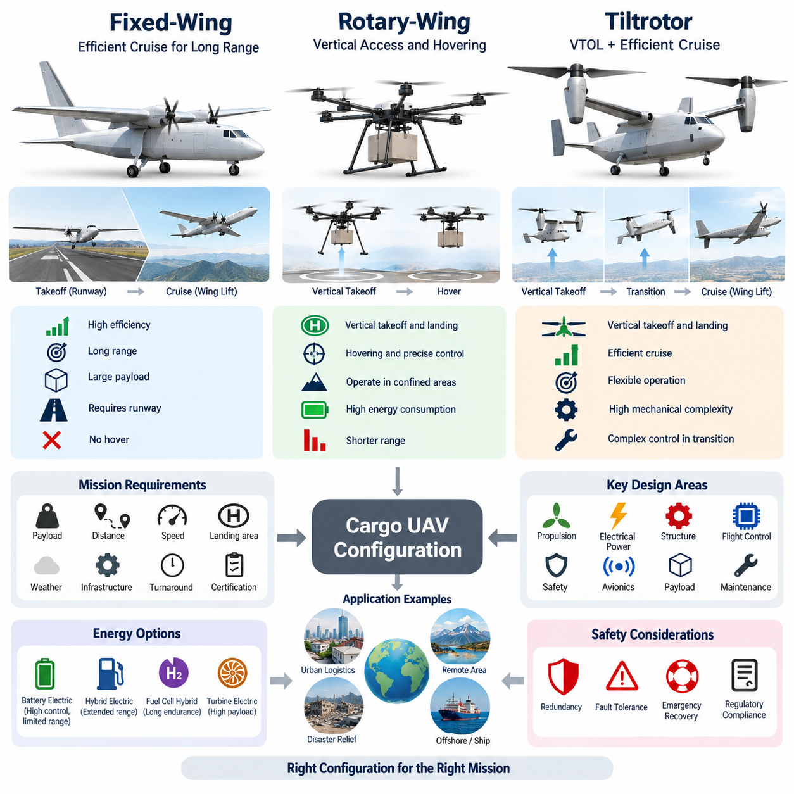
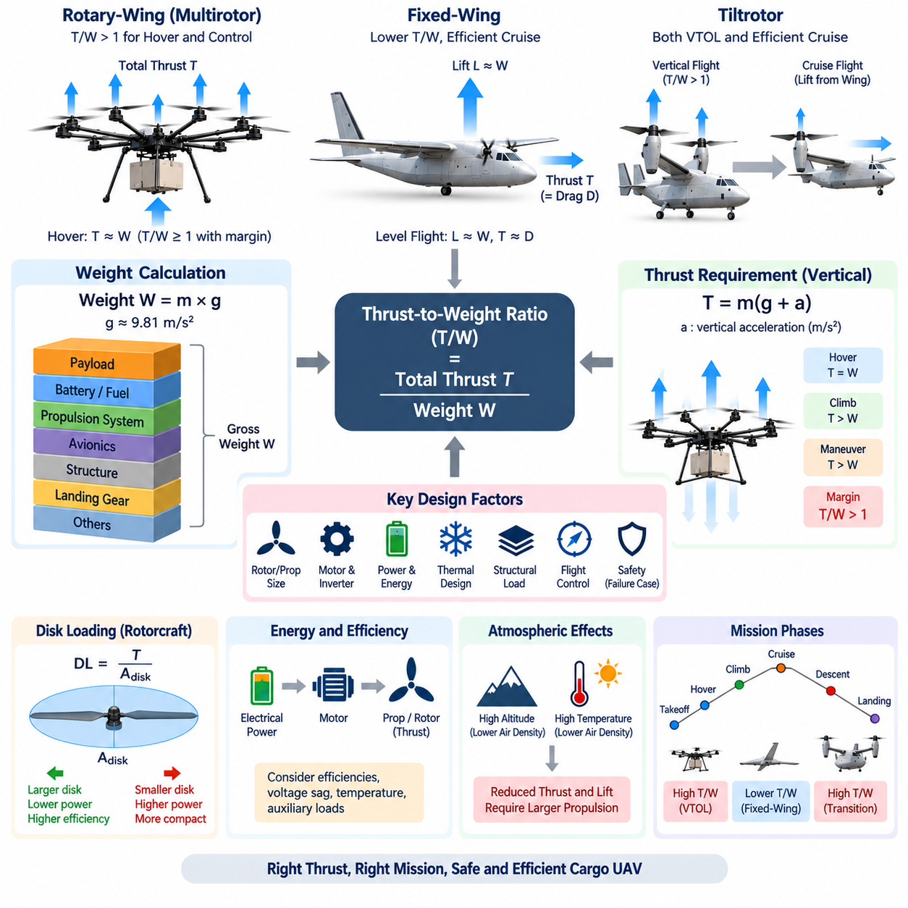
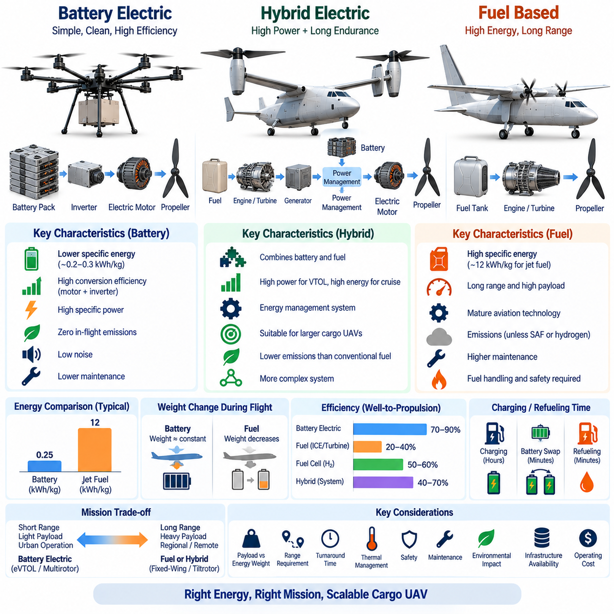
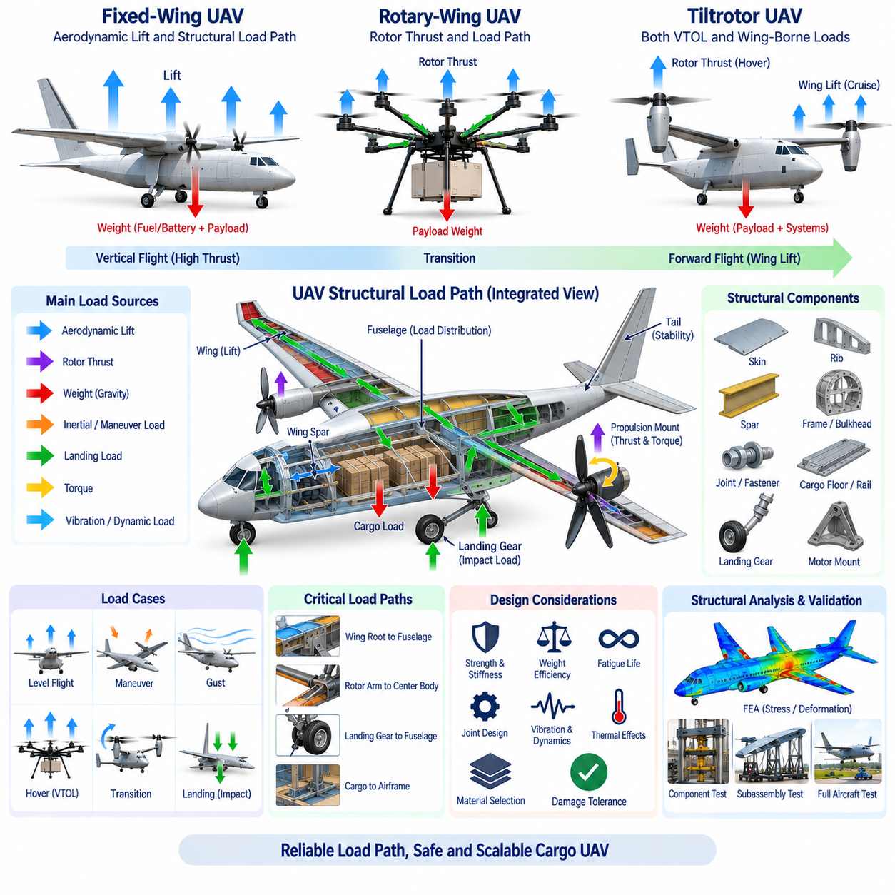
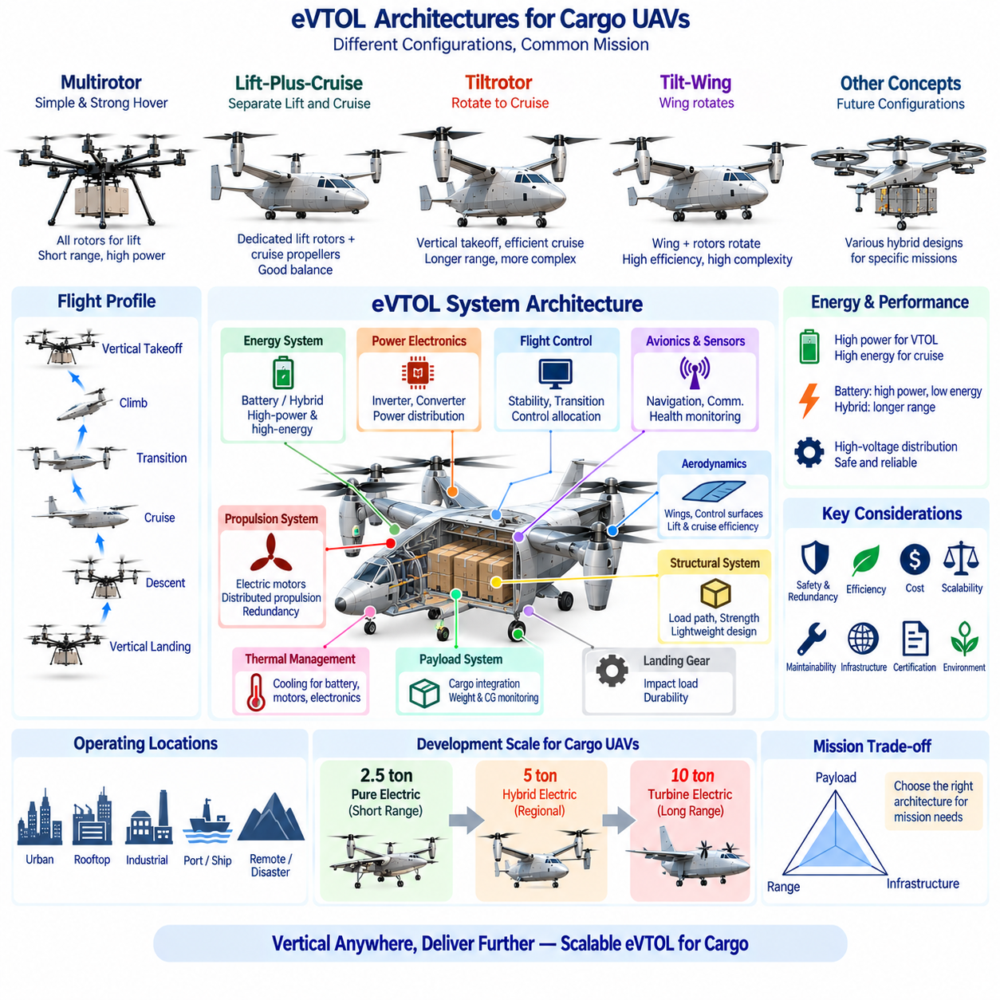

**Volume 18. Cargo UAV Architecture**

# Chapter 01. UAV Fundamentals

## 01.01. Fixed Wing/Rotary/Tiltrotor

{width="7.268055555555556in" height="7.268055555555556in"}

고정익(Fixed-wing), 회전익(Rotary-wing), 틸트로터(Tiltrotor) 항공기는 무인항공기(Unmanned Aerial Vehicle, UAV)를 구성하는 세 가지 기본적인 공력학적 아키텍처(Aerodynamic Architecture)를 대표한다. 이들의 차이는 단순한 기체 형상에 그치지 않으며, 양력(Lift)의 생성 방식, 추진 에너지(Propulsion Energy)의 소비 방식, 이착륙 방법, 화물 운송 효율을 결정한다. 따라서 화물 UAV(Cargo UAV) 아키텍처에서 이들 형식의 선택은 추진, 전력, 비행제어, 구조, 탑재량, 항속거리 및 운용 인프라에 영향을 주는 초기 시스템 수준의 핵심 의사결정이다.

고정익 UAV(Fixed-wing UAV)는 전진 비행 중 날개(Wing) 위로 공기가 흐르면서 발생하는 공력학적 양력(Aerodynamic Lift)을 주된 양력으로 이용한다. 프로펠러(Propeller)나 터빈 엔진(Turbine Engine)은 기체 중량을 지속적으로 직접 지지하기보다 주로 전진 추력(Forward Thrust)을 제공한다. 충분한 대기속도(Airspeed)가 확보되면 날개가 효율적으로 양력을 생성하므로, 호버링(Hovering) 항공기에 비해 단위 거리당 에너지 소비를 줄이면서 비교적 큰 화물을 장거리로 운송할 수 있다. 이러한 특성은 지역 및 장거리 화물 운송에 특히 적합하다.

기존 고정익 구성(Conventional Fixed-wing Configuration)의 가장 큰 제약은 양력을 얻기 위해 전진 속도가 필요하다는 점이다. 일반적으로 이륙에는 활주로(Runway), 발사장치(Launcher), 또는 기체를 비행 속도까지 가속하는 다른 수단이 필요하며, 착륙에도 안전하게 감속할 수 있는 충분한 공간이 요구된다. 이러한 인프라 요구조건은 도심 물류센터, 원격 지역, 섬, 재난지역 및 활주로가 없는 장소에서 운용을 제한할 수 있다. 단거리 이착륙(STOL) 기술로 이러한 제약을 완화할 수 있지만 회전익과 같은 자유로운 수직 접근성을 제공하지는 못한다.

회전익 UAV(Rotary-wing UAV)는 회전하는 블레이드(Rotating Blade)를 이용해 직접 양력을 생성한다. 따라서 멀티로터(Multirotor), 헬리콥터(Helicopter) 및 관련 형식은 수직이착륙(Vertical Takeoff and Landing, VTOL), 정지비행, 저속 기동 및 좁은 공간에서의 착륙이 가능하다. 이러한 특성은 뛰어난 운용 유연성(Operational Flexibility)을 제공한다. 화물 UAV는 활주로 없이 창고, 선박, 건설현장, 산악지역 또는 재난현장에 직접 접근할 수 있어, 최대 운송 효율보다 지점 간 접근성이 중요한 임무에서 특히 유리하다.

그러나 호버링(Hovering)은 추진 시스템(Propulsion System)이 항공기 중량과 거의 동일한 수준의 추력을 지속적으로 생성해야 하므로 상당한 에너지를 요구한다. 총중량(Gross Weight)과 탑재량(Payload)이 증가하면 로터 직경(Rotor Diameter), 설치 추진출력(Installed Propulsion Power), 구조 강도, 열관리(Thermal Management), 에너지 저장장치 요구조건이 더욱 중요해진다. 따라서 대형 화물 멀티로터(Heavy Cargo Multirotor)는 뛰어난 수직 기동성을 제공할 수 있지만, 동일한 규모의 고정익 항공기에 비해 항속거리나 체공시간(Endurance)이 크게 짧아질 수 있다.

로터 아키텍처(Rotor Architecture)는 비행제어 시스템(Flight Control System)의 설계에도 영향을 미친다. 멀티로터는 일반적으로 여러 분산 추진장치(Distributed Propulsion Unit)의 추력을 변화시켜 자세와 궤적을 제어하는 반면, 기존 헬리콥터는 집단피치(Collective Pitch), 주기피치(Cyclic Pitch), 반토크 제어(Anti-torque Control)를 사용한다. 분산 전기추진(Distributed Electric Propulsion)은 기계적 단순화와 추진계 중복성(Redundancy)을 제공할 수 있지만, 전력분배, 인버터(Inverter), 모터 동기화, 배터리 관리, 고장 격리 및 열관리 문제를 동시에 발생시킨다.

틸트로터 아키텍처(Tiltrotor Architecture)는 수직이착륙 능력과 효율적인 날개 기반 순항(Wing-borne Cruise)을 결합하려는 방식이다. 이착륙 시 로터(Rotor)는 주로 수직 추력을 생성하도록 배치되어 회전익처럼 운용된다. 고도를 확보하고 가속한 이후에는 추진장치가 수평 방향으로 기울어진다. 대기속도가 증가하면서 주된 양력 생성 기능이 로터에서 날개로 이전되고, 항공기는 비행기와 유사한 순항 상태로 전환되어 항속거리와 공력 효율(Aerodynamic Efficiency)을 크게 향상시킬 수 있다.

수직비행에서 날개 기반 순항으로의 천이(Transition)는 틸트로터의 핵심 기술적 난제이다. 이 과정에서는 양력, 추력, 공력 조종면(Aerodynamic Control Surface), 로터 힘, 기체 자세 및 대기속도가 지속적으로 상호작용한다. 비행제어 컴퓨터(Flight Control Computer)는 변환 비행영역(Conversion Corridor) 전체에서 충분한 제어권(Control Authority)을 유지하면서 추진 벡터 각도, 로터 추력, 피치(Pitch)와 롤(Roll), 공력 조종면을 통합적으로 조정해야 한다. 따라서 센서 정확도, 액추에이터 응답성, 제어법칙(Control Law)의 강건성 및 고장관리가 중요하다.

틸트로터 시스템(Tiltrotor System)은 기계적·구조적 복잡성도 증가시킨다. 틸팅 나셀(Tilting Nacelle), 액추에이터(Actuator), 베어링(Bearing), 잠금장치(Locking Mechanism), 전력 케이블, 통신 인터페이스, 경우에 따라 회전축까지 진동, 공력하중, 반복적인 천이 동작 및 환경 노출 조건에서 신뢰성 있게 작동해야 한다. 전기식 틸트로터(Electric Tiltrotor)는 기존 변속계 일부를 제거할 수 있지만 움직이는 추진장치를 통한 고전력 전기 배선은 여전히 중요한 설계 과제이다. 따라서 기계적 복잡성과 VTOL 및 고효율 순항을 결합함으로써 얻는 운용상의 가치를 함께 평가해야 한다.

이와 밀접한 형태로 리프트-플러스-크루즈(Lift-plus-cruise) 아키텍처가 있다. 이 방식에서는 수직양력과 전진 순항을 서로 다른 추진 시스템이 담당한다. 전용 수직 로터가 이착륙을 수행하고, 날개가 충분한 공력학적 효과를 발휘하기 시작하면 하나 이상의 순항 프로펠러(Cruise Propeller)가 전진 추력을 생성한다. 주요 추진장치를 물리적으로 회전시킬 필요가 없어 천이 메커니즘과 제어 할당(Control Allocation)을 단순화할 수 있다. 반면 순항 중에는 수직양력용 추진장치가 거의 사용되지 않아 불필요한 질량과 공기저항을 발생시킬 수 있다.

화물 운송용 아키텍처 선택은 선호하는 항공기 형상보다 임무(Mission)에서 시작해야 한다. 요구 탑재량, 운항 거리, 순항속도, 착륙구역 크기, 사용 가능한 인프라, 기상조건, 회전시간(Turnaround Time), 에너지원, 정비능력 및 인증 요구조건을 함께 고려해야 한다. 장거리 운송과 에너지 효율이 가장 중요하다면 고정익 항공기가 유리하며, 짧은 거리에서 정밀한 수직 접근성이 요구된다면 회전익 시스템이 더욱 적합하다.

틸트로터 및 기타 VTOL-날개(VTOL-wing) 구성은 수직 접근성과 장거리 효율이 동시에 요구되는 경우 특히 가치가 높다. 물류 네트워크에서 항공기가 좁은 물류센터에서 수직으로 이륙하고, 수십에서 수백 킬로미터를 효율적으로 비행한 뒤, 기존 활주로 없이 다른 지점에 착륙해야 할 수 있다. 이러한 경우 추가적인 추진 및 비행제어 복잡성은 충분히 정당화될 수 있다. 지상 인프라라는 주요 제약을 제거하면서도 고정익 순항의 공력학적 이점을 상당 부분 유지할 수 있기 때문이다.

탑재량 규모(Payload Scaling)가 증가하면 이러한 절충관계도 크게 달라진다. 소형 UAV에서는 다수의 전기 로터를 사용하는 방식이 실용적이고 비교적 단순한 VTOL 해법이 될 수 있다. 그러나 수 톤급 화물 규모에서는 디스크 하중(Disk Loading), 추진출력, 구조질량, 저장에너지, 열방출, 로터 크기 및 비상착륙 능력이 주요 설계 인자로 부상한다. 호버링 중심 아키텍처의 부담이 점차 커지므로, 임무 대부분에서 양력 생성을 공력학적 날개로 이전하는 방식의 가치가 증가한다.

따라서 추진 아키텍처(Propulsion Architecture)는 에너지 아키텍처(Energy Architecture)와 함께 평가해야 한다. 순수 배터리 전기추진(Pure Battery-electric Propulsion)은 높은 제어성, 분산 배치, 빠른 모터 응답 및 비교적 단순한 기계적 동력전달을 제공하지만, 단위 질량당 저장에너지가 장거리 중량 화물 운송을 제한한다. 하이브리드 전기(Hybrid-electric), 연료전지 하이브리드(Fuel-cell Hybrid), 터빈 전기(Turbine-electric) 방식은 전기적으로 제어되는 분산추진의 장점을 유지하면서 체공시간과 항속거리를 확장할 수 있다. 이러한 관계는 화물 UAV가 2.5톤급에서 5톤급, 10톤급으로 발전할수록 더욱 중요해진다.

안전 아키텍처(Safety Architecture) 역시 세 가지 구성에 따라 달라진다. 고정익 항공기는 특정 추진계 고장 시 공력학적 활공(Glide) 능력을 유지할 가능성이 있지만, 안전한 회복 여부는 고도, 기체 구성, 지형 및 제어 가능성에 따라 달라진다. 회전익은 로터 양력에 보다 직접적으로 의존하므로 추진계 중복성이나 별도의 비상 전략이 중요하다. 틸트로터는 호버링, 천이 및 순항 상태에서 각각의 고장을 고려해야 하므로 고장허용 제어(Fault-tolerant Control)가 서로 다른 여러 공력학적 운용영역을 포괄해야 한다.

항공전자(Avionics)의 관점에서도 복잡한 항공기 아키텍처일수록 비행제어, 항법(Navigation), 추진제어, 전력관리, 상태감시(Health Monitoring), 통신 시스템 사이의 강력한 통합이 요구된다. 비행제어 컴퓨터는 기체 자세와 비행궤적뿐 아니라 추진계의 가용성과 구성 상태도 이해해야 한다. 틸트로터 또는 분산추진 화물 UAV에서는 액추에이터 위치, 로터 속도, 모터 온도, 인버터 상태, 전기 버스(Electrical Bus), 배터리 또는 발전기 상태와 공력 상태가 모두 안전 핵심 입력(Safety-critical Input)이 될 수 있다.

화물 자체도 항공기 형식 선택에 영향을 미친다. 탑재화물의 질량과 무게중심(Center of Gravity, CG) 변화가 항공기의 안정성과 제어능력에 직접적인 영향을 주기 때문이다. 서로 다른 화물을 적재하면 무게중심이 이동할 수 있으며, 구조적 하중경로(Structural Load Path)는 이륙, 기동, 난기류, 천이 및 착륙 과정에서 발생하는 화물 하중을 기체 구조로 안전하게 전달해야 한다. 따라서 화물실을 독립된 하위시스템으로 취급하기보다 화물 고정, 중량 감지, 무게중심 모니터링 및 탑재체 인터페이스(Payload Interface)와 항공기 아키텍처를 함께 개발해야 한다.

어떠한 단일 구성도 모든 임무에서 절대적으로 우수하지는 않다. 고정익 아키텍처는 높은 순항 효율과 긴 항속거리를 제공하고, 회전익 아키텍처는 뛰어난 수직 접근성과 호버링 능력을 제공하며, 틸트로터는 시스템 복잡성 증가라는 대가를 지불하면서 두 방식의 특성을 결합한다. 따라서 화물 UAV 엔지니어링(Cargo UAV Engineering)에서는 정량적인 임무 분석을 먼저 수행한 뒤 공력, 추진, 전기, 구조, 항공전자, 안전 및 운용 측면을 통합한 트레이드오프 분석(Trade-off Study)을 통해 적절한 형식을 결정해야 한다.

결국 세 가지 아키텍처는 임무 전 과정에서 양력과 추력의 역할을 어떻게 배분할 것인가라는 근본적인 문제에 대한 서로 다른 해법으로 이해할 수 있다. 고정익은 날개가 생성하는 양력과 추진계의 전진 추력을 분리하고, 회전익은 로터 추력으로 기체를 지지하면서 동시에 기동하며, 틸트로터는 로터 기반 비행(Rotor-borne Flight)과 날개 기반 비행(Wing-borne Flight) 사이에서 이러한 기능을 동적으로 재분배한다. 이 차이에 대한 이해는 이후 추력대중량비(Thrust-to-weight Ratio), 배터리와 연료의 절충관계, 구조적 하중경로 및 eVTOL 아키텍처를 분석하기 위한 화물 UAV 설계의 기초가 된다.

## 01.02. Thrust-Weight Calculation

{width="7.268055555555556in" height="7.268055555555556in"}

추력대중량 계산(Thrust-to-weight Calculation)은 화물 무인항공기(Cargo UAV) 설계에서 가장 기본적인 사이징(Sizing) 작업 중 하나이다. 추진 시스템(Propulsion System)이 항공기를 지지하고, 가속하고, 상승시키며, 기동하는 데 충분한 힘을 생성할 수 있는지를 결정하기 때문이다. 이 관계는 항공기 총중량(Gross Weight)을 필요한 추진 능력과 직접 연결하며, 모터 또는 엔진 선정, 프로펠러와 로터 크기, 전력, 에너지 저장, 열설계, 구조하중 및 비행제어 권한(Flight-control Authority)에 영향을 준다.

항공기 중량(Aircraft Weight)은 기체 전체 질량에 작용하는 중력이다. 최대이륙질량(Maximum Takeoff Mass)을 \\(m\\)이라 하면 이에 해당하는 중량은 \\(W = mg\\)로 표현되며, 여기서 \\(g\\)는 중력가속도(Gravitational Acceleration)로 해수면 부근에서 약 9.81 m/s²이다. 따라서 1,000 kg 항공기의 중량은 약 9,810 N이다. 화물 UAV 엔지니어링에서는 최대이륙중량(Maximum Takeoff Weight)에 기체 구조, 추진 시스템, 배터리 또는 연료, 항공전자, 착륙장치, 화물, 배선, 냉각장치 및 모든 운용 장비를 포함해야 한다.

추력(Thrust)은 추진 시스템이 항공기를 이동시키거나 지지하기 위해 생성하는 힘이다. 멀티로터(Multirotor) 또는 수직이착륙(Vertical Takeoff) 항공기에서는 호버링(Hover) 중 전체 로터 추력이 주로 중력에 대항한다. 이상적인 정지 호버링 조건에서는 총추력이 항공기 중량과 같아야 하므로 \\(T = W\\)이고 추력대중량비(Thrust-to-weight Ratio)는 \\(T/W = 1.0\\)이 된다. 그러나 이는 이론적인 평형 상태만을 의미하며 상승, 기동, 외란, 부품 성능 저하 또는 안전 운용을 위한 충분한 여유를 제공하지 않는다.

따라서 실제 수직이착륙기(VTOL Aircraft)는 1보다 큰 추력대중량비를 필요로 한다. 항공기 중량이 9,810 N이고 추진 시스템이 최대 14,715 N의 추력을 생성할 수 있다면 최대 추력대중량비는 1.5이다. 이는 최대 가용 추력이 정적 중량보다 50% 크다는 것을 의미한다. 이러한 추가 능력은 제어 여유(Control Authority)와 상승 성능을 제공하지만, 실제 사용 가능한 여유는 공력 손실, 운용조건, 추진계 한계 및 비행제어 제약에 따라 달라진다.

다수의 로터를 사용하는 분산 전기추진 무인항공기(Distributed Electric Propulsion UAV)에서 총추력은 개별 추진장치가 생성하는 추력의 합이다. 동일한 8개의 로터가 각각 2,000 N을 생성한다면 이론적인 총추력은 16,000 N이다. 항공기 중량이 10,000 N이라면 추력대중량비는 1.6이다. 이 계산은 초기 사이징의 기준을 제공하지만 실제 엔지니어링에서는 불균등 하중, 장착 효과, 로터 간섭, 전압 변화, 모터 온도 및 추진장치 고장까지 고려해야 한다.

로터당 호버 추력(Hover Thrust per Rotor)은 초기 단계에서 항공기 중량을 양력 로터 수로 나누어 추정할 수 있다. 중량이 16,000 N인 8로터 항공기는 이상적인 호버링에서 로터당 약 2,000 N이 필요하다. 그러나 최대 추력이 2,000 N에 불과한 추진장치를 선택한다면 사실상 추력 여유가 존재하지 않는다. 따라서 각 모터, 인버터(Inverter), 로터 및 전기 분기회로(Electrical Branch)는 과도한 대형화로 인한 질량 증가를 피하면서 충분한 운용 여유를 확보하도록 설계해야 한다.

필요한 추력 여유는 비행제어 권한(Flight-control Authority)과 밀접한 관련이 있다. 멀티로터는 일부 로터의 추력을 증가시키고 다른 로터의 추력을 감소시켜 롤(Roll), 피치(Pitch), 요(Yaw) 및 수직가속도를 제어한다. 단순히 호버링을 유지하기 위해 모든 추진장치가 이미 최대 추력에 가깝게 작동한다면 제어기는 바람과 같은 외란을 억제하거나 빠른 기동을 수행할 능력이 거의 남지 않는다. 따라서 호버링은 차등 추력(Differential Thrust) 능력을 보존할 수 있도록 최대 추진출력보다 충분히 낮은 영역에서 이루어져야 한다.

수직상승(Vertical Climb)에서는 항공기가 중력에 대항하는 동시에 상향 가속도를 생성해야 하므로 추가적인 추력이 필요하다. 뉴턴의 제2법칙(Newton\'s Second Law)에 따라 단순화된 수직방향 관계는 \\(T-W=ma\\)이며, 이를 정리하면 \\(T=m(g+a)\\)가 된다. 1,000 kg 항공기가 2 m/s²의 상향 가속도를 가져야 한다면 공력 및 추진 손실을 고려하기 전의 이상적인 순간 추력 요구량은 약 11,810 N이 된다. 따라서 목표 상승 성능은 추진 시스템의 사이징에 직접적인 영향을 준다.

하강비행(Descending Flight) 역시 주의 깊게 분석해야 한다. 하강 중 평균적으로 필요한 추력은 감소할 수 있지만 회전익 항공기는 유도 유동(Induced Flow), 로터 후류(Rotor Wake) 상호작용 또는 제어 효과 감소와 관련된 복잡한 공력 조건을 경험할 수 있다. 따라서 대형 화물 UAV는 정상 호버링과 최대 상승 조건만을 기준으로 설계해서는 안 된다. 추진 운용영역(Propulsion Envelope)은 이륙, 호버링, 상승, 순항 천이, 하강, 착륙, 기동, 바람 외란 대응 및 비정상 운용조건을 모두 포함해야 한다.

고정익 항공기(Fixed-wing Aircraft)는 정상 순항 중 공력학적 날개가 항공기 중량 대부분을 지지하므로 추력을 다르게 사용한다. 따라서 순항 추력(Cruise Thrust)이 중량과 같을 필요는 없다. 대신 추력은 주로 공기저항(Aerodynamic Drag)과 균형을 이룬다. 정상 수평비행(Steady Level Flight)에서는 양력(Lift)이 중량과 거의 같고 추력이 항력(Drag)과 거의 같다. 따라서 고정익 화물 UAV는 VTOL 항공기보다 훨씬 낮은 추력대중량비를 가지면서도 효율적인 장거리 운항이 가능하다.

고정익 설계에서는 이륙, 상승, 가속 및 높은 항력이 발생하는 운용조건에서 필요한 추력이 증가한다. 설계자는 가용 추진력이 요구되는 활주로 성능, 상승구배(Climb Gradient), 순항속도 및 운용고도(Operational Ceiling)를 충족할 수 있는지 평가해야 한다. 따라서 날개하중(Wing Loading), 양항비(Lift-to-drag Ratio), 프로펠러 효율, 항공기 항력, 대기밀도 및 엔진 또는 모터 특성이 추력대중량 사이징과 긴밀하게 연결된다.

틸트로터 항공기(Tiltrotor Aircraft)는 임무 단계에 따라 추진 시스템의 역할이 달라지므로 회전익과 고정익의 추력 분석이 모두 필요하다. 수직이륙 중에는 로터가 항공기 중량을 직접 지지하므로 회전익 UAV와 유사한 요구조건을 가진다. 천이(Transition) 중에는 공력학적 날개 양력이 증가하면서 추력 방향이 점진적으로 변경된다. 순항에서는 추진력이 주로 항력을 극복한다. 따라서 추진 시스템은 호버링, 천이, 상승, 순항 및 착륙 전체에서 가장 가혹한 조건을 충족해야 한다.

천이비행(Transition Flight)은 날개에서 아직 일부 양력만 발생하는 동시에 로터 추력 전체가 더 이상 수직방향을 향하지 않을 수 있기 때문에 중요한 사이징 조건이 될 수 있다. 총 로터 추력이 \\(T\\)이고 추진 벡터(Propulsion Vector)가 특정 각도로 기울어지면 그중 수직 성분만이 항공기 중량을 직접 지지한다. 따라서 비행제어 및 공력 설계에서는 전체 천이 비행영역(Conversion Corridor)에서 로터의 수직 추력과 날개가 생성하는 양력의 합이 충분하도록 보장해야 한다.

프로펠러와 로터 직경(Propeller and Rotor Diameter)은 추력 생성에 필요한 동력에 큰 영향을 준다. 일반적으로 동일한 양력을 더 넓은 전체 로터 디스크 면적(Total Rotor Disk Area)으로 생성하면 더 많은 공기 질량을 더 작은 속도 변화로 가속할 수 있어 유도동력(Induced Power)을 감소시킬 수 있다. 이것이 대형 로터가 호버링 효율을 향상시킬 수 있는 이유 중 하나이다. 그러나 로터 직경 증가는 패키징, 구조, 지상고, 블레이드 끝단 속도(Blade-tip Speed), 진동, 운송 및 로터 간섭과 같은 제약을 발생시킨다.

디스크 하중(Disk Loading)은 회전익 사이징에 사용되는 또 하나의 중요한 지표로, 항공기 중량 또는 로터 추력을 전체 로터 디스크 면적으로 나눈 값으로 정의된다. 높은 디스크 하중은 로터를 더 작게 만들 수 있지만 일반적으로 호버링 시 더 큰 유도동력을 요구한다. 낮은 디스크 하중은 호버링 효율을 높일 수 있지만 더 넓은 로터 면적이 필요하다. 따라서 화물 UAV 설계에서는 기체 크기, 추진 효율, 로터 수, 로터 직경, 구조질량, 소음 및 착륙구역 크기 사이의 절충관계(Trade-off)를 고려해야 한다.

전기추진 사이징(Electric Propulsion Sizing)에서는 필요한 추력을 축동력(Shaft Power), 최종적으로는 전력(Electrical Power)으로 변환해야 한다. 모터 출력은 로터의 공력 특성, 회전속도, 토크(Torque), 프로펠러 효율 및 운전점(Operating Point)에 따라 결정된다. 전기 입력에는 추가적으로 모터와 인버터 효율, 케이블 손실, 배터리 전압 변화 및 보조부하를 고려해야 한다. 따라서 추력 계산은 최대 모터 출력을 독립된 사양으로 취급하기보다 최종적으로 완전한 전력흐름 모델(Power-flow Model)과 연결해야 한다.

배터리 충전상태(State of Charge, SOC)와 전압강하(Voltage Sag)는 높은 추진출력이 필요한 비행 단계에서 가용 추진력을 감소시킬 수 있다. 완전히 충전된 배터리에서 필요한 추력대중량비를 만족하는 추진 시스템이라도 임무 종료 시점에는 동일한 여유를 제공하지 못할 수 있다. 온도 역시 배터리, 모터 및 인버터 성능에 영향을 준다. 따라서 추진 능력은 명목상 실험실 조건만이 아니라 대표적인 최악조건의 전압, 온도, 고도, 탑재량 및 부품 노화 상태에서 평가해야 한다.

대기밀도(Atmospheric Density)는 프로펠러, 로터 및 날개가 주변 공기와 직접 상호작용하기 때문에 특히 중요하다. 높은 고도와 높은 온도에서는 공기밀도가 감소하여 동일한 운전조건에서 로터 추력과 공력학적 양력이 감소할 수 있다. 산악지역이나 고온환경에서 운용되는 대형 화물 UAV는 추진 시스템 사이징에 밀도고도(Density Altitude)의 영향을 포함해야 한다. 해수면에서 안전하게 호버링할 수 있는 기체라도 고온·고고도(High-and-hot) 조건에서는 추력 여유가 크게 감소할 수 있다.

고장조건(Failure Condition)은 분산 추진 시스템에 더욱 가혹한 요구조건을 부과할 수 있다. 멀티로터 항공기가 하나의 추진장치 고장을 허용하도록 설계된다면 나머지 장치가 충분한 추력을 생성하면서 제어 가능성(Controllability)을 유지해야 한다. 8로터 시스템에서 모터 하나를 잃는 것은 단순히 총추력이 1/8 감소하는 문제만은 아니다. 기체 형상에 따라 추력 재분배가 요, 롤 또는 피치 모멘트에 의해 제한될 수 있다. 따라서 고장허용 사이징(Fault-tolerant Sizing)은 제어 할당 분석(Control-allocation Analysis)과 함께 수행해야 한다.

화물 질량 변화(Cargo Mass Variation) 역시 중요한 설계 조건이다. 항공기는 재배치 운항에서는 화물 없이 운용될 수 있고 실제 화물 운송에서는 최대 탑재량으로 운항할 수 있다. 이러한 총중량 변화는 호버 스로틀(Hover Throttle), 가속도, 상승 능력, 에너지 소비 및 제어 응답을 변화시킨다. 또한 화물 적재에 따라 무게중심(Center of Gravity, CG)이 이동하면 개별 로터 또는 추진장치에 불균등한 하중이 발생할 수 있다. 따라서 추력 분석에서는 총중량뿐 아니라 항공기 무게중심 주변의 추진력 분포도 고려해야 한다.

초기 추력대중량 계산 자체는 단순하지만 신뢰성 높은 화물 UAV를 설계하려면 점진적으로 더 깊은 분석이 필요하다. \\(W=mg\\)와 \\(T/W\\)에서 시작하여 기본 추진 능력을 설정한 뒤 상승가속도, 로터별 추력 분배, 공력 효율, 천이조건, 대기환경, 전기적 손실, 열적 한계, 탑재량 변화 및 고장조건을 단계적으로 반영할 수 있다. 이러한 각각의 정교화 과정은 단순한 힘의 비율을 실제 추진 시스템 요구조건으로 발전시킨다.

수 톤급 화물 UAV(Multi-ton Cargo UAV)에서는 이러한 계산이 단순한 모터 선정 작업이 아니라 시스템 아키텍처(System Architecture)를 결정하는 핵심 요소가 된다. 탑재량이 증가하면 더 큰 추력이 필요하지만, 더 큰 모터, 로터, 배터리, 발전기, 냉각 시스템 및 구조물 자체가 다시 항공기 중량을 증가시키며 이는 또다시 필요한 추력을 증가시킨다. 이러한 재귀적인 관계는 질량 증가 루프(Mass-growth Loop)를 형성하므로 반복적인 항공기 사이징(Iterative Aircraft Sizing)과 다분야 최적화(Multidisciplinary Optimization)를 통해 해결해야 한다.

따라서 견고한 설계(Robust Design)는 추진 시스템을 과도하게 대형화하지 않으면서 충분한 추력 여유를 확보하는 것을 목표로 한다. 추력 여유가 부족하면 상승 성능, 기동성, 고장허용 능력 및 안전성이 저하되며, 반대로 과도한 여유는 추진계 질량, 구조하중, 전력 용량, 냉각 요구량 및 비용을 증가시킨다. 추력대중량 계산은 이러한 상충 요구조건을 정량적으로 균형화하는 기반이며, 이후의 배터리와 연료 절충관계(Battery-versus-fuel Trade-off), 구조적 하중경로(Structural Load Path), 그리고 화물 UAV 개발에서의 전체 eVTOL 아키텍처(eVTOL Architecture) 선정으로 직접 연결된다.

## 01.03. Battery vs Fuel Tradeoff

{width="7.268055555555556in" height="7.268055555555556in"}

배터리(Battery)와 연료(Fuel)는 화물 무인항공기(Cargo UAV)의 추진 에너지를 저장하는 근본적으로 서로 다른 두 가지 방식이다. 배터리 전기 시스템(Battery-electric System)은 전기에너지를 직접 저장한 뒤 전력전자(Power Electronics)를 통해 모터로 공급하는 반면, 연료 기반 시스템(Fuel-based System)은 화학에너지를 저장하고 이를 엔진, 터빈, 연료전지 또는 발전기를 통해 변환한다. 이러한 선택은 항공기 질량, 항속거리, 탑재량, 추진 아키텍처, 열관리, 충전 또는 급유시간, 정비, 안전 및 운용 인프라에 영향을 준다.

가장 핵심적인 공학적 차이는 단위 질량당 저장 가능한 에너지를 의미하는 비에너지(Specific Energy)이다. 현대의 충전식 배터리는 저장매체 자체를 기준으로 할 때 탄화수소 연료(Hydrocarbon Fuel)보다 kg당 저장에너지가 훨씬 낮다. 따라서 대형 화물을 장거리로 운송해야 하는 항공기에서는 연료가 큰 장점을 가진다. 그러나 저장매체만 직접 비교하는 것은 충분하지 않으며, 저장된 에너지 중 실제 추진 작업에 얼마나 사용되는지는 전체 추진 에너지 변환계(Propulsion Conversion Chain)에 의해 결정된다.

배터리 전기추진(Battery-electric Propulsion)은 전기에너지가 비교적 손실이 작은 인버터(Inverter)와 전기모터(Electric Motor)를 통과하기 때문에 높은 변환효율(Conversion Efficiency)을 달성할 수 있다. 전기모터는 빠른 토크 응답, 정밀한 속도제어, 분산배치 및 비교적 단순한 기계적 통합이라는 장점도 제공한다. 이러한 특성은 여러 추진장치가 자세제어, 호버링, 천이 및 고장관리를 위해 지속적으로 추력을 조정해야 하는 멀티로터(Multirotor)와 eVTOL 항공기에서 특히 중요하다.

연료 기반 추진(Fuel-based Propulsion)은 더 많은 에너지 변환 단계를 포함하고 전체 효율이 낮을 수 있지만, 연료 자체의 훨씬 높은 비에너지가 장거리 임무에서는 이러한 손실을 보상할 수 있다. 내연기관(Internal-combustion Engine)과 터빈(Turbine)은 화학에너지를 축동력(Shaft Power)으로 변환하며, 터빈 전기(Turbine-electric) 또는 엔진-발전기(Engine-generator) 아키텍처는 기계적 동력을 다시 전력으로 변환한다. 추가 장비는 질량과 복잡성을 증가시키지만 유사한 이륙중량의 배터리 전용 항공기보다 훨씬 많은 임무 에너지를 탑재할 수 있다.

배터리 질량(Battery Mass)은 비행 중 거의 일정하게 유지된다. 방전된 배터리도 충전된 배터리와 본질적으로 거의 동일한 무게를 가지기 때문이다. 이러한 특성은 일부 질량특성 계산을 단순화하지만 항공기 수준에서는 중요한 단점이 된다. 비행 중 에너지를 소비해도 기체 중량이 거의 감소하지 않는다. 반대로 연료 항공기는 연료가 소비될수록 가벼워지므로 임무 후반에 지지해야 하는 중량이 감소하고 순항 및 착륙 성능이 향상될 가능성이 있다.

화물 UAV에서 에너지 저장 시스템(Energy-storage System)은 허용 이륙질량 내에서 탑재화물과 직접 경쟁한다. 배터리 용량을 증가시키면 체공시간이 늘어나지만 동시에 배터리 질량도 증가하고, 이는 필요한 양력과 추진 에너지를 다시 증가시킨다. 일정 수준을 넘어서면 추가 배터리에 저장된 에너지의 일부가 추가된 배터리 자체를 운반하는 데 소비되므로 배터리를 더 추가해도 항속거리 증가 효과가 점차 감소할 수 있다. 이러한 질량-에너지 피드백(Mass-energy Feedback)은 호버링 비중이 높은 항공기에서 특히 심각하다.

호버링(Hovering)은 추진 시스템이 항공기 중량과 거의 동일한 양력을 지속적으로 생성해야 하기 때문에 배터리와 연료의 절충관계를 더욱 크게 만든다. 무거운 배터리 팩(Battery Pack)은 저장에너지를 증가시키지만 동시에 추가된 질량을 공중에 유지하는 데 필요한 동력도 증가시킨다. 배터리 전기 VTOL 항공기는 비교적 짧은 임무에서는 매우 효과적일 수 있지만, 장시간 호버링이나 장거리 중량 화물 운송에서는 배터리 질량이 경제적으로 유용한 탑재량을 크게 감소시킬 수 있다.

고정익 항공기(Fixed-wing Aircraft)는 공력학적 날개가 순항 중 기체를 효율적으로 지지하므로 다른 균형점을 가진다. 따라서 배터리 전기 고정익 UAV는 동일한 저장에너지를 사용하는 배터리 멀티로터보다 상당히 긴 체공시간을 확보할 수 있다. 그러나 운항 거리, 항공기 질량 및 탑재량이 증가하면 배터리의 비에너지 한계가 다시 주요 제약으로 작용한다. 임무가 지역 간 또는 장거리 화물 운송으로 확대될수록 연료 또는 하이브리드 추진(Hybrid Propulsion)의 매력이 증가한다.

틸트로터(Tiltrotor) 및 기타 날개형 VTOL(Winged VTOL) 구성은 에너지 소비가 높은 비행영역과 효율적인 비행영역을 모두 가진다. 수직이착륙에서는 높은 추진출력이 필요하지만 날개 기반 순항(Wing-borne Cruise)에서는 지속적인 동력 요구량을 크게 줄일 수 있다. 배터리는 VTOL에 필요한 높은 순간출력을 제공하고, 연료 기반 에너지원은 지속적인 임무 에너지를 공급할 수 있다. 이러한 상호보완적 특성은 대형 화물 UAV에서 하이브리드 전기 아키텍처(Hybrid-electric Architecture)를 적용하는 강력한 기술적 근거가 된다.

비출력(Specific Power)은 비에너지와 별도로 고려해야 한다. 에너지원이 많은 총에너지를 저장하고 있더라도 수직이륙, 급상승 또는 비상기동에 필요한 순간적인 고출력을 제공하지 못할 수 있다. 배터리는 일반적으로 높은 순간 전력을 제공하는 데 유리한 반면 일부 연료전지(Fuel Cell)는 지속적인 전력생성에 더 적합하다. 따라서 하이브리드 시스템에서는 배터리를 전력 버퍼(Power Buffer)로 사용하고 다른 에너지원이 평균 순항 에너지를 공급하면서 전기 버스를 지원하거나 배터리를 충전할 수 있다.

충전시간(Charging Time)과 급유시간(Refueling Time)도 운용 생산성에 영향을 준다. 고출력 충전, 배터리 교환 또는 모듈형 배터리 팩을 사용하지 않는다면 배터리 충전에는 상당한 지상 대기시간이 필요할 수 있다. 연료는 일반적으로 더 빠르게 보충할 수 있어 높은 가동률이 요구되는 화물 항공기를 신속하게 다시 운항할 수 있다. 그러나 연료에는 저장, 운송, 취급, 화재방지 및 적절한 지상 인프라가 필요하므로 선호되는 방식은 항공기 효율뿐 아니라 전체 물류 네트워크의 특성에 따라 달라진다.

배터리 교환(Battery Swapping)은 방전된 팩을 충전된 팩으로 교체함으로써 운항회전시간(Turnaround Time)을 줄일 수 있지만, 기계적 인터페이스, 대전류 커넥터, 자동 잠금장치, 배터리 식별, 건전성 상태(State of Health) 추적 및 재고관리와 같은 추가 요구조건을 발생시킨다. 대형 화물 UAV의 배터리는 매우 무거워질 수 있어 수동 교환이 현실적으로 어려울 수 있다. 따라서 대용량 항공기에 배터리 교환 방식을 적용한다면 자동화된 취급장비(Automated Handling Equipment)가 지상 인프라의 일부가 될 수 있다.

열관리(Thermal Management)는 에너지 아키텍처에 따라 크게 달라진다. 배터리는 내부저항으로 열을 발생시키며 특히 고출력 이륙, 상승, 급속충전 및 반복 운항 과정에서 발열이 증가한다. 모터와 인버터 역시 냉각이 필요하다. 연료 엔진과 터빈은 훨씬 높은 온도에서 작동하므로 배기관리, 윤활, 냉각, 화재방지 및 민감한 전자장비나 화물과의 분리가 필요하다. 하이브리드 항공기에서는 서로 다른 두 열적 영역(Thermal Domain)을 하나의 기체 안에서 통합해야 할 수 있다.

안전성(Safety)은 특정 에너지원 하나가 본질적으로 안전하다고 가정하기보다 전체 시스템 수준에서 평가해야 한다. 배터리 시스템은 셀 고장, 과충전, 단락, 열전파(Thermal Propagation), 충돌 손상 및 고전압 절연을 다루어야 한다. 연료 시스템은 누출, 점화, 화재, 압력, 환기 및 충돌안전성(Crashworthiness)을 관리해야 한다. 하이브리드 시스템은 전기와 연료 위험의 상호작용까지 포함하므로 통합된 감지, 격리, 차단, 비상정지 및 상태감시 전략이 요구된다.

정비 요구조건(Maintenance Requirement)도 서로 다르다. 전기추진은 움직이는 기계부품의 수가 적어 연소 기반 추진 시스템보다 일상적인 정비를 줄일 수 있다. 모터와 전력전자는 전류, 전압, 온도, 진동 및 절연상태 측정을 통한 상태기반 감시(Condition Monitoring)에 적합하다. 엔진과 터빈은 추가적인 회전체, 윤활 시스템, 연료 시스템, 필터 및 정기정비를 필요로 하지만, 장시간 및 고에너지 항공 임무에서는 기존 항공산업에서 축적된 기술적 경험이라는 장점을 제공할 수 있다.

환경 성능(Environmental Performance)은 전체 에너지 수명주기(Energy Lifecycle)를 기준으로 평가해야 한다. 배터리 전기 항공기는 비행 중 국부적인 연소 배출가스가 없고 소음과 지역 대기오염을 줄일 수 있어 도심 물류에 유리하다. 그러나 전체 환경영향은 전력생산, 배터리 제조, 사용수명 및 재활용에 따라 달라진다. 연료 기반 항공기는 저탄소 연료를 사용하지 않는 한 운항 중 배출가스를 발생시키며, 수소 및 연료전지 시스템은 생산, 저장, 운송 및 인프라 측면에서 별도의 고려사항을 가진다.

연료전지(Fuel Cell)는 기존 연료 연소 방식과 배터리 전기추진 사이의 중간적인 아키텍처를 제공한다. 수소(Hydrogen)는 에너지를 화학적으로 저장하고 연료전지는 이를 전기에너지로 직접 변환하여 전기모터에 공급한다. 이를 통해 전기추진의 여러 장점을 유지하면서 배터리 전용 시스템보다 긴 체공시간을 확보할 가능성이 있다. 그러나 수소 저장부피, 탱크 질량, 고압 또는 극저온 요구조건, 인프라 및 시스템 통합 문제가 이론적인 에너지 이점의 일부를 상쇄할 수 있다.

하이브리드 전기추진(Hybrid-electric Propulsion)은 서로 보완적인 특성을 활용하기 위해 두 가지 이상의 에너지원을 결합한다. 배터리는 이륙 시의 출력 피크와 빠른 부하변화를 담당하고, 엔진-발전기, 터빈-발전기 또는 연료전지 시스템은 지속적인 순항전력을 공급할 수 있다. 에너지 관리 시스템(Energy Management System, EMS)은 비행단계, 충전상태, 부품 온도, 효율, 예비에너지 요구조건 및 고장상태에 따라 전력을 배분한다. 이러한 제어전략의 품질은 항속거리, 부품수명 및 안전성에 직접적인 영향을 준다.

직렬 하이브리드 아키텍처(Series-hybrid Architecture)는 중앙에서 전기를 생성한 후 이를 여러 전기추진 모터로 분배한다. 이러한 방식은 원동기(Prime Mover)를 각 추진장치와 기계축으로 직접 연결하지 않고도 분산 전기추진(Distributed Electric Propulsion)을 구현할 수 있다. 추진장치 배치와 제어를 유연하게 하면서 발전기를 효율적인 운전영역에서 작동시킬 수 있다는 장점이 있다. 반면 발전기, 컨버터, 케이블 및 냉각장치의 질량과 각 에너지 변환 단계에서 발생하는 손실이 단점이 된다.

예비에너지(Energy Reserve)는 화물 항공 운용에서 특히 중요하다. 항공기는 정상 항로를 운항하면서 가용한 배터리 에너지나 연료를 모두 소비하도록 설계할 수 없다. 바람, 항로 변경, 대기비행(Holding), 착륙중단, 반복 접근, 대체공항 또는 대체 착륙지로의 이동, 배터리 열화 및 예상하지 못한 운용조건을 위해 예비에너지가 필요하다. 따라서 실제 임무에서 사용할 수 있는 에너지는 명목상 저장에너지보다 작으며, 예비에너지 정책은 특정 아키텍처의 실질적인 항속거리 이점을 크게 변화시킬 수 있다.

탑재량이 수 톤급(Multi-ton Class)으로 증가하면 배터리와 연료의 선택은 전체 항공기 아키텍처와 더욱 밀접하게 연결된다. 2.5톤급 화물 UAV는 단거리 또는 지역 임무를 위해 높은 수준의 전동화(Electrification)를 적용할 수 있지만, 더 큰 5톤급 및 10톤급 시스템에서는 장거리 운항, 높은 임무 에너지 및 신속한 운항회전이 더욱 중요해진다. 이러한 발전과정은 전체 화물 UAV 구조에서 항공기 규모에 따라 순수 전기(Pure-electric), 하이브리드 전기 및 터빈 전기추진을 함께 고려하는 이유를 설명한다.

따라서 올바른 비교는 단순히 배터리의 kg당 와트시(Wh/kg)와 연료의 에너지 밀도(Energy Density)를 비교하는 것이 아니라 임무 수준(Mission Level)에서 수행되어야 한다. 엔지니어는 저장탱크 또는 배터리 인클로저, 모터, 엔진, 발전기, 인버터, 냉각 시스템, 배선, 연료공급장치, 구조보강, 예비에너지, 변환효율 및 비행 중 변화하는 항공기 질량을 모두 포함해야 한다. 완전히 설치된 시스템(Installed System)을 평가해야만 항공기의 실제 탑재량-항속거리 성능(Payload-range Capability)을 판단할 수 있다.

결국 배터리와 연료는 더 큰 에너지 관리 문제(Energy-management Problem)를 구성하는 아키텍처 변수(Architectural Variable)로 이해해야 한다. 배터리 전기추진은 단순성, 제어성, 높은 변환효율 및 분산추진과의 우수한 호환성을 제공하는 반면, 연료는 장거리 및 대형 탑재량 임무에 필요한 높은 저장에너지 측면에서 우수하다. 하이브리드 아키텍처는 높은 전기 출력능력과 더 많은 임무 에너지를 결합하여 두 방식 사이의 영역을 담당하며, 에너지원 선택은 확장 가능한 화물 UAV(Scalable Cargo UAV) 설계를 결정하는 핵심 요소가 된다.

## 01.04. UAV Load Path Structure

{width="7.268055555555556in" height="7.268055555555556in"}

무인항공기 하중경로(UAV Load Path)는 공력, 추진, 탑재화물, 착륙 및 관성에 의해 발생하는 힘이 다른 힘과 평형을 이루기 전까지 항공기 구조를 통해 어떻게 전달되는지를 나타낸다. 이러한 힘 전달 네트워크(Force-transfer Network)를 이해하는 것은 화물 무인항공기(Cargo UAV)의 구조 아키텍처(Structural Architecture)에서 매우 중요하다. 날개, 동체 프레임, 스파(Spar), 로터 마운트, 착륙장치, 화물 지지구조, 조인트 및 체결부는 서로 독립된 부품이 아니라 하나의 통합 구조 시스템을 형성한다.

하중경로 설계(Load-path Design)의 기본 원리는 모든 외력이 구조를 통과하여 전달될 수 있는 연속적이고 충분한 강도의 경로를 가져야 한다는 것이다. 날개에서 양력(Lift)이 발생하면 공력하중(Aerodynamic Load)은 날개 표면에 분포한 뒤 리브(Rib)와 스킨(Skin)을 통해 주 스파(Primary Spar)로 전달된다. 스파는 굽힘 및 전단하중을 날개 뿌리(Wing Root) 방향으로 전달하며, 이곳에서 집중된 힘이 동체로 들어간다. 동체 구조는 화물, 추진계, 착륙장치 및 장비 하중을 지지하면서 이러한 힘을 다시 분산시켜야 한다.

일반적인 고정익 화물 UAV(Fixed-wing Cargo UAV)에서 날개는 가장 큰 하중을 받는 구조요소 중 하나이다. 분포된 공력 양력은 위쪽 방향의 굽힘하중을 발생시키는 반면, 동체, 화물, 배터리, 연료 및 장비의 중력은 아래쪽으로 작용한다. 이러한 힘의 조합은 날개 뿌리 부근에서 큰 굽힘모멘트(Bending Moment)를 발생시킨다. 따라서 날개 스파는 주요 하중지지부재(Load-carrying Member)로 작용하며, 리브는 공력 형상을 유지하고 국부하중을 분산시키며 날개 스킨의 변형을 억제한다.

날개 스킨(Wing Skin)은 단순한 공력 표면이 아니라 중요한 구조부재로 작용할 수도 있다. 응력외피 구조(Stressed-skin Structure) 또는 세미모노코크 구조(Semi-monocoque Structure)에서는 스킨이 스파, 리브 및 내부 보강재와 함께 상당한 전단하중과 비틀림하중(Torsional Load)을 담당한다. 폐단면 구조(Closed Structural Section)는 특히 비틀림에 효과적으로 저항한다. 이러한 특성은 추진장치, 조종면, 돌풍하중 또는 비대칭 비행조건이 날개에 비틀림모멘트를 발생시키는 경우 중요하다.

동체(Fuselage)는 주요 항공기 하위시스템을 연결하는 구조적 중심 역할을 한다. 종방향 부재(Longitudinal Member), 프레임(Frame), 벌크헤드(Bulkhead), 스킨, 바닥 빔(Floor Beam) 및 보강된 장착영역이 날개, 꼬리날개, 착륙장치, 추진 시스템 및 화물실 사이의 힘을 분산시킨다. 대형 화물 UAV에서는 동체가 비행하중뿐 아니라 집중된 탑재화물 하중도 지지해야 한다. 따라서 구조 아키텍처는 국부적인 화물 하중이 얇은 스킨이나 보강이 부족한 영역에 과도한 응력을 발생시키지 않도록 설계해야 한다.

화물(Cargo)은 질량이 비교적 작은 영역에 집중될 수 있기 때문에 독특한 하중경로 문제를 발생시킨다. 수 톤급 탑재화물은 일반적으로 전용 화물 바닥, 레일, 프레임, 하드포인트(Hardpoint) 또는 구조 빔을 통해 주 기체구조(Primary Airframe)로 힘을 전달해야 한다. 화물 고정장치(Cargo Restraint)는 가속, 난기류, 기동, 비상착륙 및 비정상 조건에서 발생하는 힘을 견뎌야 한다. 또한 임무마다 화물 크기, 질량분포 또는 무게중심이 달라져도 하중경로를 예측할 수 있어야 한다.

무게중심(Center of Gravity, CG)은 구조하중과 밀접하게 연결된다. 화물을 전방 또는 후방으로 이동시키면 날개, 꼬리날개, 추진 시스템 및 비행 조종면이 균형을 맞춰야 하는 힘과 모멘트가 변한다. 분산추진 항공기(Distributed-propulsion Aircraft)에서는 화물이 좌우 또는 전후 방향으로 치우치면 개별 로터나 모터의 하중도 변화할 수 있다. 따라서 화물 중량 감지(Cargo Weight Sensing)와 무게중심 모니터링(CG Monitoring)은 이륙 전에 불리한 적재상태를 식별함으로써 비행제어뿐 아니라 구조하중 관리에도 활용될 수 있다.

회전익 UAV(Rotary-wing UAV)는 로터 추력이 개별 추진장치 마운트를 통해 기체로 전달되므로 고정익과 다른 구조하중 환경을 형성한다. 각 로터는 추력, 토크, 진동 및 과도력을 발생시키며, 이러한 힘은 모터 마운트, 암(Arm), 빔, 조인트 및 중앙 기체구조를 통해 전달되어야 한다. 멀티로터 화물 UAV에서 구조 암은 분산된 양력 발생원과 집중된 기체 및 화물 질량을 연결하므로 굽힘강성, 비틀림강성, 피로저항 및 장착부 설계가 매우 중요하다.

로터 암(Rotor Arm)은 단순한 수직 굽힘이 아니라 복합하중(Combined Loading)을 받는다. 모터 토크는 암을 비틀 수 있고, 기동 시에는 횡력이 발생하며, 진동은 반복적인 주기응력(Cyclic Stress)을 만들고, 비대칭 추력은 추가적인 굽힘과 비틀림을 발생시킨다. 암과 중앙 동체가 연결되는 부분은 비교적 가느다란 부재에서 전달되는 하중이 집중되기 때문에 높은 응력이 발생하는 영역이 되기 쉽다. 따라서 원활한 하중 전달, 충분한 조인트 강성, 보강 및 급격한 형상변화의 최소화가 중요하다.

틸트로터 항공기(Tiltrotor Aircraft)는 고정익과 회전익의 구조적 특성을 모두 가진다. 호버링 중에는 집중된 로터 추력이 날개 또는 나셀(Nacelle) 구조로 전달되어 거의 전체 항공기 중량을 지지해야 한다. 순항 중에는 분포된 공력학적 날개 양력이 주요 하중이 된다. 천이비행(Transition Flight)에서는 추진 벡터 각도가 변하면서 두 메커니즘이 동시에 작용한다. 따라서 구조 시스템은 전체 비행영역에서 서로 다른 굽힘, 비틀림, 전단, 진동 및 동적하중의 조합을 견뎌야 한다.

추진장치 설치(Propulsion Installation)는 추가적인 국부 하중경로를 형성한다. 모터, 엔진, 터빈, 기어박스 및 프로펠러에서 발생하는 추력과 토크는 보강된 구조부재로 전달되어야 한다. 무거운 추진장치는 기동과 착륙 과정에서 관성하중(Inertial Load)도 발생시킨다. 장착구조는 정렬상태를 유지할 수 있는 충분한 강성을 제공하면서 센서, 항공전자 및 화물로 전달되는 진동을 제한해야 한다. 전기 항공기에서는 고전압 케이블, 냉각라인 및 정비 접근성도 구조 통합 과정에서 함께 고려해야 한다.

착륙하중(Landing Load)은 항공기가 지면에 접촉하면서 수직속도가 빠르게 감소하기 때문에 정상적인 정적 중량보다 상당히 커질 수 있다. 착륙장치는 이러한 충격력을 장착부를 통해 프레임, 벌크헤드, 빔 또는 다른 주요 구조부재로 전달한다. 하중경로가 부적절하면 전체 기체가 충분히 강하더라도 심각한 국부응력이 발생할 수 있다. 따라서 착륙장치 장착영역은 압축, 굽힘, 전단, 에너지 흡수 및 반복적인 운용주기를 고려하여 분석해야 한다.

수직이착륙 화물 UAV(Vertical-takeoff Cargo UAV)는 분산된 물류 거점에서 반복적으로 착륙할 수 있으므로 피로(Fatigue)가 특히 중요하다. 구조부품은 한 번의 최대하중을 견딜 수 있더라도 더 작은 하중이 반복되면 결국 파손될 수 있다. 로터 진동, 돌풍 응답, 반복적인 이착륙, 화물 적재 및 추진계 과도현상은 모두 누적 피로손상(Cumulative Fatigue Damage)에 영향을 준다. 따라서 구조설계는 극한강도뿐 아니라 항공기의 예상 운용수명 전체에 걸친 장기 내구성도 고려해야 한다.

기동하중(Maneuver Load)은 일반적으로 항공기 중량과 공력 또는 관성하중의 관계를 나타내는 하중계수(Load Factor)를 이용해 표현한다. 항공기가 1보다 큰 하중계수를 경험하면 구조에 작용하는 힘은 정상 수평비행 상태보다 크게 증가할 수 있다. 따라서 화물 고정장치, 날개 뿌리, 로터 마운트, 동체 프레임 및 착륙구조는 단순히 정지 상태의 항공기 중량만 지지하도록 설계하는 것이 아니라 정의된 제한하중 조건(Limit-load Condition)을 기준으로 사이징해야 한다.

구조설계에서는 제한하중(Limit Load)과 극한하중(Ultimate Load)을 구분한다. 제한하중은 규정된 운용조건에서 허용할 수 없는 영구변형 없이 견뎌야 하는 최대하중을 의미하며, 극한하중은 구조파손에 대한 여유를 확보하기 위해 추가적인 안전계수(Safety Factor)를 적용한 하중이다. 정확한 값은 항공기 종류, 인증기준, 운용가정 및 적용 요구조건에 따라 달라진다. 화물 UAV 개발에서는 개별 부품별로 임의의 하중을 선정하기보다 명확하게 정의된 비행 및 지상 운용영역에서 이러한 하중을 설정해야 한다.

하중경로 효율(Load-path Efficiency)은 항공기의 공허중량(Empty Mass)에 큰 영향을 준다. 직접적인 구조경로는 적절하게 사이징된 소수의 주요 부재를 통해 힘을 전달하지만, 간접적인 경로에서는 하중이 보조구조를 통하거나 구조적 불연속부를 우회해야 하므로 추가적인 보강이 필요할 수 있다. 따라서 효율적인 화물 UAV 아키텍처에서는 가능한 경우 주요 하중 발생부와 하중 반력부를 정렬하는 것이 중요하다. 날개 장착부, 화물 지지구조, 착륙장치 및 추진장치 마운트는 구조적 배치를 통합적으로 설계함으로써 상당한 이점을 얻을 수 있다.

재료선정(Material Selection)은 이러한 하중이 전달되는 방식에 영향을 준다. 알루미늄 합금(Aluminum Alloy)은 예측 가능한 거동, 확립된 제조방법 및 비교적 용이한 검사와 수리라는 장점을 제공한다. 복합재료(Composite Material)는 높은 비강도(Specific Strength)와 비강성(Specific Stiffness)을 제공하면서 공력 구조와 통합할 수 있지만, 조인트, 체결부, 인서트(Insert) 및 집중하중 장착부에서 하중을 구조로 전달하는 방식에 세심한 설계가 필요하다. 하이브리드 구조(Hybrid Structure)는 서로 다른 하중경로 영역에서 금속과 복합재료의 장점을 결합할 수 있다.

복합재 구조(Composite Structure)는 강도가 섬유방향(Fiber Orientation)에 크게 의존하기 때문에 특별한 주의가 필요하다. 하중은 가능하면 인장, 압축 및 전단을 효율적으로 전달할 수 있는 섬유방향을 따라 전달되어야 한다. 부적절하게 설계된 홀, 인서트, 접착 조인트(Bonded Joint) 또는 급격한 적층구조 변화는 응력집중(Stress Concentration)과 층간박리(Delamination)의 위험을 발생시킬 수 있다. 따라서 대형 화물 UAV의 복합재 최적화에서는 최소질량뿐 아니라 손상허용성, 검사, 수리성, 환경 노출 및 제조 반복성까지 고려해야 한다.

조인트(Joint)는 때때로 조인트가 연결하는 주 빔보다 더 중요한 구조요소가 된다. 볼트, 리벳, 접착 조인트, 용접구조, 피팅(Fitting) 및 복합재 인서트는 과도한 국부 베어링 응력(Bearing Stress), 전단, 박리 또는 피로손상 없이 힘을 전달해야 한다. 여러 하중경로가 하나의 장착부에 집중되면 해당 조인트가 구조적 병목점이 될 수 있다. 따라서 날개 뿌리, 로터 암, 나셀, 착륙장치, 화물 레일, 배터리 인클로저 및 탈착식 정비 모듈에서는 세부적인 조인트 설계가 필수적이다.

구조강성(Structural Stiffness)은 구조강도(Structural Strength)만큼 중요하다. 부품의 응력이 재료 파손 수준보다 낮더라도 변형이 지나치게 크면 공력성능, 로터 정렬, 센서 보정 또는 제어 시스템 안정성이 저하될 수 있다. 날개 처짐(Wing Deflection)은 공력 형상을 변화시키고, 모터 마운트 변형은 추력 방향을 변화시키며, 유연한 센서 구조는 인지 정확도를 떨어뜨릴 수 있다. 따라서 구조 요구조건에는 응력 한계뿐 아니라 허용 변위, 회전각, 진동 및 고유진동수(Natural Frequency) 목표도 포함되어야 한다.

동적하중(Dynamic Load)은 구조설계를 더욱 복잡하게 만든다. 프로펠러, 로터, 모터, 엔진, 공력 난류, 착륙충격 및 제어동작은 시간에 따라 변화하는 힘을 발생시킨다. 가진주파수(Excitation Frequency)가 구조물의 고유진동수에 가까워지면 공진(Resonance)에 의해 진동과 응력이 크게 증폭될 수 있다. 따라서 모달해석(Modal Analysis)과 진동시험(Vibration Test)을 통해 구조모드를 파악하고 주요 추진 및 운용주파수와 충분히 분리해야 하며, 이는 다수의 동기 또는 준동기 로터를 사용하는 분산 전기추진 시스템에서 특히 중요하다.

배터리 또는 연료 시스템도 구조 아키텍처에 안전하게 통합되어야 한다. 대형 배터리 팩은 항공기 전체 질량의 상당 부분을 차지할 수 있으므로 큰 관성하중을 발생시킨다. 배터리 인클로저와 장착구조는 이러한 하중을 전달하면서 충돌보호, 열적 격리, 전기안전 및 정비 접근성을 제공해야 한다. 연료탱크 역시 비행 중 연료의 이동, 압력, 배관, 열적 영향 및 변화하는 질량을 고려하면서 구조적으로 안전하게 지지되어야 한다.

구조해석(Structural Analysis)은 궁극적으로 다양한 운용조건에서 항공기 전체를 하나의 통합 시스템으로 평가해야 한다. 호버링, 전진비행, 최대상승, 돌풍, 선회, 천이, 추진계 고장, 경착륙(Hard Landing), 지상취급, 화물 적재 및 비상조건은 서로 다른 임계 하중경로를 발생시킬 수 있다. 유한요소해석(Finite Element Analysis, FEA), 해석적 계산, 부품시험, 구조 쿠폰시험(Structural Coupon Test), 부분조립체 시험 및 전체 기체 검증을 단계적으로 수행하여 예측된 힘의 전달경로가 실제 구조거동과 일치하는지를 확인할 수 있다.

화물 UAV가 소형 항공기에서 2.5톤급, 5톤급, 궁극적으로 10톤급으로 확장될수록 구조질량이 탑재량 및 추진 시스템과 독립적으로 증가하지 않기 때문에 하중경로 아키텍처의 중요성은 더욱 커진다. 탑재량이 증가하면 더 강한 구조가 필요하고, 이는 공허중량을 증가시키며 다시 필요한 양력, 추력, 에너지 및 착륙하중을 증가시킨다. 효율적인 하중경로는 이러한 질량 증가 루프(Mass-growth Loop)를 억제하는 데 기여하므로 추진계 사이징, 에너지 아키텍처, 탑재량, 안전성 및 항공기 경제성과 직접적으로 연결된다.

따라서 성공적인 UAV 구조는 단순히 가능한 한 강한 기체를 만드는 것을 의미하지 않는다. 공력 양력, 로터 추력, 추진 토크, 화물 관성력, 착륙충격 및 기동하중을 예측 가능한 구조경로를 통해 전달하면서 적절한 강도, 강성, 피로수명, 질량 및 손상허용성(Damage Tolerance)을 유지하도록 정교하게 구성된 네트워크여야 한다. 이러한 하중경로에 대한 이해는 이후 eVTOL 아키텍처 개발과 확장 가능한 대형 화물 UAV(Heavy-cargo UAV) 설계를 위한 구조적 기반을 제공한다.

## 01.05. eVTOL Architecture Overview

{width="7.268055555555556in" height="7.268055555555556in"}

전기 수직이착륙 항공기(Electric Vertical Takeoff and Landing Aircraft), 즉 eVTOL은 전기 구동 추진(Electrically Driven Propulsion)과 수직으로 이착륙할 수 있는 능력을 결합한 항공기이다. 이 개념은 하나의 항공기 형상에 국한되지 않으며 멀티로터(Multirotor), 리프트-플러스-크루즈(Lift-plus-cruise), 틸트로터(Tiltrotor), 틸트윙(Tilt-wing) 및 기타 분산추진(Distributed Propulsion) 구성을 포함한다. 화물 UAV에서 eVTOL 아키텍처는 공력 구성, 추진, 전력, 비행제어, 구조설계, 탑재화물 통합 및 운용 인프라를 연결하는 체계를 제공한다.

eVTOL의 핵심 능력은 활주로에 의존하지 않는 수직 운용(Runway-independent Vertical Operation)이다. 이륙 중에는 전기추진장치(Electric Propulsion Unit)가 항공기 중량을 극복할 수 있는 충분한 수직 추력을 생성하여 제어된 상승을 수행한다. 착륙 중에는 동일한 추진 아키텍처가 저속 위치제어와 수직하강을 제공한다. 이러한 능력을 통해 화물 항공기는 기존 활주로 인프라를 사용할 수 없는 소형 물류 허브, 옥상, 산업현장, 항만, 선박, 원격지역 및 재난지역에서도 운용할 수 있다.

기본적인 멀티로터 eVTOL(Multirotor eVTOL)은 기체 주변에 분산 배치된 여러 개의 고정식 양력 로터(Fixed Lift Rotor)를 사용한다. 기체의 자세와 궤적은 주로 기존의 공력 조종면보다 로터 간 차등추력(Differential Rotor Thrust)을 이용하여 제어한다. 이 아키텍처는 기계적 단순성, 빠른 전기모터 응답 및 우수한 호버링 능력을 제공한다. 주요 한계는 순항 효율로, 로터가 필요한 양력 대부분을 지속적으로 생성해야 하므로 항공기 질량과 탑재량이 증가할수록 장거리 운송에 필요한 에너지가 크게 증가한다.

리프트-플러스-크루즈 아키텍처(Lift-plus-cruise Architecture)는 수직 및 수평 추진 기능을 분리한다. 전용 양력 로터(Dedicated Lift Rotor)가 수직이륙, 호버링 및 착륙을 담당하고, 날개에서 공력학적 양력이 발생하기 시작하면 별도의 순항 프로펠러(Cruise Propeller)가 전진 추력을 제공한다. 이 방식은 대형 추진장치를 기계적으로 기울일 필요가 없어 천이 메커니즘을 단순화할 수 있다. 그러나 순항 중 양력 로터가 대부분 작동하지 않으므로 해당 모터, 프로펠러, 지지구조 및 배선이 비추진 질량과 공기저항으로 남게 된다.

틸트로터 아키텍처(Tiltrotor Architecture)는 수직방향과 수평방향 사이에서 회전하는 추진장치를 사용한다. 호버링에서는 로터 추력이 항공기 중량을 지지하고, 천이(Transition) 과정에서는 날개 양력이 증가함에 따라 추진 벡터가 점진적으로 전방으로 기울어진다. 순항에서는 고정익 항공기와 유사하게 운용된다. 이 구성은 VTOL 접근성과 효율적인 장거리 순항을 결합할 수 있지만, 신뢰성 높은 틸팅 메커니즘(Tilting Mechanism), 정교한 비행제어 법칙, 구조보강 및 빠르게 변화하는 공력의 통합관리가 필요하다.

틸트윙 아키텍처(Tilt-wing Architecture)는 추진장치와 함께 날개의 상당 부분을 회전시키는 방식으로 천이 개념을 확장한다. 일부 천이조건에서 프로펠러와 날개 사이의 유리한 공기흐름 관계를 유지할 수 있지만, 대형 공력 표면을 움직이는 것은 추가적인 구조, 액추에이터, 제어 및 고장관리 문제를 발생시킨다. 대형 화물 UAV에서는 변환 메커니즘(Conversion Mechanism)의 질량과 신뢰성을 해당 구성을 통해 얻을 수 있는 공력 및 운용상의 이점과 함께 평가해야 한다.

분산 전기추진(Distributed Electric Propulsion, DEP)은 많은 eVTOL 아키텍처를 가능하게 하는 핵심 기술이다. 하나 또는 두 개의 대형 추진장치에 의존하는 대신 여러 전기모터와 프로펠러를 날개 또는 기체에 분산 배치할 수 있다. 개별 추력을 전자적으로 제어함으로써 추진계 중복성(Propulsion Redundancy), 제어 할당(Control Allocation), 공력 통합 및 유연한 패키징이 가능해진다. 반면 고출력 전력분배, 동기화, 냉각, 배선, 보호 및 고장격리에 대한 추가적인 요구조건도 발생한다.

전력 아키텍처(Electrical Power Architecture)는 평균적인 임무 에너지뿐 아니라 단시간의 최대출력(Peak Power)도 지원해야 한다. 수직이륙과 상승에는 매우 높은 출력이 필요할 수 있지만 날개 기반 순항(Wing-borne Cruise)에서는 필요한 출력이 크게 감소할 수 있다. 배터리는 빠른 전력공급에 적합하지만 비에너지(Specific Energy)가 대형 항공기의 체공시간을 제한한다. 하이브리드 전기 시스템(Hybrid-electric System)은 배터리와 엔진, 터빈, 발전기 또는 연료전지를 결합하여 배터리가 순간적인 VTOL 부하를 담당하고 다른 에너지원이 지속적인 순항 에너지를 제공하도록 할 수 있다.

추진출력이 증가할수록 고전압 전력분배(High-voltage Electrical Distribution)의 중요성이 커진다. 버스전압(Bus Voltage)을 높이면 동일한 출력에서 전류를 감소시켜 도체 질량과 저항손실을 줄일 수 있다. 그러나 높은 전압은 절연, 연면거리(Creepage), 공간거리(Clearance), 커넥터, 컨택터(Contactor), 프리차지 회로(Precharge Circuit), 절연감시, 아크 보호, 전자파 적합성 및 정비절차에 더 엄격한 요구조건을 부과한다. 따라서 대형 화물 eVTOL의 전기 아키텍처는 단순한 모터와 배터리의 집합이 아니라 항공기 수준의 안전 시스템으로 개발되어야 한다.

전력전자(Power Electronics)는 에너지원과 전기추진 모터 사이의 인터페이스를 형성한다. 인버터는 비행제어 명령에 따라 모터 토크와 속도를 조절하고, DC/DC 컨버터(DC/DC Converter)는 항공전자, 센서, 액추에이터, 통신 시스템 및 보조장비에 적절한 전압을 공급한다. 전력분배장치(Power Distribution Unit, PDU)는 스위칭과 보호를 통합 관리한다. 추진이 전력 가용성에 직접 의존하므로 버스, 컨버터, 컨택터, 케이블 또는 냉각 시스템의 고장은 비행안전에 직접적인 영향을 미치는 사건이 될 수 있다.

비행제어 아키텍처(Flight-control Architecture)는 추진 구성과 밀접하게 연결된다. 일반적인 고정익 항공기는 주로 공력 조종면을 이용하여 자세를 제어하는 반면, 멀티로터는 차등추력에 크게 의존한다. 틸트로터와 리프트-플러스-크루즈 항공기는 비행모드에 따라 로터 추력과 공력 조종면의 서로 다른 조합을 사용할 수 있다. 따라서 비행제어 컴퓨터(Flight-control Computer)는 대기속도, 로터 상태, 추진계 가용성, 기체 구성, 무게중심 및 액추에이터 한계를 고려하면서 제어 할당을 동적으로 수행해야 한다.

천이비행(Transition Flight)은 날개형 eVTOL(Winged eVTOL)의 핵심 기술적 과제 중 하나이다. 저속에서는 로터가 대부분의 양력과 제어권(Control Authority)을 제공하지만 전진속도가 증가하면 날개와 공력 조종면의 효과가 점차 증가한다. 제어기는 불안정한 자세변화나 양력 부족을 발생시키지 않으면서 이러한 메커니즘 사이의 역할을 부드럽게 전환해야 한다. 따라서 전체 천이 비행영역(Transition Corridor)에서 대기속도, 자세, 추진계 상태, 공력 상태 및 액추에이터 위치를 정확하게 추정하는 것이 중요하다.

전기추진은 여러 개의 독립적 또는 반독립적인 추진채널을 구성할 수 있기 때문에 중복성(Redundancy)이 특히 중요하다. 분산 시스템은 개별 모터 또는 인버터 고장을 허용할 가능성이 있지만, 나머지 시스템이 충분한 힘과 모멘트를 생성할 수 있어야만 실제 중복성이 확보된다. 전기 버스, 배터리, 통신 네트워크, 비행제어 컴퓨터, 센서 및 냉각 시스템 역시 공통원인고장(Common-cause Failure)을 방지해야 한다. 따라서 단순히 추진장치의 개수가 많다는 것만으로 진정한 고장허용성(Fault Tolerance)이 확보되는 것은 아니다.

구조 아키텍처(Structural Architecture)는 집중된 로터 추력, 모터 토크, 공력학적 날개하중, 배터리 또는 연료 시스템 질량, 화물 관성력 및 착륙충격을 연속적인 하중경로(Load Path)를 통해 전달해야 한다. 날개형 eVTOL에서는 호버링과 순항 사이에서 임계 구조조건이 달라질 수 있으며, 틸팅 메커니즘은 추가적인 집중하중과 조인트 요구조건을 발생시킨다. 따라서 대형 화물 항공기에서는 추진장치 마운트, 날개 뿌리, 화물 바닥, 착륙장치 장착부 및 에너지 저장장치 지지구조를 주 하중구조와 통합해야 한다.

열관리(Thermal Management)는 배터리, 모터, 인버터, 컨버터, 발전기 및 항공전자가 모두 열을 발생시키기 때문에 시스템 수준의 요구조건이 된다. 최대 VTOL 출력은 짧지만 매우 강한 열부하를 발생시킬 수 있고, 순항에서는 상대적으로 낮지만 지속적인 열이 발생한다. 냉각 아키텍처는 반복 운항, 높은 외기온도, 충전 및 비정상 조건에서도 부품 온도를 허용범위 내로 유지해야 한다. 하이브리드 전기 항공기는 전기 열관리 시스템과 함께 엔진 또는 터빈의 열과 배기까지 관리해야 한다.

탑재화물 통합(Payload Integration)은 화물 질량이 총중량, 무게중심, 추진 요구량, 구조하중 및 에너지 소비를 변화시키기 때문에 eVTOL 아키텍처에 큰 영향을 준다. 대형 화물은 보강된 구조 하드포인트(Structural Hardpoint) 또는 화물 바닥을 통해 하중을 전달해야 하며, 중량 및 무게중심 모니터링을 통해 비행 전에 안전한 적재상태를 확인할 수 있다. 화물 관리 시스템(Cargo Management System)은 적재상태를 비행제어 및 임무계획 시스템에 제공하여 실제 항공기 구성에 기반한 성능계산이 이루어지도록 할 수 있다.

착륙 인프라(Landing Infrastructure)는 기존 활주로보다 작게 구성할 수 있지만 eVTOL 운용에도 세심하게 설계된 지상 인터페이스가 필요하다. 버티포트(Vertiport) 또는 물류 착륙장은 충전이나 급유설비, 통신, 항법지원, 화물취급, 화재방지, 기상감시 및 정비 접근성을 필요로 할 수 있다. 대형 화물 항공기는 상당한 로터 다운워시(Rotor Downwash)와 소음을 발생시키므로 착륙구역 크기와 주변 안전영역은 추진 구성 및 최대이륙중량을 고려하여 설정해야 한다.

어떤 eVTOL 구성이 적절한지는 궁극적으로 임무 아키텍처(Mission Architecture)에 의해 결정된다. 단거리 도심 화물 운송에서는 수직 접근성과 빠른 제어가 주요 요구조건이므로 비교적 단순한 배터리 전기 멀티로터가 적합할 수 있다. 장거리 노선에서는 순항 중 양력 생성을 로터에서 공력 표면으로 이전하는 날개형 구성이 유리하다. 대형 지역 화물 운송에서는 VTOL 운용과 향상된 탑재량-항속거리 성능(Payload-range Capability)을 결합하는 틸트로터, 리프트-플러스-크루즈 또는 하이브리드 전기 방식의 필요성이 증가한다.

화물 탑재능력이 증가할수록 추진 및 에너지 시스템의 확장성(Scaling)이 핵심적인 설계 제약이 된다. 더 큰 탑재량은 총중량을 증가시키고, 이는 더 큰 로터 추력, 모터출력, 구조용량 및 저장에너지를 요구한다. 그러나 이러한 시스템의 추가 자체가 다시 항공기 질량을 증가시켜 항공기 설계에서 반복적으로 나타나는 질량 증가 루프(Mass-growth Loop)를 형성한다. 따라서 소형 eVTOL에서 수 톤급 화물 항공기로 확장할수록 효율적인 날개, 최적화된 하중경로, 높은 에너지의 추진 아키텍처 및 정교한 시스템 통합이 더욱 중요해진다.

화물 UAV 아키텍처에서 제시된 개발경로는 전용 2.5톤급, 5톤급 및 10톤급 항공기 클래스를 통해 이러한 확장 문제를 반영한다. 전체 구조에서는 이러한 항공기 등급을 각각 순수 전기(Pure-electric), 하이브리드 전기(Hybrid-electric) 및 터빈 전기(Turbine-electric) 아키텍처와 연계하여 고려하며, 항공기 규모가 증가할수록 항공전자, 전력, 물류 및 인증 요구조건도 더욱 복잡해진다. 이는 높은 수준으로 전동화된 지역 운송 플랫폼에서 장거리 대형 화물 시스템으로 발전하는 논리적인 경로를 제공한다.

인증(Certification)과 안전 요구사항은 시제품 개발 이후에 추가하는 것이 아니라 설계 초기부터 반영해야 한다. 항공기 구성은 주요 고장조건, 비상착륙 능력, 추진계 중복성, 전기적 절연 요구조건, 구조하중 및 비행제어 복잡성을 결정한다. 따라서 검증(Verification)은 추진계 고장, 전기적 결함, 센서 고장, 천이 이상, 열적 사고, 통신 두절, 항법 성능 저하, 화물 이상 및 목표 운용환경에 적합한 복합고장 조건까지 포함해야 한다.

따라서 eVTOL은 단순히 전기로 구동되는 회전익 항공기가 아니라 통합 항공기 아키텍처(Integrated Aircraft Architecture)로 이해해야 한다. 공력 시스템은 양력이 생성되는 방식을 결정하고, 추진 시스템은 힘을 생성하며, 에너지 시스템은 체공시간과 항속거리를 결정하고, 구조 시스템은 하중을 전달한다. 항공전자는 기체 상태를 통합하고 비행제어 시스템은 서로 다른 운용모드에서 이러한 요소들을 조정한다. 여기에 화물취급, 지상 인프라, 정비, 안전 및 인증이 결합되어 항공기를 둘러싼 전체 운용 시스템을 완성한다.

결국 가장 효과적인 아키텍처는 요구되는 임무를 적절한 탑재량, 항속거리, 에너지 소비, 안전성, 신뢰성, 인프라 요구량 및 수명주기비용(Lifecycle Cost)으로 만족시키는 구성이다. 멀티로터, 리프트-플러스-크루즈, 틸트로터, 틸트윙, 배터리 전기 및 하이브리드 전기 개념은 절대적으로 우수한 단일 해법이 아니라 서로 다른 절충관계(Trade-off)의 조합이다. 이들의 상호작용을 이해하는 것은 단거리 물류기체에서 미래의 수 톤급 자율 화물 플랫폼까지 확장 가능한 화물 eVTOL(Scalable Cargo eVTOL)을 설계하기 위한 시스템 수준의 기반이 된다.
