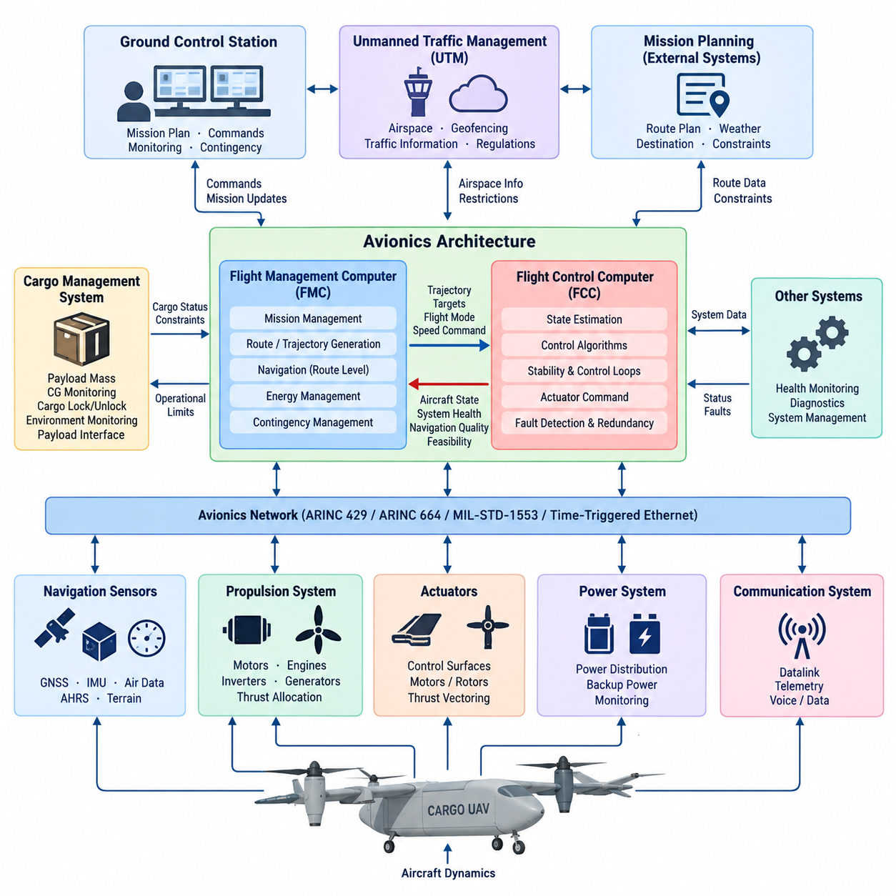
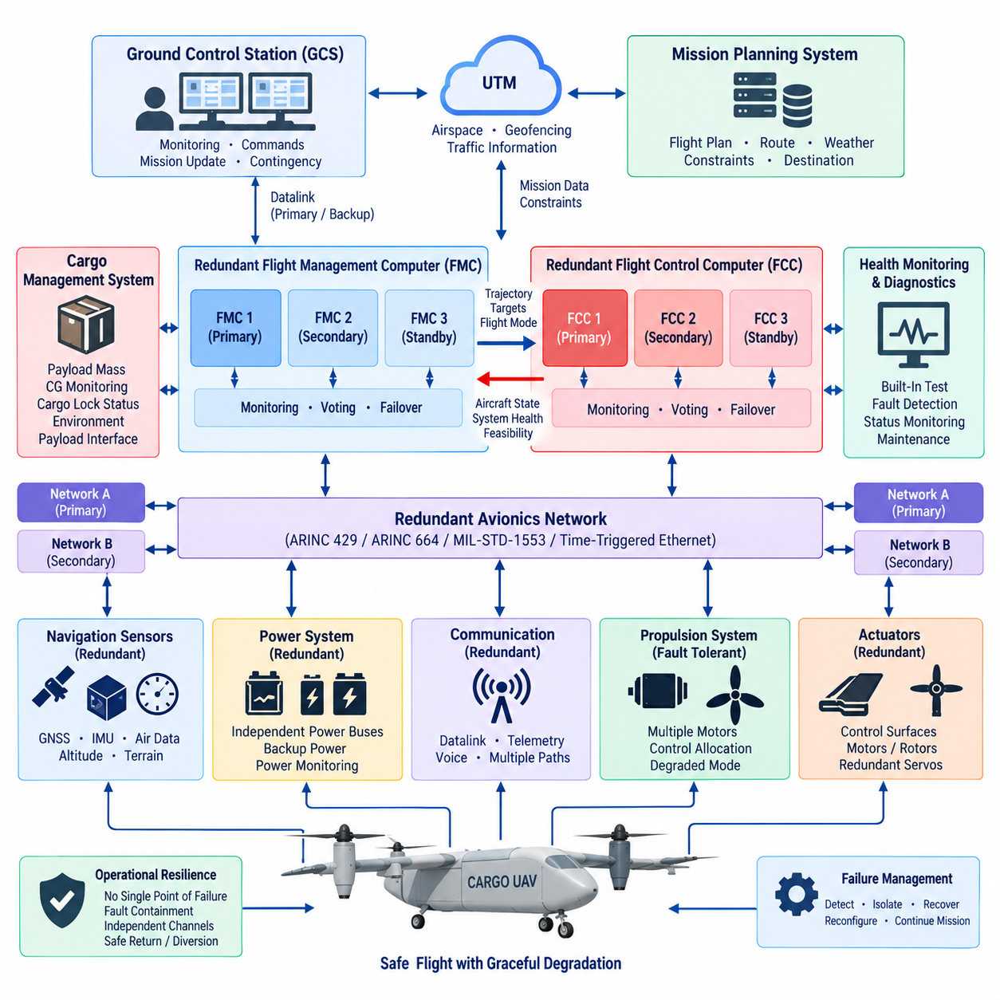
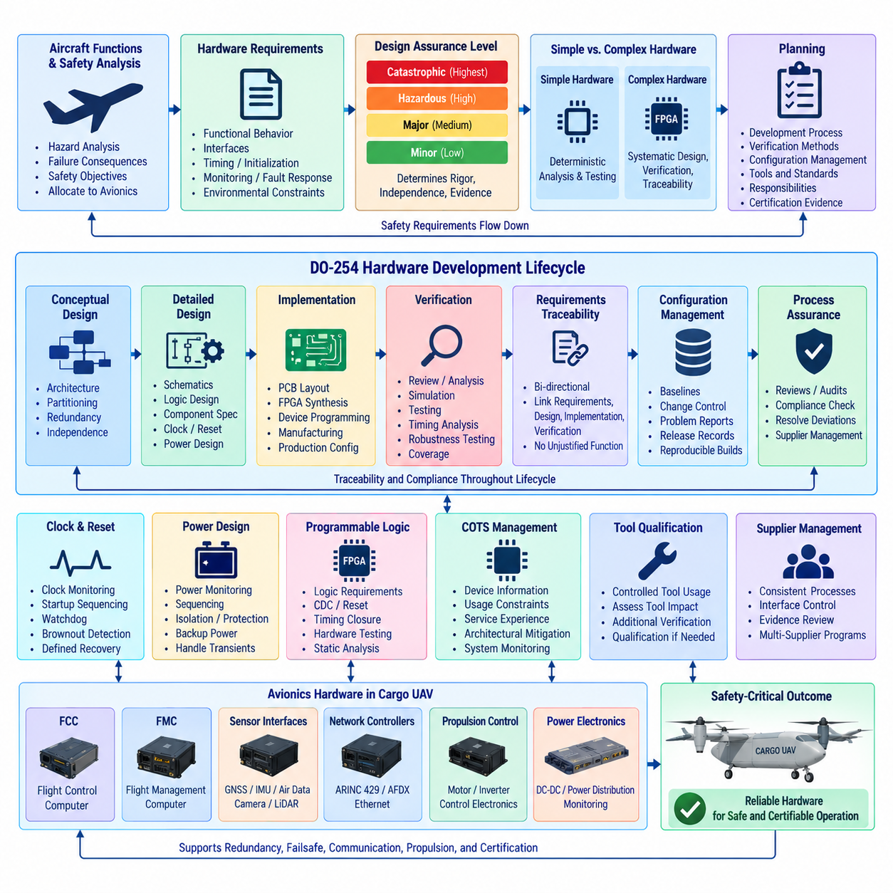
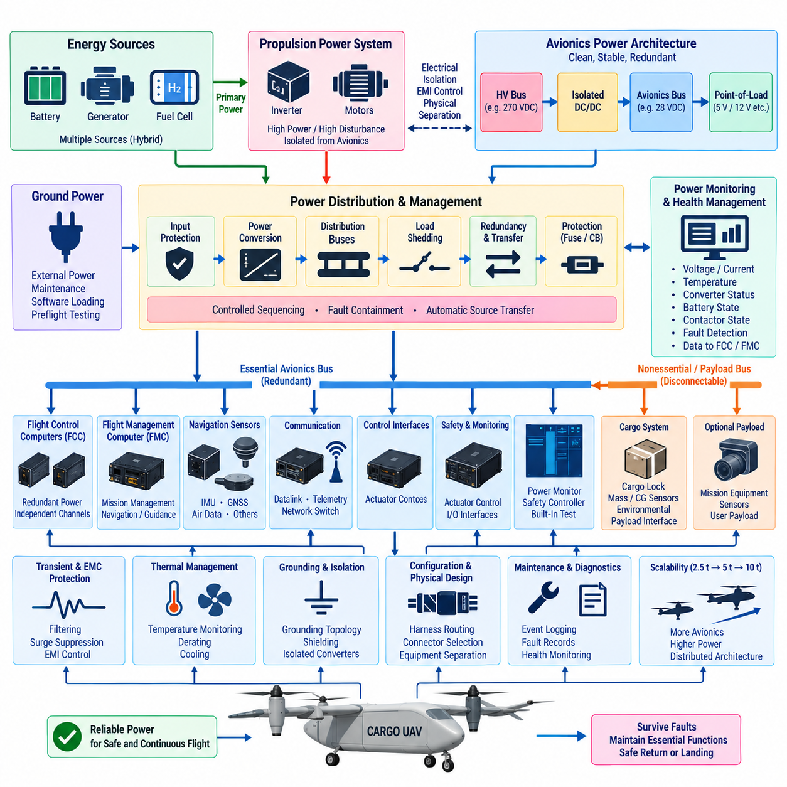
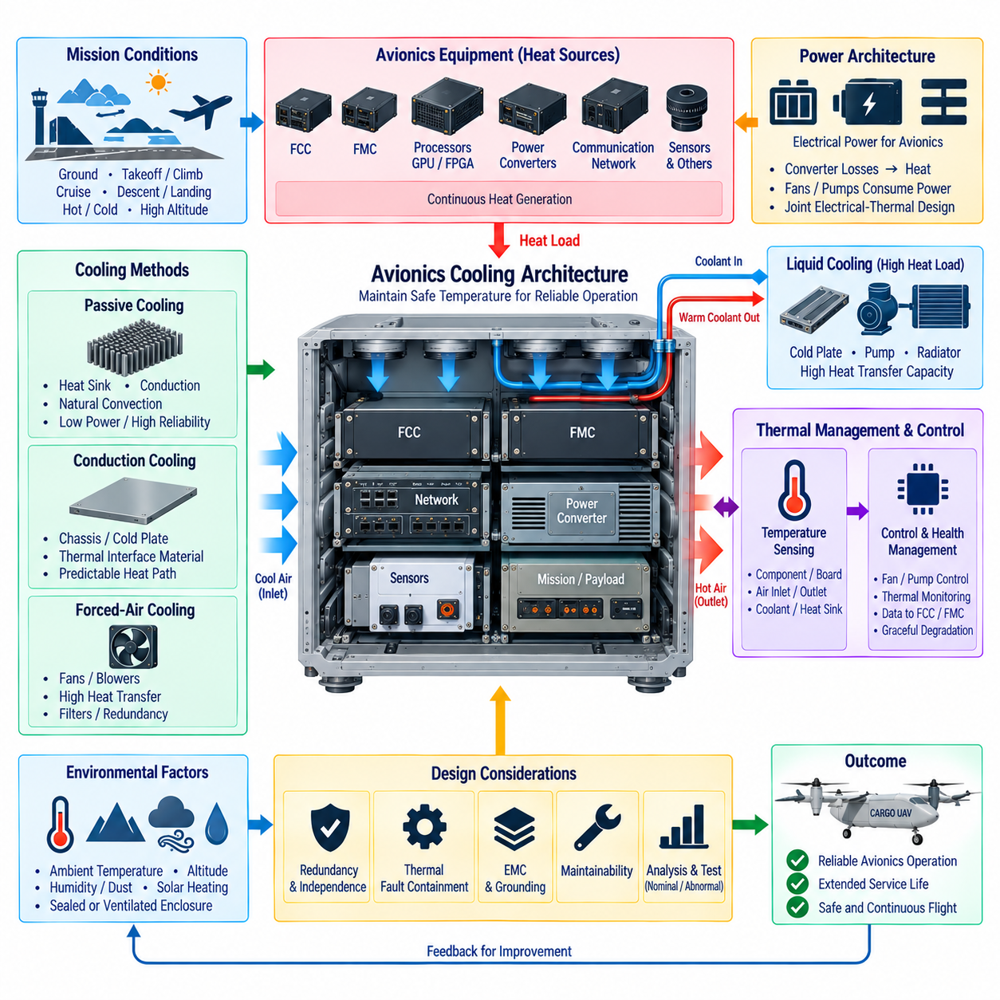

**Volume 18. Cargo UAV Architecture**

# Chapter 02. Avionics Architecture

## 02.01. FCC/FMC Architecture

{width="7.268055555555556in" height="7.268055555555556in"}

The Flight Control Computer (FCC) and Flight Management Computer (FMC) form two complementary computational domains within a cargo UAV avionics architecture. The FCC is responsible for real-time stabilization and control of the aircraft, while the FMC manages higher-level mission, navigation, trajectory, and operational objectives. Separating these domains allows deterministic flight-control functions to remain protected from computationally complex mission-management workloads.

The FCC operates at the innermost layer of the flight-control architecture. It continuously receives measurements from inertial measurement units, air-data sensors, GNSS receivers, attitude and heading systems, propulsion controllers, and other flight-critical sources. These inputs are processed through estimation and control algorithms that generate actuator commands for aerodynamic surfaces, motors, propellers, rotors, or thrust-vectoring mechanisms.

Real-time determinism is a fundamental FCC requirement because aircraft stability depends on predictable sensing, computation, and actuation latency. Attitude, angular-rate, altitude, velocity, and position control loops may operate at different update frequencies, but each must remain within defined timing limits. The FCC therefore emphasizes deterministic scheduling, bounded execution time, low communication latency, and controlled software partitioning rather than maximum computational throughput.

The FMC operates above these fast control loops and determines where and how the aircraft should fly. It manages flight plans, waypoints, route constraints, altitude profiles, speed targets, mission phases, energy considerations, and destination requirements. In an autonomous cargo UAV, the FMC can additionally coordinate departure, cruise, approach, landing, diversion, contingency routing, and interfaces with ground-based mission-planning or traffic-management systems.

A useful architectural distinction is that the FMC produces intent while the FCC converts that intent into physically achievable aircraft motion. The FMC may command a desired trajectory, altitude, airspeed, heading, or flight mode, but the FCC determines the required control response using current aircraft states. This hierarchy prevents mission software from directly manipulating actuators and establishes a controlled boundary between strategic navigation decisions and safety-critical vehicle dynamics.

Navigation functions bridge the two computational domains. GNSS, inertial navigation, air-data measurements, terrain information, and other navigation sources can be fused to estimate the aircraft state. Depending on system partitioning, high-rate state estimation may reside within the FCC, while route-level navigation and trajectory generation reside within the FMC. Clearly defined interfaces prevent conflicting estimates or duplicated control authority from propagating through the avionics system.

For a large autonomous cargo UAV, the FCC architecture should not be considered a single general-purpose computer. Flight-critical implementations commonly require redundant computational channels, independent sensor paths, fault detection, cross-channel monitoring, and controlled failover behavior. Multiple FCC channels can independently calculate flight states and commands, allowing disagreement detection and continued operation when an individual processor, sensor interface, communication path, or power domain fails.

The FMC can also employ redundancy, although its failure characteristics differ from those of the FCC. Temporary loss of mission optimization should not immediately destabilize the aircraft because the FCC must retain sufficient local authority to maintain safe flight. A degraded FMC condition can therefore trigger predefined behaviors such as holding a stable trajectory, continuing toward a validated waypoint, entering a loiter pattern, returning to base, diverting, or executing another certified contingency strategy.

Communication between FCC and FMC requires explicit data ownership and command authority. Typical information flowing toward the FCC includes trajectory references, navigation targets, requested flight modes, speed commands, and mission-phase transitions. Information returning toward the FMC includes aircraft state, control mode, navigation quality, system health, propulsion status, energy availability, fault conditions, and whether requested trajectories remain feasible under current vehicle limitations.

The avionics network surrounding these computers must support both deterministic flight-critical communication and higher-bandwidth mission data. The broader cargo UAV structure explicitly includes aerospace protocols such as ARINC 429, ARINC 664/AFDX, MIL-STD-1553, and Time-Triggered Ethernet as separate architectural topics. Their placement indicates that protocol selection should be treated as part of the overall avionics partitioning rather than as an isolated communication decision.

Power architecture is equally important because computational redundancy provides little benefit when redundant computers share a common electrical failure point. FCC and FMC channels should therefore be considered together with independent power feeds, protected distribution, monitoring, reset strategies, and backup energy sources. Critical sensor and communication paths must also be partitioned so that a single power-distribution, connector, harness, or network fault does not disable every control channel simultaneously.

The boundary between flight control and propulsion becomes especially important in cargo UAVs using distributed electric propulsion, hybrid-electric propulsion, or eVTOL configurations. The FCC may command thrust allocation rather than a single engine throttle, while lower-level propulsion controllers regulate individual motors, inverters, generators, or rotor systems. Control allocation must account for actuator limits, failures, asymmetric thrust, vehicle configuration, and transitions between different aerodynamic operating regimes.

The FMC must simultaneously consider mission feasibility at a much longer time horizon. For electric and hybrid cargo aircraft, route planning cannot be separated from energy management. Remaining battery energy, fuel state, predicted winds, payload mass, reserve requirements, alternate landing sites, propulsion degradation, and environmental constraints can influence trajectory decisions. The FMC can therefore become a central coordinator between navigation, mission planning, energy management, and contingency management.

Cargo operations introduce additional state information that conventional small UAV autopilots may not require. Payload mass, center-of-gravity condition, cargo-lock status, and cargo-system health can influence allowable flight envelopes and mission authorization. The volume structure consequently places cargo weight sensing, CG monitoring, cargo locking, environmental monitoring, and payload interfaces in a dedicated Cargo Management System, which should exchange validated operational states with the FCC/FMC architecture.

Ground systems represent another important architectural boundary. The Ground Control Station can provide mission plans, operator commands, route modifications, health monitoring, and contingency instructions, but safe aircraft operation should not depend on uninterrupted ground communication. The onboard FCC/FMC architecture must maintain sufficient autonomous capability to continue controlled flight when the datalink is delayed, degraded, interrupted, or unavailable for a defined period.

Integration with unmanned traffic management further expands the FMC role. Geofencing constraints, airspace restrictions, traffic information, collision-avoidance requirements, and approved routes can modify mission-level trajectory planning. These external constraints should enter through controlled interfaces rather than directly influencing actuator commands. The FCC remains responsible for executing validated trajectories while respecting aircraft dynamics, control limits, and immediate flight-safety requirements.

Fault management therefore spans multiple hierarchical layers. Hardware monitoring detects processor, memory, power, communication, sensor, and actuator faults; the FCC determines whether stable control can continue; and the FMC evaluates whether the original mission remains achievable. A propulsion fault, for example, may first require immediate control reconfiguration by the FCC and subsequently require route replanning, diversion, or emergency landing selection by the FMC.

As cargo UAV size increases from the 2.5-ton class toward 5-ton and 10-ton architectures represented in the volume structure, avionics partitioning becomes increasingly important. Higher payload, longer range, hybrid propulsion, more complex energy systems, and expanded operational environments increase the number of interacting subsystems. The FCC/FMC architecture therefore becomes a hierarchical safety backbone connecting vehicle dynamics, navigation, propulsion, mission management, cargo systems, ground control, and external airspace services.

## 02.02. Redundant Avionics Design

{width="7.268055555555556in" height="7.268055555555556in"}

Redundant avionics design ensures that a cargo UAV can maintain controlled flight when individual computers, sensors, communication links, power sources, or actuators fail. Unlike simple component duplication, effective redundancy requires independent channels, fault containment, continuous health monitoring, and deterministic reconfiguration. The objective is not merely to prevent equipment loss, but to prevent a single failure from becoming a vehicle-level loss of control.

The architecture begins by identifying flight-critical functions and determining how many independent paths are required to preserve them. Flight control, navigation, propulsion control, electrical power, communication, and essential sensing may require different redundancy strategies according to their failure consequences. A cargo UAV carrying substantial payloads generally demands stronger fault tolerance than a small unmanned aircraft because the potential consequences of uncontrolled flight are significantly greater.

Dual redundancy provides two channels performing equivalent functions, allowing one channel to continue operation when the other clearly fails. However, two channels alone cannot always determine which result is correct when their outputs disagree. For this reason, highly critical functions may use triple modular redundancy, where three independent channels calculate comparable results and voting logic identifies an inconsistent channel while the remaining two establish the accepted result.

Triple redundant Flight Control Computers can independently process sensor information, estimate aircraft states, execute control laws, and generate actuator commands. Cross-channel monitoring continuously compares their operating states and calculated outputs. When one FCC produces values outside predefined agreement limits, the architecture can isolate the suspected channel and continue operation using the healthy channels, while recording the fault and notifying higher-level system management.

Redundancy must also extend to sensors because several computers using one common sensor do not create a truly redundant control system. Multiple IMUs, GNSS receivers, air-data sensors, altitude sources, or attitude references can provide independent measurements. Sensor voting, consistency checking, analytical redundancy, and model-based estimation allow the avionics system to detect measurements that diverge from expected aircraft behavior and remove unreliable sources from the active solution.

Navigation redundancy is particularly important for autonomous cargo operations. GNSS may provide highly accurate absolute positioning but can be degraded by interference, blockage, jamming, spoofing, or antenna faults. Inertial navigation can maintain short-term state estimation without external signals, while additional navigation sources can constrain accumulated drift. The avionics architecture should therefore treat navigation as a multi-source estimation problem rather than depending on one positioning technology.

Communication paths between redundant computers must avoid introducing common points of failure. Independent buses, switches, network interfaces, connectors, and harness routes may be required for critical data. Aerospace communication technologies such as ARINC 429, ARINC 664/AFDX, MIL-STD-1553, or Time-Triggered Ethernet can support different redundancy models, but protocol redundancy is effective only when the physical and logical network architecture also provides appropriate fault isolation.

Electrical redundancy is inseparable from computational redundancy. Two FCCs connected to the same unprotected power rail can both disappear after one electrical fault. Critical avionics channels should therefore be distributed across independent or appropriately isolated power domains, with separate protection, conversion, monitoring, and backup capability. Battery-backed essential buses or alternative energy sources can preserve minimum flight-control capability after degradation of the primary electrical system.

Physical separation further reduces common-cause failures. Redundant computers installed together may simultaneously experience fire, water intrusion, impact damage, overheating, electromagnetic interference, or connector failure. Sensor wiring and network harnesses routed through the same vulnerable location can suffer the same problem. Redundant avionics design consequently considers equipment placement, harness routing, thermal zones, grounding, shielding, connector independence, and structural separation as part of system safety.

Fault detection, isolation, and recovery form the operational core of the redundant architecture. Fault detection determines that abnormal behavior exists, fault isolation identifies the affected component or channel, and recovery establishes an appropriate configuration using remaining resources. These functions must operate quickly enough that the aircraft remains within its controllable flight envelope while reconfiguration occurs, particularly during takeoff, landing, transition, or other dynamically sensitive phases.

Redundancy management should distinguish between transient faults and persistent failures. A temporary communication timeout or sensor anomaly does not necessarily justify permanent channel removal, while repeated or physically implausible behavior may require isolation. Health-monitoring logic can therefore use timing thresholds, plausibility checks, disagreement counters, built-in tests, watchdogs, communication supervision, and confidence metrics to determine whether a component should remain active, restart, enter standby, or be disconnected.

Actuator redundancy introduces another level of complexity because computational commands ultimately depend on physical control authority. Conventional aircraft may use redundant servos or control surfaces, while distributed-propulsion UAVs can exploit multiple motors or rotors. If one actuator or propulsion unit fails, control-allocation algorithms can redistribute commands among remaining devices, provided sufficient thrust and control authority remain to maintain a safe flight condition.

A distributed propulsion architecture can therefore provide functional redundancy without requiring every propulsion unit to have an identical standby replacement. The important requirement is vehicle-level controllability after a defined failure. The FCC must understand actuator availability, performance limits, saturation, asymmetric thrust, and degraded dynamics so that commands are allocated only to healthy resources and the aircraft remains inside a reduced but safe operating envelope.

Redundant Flight Management Computers address a different time scale. FMC failure should not interrupt the high-rate stabilization performed by the FCC. A standby or parallel FMC can preserve flight plans, navigation targets, mission states, energy information, and contingency data. If the active FMC fails, another channel can assume mission-management authority while the FCC continues executing the most recently validated flight mode or trajectory during the transition.

Cargo systems must also participate in redundancy management where their state affects flight safety. Payload mass, center of gravity, cargo restraint, door or locking status, and other cargo conditions can modify aircraft limitations. Independent sensing or plausibility checking may therefore be required for safety-relevant cargo information. An invalid cargo measurement should be detected before it causes inappropriate trajectory, performance, energy, or control-envelope calculations.

Ground communication can provide valuable supervision but should not serve as the final redundancy mechanism for onboard flight control. Loss of the Ground Control Station or datalink must not remove the aircraft\'s ability to stabilize itself. Autonomous contingency logic should define responses to communication loss, including continued flight, loiter, return, diversion, or landing according to mission phase, aircraft condition, available energy, weather constraints, and predefined operational rules.

Redundancy also requires protection against common-mode and common-cause failures. Installing three identical computers does not guarantee independence if all contain the same systematic design defect, receive corrupted common data, share one clock, depend on one power converter, or execute identical erroneous software assumptions. Architectural diversity, independent monitoring, partitioning, development assurance, and carefully controlled interfaces can reduce the probability that one cause defeats multiple redundant channels simultaneously.

Graceful degradation is a central design principle. A redundant cargo UAV should not be viewed only as either fully operational or failed. Loss of one component may reduce mission capability while preserving safe flight. The system can progressively restrict speed, maneuvering, altitude, route options, autonomous functions, or payload operations as redundancy is consumed, eventually transitioning to diversion or emergency landing when the remaining safety margin becomes insufficient.

Built-in test and maintenance functions complete the redundancy lifecycle. Power-on tests, continuous monitoring, maintenance diagnostics, fault histories, event logs, and channel-performance records help identify latent failures before another failure occurs. This is particularly important because an unnoticed standby-channel failure can silently eliminate redundancy. Maintenance systems should therefore verify not only active equipment but also components that may be required only during abnormal operation.

The overall Volume 18 structure places redundant avionics alongside FCC/FMC architecture, DO-254 hardware design, avionics power architecture, cooling, flight-control redundancy, failsafe design, Ground Control Station redundancy, and UAV safety architecture. This organization reflects an important principle: redundancy is not a single avionics feature but a system-level property spanning computation, sensing, networks, power, propulsion, physical installation, software, and operational contingency management.

## 02.03. DO-254 Hardware Design

{width="7.268055555555556in" height="7.268055555555556in"}

DO-254 provides a structured design-assurance framework for airborne electronic hardware whose failure could affect aircraft safety. In a cargo UAV, its principles are particularly relevant to complex electronic hardware used inside Flight Control Computers, Flight Management Computers, sensor interfaces, network controllers, propulsion-control electronics, and other avionics equipment. The central objective is to establish evidence that hardware performs its intended functions correctly and predictably.

Hardware assurance begins with system-level safety requirements rather than with schematic capture or component selection. Aircraft functions are analyzed to determine the consequences of hardware failure, and the resulting safety objectives are allocated to avionics equipment. Hardware requirements must then define precisely what each device or circuit is expected to perform, including functional behavior, interfaces, timing, initialization, monitoring, fault responses, and environmental operating constraints.

The required level of design assurance depends on the severity of the failure condition associated with the hardware function. Functions whose failure could contribute to catastrophic aircraft consequences require substantially stronger development and verification rigor than hardware associated with minor operational effects. This safety-driven classification influences planning, requirements traceability, independence of verification, configuration control, process assurance, and the amount of objective evidence required throughout development.

A fundamental distinction exists between simple and complex electronic hardware. Simple hardware can be comprehensively verified through deterministic analysis and testing without requiring extensive internal design assurance. Complex devices such as FPGAs, programmable logic, highly integrated digital circuits, or sophisticated custom hardware cannot generally be verified solely by testing every possible internal condition. Their development therefore requires systematic requirements, design, implementation, verification, and traceability activities.

Planning establishes how the hardware lifecycle will be controlled before detailed implementation progresses. Development processes, verification methods, configuration management, process assurance, certification evidence, tools, standards, and responsibilities should be defined consistently. For a cargo UAV program, this planning activity is especially important because FCC, FMC, communication, propulsion, power, and sensor electronics may be developed by different teams or suppliers while still contributing to one integrated safety architecture.

Hardware requirements provide the formal bridge between aircraft-level functions and electronic implementation. Requirements should be clear, verifiable, internally consistent, and sufficiently detailed to support design decisions. Inputs and outputs, electrical characteristics, timing behavior, data integrity, reset behavior, fault detection, redundancy interfaces, power transitions, and communication responses may all become hardware requirements. Ambiguous requirements create verification gaps that become increasingly expensive to resolve later.

Conceptual design transforms these requirements into an implementable hardware architecture. Processing devices, memories, communication interfaces, clocks, power supplies, monitoring circuits, sensor interfaces, programmable logic, and discrete electronics are partitioned according to functional and safety needs. Redundant channels should be designed so that independence is preserved wherever required, avoiding hidden common dependencies that could defeat the fault-tolerance objectives of the overall avionics architecture.

Detailed design defines how the conceptual architecture is physically realized. Schematics, programmable logic descriptions, component specifications, interface circuits, clock structures, reset networks, memory organization, PCB constraints, power distribution, and monitoring mechanisms must remain consistent with allocated requirements. Design decisions should be sufficiently documented so that verification engineers can determine not merely that the hardware operates, but why its implementation satisfies each applicable requirement.

Implementation converts the detailed design into physical electronic hardware and programmed devices. PCB layout, FPGA synthesis, device programming, component assembly, manufacturing data, and production configuration become controlled engineering outputs. At this stage, unintended implementation characteristics such as routing-induced timing problems, power integrity limitations, thermal concentration, electromagnetic coupling, or incorrect programmable-device constraints can invalidate assumptions established during earlier design activities.

Requirements traceability connects system requirements, hardware requirements, design elements, implementation outputs, and verification evidence. Bidirectional traceability helps demonstrate that every required function has been implemented and verified while also identifying design features that have no justified requirement. In safety-critical avionics, this discipline prevents undocumented functionality from entering the product and makes design changes easier to evaluate for their effects across the hardware lifecycle.

Verification must demonstrate that the hardware satisfies its requirements under normal, boundary, abnormal, and relevant failure conditions. Review, analysis, simulation, laboratory testing, timing analysis, interface verification, robustness testing, and programmable-logic verification may be combined according to the hardware type. Verification should challenge assumptions and boundary conditions rather than simply demonstrate successful nominal operation, particularly for hardware supporting flight-control and redundancy functions.

Verification independence becomes increasingly important as hardware criticality rises. The engineer who created a design may understand it deeply, but that familiarity can also make hidden assumptions more difficult to detect. Independent review and verification provide another technical perspective on requirements interpretation, implementation correctness, test completeness, and unexpected behavior. Independence therefore functions as a systematic defense against development errors rather than merely an administrative separation of responsibilities.

Programmable logic requires particular attention because FPGA behavior is simultaneously hardware-like and configuration-defined. Logic requirements, clock-domain crossings, reset behavior, state machines, arithmetic behavior, resource utilization, timing closure, fault responses, and interfaces must be verified systematically. Simulation alone may be insufficient, so static analysis, timing analysis, hardware testing, coverage assessment, and implementation reviews can collectively provide evidence that the programmed device behaves as intended.

Clock and reset architectures are safety-relevant because failures in these functions can affect large portions of an avionics computer simultaneously. Independent clock monitoring, startup sequencing, watchdogs, brownout detection, controlled resets, and defined recovery behavior can prevent uncertain electronic states. In redundant FCC architectures, clock or reset dependencies should also be evaluated for common-cause effects so that one infrastructure failure does not unexpectedly disable multiple computational channels.

Power behavior must similarly be addressed throughout hardware design. Avionics electronics experience startup, shutdown, voltage variation, transient disturbances, switching events, and potentially degraded power sources. Hardware should enter defined states during these conditions and recover predictably when valid power returns. Power monitoring, sequencing, isolation, protection, and backup supplies therefore interact directly with DO-254-oriented assurance activities and the broader avionics power architecture described within this volume.

Commercial off-the-shelf devices introduce another assurance challenge because developers may not control their internal design processes. Processors, memories, network devices, converters, and other highly integrated components may contain functionality beyond what the UAV application uses. Their suitability must therefore be supported through appropriate device information, usage constraints, service experience where applicable, verification, architectural mitigation, and system-level monitoring rather than assuming commercial qualification alone establishes airborne suitability.

Tool usage must also be controlled when a development or verification tool can introduce an error or fail to detect one without subsequent independent checking. FPGA synthesis tools, simulation environments, automated test systems, requirement-management platforms, and analysis software may influence assurance evidence. The project must understand how each tool affects lifecycle outputs and determine whether additional verification, tool assessment, or qualification-related activities are necessary for the intended assurance context.

Configuration management ensures that requirements, schematics, programmable logic, PCB data, component lists, verification procedures, test results, and released hardware configurations remain synchronized. A verified FPGA image installed on the wrong PCB revision or an uncontrolled component substitution can invalidate previous evidence. Baselines, change histories, problem reports, release records, and reproducible build information are therefore essential parts of maintaining hardware assurance over the aircraft lifecycle.

Process assurance provides confidence that the planned hardware lifecycle has actually been followed. Reviews and audits identify deviations, incomplete evidence, unresolved problem reports, or inconsistencies between development and verification records. This becomes especially important in large cargo UAV programs involving multiple suppliers because technically capable subsystems can still create certification problems when their lifecycle evidence, configuration records, interfaces, or assurance processes are inconsistent.

DO-254-oriented development should be integrated with redundant avionics design rather than performed after the hardware architecture has already been frozen. Redundant FCCs, FMCs, network channels, power domains, sensor interfaces, and monitoring circuits create assumptions about independence and fault containment that must be reflected in hardware requirements and verification. Assurance evidence must demonstrate not only correct individual operation but also the intended behavior when channels disagree, fail, reset, or transition.

The broader Volume 18 structure places DO-254 hardware design between redundant avionics design and avionics power architecture, while later chapters address flight control, failsafe behavior, redundancy, communication, propulsion, and certification planning. This organization emphasizes that hardware assurance is one layer of a larger cargo UAV safety architecture. Reliable airborne electronics ultimately depend on coordinated requirements, implementation, verification, redundancy, power, communication, configuration control, and system-level validation.

## 02.04. Avionics Power Architecture

{width="7.268055555555556in" height="7.268055555555556in"}

The avionics power architecture of a cargo UAV provides controlled, reliable, and fault-tolerant electrical energy to flight-critical computers, navigation sensors, communication equipment, monitoring electronics, and control interfaces. Its purpose extends beyond voltage conversion and distribution. The architecture must preserve essential avionics functions during normal operation, electrical transients, source failures, switching events, and progressively degraded aircraft conditions.

Power requirements originate from the avionics functional architecture. Flight Control Computers, Flight Management Computers, GNSS receivers, IMUs, air-data systems, communication interfaces, network switches, cargo-monitoring electronics, and safety controllers have different voltage, current, transient, and availability requirements. These loads must therefore be classified according to functional criticality before electrical buses, converters, protection devices, and backup sources are allocated.

A fundamental design principle is separation between propulsion power and avionics power. Electric or hybrid cargo UAVs can contain high-power motors, inverters, generators, batteries, and switching converters that generate substantial electrical disturbances. Flight-critical avionics require a cleaner and more tightly controlled electrical environment. Isolation, filtering, dedicated conversion stages, grounding strategy, shielding, and appropriate physical separation help prevent propulsion disturbances from propagating into sensitive electronics.

The power architecture commonly establishes multiple distribution levels rather than supplying every avionics device directly from the main energy source. A high-voltage propulsion bus may feed isolated DC/DC converters that create lower-voltage avionics buses, while additional point-of-load converters generate voltages required by processors, FPGAs, sensors, memories, and communication circuits. This hierarchy improves voltage regulation, protection coordination, monitoring, and subsystem-level fault containment.

Redundant avionics require corresponding power redundancy. Installing multiple FCC or FMC channels provides limited safety benefit if all channels depend on one converter, contactor, fuse, connector, or distribution bus. Independent or sufficiently isolated power paths should therefore supply redundant computational channels. A failure in one source or distribution branch must not automatically remove all computers responsible for stabilization, navigation, or mission management.

Essential and nonessential loads should be separated according to their contribution to continued safe flight. Essential loads can include minimum flight-control computation, inertial sensing, required navigation sources, critical communication, actuator interfaces, and power monitoring. Less critical payload, convenience, or mission equipment can be disconnected when electrical capacity becomes limited. Load shedding allows remaining energy to be concentrated on functions required to stabilize and safely recover the aircraft.

Backup power provides another layer of protection when primary generation or distribution becomes unavailable. Dedicated batteries, isolated reserve buses, or alternative generation sources can maintain critical avionics for a defined duration. Backup capacity should be based on the time required to detect the failure, reconfigure the aircraft, establish a safe trajectory, reach an alternate landing location, or perform an emergency landing rather than being treated as an arbitrary energy reserve.

Power source diversity becomes increasingly important in hybrid cargo UAVs. Batteries, generators, fuel cells, turbine-electric systems, or other sources may coexist within the aircraft. Although propulsion energy management is addressed separately within the hybrid power architecture, avionics power design must determine which sources can support essential electronics under different failure combinations. Automatic source transfer must occur without producing unacceptable interruptions or unstable voltage conditions.

Power conversion devices are themselves potential single points of failure. DC/DC converters, voltage regulators, power controllers, contactors, and solid-state switching devices therefore require appropriate redundancy, derating, protection, and health monitoring. Parallel or independent conversion paths can improve availability, but their architecture must prevent one failed converter from collapsing a shared output bus or feeding damaging energy backward into another healthy power channel.

Protection coordination limits the propagation of electrical faults. Fuses, circuit breakers, electronic protection devices, current limiting, overvoltage protection, reverse-current protection, and isolation switches should disconnect the smallest practical affected region. A short circuit in a noncritical sensor or communication unit should not remove the entire avionics bus. Selective protection therefore contributes directly to fault containment and overall aircraft availability.

Power sequencing is particularly important for modern avionics computers containing processors, GPUs, FPGAs, memories, network devices, and multiple voltage rails. Incorrect startup or shutdown sequences can create undefined states even when the nominal supply voltage is correct. Controlled sequencing, power-good signals, reset coordination, brownout detection, and defined initialization behavior ensure that avionics equipment enters and leaves operation predictably.

Voltage transients and interruptions must be considered as normal design challenges rather than exceptional laboratory events. Motor switching, contactor operation, generator transitions, regenerative events, load changes, wiring inductance, and source transfer can generate dips, surges, ripple, and high-frequency disturbances. Filtering, transient suppression, energy storage, converter control, and robust interface design prevent these events from causing computer resets, corrupted data, or erroneous sensor measurements.

Power monitoring transforms the electrical distribution system into an observable avionics subsystem. Voltage, current, temperature, insulation condition, converter status, battery state, contactor state, and protection events can be continuously measured. These measurements allow health-management functions to identify abnormal trends, distinguish local equipment faults from source problems, and provide the FCC or FMC with information required for electrical reconfiguration and mission-level decisions.

The FCC must retain sufficient power information to protect immediate flight safety. Loss of an avionics power channel may require transfer to another source, isolation of failed equipment, reconfiguration of sensors, or transition to a degraded control mode. The FMC can evaluate the longer-term consequences by considering remaining energy, destination distance, alternate landing sites, mission requirements, and the availability of redundant equipment before deciding whether the mission can continue.

Physical implementation strongly influences electrical independence. Redundant power cables routed together through one vulnerable location can be damaged by the same mechanical event, heat source, or fire. Similarly, redundant converters installed in one thermal zone can experience a common overheating condition. Power architecture therefore includes harness routing, connector selection, equipment placement, cooling, grounding, shielding, structural separation, and environmental protection.

Grounding and electromagnetic compatibility are closely connected to avionics power quality. High-current propulsion equipment can introduce conducted and radiated interference through common impedance, cable coupling, chassis paths, or poorly controlled return currents. Defined grounding topology, controlled return paths, filtering, shielding, bonding, and separation between noisy and sensitive circuits reduce interference while preventing unintended ground loops and unstable reference potentials.

Thermal behavior must also be considered because power conversion efficiency directly affects avionics reliability. Even highly efficient converters generate heat continuously, and redundant power electronics may remain active simultaneously. Temperature monitoring, derating, heat spreading, conduction paths, forced-air or liquid cooling where appropriate, and thermal fault responses should ensure that electrical availability is not compromised by excessive temperature during demanding mission phases.

Cargo systems introduce additional electrical loads whose criticality depends on aircraft configuration and mission. Cargo locks, weight sensors, center-of-gravity monitoring, environmental sensors, payload interfaces, and cargo-control electronics may require continued power during specific phases of flight. The architecture should distinguish safety-relevant cargo functions from optional payload functions so that electrical degradation does not inadvertently disable information required to maintain a safe flight envelope.

Maintenance and diagnostics depend on detailed power-system information. Recorded undervoltage events, overcurrent trips, converter temperatures, source transfers, protection activations, and intermittent resets can reveal developing faults before they become operational failures. Built-in test and event logging are particularly valuable for redundant systems because a latent failure in an unused backup power path can otherwise remain undetected until the primary channel fails.

The power architecture must also support controlled ground operation, maintenance, software loading, and preflight testing. External power can reduce unnecessary consumption of onboard energy, but its connection must not bypass protection or introduce unsafe transients into flight hardware. Ground-power interfaces, maintenance modes, isolation mechanisms, and source-selection logic should therefore be integrated into the same controlled electrical architecture used during flight.

As cargo UAV size progresses from 2.5-ton to 5-ton and ultimately 10-ton classes, electrical architecture becomes increasingly distributed and power-intensive. Larger aircraft introduce more avionics equipment, longer harnesses, greater propulsion power, hybrid energy sources, additional redundancy, and stronger thermal constraints. Power distribution must therefore evolve from a collection of supplies into an actively monitored, fault-contained, reconfigurable electrical network.

Within Volume 18, avionics power architecture follows FCC/FMC architecture, redundant avionics design, and DO-254 hardware design, while the next topic addresses avionics cooling. Later chapters separately cover flight control, failsafe behavior, cargo management, hybrid power systems, and progressively larger cargo UAV classes. This structure positions avionics power as the electrical foundation that allows computing, sensing, communication, redundancy, and safety functions to remain available throughout flight.

## 02.05. Avionics Cooling Design

{width="7.268055555555556in" height="7.268055555555556in"}

Avionics cooling design ensures that flight-critical electronic equipment remains within allowable temperature limits throughout the complete cargo UAV mission. Flight Control Computers, Flight Management Computers, processors, FPGAs, communication devices, power converters, sensor interfaces, and monitoring electronics continuously generate heat. Cooling must therefore be treated as part of avionics reliability and safety architecture rather than as a secondary packaging consideration.

Electronic temperature directly influences component reliability, computational stability, and service life. Excessive junction temperature can accelerate semiconductor degradation, increase leakage current, alter electrical characteristics, reduce power-converter efficiency, and eventually cause shutdown or permanent damage. Even when equipment remains operational, repeated thermal cycling can fatigue solder joints, connectors, PCB structures, and interfaces between electronic components and their cooling surfaces.

Thermal design begins with a heat-load model of the avionics architecture. Each computer, converter, network device, sensor-processing module, and power component contributes a different amount of heat according to operating mode. Peak electrical power alone is insufficient because actual thermal behavior depends on efficiency, duty cycle, mission phase, processor utilization, ambient temperature, airflow, enclosure design, and heat-transfer paths from semiconductor junctions to the external environment.

Cargo UAV missions create highly variable thermal conditions. Ground operation may combine high ambient temperature with little natural airflow, while climb can impose maximum computational and propulsion-related loads. Cruise may improve external airflow but expose equipment to different atmospheric temperatures and pressures. Landing and post-flight operation introduce further transitions. Cooling architecture must therefore address the complete mission thermal profile rather than optimize only for steady cruise conditions.

Passive cooling is attractive because it minimizes moving parts, electrical consumption, acoustic noise, and maintenance requirements. Heat sinks, thermal interface materials, conduction plates, structural heat spreaders, enclosure surfaces, and natural convection can transfer heat without active machinery. Passive methods are especially useful for lower-power avionics, but their capability becomes limited as processor density and internal heat flux increase in advanced autonomous cargo UAV computers.

Conduction cooling transfers heat directly from electronic components and circuit boards into a chassis, cold plate, equipment rack, or aircraft structure. This approach can provide predictable thermal paths while avoiding dependence on internal airflow. Mechanical interfaces become critical because contact pressure, surface flatness, thermal interface materials, mounting tolerances, vibration, and structural deformation can significantly change thermal resistance between the heat-generating device and the final heat sink.

Forced-air cooling increases heat-transfer capability by moving air across heat sinks, circuit boards, or equipment enclosures. Fans and blowers can support processors and power electronics with higher thermal loads, but they introduce additional failure modes. Bearing wear, dust accumulation, blocked passages, filter contamination, reduced air density, and fan-controller faults must be considered. Safety-critical equipment should not lose essential functionality immediately following a single cooling-fan failure.

Airflow architecture requires deliberate management rather than simply installing additional fans. Intake location, exhaust routing, pressure drop, recirculation, equipment spacing, cable obstruction, hot-air mixing, and local stagnation regions influence actual cooling performance. Thermal analysis should identify hotspots inside avionics bays and ensure that downstream equipment is not supplied primarily with air already heated by upstream computers or power-conversion modules.

Liquid cooling becomes attractive when avionics heat density exceeds practical air-cooling capability. Cold plates can collect heat from high-performance processors, GPUs, FPGAs, and power electronics, while pumps circulate coolant toward a heat exchanger or radiator. Liquid systems provide high heat-transfer capacity and flexible heat transport, but introduce pumps, hoses, seals, connectors, reservoirs, coolant compatibility, leakage detection, and additional maintenance considerations.

A redundant avionics architecture requires corresponding consideration of cooling independence. Two redundant FCCs installed on the same cooling loop can experience simultaneous thermal failure if one pump or heat exchanger is lost. Thermal architecture should therefore evaluate whether redundant computers require independent cooling paths, passive emergency capability, multiple pumps, isolated branches, or sufficient thermal inertia to maintain operation while the aircraft transitions to a safe degraded state.

Thermal fault containment is as important as nominal cooling performance. One overheating unit should not unnecessarily raise the temperature of adjacent redundant equipment. Physical separation, thermal barriers, independent heat paths, controlled airflow, compartmentalization, and strategic equipment placement can reduce propagation. This principle complements electrical and computational redundancy by preventing a common thermal event from disabling multiple safety-critical channels.

Temperature sensing provides the feedback required for active thermal management. Semiconductor junction estimates, board sensors, inlet and outlet air temperatures, coolant temperatures, heat-sink sensors, and avionics-bay measurements can reveal both immediate overheating and gradual degradation. Multiple measurement points are valuable because a normal enclosure temperature does not guarantee that a processor junction, voltage regulator, FPGA, or localized PCB region remains within its allowable range.

Thermal monitoring should be integrated with avionics health management rather than remain isolated within cooling hardware. Temperature trends, fan speed, pump status, coolant flow, processor load, converter temperature, and environmental conditions can be combined to estimate remaining thermal margin. The FCC and FMC can then receive relevant health information and determine whether computational capability, mission operation, or aircraft trajectory must be modified.

Graceful thermal degradation can prevent overheating from immediately becoming a flight-critical failure. A high-performance computer may reduce processor or GPU frequency, disable nonessential workloads, lower sensor-processing rates, or suspend optional AI functions while preserving core flight control. Nonessential mission equipment can also be shut down. Thermal management therefore interacts with computational scheduling and electrical load shedding to protect the minimum functions required for safe flight.

The distinction between flight-critical and mission-critical computing is important for cooling allocation. FCC functions require predictable availability and should receive cooling resources consistent with their safety role. Higher-level AI perception, mission optimization, payload processing, or data recording may consume substantially more power but can often tolerate controlled performance reduction. Thermal priorities should reflect functional criticality rather than simply the magnitude of each equipment heat load.

Avionics power architecture and cooling architecture are strongly coupled. Electrical conversion losses become thermal loads, while fans, pumps, valves, and cooling controllers themselves consume electrical power. A degraded electrical system may therefore reduce cooling capability precisely when remaining converters are carrying higher loads. Joint electrical-thermal analysis is required to evaluate realistic failure conditions and avoid assumptions that each architecture independently has unlimited supporting resources.

Environmental conditions introduce additional design constraints. Cargo UAV avionics may encounter high and low ambient temperatures, solar heating, humidity, rain, dust, salt contamination, altitude-related pressure changes, and rapid thermal transitions. Sealed enclosures improve environmental protection but restrict convection. Ventilated systems improve airflow but increase contamination exposure. Cooling design must balance environmental sealing, heat rejection, maintainability, mass, and reliability.

Altitude affects air cooling because reduced air density changes convective heat-transfer performance. A cooling system that performs adequately during ground testing may have less margin at operating altitude, particularly when high computational workloads continue during climb or cruise. Fans and heat exchangers must therefore be evaluated under representative atmospheric conditions, and thermal models should account for changes in air density, temperature, pressure, and aircraft operating state.

Electromagnetic compatibility also interacts with cooling design. Large ventilation openings can weaken enclosure shielding, while fans, pumps, and their electronic drives can introduce electrical noise. Conductive heat paths may simultaneously become grounding or bonding paths. Cooling interfaces must therefore be coordinated with enclosure design, shielding, grounding, filtering, and cable routing so that improved thermal performance does not create new electromagnetic interference or electrical safety problems.

Thermal analysis should combine analytical calculations, simulation, component characterization, and physical testing. Early models can estimate heat paths and equipment temperatures before hardware exists, while detailed computational analysis can identify local airflow or conduction problems. Prototype testing under controlled environmental conditions is then required to validate assumptions, correlate models, and determine whether thermal margins remain adequate under representative loads and failure cases.

Verification must include abnormal conditions rather than demonstrating only nominal cooling. Fan failure, pump degradation, blocked airflow, increased processor load, elevated ambient temperature, partial power-system failure, sensor faults, and degraded heat-transfer interfaces should be considered where relevant. The objective is to determine how quickly temperatures rise, which functions are affected, whether monitoring detects the condition, and how long essential avionics remain operational.

Maintenance strategy should preserve cooling performance throughout the aircraft lifecycle. Fans, filters, pumps, coolant, thermal interface materials, heat exchangers, and ventilation passages can degrade gradually. Temperature trends and cooling-system health records can support predictive maintenance by identifying increasing thermal resistance or declining airflow before operational limits are exceeded. Accessible equipment placement also reduces the cost and risk of inspection and replacement.

As cargo UAVs progress from 2.5-ton to 5-ton and 10-ton classes, avionics cooling becomes increasingly integrated with vehicle-level thermal management. Larger aircraft can carry more powerful computers, redundant electronics, communication systems, hybrid-power controllers, and autonomous processing hardware. Future designs may therefore combine distributed conduction, forced air, liquid cooling, and centralized heat rejection rather than relying on one universal cooling method.

Within Volume 18, avionics cooling design completes the Avionics Architecture chapter after FCC/FMC architecture, redundant avionics design, DO-254 hardware design, and avionics power architecture. The following chapters address aerospace protocols and flight-control systems, while later sections cover hybrid power and progressively larger cargo UAV platforms. This structure establishes cooling as a fundamental enabling layer for reliable computing, redundancy, communication, control, and safe autonomous flight.
