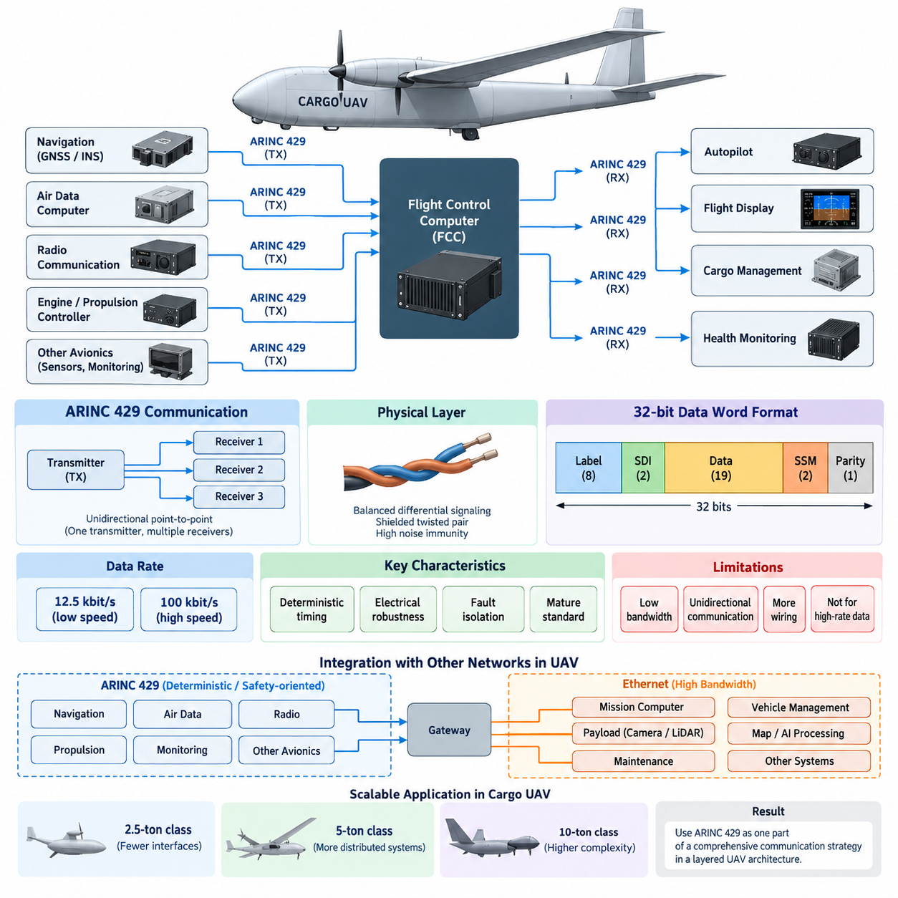
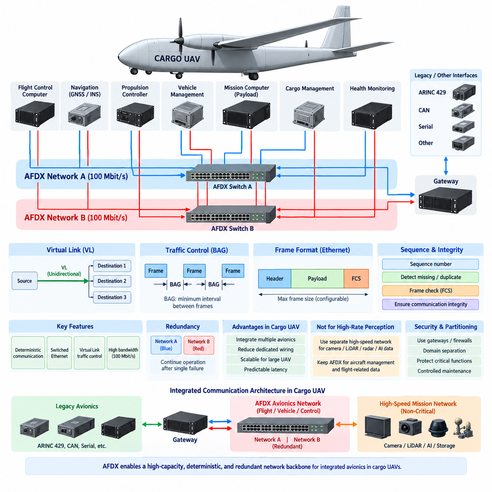
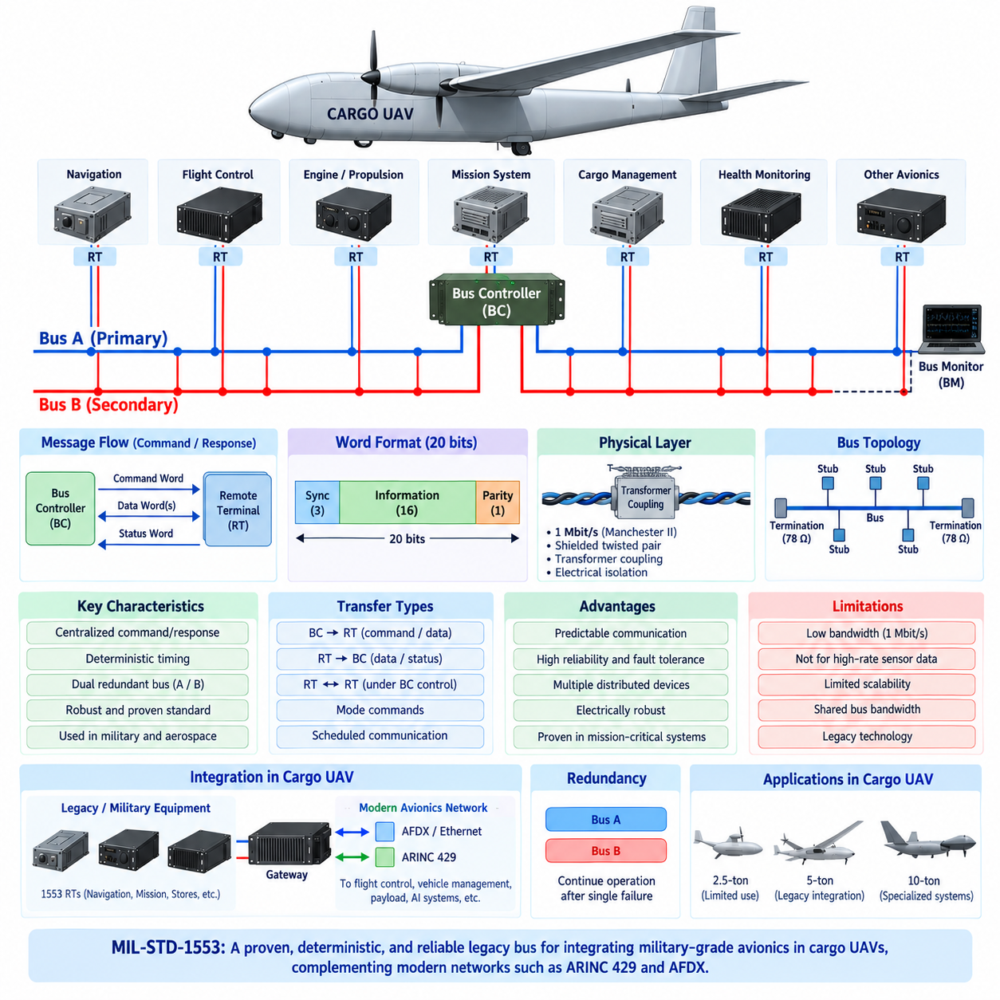
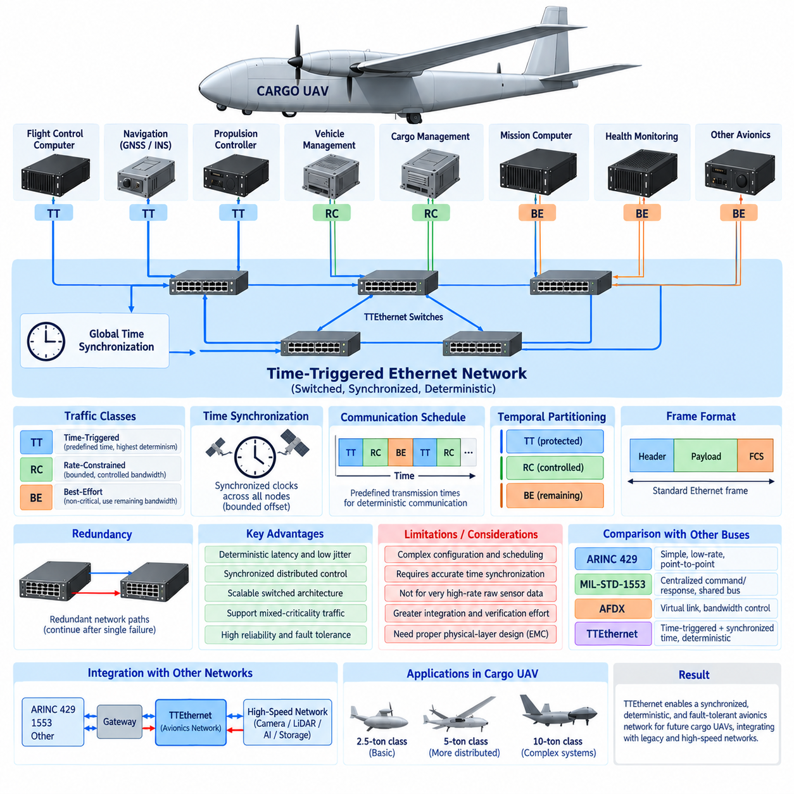
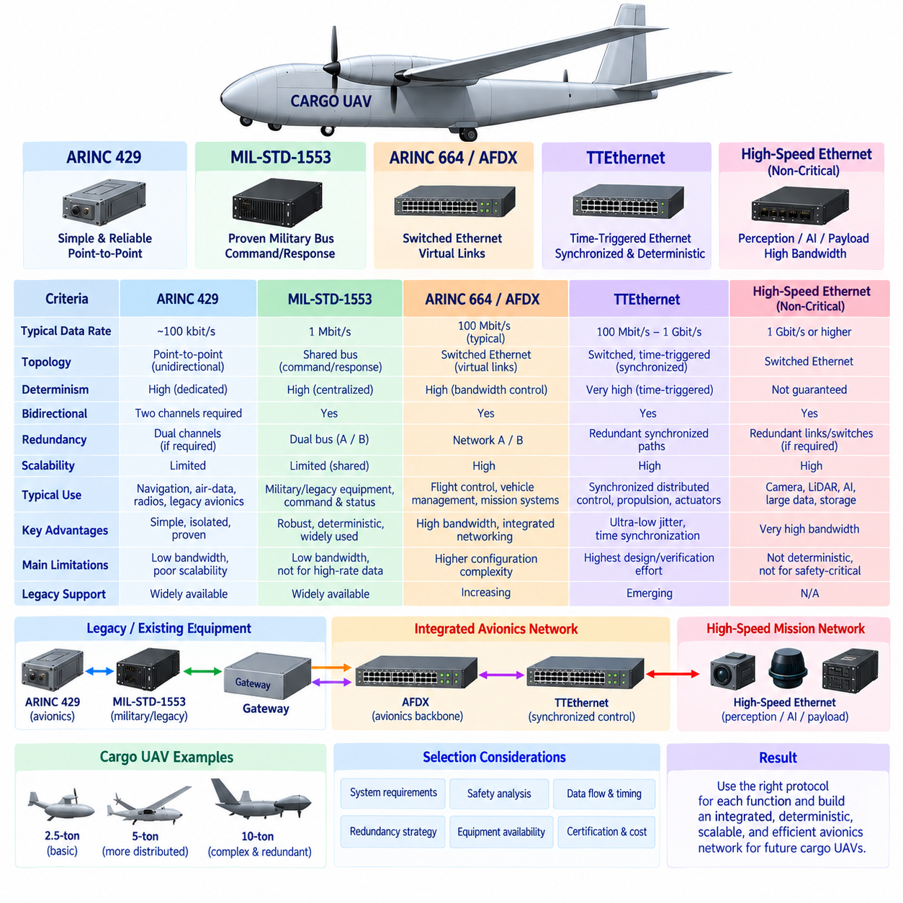

**Volume 18. Cargo UAV Architecture**

# Chapter 03. Aerospace Protocols

## 03.01. ARINC 429 in UAV

{width="7.268055555555556in" height="7.268055555555556in"}

ARINC 429는 민간 항공전자(Civil Avionics) 분야에서 항공기 하위 시스템 간에 결정론적(Deterministic)이고 저속(Low-Rate)인 정보를 전송하기 위해 널리 사용되는 성숙한 디지털 데이터 버스(Digital Data Bus) 표준이다. 화물 무인항공기(Cargo UAV)에서는 비행제어컴퓨터(Flight Control Computer), 항법장치(Navigation Unit), 대기자료시스템(Air Data System), 엔진 또는 추진 제어기(Propulsion Controller), 상태 감시장치(Monitoring Equipment), 임무 항공전자장비(Mission Avionics) 사이에 단순하고 예측 가능한 인터페이스를 제공할 수 있다. ARINC 429의 가치는 높은 대역폭보다는 안정적인 타이밍, 전기적 견고성, 그리고 오랜 기간 확립된 항공전자 통합 방식에 있다.

ARINC 429의 기본 아키텍처(Architecture)는 단방향 점대점 통신(Unidirectional Point-to-Point Communication) 모델을 사용한다. 하나의 송신기(Transmitter)는 여러 수신기(Receiver)에 정보를 전달할 수 있지만, 동일한 연결을 통해 정보가 반대 방향으로 되돌아가지는 않는다. 따라서 양방향 통신(Bidirectional Communication)을 구현하려면 별도의 송신 채널과 수신 채널이 필요하다. 이러한 구조는 공유 버스(Shared Bus) 방식보다 배선량을 증가시키지만, 강력한 통신 격리(Communication Isolation)를 제공하고 각 데이터 흐름의 방향과 소유권을 명확하게 분석할 수 있게 한다.

물리 계층(Physical Layer)에서 ARINC 429는 일반적으로 항공기의 전기적 잡음 환경에서 전자기 간섭(Electromagnetic Interference)에 대한 내성을 향상시키는 평형 차동 신호(Balanced Differential Signaling) 쌍을 사용한다. 차폐 연선(Shielded Twisted Pair)이 일반적으로 인터페이스에 사용되며, 차동 신호 방식은 공통 모드 잡음(Common-Mode Disturbance)을 억제하는 데 도움이 된다. 이러한 특성은 고출력 추진 인버터(Propulsion Inverter), 전기모터(Electric Motor), DC/DC 컨버터(DC/DC Converter), 스위칭 전력전자장치(Switching Power Electronics), 무선장치(Radio) 등 다양한 전자기 잡음원을 포함하는 화물 무인항공기에서 중요하다.

ARINC 429 통신은 가변 길이 네트워크 패킷(Variable-Length Network Packet)이 아니라 32비트 워드(32-bit Word)를 기반으로 한다. 하나의 워드는 전송되는 파라미터(Parameter)를 식별하고 관련 데이터, 필요한 경우 출발지 또는 목적지 정보, 상태 정보(Status Information), 패리티 보호(Parity Protection)를 제공하는 필드(Field)들로 구성된다. 레이블(Label) 필드는 데이터의 의미를 식별하며, 부호/상태 매트릭스(Sign/Status Matrix)는 데이터의 유효성이나 동작 상태를 전달할 수 있다. 이러한 고정 워드 구조는 수신기 구현을 단순화하고 예측 가능한 처리 동작을 지원한다.

ARINC 429에서는 일반적으로 두 가지 표준 데이터 전송률(Data Rate)이 사용되며, 저속 동작(Low-Speed Operation)은 약 12.5 kbit/s, 고속 동작(High-Speed Operation)은 100 kbit/s이다. 이러한 속도는 현대적인 이더넷 기반 항공전자 네트워크(Ethernet-Based Avionics Network)에 비하면 매우 낮지만, 많은 비행 필수 파라미터(Flight-Critical Parameter)는 높은 대역폭을 필요로 하지 않는다. 대기속도(Airspeed), 고도(Altitude), 방위(Heading), 항법 상태(Navigation Status), 온도, 압력, 액추에이터 상태(Actuator State), 시스템 건전성 값(System-Health Value) 등은 주기적으로 전송되는 소형 데이터 워드로 효율적으로 표현할 수 있다.

결정론성(Determinism)은 ARINC 429가 항공전자 시스템에서 여전히 유용한 중요한 이유 중 하나이다. 송신기는 사전에 정의된 파라미터를 제어된 반복 주기(Repetition Interval)에 따라 전송하므로, 수신 시스템은 중요한 정보가 언제 도착해야 하는지를 예측할 수 있다. 여러 노드(Node)가 하나의 공유 통신 매체를 두고 경쟁하는 복잡한 중재(Arbitration)가 존재하지 않는다. 무인항공기 비행제어 아키텍처에서는 이러한 예측 가능한 특성이 항법 입력, 대기자료 측정값, 장비 상태 등 갱신 주기가 명확하게 제한되고 분석되어야 하는 신호의 타이밍 분석(Timing Analysis)을 단순화할 수 있다.

ARINC 429는 통신 채널이 물리적으로 분리되어 있기 때문에 유용한 고장 격리(Fault Containment) 특성도 제공한다. 하나의 수신기에 고장이 발생하더라도 일반적으로 공유 네트워크 전체를 점유하여 다른 장비의 통신을 방해할 수 없다. 또한 송신 채널을 적절하게 분리하면 인터페이스 고장(Interface Failure)이 다른 시스템으로 전파되는 것을 제한할 수 있다. 따라서 이중화 무인항공기 항공전자(Redundant UAV Avionics)에서는 시스템 아키텍처가 요구하는 경우 독립적인 ARINC 429 채널을 이용하여 비행제어, 항법, 상태 감시 또는 추진 관련 경로 사이의 분리성을 지원할 수 있다.

화물 무인항공기는 ARINC 429를 유일한 기내 네트워크(Onboard Network)로 사용하는 대신 선택적으로 적용할 수 있다. 항법장비, GNSS/INS 장치, 대기자료컴퓨터(Air Data Computer), 무선장비 또는 인증된 항공전자 모듈(Certified Avionics Module)은 ARINC 429 인터페이스를 제공할 수 있으며, 높은 대역폭을 요구하는 센서와 컴퓨팅 시스템은 이더넷 기반 통신(Ethernet-Based Communication)을 사용할 수 있다. 결과적으로 항공기는 ARINC 429가 결정론적 레거시(Legacy) 또는 안전 지향 인터페이스를 담당하고, 고속 네트워크가 데이터 집약적 정보를 전달하는 이종 네트워크(Heterogeneous Network) 구조를 갖게 된다.

인터페이스 설계(Interface Design)는 단순히 송신기와 수신기를 연결하는 것 이상을 고려해야 한다. 엔지니어는 필요한 레이블(Label), 데이터 표현(Data Representation), 전송 속도, 반복 주기, 출발지/목적지 규칙(Source/Destination Convention), 상태 해석(Status Interpretation), 패리티 처리(Parity Handling), 타임아웃 동작(Timeout Behavior), 그리고 유효하지 않거나 누락된 정보에 대한 대응을 정의해야 한다. 수신 소프트웨어는 물리적으로 정상 수신된 워드와 실제 운용에서 신뢰할 수 있는 데이터를 구분해야 하는데, 전기적으로 정상적인 데이터 수신이 해당 센서나 하위 시스템의 정상 상태를 의미하지는 않기 때문이다.

데이터 표현에는 파라미터와 장비 인터페이스 정의에 따라 이진화 십진수(Binary Coded Decimal) 또는 이진 수치 인코딩(Binary Numerical Encoding)과 같은 형식을 사용할 수 있다. 스케일링(Scaling), 분해능(Resolution), 범위(Range), 부호 규칙(Sign Convention), 단위(Unit), 유효성 상태(Validity State)는 송신 장비와 수신 장비 사이에서 일관되게 정의되어야 한다. 해석 방식이 일치하지 않으면 겉보기에는 정상적이지만 실제로는 잘못된 공학적 값이 생성될 수 있으므로, 여러 공급업체의 항공전자 장비를 통합할 때 인터페이스 제어 문서(Interface Control Documentation)와 검증(Verification)이 특히 중요하다.

이중화 비행제어시스템(Redundant Flight Control System)에서는 동일한 정보를 독립적인 채널을 통해 이중화 센서 또는 항공전자 장치로부터 수신할 수 있다. 비행제어컴퓨터(Flight Control Computer)는 이러한 정보원을 감시하고, 누락되거나 유효하지 않은 워드를 탐지하며, 이중화 측정값을 비교하고, 시스템 수준의 보팅 또는 선택 로직(Voting or Selection Logic)을 적용할 수 있다. ARINC 429 자체가 이중화(Redundancy)를 생성하거나 고장 보팅(Fault Voting)을 수행하는 것은 아니며, 항공기 설계자가 이중화 항공전자 아키텍처를 구축할 수 있는 통신 채널을 제공한다.

ARINC 429는 첨단 자율 무인항공기(Autonomous UAV)에 적용할 때 중요한 한계도 가지고 있다. 기존 방식에서 최대 100 kbit/s의 전송률은 카메라 영상, 라이다 포인트 클라우드(LiDAR Point Cloud), 고속 레이더 정보, 대규모 지도, AI 인지 텐서(AI Perception Tensor), 소프트웨어 업데이트 등 데이터 집약적 작업에 적합하지 않다. 또한 통신하는 하위 시스템의 수가 증가할수록 점대점 배선(Point-to-Point Wiring)은 하네스 중량(Harness Mass), 커넥터 수, 설치 복잡성 및 유지보수 부담을 증가시키며, 이러한 문제는 대형 분산 항공기 아키텍처에서 더욱 중요해진다.

이러한 이유로 ARINC 429와 현대적인 이더넷 기술(Ethernet Technology)은 상호 보완적인 역할을 수행할 수 있다. ARINC 429는 비교적 작은 크기의 주기적이고 결정론적인 항공전자 파라미터에 적합하며, ARINC 664/AFDX 또는 다른 결정론적 이더넷(Deterministic Ethernet) 기술은 더 높은 수준의 네트워크 통합(Network Aggregation)과 대역폭을 지원할 수 있다. 일반 이더넷(Conventional Ethernet)은 안전 아키텍처가 사용을 허용하고 적절한 분리성을 제공하는 경우 임무 컴퓨터(Mission Computer), 페이로드 시스템(Payload System), 정비 인터페이스(Maintenance Interface), 비행 비필수 데이터 영역(Non-Flight-Critical Data Domain)에도 활용할 수 있다.

ARINC 429 장비가 이더넷 기반 비행컴퓨터(Ethernet-Based Flight Computer) 또는 기체 관리 네트워크(Vehicle-Management Network)와 정보를 교환해야 할 경우 게이트웨이 장치(Gateway Device)가 중요해진다. 게이트웨이는 ARINC 워드를 수신하고 검증 및 해석한 뒤 해당 파라미터를 목적지 네트워크의 데이터 표현 방식으로 매핑하며, 필요한 경우 반대 방향의 변환도 수행한다. 이러한 게이트웨이는 단순히 두 물리 인터페이스 사이에서 전기 신호를 변환하는 것이 아니라 데이터 의미(Data Semantics), 갱신 타이밍(Update Timing), 유효성 정보(Validity Information), 고장 동작(Failure Behavior)을 보존해야 한다.

전기 추진 화물 무인항공기(Electrically Powered Cargo UAV)에서는 네트워크 설계를 전자기 적합성(EMC, Electromagnetic Compatibility) 엔지니어링과 함께 고려해야 한다. ARINC 429 하네스는 고전류 추진 케이블(High-Current Propulsion Cable)과 스위칭 전력 도체(Switching-Power Conductor)로부터 적절한 간격을 유지하여 배치해야 하며, 차폐(Shielding), 접지(Grounding), 커넥터 종단(Connector Termination), 본딩(Bonding) 방식도 항공기 전체 수준에서 검토해야 한다. 따라서 통신 신뢰성(Communication Reliability)은 프로토콜 로직뿐만 아니라 물리적 설치, 하네스 엔지니어링, 전력 아키텍처 및 EMC 검증에도 영향을 받는다.

상태 감시(Health Monitoring)는 전달되는 파라미터뿐만 아니라 통신 경로 자체도 감시해야 한다. 비행 소프트웨어(Flight Software)는 수신 타임아웃을 통해 오래된 정보(Stale Information)를 탐지하고, 유효하지 않은 상태 표시를 식별하며, 패리티 또는 인터페이스 오류를 기록하고, 이중화 정보원을 비교할 수 있다. 이러한 메커니즘을 통해 통신 고장을 명시적인 시스템 상태(System State)로 변환할 수 있으며, 무인항공기 안전 아키텍처에 정의된 성능 저하 운용 모드(Degraded Operating Mode), 센서 대체(Sensor Substitution), 임무 제한(Mission Restriction), 기지 복귀(Return-to-Base) 등의 대응을 실행할 수 있다.

ARINC 429의 중요성은 화물 무인항공기의 크기와 복잡성이 증가함에 따라 달라진다. 소형 2.5톤급 항공기(2.5-ton-class Aircraft)는 상대적으로 적은 수의 전통적인 항공전자 인터페이스를 사용할 수 있지만, 5톤 및 10톤급 플랫폼은 더욱 많은 분산 비행제어, 추진, 에너지 관리(Energy Management), 항법, 화물 및 통신 장비를 포함할 수 있다. 네트워크 복잡성이 증가하면 모든 통신에 ARINC 429를 적용하는 방식은 비효율적이 되므로, 특화된 결정론적 인터페이스와 고용량 백본 네트워크(High-Capacity Backbone Network)를 결합하는 계층형 아키텍처(Layered Architecture)가 필요해진다.

따라서 전체 화물 무인항공기 아키텍처에서 ARINC 429는 범용 네트워크(Universal Network)가 아니라 항공우주 통신 전략(Aerospace Communication Strategy)을 구성하는 하나의 요소로 이해해야 한다. 주요 강점은 단순성(Simplicity), 예측 가능한 데이터 전송(Predictable Data Transfer), 전기적 견고성(Electrical Robustness), 성숙한 항공전자 적용 경험(Mature Avionics Practice), 효과적인 점대점 격리(Point-to-Point Isolation)이다. 반면 제한된 대역폭, 단방향 통신, 증가하는 배선 부담이라는 약점이 있으므로, 자율 화물 항공기가 더욱 대형화되고 통합된 항공전자 시스템으로 발전할수록 적절한 프로토콜 할당(Protocol Allocation)이 중요해진다.

## 03.02. ARINC 664 (AFDX) in UAV

{width="7.268055555555556in" height="7.268055555555556in"}

ARINC 664 Part 7은 일반적으로 항공전자 전이중 스위치드 이더넷(AFDX, Avionics Full-Duplex Switched Ethernet)과 연관되며, 통합 항공전자 시스템(Integrated Avionics System)을 위한 결정론적 이더넷 기반 통신 아키텍처(Deterministic Ethernet-Based Communication Architecture)를 제공한다. 화물 무인항공기(Cargo UAV)에서 AFDX는 비행제어컴퓨터(Flight Control Computer), 항법시스템(Navigation System), 추진제어기(Propulsion Controller), 기체관리컴퓨터(Vehicle-Management Computer), 임무시스템(Mission System), 게이트웨이(Gateway)를 연결하는 고용량 백본(High-Capacity Backbone)을 구성하면서 핵심 항공 응용에 요구되는 예측 가능한 통신 특성을 유지할 수 있다.

주로 전용 단방향 점대점 링크(Dedicated Unidirectional Point-to-Point Link)를 사용하는 ARINC 429와 달리, AFDX는 스위치드 이더넷 아키텍처(Switched Ethernet Architecture)를 사용한다. 종단 시스템(End System)은 전이중 링크(Full-Duplex Link)를 통해 네트워크 스위치(Network Switch)에 연결되므로 이더넷 충돌(Ethernet Collision) 없이 송신과 수신을 동시에 수행할 수 있다. 이러한 토폴로지(Topology)는 수많은 전용 신호 경로의 필요성을 줄이고, 여러 항공전자 기능이 논리적으로 분리된 상태에서 구조화된 네트워크 인프라(Network Infrastructure)를 공유할 수 있게 한다.

AFDX에서 기본적인 통신 추상화(Communication Abstraction)는 가상 링크(VL, Virtual Link)이다. 가상 링크는 하나의 송신 종단 시스템에서 하나 이상의 수신 종단 시스템으로 연결되는 논리적인 단방향 연결(Logical Unidirectional Connection)을 정의한다. 각각의 VL에는 알려진 트래픽 특성(Traffic Characteristics)과 목적지가 설정된다. 이를 통해 여러 항공전자 애플리케이션이 물리적 이더넷 링크를 공유하면서도 제어된 정보 흐름을 유지할 수 있어, 일반적인 최선형 이더넷(Best-Effort Ethernet) 통신보다 네트워크 동작을 쉽게 분석할 수 있다.

트래픽 제어(Traffic Control)는 부분적으로 대역폭 할당 간격(BAG, Bandwidth Allocation Gap)을 통해 이루어지며, BAG는 하나의 가상 링크에서 연속된 프레임(Frame)이 전송될 수 있는 최소 시간 간격을 정의한다. 프레임 크기 제한과 결합된 BAG는 각 VL이 사용할 수 있는 대역폭을 제한한다. 이러한 트래픽 셰이핑(Traffic Shaping) 메커니즘은 특정 애플리케이션이 무제한으로 데이터를 전송하여 다른 네트워크 사용자를 방해하는 것을 방지하고, 항공전자 통신 인프라 전체에서 예측 가능한 지연시간과 제한된 네트워크 사용률을 지원한다.

AFDX는 일반적으로 100 Mbit/s 전이중 이더넷 링크(Full-Duplex Ethernet Link)를 사용하여 ARINC 429의 100 kbit/s 고속 모드보다 훨씬 높은 통신 용량을 제공한다. 증가된 대역폭은 더 많은 항법, 제어, 상태 감시(Health Monitoring), 임무 및 기체관리 데이터를 포함하는 통합 항공전자 시스템에 적합하다. 그러나 AFDX는 기본적으로 통제된 항공전자 네트워킹(Controlled Avionics Networking)을 위해 설계된 것으로, 원시 카메라 영상과 같은 초고속 인지 데이터(High-Rate Perception Data)를 제한 없이 전송하기 위한 네트워크는 아니다.

네트워크 이중화(Network Redundancy)는 AFDX의 주요 아키텍처 특성이다. 핵심 종단 시스템은 관례적으로 네트워크 A(Network A)와 네트워크 B(Network B)로 구분되는 물리적으로 분리된 두 개의 네트워크를 통해 통신할 수 있다. 동일한 프레임이 두 경로를 통해 전송될 수 있으며, 수신 종단 시스템은 먼저 도착한 유효한 복사본을 수용하고 중복 프레임을 제거할 수 있다. 이 방식은 케이블, 커넥터, 스위치 또는 네트워크 경로에서 단일 고장이 발생해도 통신을 지속할 수 있도록 한다.

시퀀스 번호(Sequence Number)와 무결성 메커니즘(Integrity Mechanism)은 수신 시스템이 비정상적인 통신 동작을 탐지하도록 지원한다. 수신기는 중복, 누락 또는 잘못된 순서의 프레임을 식별하고 통신 아키텍처에서 정의한 수용 규칙(Acceptance Rule)을 적용할 수 있다. 이더넷 프레임 검사(Ethernet Frame Checking) 역시 데이터 링크 계층(Data-Link Layer)에서 오류 탐지를 제공한다. 이러한 기능이 시스템 수준의 안전 감시를 대체하지는 않지만, 통신 무결성에 관한 중요한 정보를 제공하고 분산 항공전자 시스템의 고장 탐지(Fault Detection)를 지원한다.

결정론적 동작(Deterministic Behavior)은 AFDX와 일반 기업용 이더넷(Enterprise Ethernet)을 구분하는 중요한 특성이다. 일반적인 이더넷 네트워크는 주로 처리량(Throughput)과 상호운용성(Interoperability)을 중심으로 설계되는 반면, 핵심 항공전자 시스템에서는 제한된 지연시간(Bounded Latency), 제어된 대역폭, 알려진 통신 경로, 분석 가능한 고장 동작이 요구된다. 가상 링크, 트래픽 파라미터, 스위치 구성, 수신 목적지를 사전에 정의함으로써 엔지니어는 핵심 메시지가 항공기 시스템 설계에서 정의된 시간 요구조건 내에 목적지에 도달하는지를 평가할 수 있다.

AFDX 종단 시스템(End System)은 항공전자 애플리케이션과 스위치드 네트워크 사이의 인터페이스를 제공한다. 비행제어컴퓨터, 항법컴퓨터(Navigation Computer), 추진관리시스템(Propulsion-Management System) 등의 장비가 애플리케이션 데이터를 생성하면 종단 시스템이 이를 네트워크 전송에 적합하게 처리한다. 수신 측에서는 종단 시스템이 수신 트래픽을 검증하고 적절한 정보를 애플리케이션으로 전달한다. 이러한 분리는 분산된 항공전자 기능들이 표준화된 이더넷 기술을 통해 통신하면서도 제어된 네트워크 동작을 유지하도록 지원한다.

AFDX 스위치(AFDX Switch)는 모든 트래픽을 제한 없는 범용 이더넷 통신으로 처리하는 대신 사전에 정의된 네트워크 구성(Network Configuration)에 따라 프레임을 전달한다. 따라서 네트워크 엔지니어링에는 가상 링크 할당, 라우팅 구성(Routing Configuration), 대역폭 분석(Bandwidth Analysis), 스위치 포트 할당, 이중화 계획 및 지연시간 검증(Latency Verification)이 포함된다. 잘못된 구성이 물리적 네트워크 하드웨어가 정상적으로 동작하는 상황에서도 여러 연결 기능에 영향을 줄 수 있으므로 통신 데이터베이스(Communication Database)는 중요한 엔지니어링 산출물이 된다.

화물 무인항공기에서 AFDX는 중앙 항공전자 백본(Central Avionics Backbone)을 제공하고, 특수한 인터페이스는 하위 시스템 경계에 유지할 수 있다. GNSS/INS 장치 또는 대기자료컴퓨터(Air Data Computer)는 ARINC 429를 통해 통신하고, 게이트웨이가 선택된 파라미터를 AFDX를 통해 배포할 수 있도록 변환할 수 있다. 이후 비행제어, 추진, 에너지관리(Energy Management), 화물관리(Cargo Management), 상태감시 컴퓨터는 각 장비 사이에 전용 배선을 설치하지 않고도 백본을 통해 정보를 교환할 수 있다.

이러한 게이트웨이 기반 아키텍처(Gateway-Based Architecture)는 기존 항공전자 시스템에서 더욱 통합된 무인항공기 시스템으로 전환하는 과정에서 특히 유용하다. 항공기가 이더넷 백본을 도입한다고 해서 기존 인증 장비(Certified Equipment)를 반드시 다시 설계할 필요는 없다. ARINC 429, CAN, 직렬 인터페이스(Serial Interface) 또는 다른 하위 시스템 프로토콜을 적절한 위치에 유지하면서 게이트웨이가 선택된 정보를 AFDX 영역으로 변환할 수 있다. 따라서 항공기는 적절한 레거시 인터페이스(Legacy Interface)를 유지하면서 단계적으로 발전할 수 있다.

AFDX는 일반적인 고대역폭 임무 이더넷(High-Bandwidth Mission Ethernet)과도 구분되어야 한다. 자율 화물 무인항공기에는 카메라, 라이다(LiDAR), 레이더(Radar), AI 가속기(AI Accelerator), 임무컴퓨터(Mission Computer), 저장시스템(Storage System)이 탑재되어 기존 항공전자 시스템보다 훨씬 많은 데이터를 생성할 수 있다. 이러한 워크로드(Workload)는 별도의 고속 이더넷 네트워크에 할당하고, AFDX는 통제된 기체관리 및 비행 관련 정보를 전달하도록 구성할 수 있다. 이러한 네트워크 분리(Network Separation)는 데이터 집약적인 인지 작업이 핵심 항공전자 기능을 위해 확보된 통신 자원을 소모하는 것을 방지한다.

사이버보안(Cybersecurity)과 파티셔닝(Partitioning)은 무인항공기 항공전자가 비행 필수, 임무, 정비 및 외부 통신 영역을 통합함에 따라 더욱 중요해진다. AFDX 가상 링크는 구조화된 통신 경로를 제공하지만 완전한 사이버보안 솔루션으로 해석해서는 안 된다. 비인가 트래픽이나 침해된 임무시스템(Compromised Mission System)이 핵심 항공기 기능에 영향을 미치는 것을 방지하려면 게이트웨이, 방화벽(Firewall), 보안 부팅(Secure Boot), 인증된 소프트웨어(Authenticated Software), 통제된 정비 인터페이스 및 도메인 분리(Domain Separation)가 추가로 필요할 수 있다.

전용 항공전자 버스에서 이더넷으로 전환하더라도 물리적 네트워크 설계(Physical Network Design)는 여전히 중요하다. 케이블 선정, 커넥터 설계, 차폐(Shielding), 접지(Grounding), 배선 경로(Routing), 스위치 배치, 전원 이중화(Power Redundancy), 전자기 적합성(EMC, Electromagnetic Compatibility)을 항공기 운용 환경에 맞게 설계해야 한다. 전기 및 하이브리드 화물 무인항공기에서는 네트워크 케이블이 추진 인버터, 모터, 발전기, 배터리 시스템, 고출력 컨버터 근처에 위치할 수 있으므로 가혹한 운용 조건에서도 안정적인 통신을 유지하기 위한 세심한 EMC 설계가 필요하다.

네트워크 타이밍 분석(Network Timing Analysis)은 단순히 공칭 링크 속도(Nominal Link Speed)만 고려해서는 안 된다. 엔지니어는 프레임 크기, BAG 값, 스위치 지연(Switch Delay), 트래픽 집계(Traffic Aggregation), 가상 링크 라우팅, 종단 시스템 처리시간, 이중화 동작 및 최악 조건 네트워크 부하(Worst-Case Network Loading)를 평가한다. 목적은 평균적인 통신 속도가 빠르다는 것을 입증하는 것이 아니라, 항공기 안전 및 검증 과정에서 고려하는 네트워크 조건에서도 필요한 정보가 정의된 지연시간 및 지터(Jitter) 한계 내에 유지됨을 입증하는 것이다.

상태 감시(Health Monitoring)는 종단 시스템, 스위치, 이중화 네트워크 경로, 가상 링크, 프레임 시퀀스 동작 및 통신 타임아웃(Communication Timeout)을 감시할 수 있다. 탐지된 고장은 기체관리 또는 정비시스템(Maintenance System)에 보고되고 사전에 정의된 성능 저하 모드(Degraded Mode)와 연계될 수 있다. 화물 무인항공기는 하나의 네트워크가 고장 난 이후에도 나머지 이중화 네트워크를 이용해 운항을 지속할 수 있으며, 추가 고장이 발생하면 안전 아키텍처에서 정의된 임무 제한, 항로 변경(Diversion), 기지 복귀(Return-to-Base), 통제 착륙(Controlled Landing) 등의 대응을 수행할 수 있다.

화물 무인항공기가 2.5톤급에서 5톤급, 그리고 궁극적으로 10톤급으로 발전함에 따라 분산 항공전자 기능의 수는 크게 증가할 수 있다. 더 많은 추진 채널, 에너지관리장치(Energy-Management Unit), 화물시스템, 이중화 비행컴퓨터, 항법장비 및 상태감시 기능은 증가하는 통신 요구사항을 발생시킨다. AFDX와 같은 스위치드 백본(Switched Backbone)은 통신하는 모든 하위 시스템 사이에 별도의 물리적 점대점 인터페이스를 설치하지 않고도 다수의 제어된 데이터 흐름을 통합할 수 있으므로 점차 매력적인 선택이 된다.

따라서 ARINC 664/AFDX는 단순히 ARINC 429를 더 빠르게 대체하는 기술이 아니라 통합 항공전자 백본 기술(Integrated Avionics Backbone Technology)로 이해해야 한다. ARINC 429는 단순하고 결정론적인 장비 인터페이스에 여전히 효과적이며, AFDX는 더 높은 대역폭, 네트워크 통합(Network Aggregation), 가상 링크 기반 트래픽 제어, 스위치드 통신 및 이중화 네트워크 경로를 제공한다. 대형 자율 화물 무인항공기에서는 이러한 기술을 별도의 고대역폭 임무 네트워크와 결합함으로써 결정론성, 확장성(Scalability), 고장 허용성(Fault Tolerance), 데이터 용량(Data Capacity)의 균형을 갖춘 계층형 통신 아키텍처(Layered Communication Architecture)를 구성할 수 있다.

## 03.03. MIL-STD-1553 Legacy

{width="7.268055555555556in" height="7.268055555555556in"}

MIL-STD-1553은 원래 군용 항공전자(Military Avionics)를 위해 개발된 명령/응답(Command/Response) 방식의 디지털 데이터 버스(Digital Data Bus)이며, 현재도 항공기, 우주선, 미사일 및 특수 무인 시스템에서 중요한 레거시 통신 기술(Legacy Communication Technology)로 사용되고 있다. 화물 무인항공기(Cargo UAV) 아키텍처에서는 새로운 고대역폭 설계의 기본 네트워크라기보다 이미 MIL-STD-1553을 지원하는 검증된 군용 등급 항공전자장비, 임무장비, 항법장치, 탑재물 관련 시스템 또는 기존 하위 시스템을 통합할 때 특히 의미가 있다.

이 아키텍처는 현대적인 스위치드 이더넷(Switched Ethernet)과 근본적으로 다르다. MIL-STD-1553은 중앙집중식 버스 제어기(BC, Bus Controller)가 관리하는 공유 버스(Shared Bus)를 사용한다. 여러 원격 터미널(RT, Remote Terminal)이 버스에 연결되며 버스 제어기가 발행하는 명령에 따라서만 정보를 교환한다. 버스 모니터(BM, Bus Monitor)는 정상적인 트래픽을 제어하지 않고 통신을 관찰할 수 있다. 이러한 중앙집중식 구조는 매우 예측 가능한 통신 순서를 제공하고 각 터미널이 임의로 공유 매체에 데이터를 전송하는 것을 방지한다.

버스 제어기(Bus Controller)는 통신 스케줄을 관리하고 데이터 전송을 시작하는 역할을 담당한다. 버스 제어기는 대상 원격 터미널, 전송 방향, 서브주소(Subaddress), 전송할 데이터 양을 지정하는 명령 워드(Command Word)를 전송한다. 지정된 터미널은 요청된 트랜잭션(Transaction)에 따라 응답한다. 통신이 중앙집중식 제어하에서 시작되기 때문에 시스템 설계자는 알려진 메시지 스케줄(Message Schedule)을 구성하고 중요한 항공전자 데이터 교환의 타이밍을 비교적 높은 신뢰도로 분석할 수 있다.

원격 터미널(Remote Terminal)은 공유 MIL-STD-1553 버스와 개별 항공전자 하위 시스템 사이의 인터페이스를 제공한다. 하나의 RT는 항법컴퓨터(Navigation Computer), 비행제어 하위 시스템(Flight-Control Subsystem), 액추에이터 제어기(Actuator Controller), 임무장치(Mission Device), 센서 인터페이스 또는 기타 장비를 나타낼 수 있다. 각 터미널은 자신에게 전달된 명령을 해석하고 요청된 데이터를 전송하며 상태정보(Status Information)를 보고한다. 이를 통해 여러 분산 장치가 통신 매체에 독립적으로 접근 경쟁을 하지 않고 하나의 제어된 항공전자 네트워크에 참여할 수 있다.

MIL-STD-1553 통신에서는 명령 워드(Command Word), 데이터 워드(Data Word), 상태 워드(Status Word)의 세 가지 주요 워드 유형을 사용한다. 각 워드는 물리적 전송 매체에서 20비트로 구성되며, 동기화 필드(Synchronization Field), 16비트 정보 영역, 패리티 비트(Parity Bit)를 포함한다. 명령 워드는 트랜잭션을 정의하고, 데이터 워드는 애플리케이션 정보를 전달하며, 상태 워드는 원격 터미널이 자신의 동작 상태 또는 통신 상태를 버스 제어기에 보고할 수 있도록 한다.

이 표준은 맨체스터 II 이상(Manchester II Bi-Phase) 인코딩을 사용하여 공칭 1 Mbit/s의 데이터 전송률로 동작한다. 이러한 대역폭은 현대적인 이더넷 네트워크에 비하면 매우 낮지만, 제어 명령, 이산 상태(Discrete State), 항법 파라미터, 장비 상태 및 중간 속도의 센서 정보를 처리하는 많은 전통적인 항공전자 기능에는 충분했다. 이러한 신호 방식은 안정적인 클록 복구(Clock Recovery)를 지원하며 전기적으로 까다로운 항공우주 환경에서 견고한 동작을 가능하게 한다.

MIL-STD-1553의 주요 특징 중 하나는 이중화 버스 아키텍처(Dual-Redundant Bus Architecture)이다. 시스템은 일반적으로 버스 A(Bus A)와 버스 B(Bus B)로 구분되는 두 개의 물리적 버스를 제공한다. 정상적인 통신은 하나의 버스에서 수행하고, 활성 버스에 고장이 발생하면 두 번째 버스를 대체 경로로 사용할 수 있다. 이러한 이중화는 배선, 커넥터, 커플러(Coupler) 또는 기타 통신 경로의 고장에 대한 내고장성(Fault Tolerance)을 향상시키며, 이 표준이 임무 필수 플랫폼에서 널리 사용된 주요 이유 중 하나이다.

터미널은 일반적으로 임의의 분기 배선을 주 버스에 직접 연결하는 방식이 아니라 커플링(Coupling) 구조를 통해 연결된다. 변압기 결합(Transformer Coupling)은 전기적 절연(Electrical Isolation)을 제공하고 터미널 또는 스텁(Stub)의 고장이 주 버스에 미치는 영향을 줄이는 데 도움이 되기 때문에 널리 사용된다. 따라서 버스 토폴로지(Bus Topology), 스텁 길이, 종단(Termination), 임피던스(Impedance), 차폐(Shielding), 커플링 설계는 MIL-STD-1553 장비를 항공기에 통합할 때 중요한 물리 계층(Physical Layer) 엔지니어링 요소가 된다.

결정론성(Determinism)은 MIL-STD-1553의 가장 강력한 특성 중 하나이다. 버스 제어기가 트랜잭션 발생 시점을 결정하기 때문에 원격 터미널은 독립적으로 제어되지 않은 트래픽을 발생시킬 수 없다. 핵심 메시지는 사전에 정의된 타이밍 요구조건에 따라 스케줄링할 수 있으며, 우선순위가 낮은 데이터 전송은 핵심 메시지 사이에 배치할 수 있다. 이러한 특성은 높은 처리량보다 예측 가능한 제어 통신과 분석 가능한 최악 조건 타이밍(Worst-Case Timing)이 중요한 시스템에 특히 유용하다.

이 프로토콜은 버스 제어기에서 원격 터미널로의 통신, 원격 터미널에서 버스 제어기로의 통신, 그리고 버스 제어기의 감독하에 두 원격 터미널 사이에서 이루어지는 데이터 전송 등 여러 전송 패턴을 지원한다. 모드 명령(Mode Command)은 추가적인 제어 및 관리 기능을 제공한다. 트랜잭션 유형에 관계없이 중앙집중식 명령/응답 방식은 기본 원칙으로 유지되며, 버스 제어기가 공유 네트워크 전체의 통신 활동에 대한 제어 권한을 갖는다.

오류 탐지(Error Detection)와 상태 보고(Status Reporting)는 통신 동작에 통합되어 있다. 패리티 검사(Parity Checking), 예상 응답 동작, 워드 유효성 검사(Word Validation), 타이밍 감시(Timing Supervision), 터미널 상태정보를 통해 시스템은 다양한 비정상 상태를 식별할 수 있다. 버스 제어기는 응답 누락이나 통신 오류를 탐지하고 시스템 설계에 따라 트랜잭션 재시도, 이중화 버스 사용, 문제가 있는 장비의 격리 또는 상위 기체관리 및 정비 기능으로의 고장 보고를 수행할 수 있다.

현대적인 화물 무인항공기에서 MIL-STD-1553의 가장 큰 한계는 대역폭(Bandwidth)이다. 1 Mbit/s 공유 버스는 카메라 영상, 라이다 포인트 클라우드(LiDAR Point Cloud), 고해상도 레이더 데이터, 대규모 임무 데이터베이스, AI 인지 데이터 스트림(AI Perception Stream) 또는 기타 데이터 집약적인 자율 기능에 적합하지 않다. 프로토콜이 명령 및 제어(Command and Control)에 여전히 유용한 경우에도 이러한 고속 데이터 워크로드에는 현대적인 센서 및 컴퓨팅 트래픽을 처리할 수 있도록 설계된 이더넷 또는 다른 고용량 네트워크가 필요하다.

확장성(Scalability) 역시 중요한 고려사항이다. 많은 장치를 추가하고 데이터 갱신 속도를 증가시키면 공유 버스에서 사용할 수 있는 한정된 통신 스케줄이 빠르게 소모된다. 항공기의 기능이 확장될수록 설계자는 핵심 메시지와 비핵심 메시지 사이에 버스 시간을 세심하게 할당해야 한다. 이는 여러 물리적 링크가 동시에 동작할 수 있는 스위치드 네트워크 아키텍처와 크게 다르다. 따라서 MIL-STD-1553은 데이터 집약적 무인항공기 아키텍처의 무제한 확장보다는 통제된 레거시 통합(Legacy Integration)에 더 적합하다.

따라서 화물 무인항공기에서는 MIL-STD-1553을 최신 항공전자 백본(Newer Avionics Backbone)에 연결된 게이트웨이(Gateway)를 통해 사용할 수 있다. 기존 군용 또는 항공우주 장비는 로컬 1553 버스(Local 1553 Bus)에 유지하고, 게이트웨이가 선택된 명령, 상태정보 및 애플리케이션 데이터를 ARINC 664/AFDX 또는 다른 항공기 네트워크로 변환할 수 있다. 이를 통해 검증된 기존 장비와의 호환성을 유지하면서 레거시 1 Mbit/s 버스가 전체 기체 아키텍처의 대역폭 병목(Bandwidth Bottleneck)이 되는 것을 방지할 수 있다.

게이트웨이 엔지니어링(Gateway Engineering)은 단순히 전송되는 데이터의 수치값만 보존해서는 안 된다. 명령/응답 의미(Command/Response Semantics), 메시지 타이밍, 장비 상태, 타임아웃 동작, 버스 선택, 유효성 정보 및 고장 상태가 목적지 네트워크에 정확하게 매핑되어야 한다. 잘못 설계된 게이트웨이는 고장을 숨기거나 원래 인터페이스에 존재하지 않았던 타이밍 동작을 발생시킬 수 있으므로, 프로토콜 변환(Protocol Conversion)은 시스템 수준의 항공전자 통합 기능으로 다루어야 한다.

MIL-STD-1553, ARINC 429, AFDX는 결정론적 항공우주 통신(Deterministic Aerospace Communication)에 대한 서로 다른 세 가지 접근 방식을 보여준다. ARINC 429는 단순한 단방향 점대점 전송(Unidirectional Point-to-Point Transmission)을 강조하고, MIL-STD-1553은 이중화된 공유 버스에서 중앙집중식 명령/응답 통신을 사용하며, AFDX는 스위치드 이더넷 위에서 제어된 가상 링크(Virtual Link)를 적용한다. 화물 무인항공기의 인터페이스를 선정할 때는 단순히 공칭 데이터 전송률을 비교하는 것보다 이러한 아키텍처의 차이를 이해하는 것이 더 중요하다.

물리적 통합(Physical Integration)에서도 세심한 전자기 적합성(EMC, Electromagnetic Compatibility) 엔지니어링이 필요하다. 차폐 케이블(Shielded Cable), 제어된 임피던스(Controlled Impedance), 올바른 종단, 변압기 결합, 접지, 커넥터 선정, 고전력 도체와의 분리는 통신 신뢰성에 영향을 준다. 특히 추진 모터, 인버터, 발전기, 배터리 시스템, DC/DC 컨버터 및 상당한 전자기 간섭을 발생시킬 수 있는 기타 스위칭 장치를 포함하는 전기 또는 하이브리드 화물 무인항공기에서 이러한 요소가 중요하다.

상태 감시(Health Monitoring)는 버스 제어기의 동작, 원격 터미널의 응답, 버스 오류, 이중화 버스의 가용성, 타임아웃 및 장비 상태를 감시할 수 있다. 반복적으로 발생하는 고장은 정비 기록(Maintenance Record) 또는 시스템 수준의 성능 저하 모드(Degraded Mode)와 연계할 수 있다. 안전 아키텍처에 따라 하나의 버스가 손실된 경우 이중화 경로를 이용하여 운항을 계속할 수 있으며, 핵심 터미널 또는 두 통신 경로가 모두 손실되면 임무 제한, 기지 복귀(Return-to-Base), 항로 변경(Diversion), 통제 착륙(Controlled Landing) 등을 수행할 수 있다.

화물 무인항공기 아키텍처가 2.5톤급에서 5톤급, 그리고 10톤급 플랫폼으로 발전함에 따라 MIL-STD-1553을 새롭게 개발되는 모든 항공전자 및 자율 시스템의 주 네트워크(Primary Network)로 사용하는 것은 효율적이지 않을 가능성이 높다. 대신 호환성(Compatibility), 결정론적 제어, 검증된 장비, 견고한 고장 격리(Fault Containment)가 대역폭, 네트워크 유연성 또는 대용량 데이터 스트림 지원보다 중요한 레거시 또는 특수 하위 시스템 경계에서 가장 강점을 발휘할 수 있다.

따라서 MIL-STD-1553은 항상 제거해야 하는 낡은 기술이 아니라 지속적인 통합 가치를 가진 견고한 레거시 항공우주 프로토콜(Legacy Aerospace Protocol)로 이해해야 한다. 계층형 화물 무인항공기 통신 아키텍처(Layered Cargo UAV Communication Architecture)에서 1553은 기존의 결정론적 명령 및 제어 장비를 지원하고, ARINC 429는 선택적인 점대점 항공전자 인터페이스를 담당하며, AFDX는 통합 항공전자 백본을 구성할 수 있다. 별도의 고속 네트워크(High-Speed Network)는 인지(Perception), AI, 페이로드(Payload), 저장장치(Storage) 관련 대용량 트래픽을 담당하도록 구성할 수 있다.

## 03.04. TT-Ethernet in UAV

{width="7.268055555555556in" height="7.268055555555556in"}

시간 트리거 이더넷(TTEthernet, Time-Triggered Ethernet)은 엄격하게 제어된 타이밍과 고장 허용성(Fault Tolerance)이 필요한 분산 시스템(Distributed System)을 위해 표준 이더넷(Standard Ethernet)에 결정론적 통신 메커니즘(Deterministic Communication Mechanism)을 확장한 기술이다. 화물 무인항공기(Cargo UAV)에서는 비행제어컴퓨터(Flight-Control Computer), 항법시스템(Navigation System), 추진제어기(Propulsion Controller), 기체관리컴퓨터(Vehicle-Management Computer) 및 기타 안전 필수 항공전자장비(Safety-Critical Avionics)를 연결하는 동기화 통신 백본(Synchronized Communication Backbone)을 제공하면서, 동일한 물리적 네트워크에서 시간 중요도가 낮은 트래픽도 함께 지원할 수 있다.

TTEthernet의 핵심 개념은 사전에 정의된 전역 시간 스케줄(Global Time Schedule)에 따라 통신을 조정할 수 있다는 것이다. 모든 장치가 네트워크 접근이 가능할 때마다 데이터를 전송하도록 하는 대신, 핵심 메시지에는 특정 전송 기회(Transmission Opportunity)가 할당된다. 이러한 시간 트리거 동작(Time-Triggered Behavior)은 메시지 지연시간과 지터(Jitter)를 매우 예측 가능하게 만들며, 정밀한 시간적 조정이 필요한 비행제어 루프(Flight-Control Loop), 동기화 센서 처리, 액추에이터 명령 및 분산 제어 기능에 유용하다.

TTEthernet은 일반적으로 시간 트리거(TT, Time-Triggered), 전송률 제한(RC, Rate-Constrained), 최선형(BE, Best-Effort)의 세 가지 트래픽 클래스(Traffic Class)를 구분한다. TT 트래픽은 사전에 정의된 전송 시간을 가지며 가장 높은 수준의 결정론적 통신을 목적으로 한다. RC 트래픽은 정확한 전역 전송 시점을 요구하지 않으면서 제한된 통신 동작을 제공한다. BE 트래픽은 일반 이더넷과 유사하며 높은 우선순위의 결정론적 통신 요구사항이 충족된 이후 남는 네트워크 용량을 이용해 비핵심 정보를 전달할 수 있다.

시간 동기화(Time Synchronization)는 TT 통신의 핵심 요소이다. 네트워크 참여 장치는 조정된 시간 개념(Coordinated Notion of Time)을 유지하여 예정된 송신과 수신이 정의된 시간 윈도(Time Window) 내에서 이루어지도록 한다. 동기화 프로토콜은 각 로컬 클록(Local Clock)의 차이를 보상하고 분산 장비 사이의 클록 오프셋(Clock Offset)을 제한된 범위로 유지한다. 여러 비행제어 및 기체관리컴퓨터를 포함하는 무인항공기에서 이러한 공통 시간 기준(Common Time Base)은 항공기 전체에서 시간 민감 정보의 일관된 해석과 조정된 실행을 지원할 수 있다.

TTEthernet 네트워크는 일반적으로 이더넷 스위치(Ethernet Switch)를 통해 연결되는 종단 시스템(End System)으로 구성된다. 종단 시스템은 항공전자 애플리케이션과 네트워크 사이의 인터페이스를 제공하며, 스위치는 설정된 타이밍 및 라우팅 규칙(Routing Rule)에 따라 트래픽을 전달한다. 스위치드 링크(Switched Link)를 사용하면 여러 통신이 동시에 수행될 수 있으므로 기존 공유 버스(Shared Bus)보다 효과적으로 확장할 수 있으며, 통신하는 모든 하위 시스템 사이에 개별 물리 연결을 설치하지 않고도 분산 항공전자 시스템을 지원할 수 있다.

사전에 정의된 통신 스케줄(Communication Schedule)은 중요한 엔지니어링 산출물이다. 설계자는 핵심 프레임이 언제 전송되고, 어떤 경로를 사용하며, 스위치가 언제 이를 전달하고, 수신 시스템이 언제 프레임을 받아야 하는지를 결정한다. 스케줄 생성(Schedule Generation)에서는 메시지 주기, 프레임 크기, 링크 용량, 스위치 지연, 처리시간 및 트래픽 클래스 간 상호작용을 고려해야 한다. 올바른 스케줄링을 통해 다수의 분산 항공전자 기능이 네트워크를 공유하는 상황에서도 제한된 종단 간 지연시간(Bounded End-to-End Latency)을 제공할 수 있다.

TTEthernet은 시간적 파티셔닝(Temporal Partitioning)도 중요하게 다룬다. 핵심 TT 트래픽은 설정된 스케줄에 따라 전송 기회가 할당되기 때문에 중요도가 낮은 네트워크 통신으로부터 간섭을 받지 않도록 보호할 수 있다. 따라서 대량의 일반 이더넷 트래픽을 발생시키는 임무컴퓨터(Mission Computer)가 예정된 비행제어 메시지를 지연시키지 않도록 설계할 수 있다. 이러한 분리는 서로 다른 중요도 수준(Criticality Level)의 항공전자 시스템이 동일한 통신 인프라의 일부를 공유할 때 특히 유용하다.

고장 허용성(Fault Tolerance)은 이중화 네트워크 경로(Redundant Network Path)를 통해 강화할 수 있다. 핵심 메시지는 물리적으로 독립된 스위치, 링크 또는 네트워크 채널을 통해 전송하여 하나의 통신 경로에서 고장이 발생해도 필요한 정보 교환이 즉시 중단되지 않도록 할 수 있다. 이중화 비행제어컴퓨터(Redundant Flight-Control Computer)는 독립적인 경로를 통해 동일한 데이터를 수신할 수 있으며, 시스템 수준의 로직은 경로 가용성을 감시하고 고장 탐지 이후 통신을 어떻게 지속할지 결정한다.

내고장 클록 동기화(Fault-Tolerant Clock Synchronization)는 시간 트리거 아키텍처의 또 다른 중요한 요소이다. 하나의 고장 난 클록이 모든 참여 장치의 타이밍을 임의로 교란할 수 있다면 분산 시스템은 전역 스케줄에 안전하게 의존할 수 없다. 따라서 동기화 메커니즘은 정의된 고장을 허용하면서 충분히 일관된 전역 시간 기준(Global Time Base)을 유지해야 한다. 이러한 기능은 여러 컴퓨팅 채널이 시간적으로 조정된 상태를 유지해야 하는 이중화 비행제어 아키텍처에서 특히 중요하다.

결정론적 이더넷(Deterministic Ethernet)은 분산 비행제어 기능(Distributed Flight-Control Function)에 이점을 제공할 수 있다. 센서 측정값의 샘플링, 전송, 처리 및 액추에이터 명령 변환을 조정된 시간 관계에 따라 수행할 수 있다. 네트워크 지연을 예측할 수 없는 변수로 취급하는 대신 설계자는 알려진 통신 타이밍을 제어시스템 분석(Control-System Analysis)에 포함할 수 있다. 이를 통해 비행제어, 추진제어, 에너지관리(Energy Management), 액추에이터 기능이 여러 컴퓨팅 노드에 분산된 아키텍처를 지원할 수 있다.

자율 화물 무인항공기(Autonomous Cargo UAV)에서는 동기화 네트워킹(Synchronized Networking)이 센서 융합(Sensor Fusion)에도 도움을 줄 수 있다. IMU, GNSS, 대기자료(Air Data), 레이더 및 기타 측정값은 획득 시점이 정확하게 알려질 때 가장 유용하다. 공통 시간 프레임워크(Common Time Framework)는 분산 센서와 처리 컴퓨터 사이의 시간 정렬(Temporal Alignment)을 향상시킬 수 있다. 그러나 네트워크 동기화가 센서 타임스탬핑(Sensor Timestamping), 보정(Calibration), 지연 특성 분석 및 측정 불확실성에 대한 애플리케이션 수준의 처리를 대체하는 것은 아니다.

TTEthernet을 모든 대용량 데이터 소스의 전송에 자동으로 사용해서는 안 된다. 원시 카메라 스트림, 고밀도 라이다 포인트 클라우드(LiDAR Point Cloud), AI 텐서(AI Tensor), 매핑 데이터 및 대규모 저장장치 전송은 상당한 대역폭을 요구하며 비행제어 트래픽과 서로 다른 결정론성 요구조건을 가질 수 있다. 따라서 화물 무인항공기는 안전 필수 결정론적 네트워크와 전용 고속 인지 및 임무 네트워크(High-Speed Perception and Mission Network)를 분리하고, 선택적으로 처리된 정보만 제어된 게이트웨이를 통해 교환할 수 있다.

ARINC 429와 비교하면 TTEthernet은 스위치드 이더넷을 통해 훨씬 높은 수준의 네트워크 통합(Network Aggregation)과 양방향 통신(Bidirectional Communication)을 제공할 수 있다. ARINC 429는 단순하고 저속인 점대점 항공전자 인터페이스에 여전히 적합하지만, TTEthernet은 공통 백본(Common Backbone)을 통해 많은 분산 컴퓨팅 시스템을 연결할 수 있다. 반면 비교적 단순하게 동작하는 ARINC 429 채널보다 구성, 동기화, 스케줄링, 검증 및 시스템 통합의 복잡성이 증가한다.

MIL-STD-1553과의 아키텍처 차이도 중요하다. MIL-STD-1553은 공유 버스에서 중앙집중식 명령/응답 제어(Centralized Command/Response Control)를 통해 결정론적 동작을 구현하는 반면, TTEthernet은 스위치드 링크에서 동기화된 시간 트리거 통신을 통해 강력한 시간 결정론성(Temporal Determinism)을 구현한다. 이더넷 아키텍처는 분산 컴퓨팅 시스템에 훨씬 높은 확장성을 제공하지만, 기존 1553 장비는 하위 시스템 경계에서 여전히 유용할 수 있으며 게이트웨이를 통해 통합할 수 있다.

TTEthernet과 ARINC 664/AFDX는 모두 결정론적 이더넷(Deterministic Ethernet) 접근 방식이지만 기본적인 트래픽 제어 방식에는 차이가 있다. AFDX는 주로 설정된 가상 링크(Virtual Link)와 대역폭 할당 간격(BAG, Bandwidth Allocation Gap)과 같은 대역폭 제한을 통해 통신을 제어한다. TTEthernet은 여기에 명시적인 시간 트리거 전송 스케줄과 동기화된 전역 시간(Synchronized Global Time)을 적용할 수 있다. 따라서 매우 낮은 지터와 긴밀하게 조정된 분산 실행이 아키텍처의 핵심 요구사항인 경우 특히 적합하다.

네트워크 설계에서는 물리 계층의 신뢰성(Physical-Layer Reliability)도 반드시 고려해야 한다. 케이블 배선, 차폐(Shielding), 접지(Grounding), 커넥터 선정, 스위치 배치, 전원 이중화(Power Redundancy), 전자기 적합성(EMC, Electromagnetic Compatibility)은 전기 또는 하이브리드 화물 무인항공기에서 중요한 요소이다. 추진 인버터, 모터, 발전기, 고전압 배터리 및 전력 변환기는 가혹한 전기적 환경을 만들 수 있으므로 결정론적 프로토콜만으로 부적절한 물리적 설치나 불충분한 EMC 설계를 보완할 수는 없다.

시간 트리거 네트워크의 검증(Verification)은 평균 처리량을 측정하는 것만으로 충분하지 않다. 엔지니어는 동기화 정확도(Synchronization Accuracy), 예정된 전송 시간 윈도, 종단 간 지연시간, 지터, 이중화 경로 동작, 스위치 구성, 트래픽 클래스 격리(Traffic-Class Isolation), 네트워크 고장에 대한 대응을 확인해야 한다. 결정론적 네트워킹의 핵심 가치는 높은 평균 통신 성능이 아니라 제한된 동작(Bounded Behavior)을 입증하는 데 있으므로 타이밍 분석에는 최악 조건(Worst-Case Condition)이 포함되어야 한다.

상태 감시(Health Monitoring)는 동기화 상태, 스위치 동작, 통신 링크, 누락된 프레임, 타이밍 위반(Timing Violation), 이중화 경로 및 종단 시스템의 가용성을 감시할 수 있다. 탐지된 이상 상태는 기체관리 및 정비 기능(Maintenance Function)에 보고할 수 있다. 시스템 중요도에 따라 항공기는 고장 난 네트워크 구성요소를 격리하고, 이중화 통신 경로로 전환하거나, 성능 저하 운용 모드(Degraded Operating Mode)로 진입하거나, 기지 복귀(Return-to-Base) 또는 통제 착륙(Controlled Landing)을 수행할 수 있다.

화물 무인항공기 플랫폼이 2.5톤급에서 5톤급 및 10톤급으로 대형화되면 분산 제어의 복잡성이 크게 증가할 수 있다. 대형 항공기에는 다수의 추진 채널, 이중화 비행컴퓨터, 분산 전력 및 에너지 제어기, 화물관리시스템(Cargo-Management System), 항법컴퓨터 및 상태감시 노드가 포함될 수 있다. 동기화된 스위치드 네트워크(Synchronized Switched Network)는 광범위한 점대점 통신에서 발생하는 급격한 배선 증가를 피하면서 이러한 기능을 조정할 수 있다.

따라서 TTEthernet은 분산 항공전자 시스템 사이에서 긴밀하게 동기화되고 결정론적이며 고장 허용성이 높은 통신을 요구하는 미래 화물 무인항공기의 후보 아키텍처(Candidate Architecture)로 고려할 수 있다. TTEthernet이 ARINC 429, MIL-STD-1553, AFDX 또는 일반 이더넷을 제거하는 것은 아니며, 각각의 기술은 서로 다른 계층과 하위 시스템 경계에서 역할을 수행할 수 있다. 세심하게 파티셔닝된 아키텍처(Partitioned Architecture)는 대역폭, 타이밍, 안전성 및 통합 요구사항에 따라 레거시 인터페이스, 결정론적 항공전자 네트워크 및 고속 임무 네트워크를 결합할 수 있다.

## 03.05. Protocol Selection Matrix

{width="7.268055555555556in" height="7.268055555555556in"}

화물 무인항공기(Cargo UAV) 항공전자 시스템의 프로토콜 선정 매트릭스(Protocol Selection Matrix)는 하나의 네트워크가 모든 요구사항을 효율적으로 충족할 수 있다고 가정하기보다 시스템 기능에 따라 통신 기술을 평가해야 한다. ARINC 429, ARINC 664/AFDX, MIL-STD-1553, 시간 트리거 이더넷(TTEthernet, Time-Triggered Ethernet)은 단순한 점대점 링크(Point-to-Point Link)부터 동기화된 스위치드 네트워크(Synchronized Switched Network)에 이르기까지 서로 다른 아키텍처 철학을 나타낸다. 적절한 선택은 대역폭, 결정론성, 이중화, 확장성, 레거시 호환성, 배선 및 안전 요구사항에 따라 달라진다.

ARINC 429는 통신 요구사항이 단순하고 결정론적이며 비교적 낮은 대역폭을 요구하는 경우에 가장 적합하다. 단방향 점대점 아키텍처(Unidirectional Point-to-Point Architecture)는 명확한 데이터 소유권, 강력한 채널 격리(Channel Isolation), 비교적 단순한 고장 분석을 제공한다. 따라서 항법장치, 대기자료장비(Air-Data Equipment), 무선장비 및 기존 항공전자 모듈은 특히 해당 장비가 이미 인증되거나 검증된 ARINC 429 인터페이스를 제공하는 경우 실용적인 적용 대상이 될 수 있다.

ARINC 429의 주요 단점은 제한된 확장성(Scalability)이다. 고속 동작에서도 약 100 kbit/s만 제공하며 양방향 통신(Bidirectional Communication)을 위해서는 별도의 채널이 필요하다. 연결 장치 수가 증가할수록 배선, 커넥터 수, 인터페이스 전자장치 및 하네스 중량이 빠르게 증가할 수 있다. 따라서 ARINC 429는 일반적으로 대규모 분산 자율 화물 무인항공기의 주 통신 백본보다는 범위가 명확한 하위 시스템 인터페이스(Subsystem Interface)에 적용하는 것이 적합하다.

MIL-STD-1553은 공유 버스(Shared Bus)에서 중앙집중식 명령/응답 통신(Centralized Command/Response Communication)을 제공하기 때문에 다른 위치를 차지한다. 버스 제어기(BC, Bus Controller)가 여러 원격 터미널(RT, Remote Terminal)과의 트랜잭션을 관리하여 매우 통제되고 분석 가능한 통신 동작을 구현한다. 이중화 버스 아키텍처(Dual-Redundant Bus Architecture)와 군용 항공우주 시스템에서 오랫동안 사용된 경험은 화물 무인항공기에 기존 군용 등급의 항법, 임무, 제어 또는 특수 항공전자장비를 통합해야 할 때 특히 적합하게 만든다.

MIL-STD-1553의 주요 한계는 1 Mbit/s의 공유 대역폭이다. 전통적인 명령, 상태 및 중간 속도의 항공전자 데이터에는 충분하지만 현대적인 인지(Perception) 또는 대용량 컴퓨팅 워크로드에는 효율적이지 않다. 따라서 새롭게 설계되는 화물 무인항공기에서 1553은 미래의 주 네트워크보다는 레거시 통합 기술(Legacy Integration Technology)로 사용하는 것이 일반적으로 더 적합하다. 게이트웨이(Gateway)를 이용하면 호환 장비를 유지하면서 선택된 데이터를 현대적인 항공전자 백본에 연결할 수 있다.

ARINC 664/AFDX는 다수의 분산 항공전자 시스템이 훨씬 높은 대역폭과 네트워크 통합(Network Aggregation)을 필요로 할 때 매력적인 선택이 된다. 스위치드 전이중 이더넷 아키텍처(Switched Full-Duplex Ethernet Architecture), 가상 링크(Virtual Link), 제어된 대역폭 할당, 이중화 네트워크 A(Network A)와 네트워크 B(Network B)는 통합 항공전자 통신을 지원한다. 광범위한 ARINC 429 배선과 비교하면 AFDX는 예측 가능한 통신 특성을 유지하면서 많은 논리적 데이터 흐름을 구조화된 백본으로 통합할 수 있다.

AFDX는 특히 비행제어컴퓨터, 항법컴퓨터, 추진관리시스템(Propulsion-Management System), 에너지관리 제어기(Energy-Management Controller), 화물관리컴퓨터(Cargo-Management Computer), 상태감시시스템(Health-Monitoring System) 사이의 통신에 적합하다. 가상 링크를 통해 설계자는 제어된 통신 경로를 정의할 수 있으며, 대역폭 할당 간격(BAG, Bandwidth Allocation Gap)과 같은 메커니즘으로 네트워크 사용량을 제한할 수 있다. 그 결과 결정론적 항공전자 네트워킹 원칙을 유지하면서 기존 점대점 또는 공유 버스 아키텍처보다 높은 확장성을 확보할 수 있다.

시간 트리거 이더넷(TTEthernet)은 정밀한 시간적 조정(Temporal Coordination) 자체가 핵심 시스템 요구사항일 때 더욱 적극적으로 고려할 수 있다. TTEthernet은 시간 트리거(TT, Time-Triggered), 전송률 제한(RC, Rate-Constrained), 최선형(BE, Best-Effort) 트래픽을 결합하면서 동기화된 전역 시간(Synchronized Global Time)을 유지할 수 있다. 핵심 메시지에 사전에 정의된 전송 기회를 할당하여 매우 낮은 지터와 제한된 통신 지연시간을 구현할 수 있으므로 긴밀하게 결합된 분산 비행제어, 추진제어, 액추에이터 및 동기화 센싱 아키텍처에 적합하다.

TTEthernet의 향상된 결정론성에는 더 높은 엔지니어링 복잡성이 따른다. 전역 클록 동기화(Global Clock Synchronization), 통신 스케줄 생성, 트래픽 클래스 파티셔닝(Traffic-Class Partitioning), 이중화 경로 구성, 타이밍 검증 및 내고장 동기화(Fault-Tolerant Synchronization)를 모두 설계하고 검증해야 한다. 따라서 단순히 기술적으로 진보된 방식이라는 이유만으로 TTEthernet을 선택해서는 안 된다. 분산 제어 기능이 더 단순한 결정론적 네트워크로는 효율적으로 제공하기 어려운 긴밀한 동기화 실행을 실제로 요구할 때 가장 큰 이점을 제공한다.

대역폭만으로 프로토콜을 선정하는 것은 충분하지 않다. ARINC 429는 낮은 대역폭을 제공하지만 뛰어난 단순성과 격리성을 갖는다. MIL-STD-1553은 중앙집중식 결정론적 제어와 함께 중간 수준의 레거시 대역폭을 제공한다. AFDX는 제어된 스위치드 네트워킹(Controlled Switched Networking)을 통해 훨씬 높은 용량을 제공하며, TTEthernet은 이더넷의 확장성과 명시적인 시간 트리거 통신을 결합한다. 따라서 엔지니어링 결정에서는 데이터 양, 갱신 속도, 지연시간, 지터, 중요도(Criticality), 고장 동작 사이의 관계를 함께 평가해야 한다.

결정론성(Determinism) 역시 단순히 지원 여부로 평가하기보다 애플리케이션 요구에 따라 분석해야 한다. ARINC 429는 전용 채널과 주기적 전송을 통해 예측 가능성을 확보한다. MIL-STD-1553은 중앙집중식 버스 제어기 스케줄링을 사용한다. AFDX는 설정된 가상 링크와 대역폭 할당을 통해 트래픽을 제한한다. TTEthernet은 명시적인 동기화 전송 스케줄을 제공할 수 있다. 따라서 각 기술은 근본적으로 서로 다른 아키텍처 메커니즘을 이용하여 결정론적 동작을 구현한다.

이중화 요구사항(Redundancy Requirement)은 또 다른 선정 기준을 제공한다. ARINC 429는 이중화 채널을 구성할 수 있지만 추가적인 인터페이스와 배선을 통해 이중화를 설계해야 한다. MIL-STD-1553은 일반적으로 이중 버스 A와 버스 B 경로를 사용한다. AFDX는 중복 프레임 전송과 함께 물리적으로 이중화된 네트워크를 지원하며, TTEthernet은 이중화된 동기식 네트워크 경로를 사용할 수 있다. 그러나 프로토콜 이중화는 여전히 이중화 컴퓨터, 센서, 전원공급장치 및 시스템 수준의 고장관리 로직(Fault-Management Logic)과 함께 설계되어야 한다.

레거시 호환성(Legacy Compatibility)은 실제 항공기 아키텍처에 큰 영향을 미칠 수 있다. 기존 항법, 추진, 임무 또는 인증 항공전자장비가 이미 ARINC 429나 MIL-STD-1553을 사용한다면 이론적으로 최적인 새로운 네트워크가 경제적 또는 기술적으로 바람직하지 않을 수 있다. 검증된 장비를 교체하면 새로운 개발 및 검증 부담이 발생할 수 있다. 게이트웨이 기반 통합(Gateway-Based Integration)을 사용하면 이러한 인터페이스를 하위 시스템 경계에 유지하면서 새로운 AFDX 또는 TTEthernet 네트워크가 중앙 통신 백본을 담당하도록 구성할 수 있다.

고속 자율 인지(High-Rate Autonomous Perception)는 별도로 고려해야 한다. 이러한 프로토콜 가운데 어느 하나도 원시 카메라 스트림, 고밀도 라이다 포인트 클라우드(LiDAR Point Cloud), 대규모 레이더 데이터셋, AI 텐서(AI Tensor), 매핑 데이터베이스 또는 대용량 저장장치 트래픽을 위한 범용 전송망으로 자동 선정해서는 안 된다. 이러한 워크로드에는 전용 고속 이더넷(High-Speed Ethernet)이나 특수 센서 네트워크를 사용할 수 있다. 이후 비행 또는 기체관리 기능에 필요한 선택된 인지 결과만 제어된 게이트웨이를 통해 안전 관련 항공전자 영역으로 전달할 수 있다.

프로토콜 선택은 항공기 배선과 설치에 영향을 주기 때문에 물리적 구현(Physical Implementation) 역시 선정 매트릭스에 포함해야 한다. 점대점 방식의 ARINC 429는 하네스 수량을 증가시킬 수 있고, 공유형 1553 버스는 일부 연결을 줄이는 대신 버스 토폴로지 제약을 갖는다. 스위치드 이더넷은 스위치, 이더넷 호환 케이블, 커넥터 및 이중화 전원을 요구한다. 모든 경우에서 차폐, 접지, 배선 경로, 종단, 전자기 적합성(EMC), 정비성(Maintainability), 항공기 중량을 함께 고려해야 한다.

검증 노력(Verification Effort)도 중요한 차별화 기준이다. 단순한 ARINC 429 링크는 비교적 쉽게 검사하고 시험할 수 있다. MIL-STD-1553은 버스 스케줄링, 터미널 동작, 이중화 및 물리적 토폴로지를 검증해야 한다. AFDX는 여기에 가상 링크 구성, 대역폭, 라우팅, 지연시간 및 이중화 네트워크 분석이 추가된다. TTEthernet은 다시 전역 동기화와 스케줄 검증을 추가한다. 따라서 네트워크 기능이 향상될수록 일반적으로 구성 및 검증에 대한 엔지니어링 책임도 증가한다.

화물 무인항공기의 크기는 이러한 평가 기준의 가중치를 변화시킨다. 제한된 수의 항공전자 노드를 갖는 2.5톤급 항공기는 ARINC 429와 비교적 단순한 이더넷 백본을 함께 사용할 수 있다. 더 많은 분산 추진 및 기체관리 장비를 갖는 5톤급 플랫폼은 AFDX 또는 다른 결정론적 스위치드 네트워크로부터 상당한 이점을 얻을 수 있다. 고도로 분산된 이중화 제어시스템을 갖는 10톤급 플랫폼에서는 동기화된 실행이 측정 가능한 시스템 수준의 이점을 제공하는 경우 TTEthernet 적용을 정당화할 수 있다.

따라서 실용적인 아키텍처에서는 하나의 프로토콜만을 최종 승자로 선정하기보다 프로토콜을 계층적으로 사용할 수 있다. ARINC 429는 기존 저속 항공전자장비를 연결하고, MIL-STD-1553은 특수 레거시 또는 군용 장비를 유지하며, AFDX는 통합 결정론적 항공전자 백본(Integrated Deterministic Avionics Backbone)을 담당할 수 있다. 필요한 경우 TTEthernet은 긴밀하게 동기화된 분산 제어를 지원할 수 있다. 별도의 고속 이더넷은 안전 파티셔닝 규칙에 따라 인지, AI, 페이로드, 정비 및 저장장치 트래픽을 처리할 수 있다.

최종 프로토콜 결정은 시스템 요구사항, 안전성 분석(Safety Analysis), 데이터 흐름 모델링(Data-Flow Modeling), 타이밍 분석, 이중화 전략, 장비 가용성, 인증 목표(Certification Objective), 생애주기 비용(Lifecycle Cost)을 기반으로 이루어져야 한다. 따라서 프로토콜 선정 매트릭스는 단순한 비트 전송률 비교표가 아니다. 각각의 통신 기술을 가장 적합한 기능과 연결하는 아키텍처 의사결정 프레임워크(Architectural Decision Framework)이며, 미래 화물 무인항공기가 결정론적 제어, 고장 허용성, 확장성, 통합 복잡성 및 자율 컴퓨팅 요구사항 사이에서 적절한 균형을 확보하도록 지원한다.
