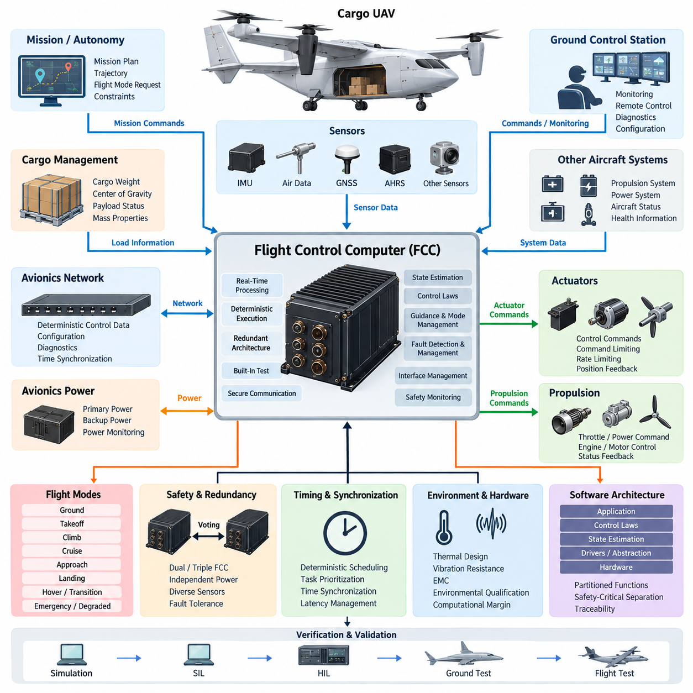
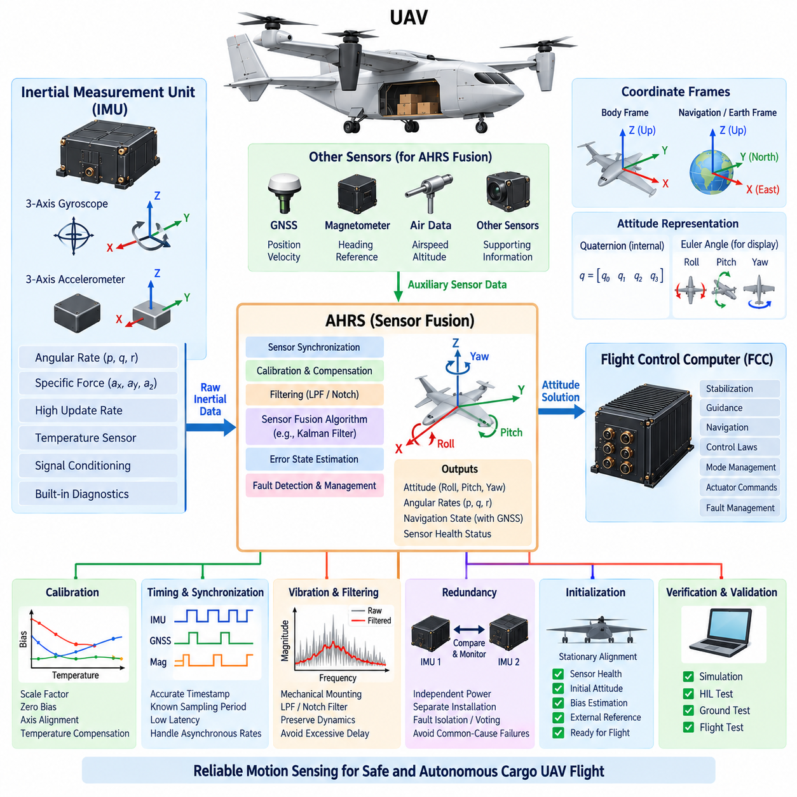
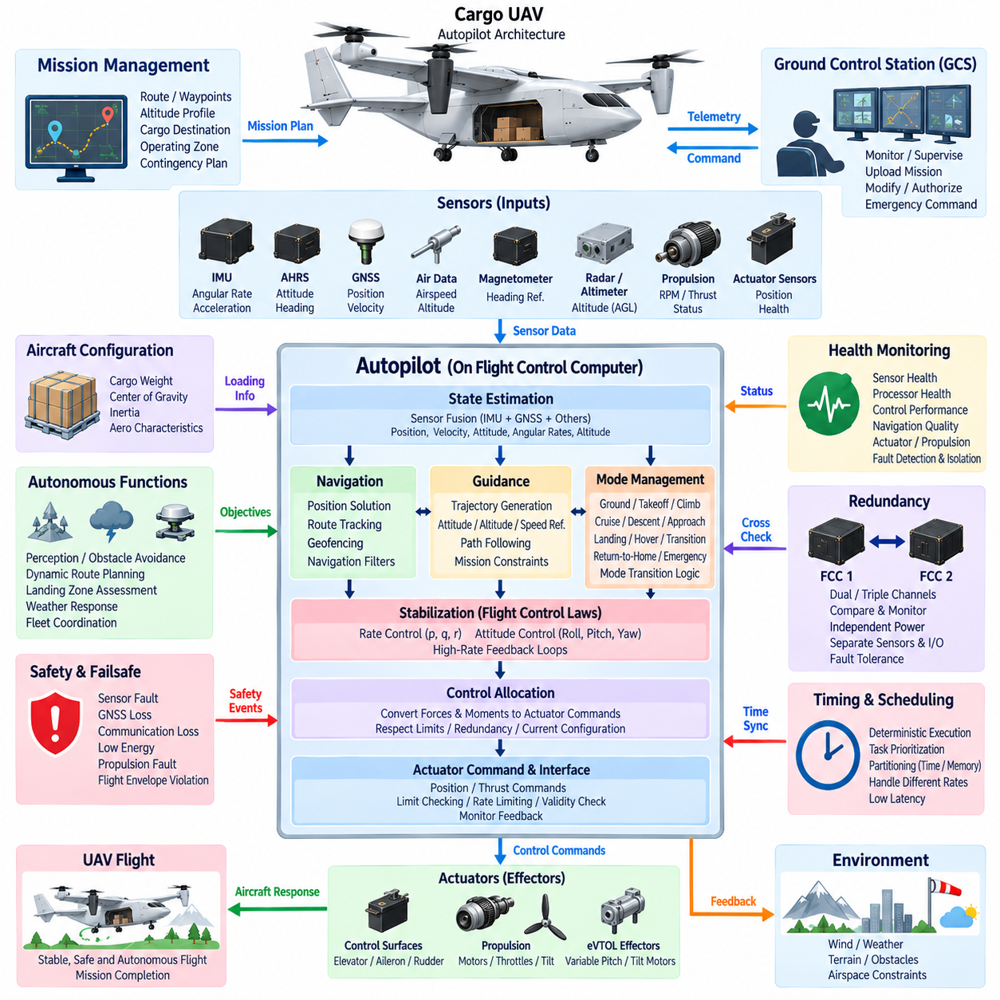
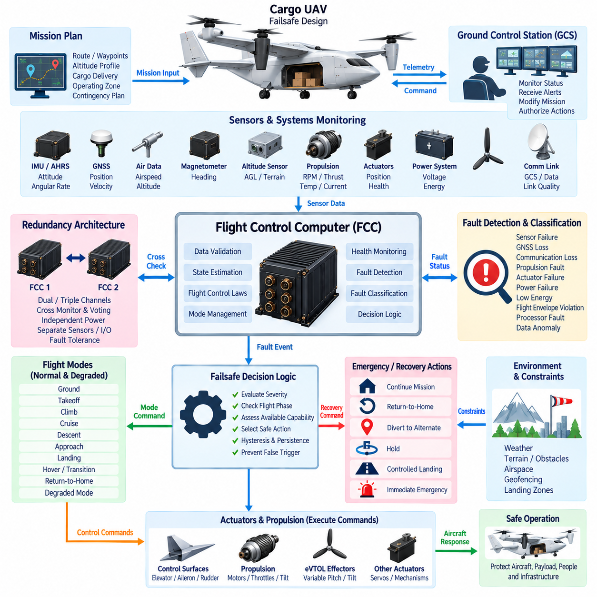
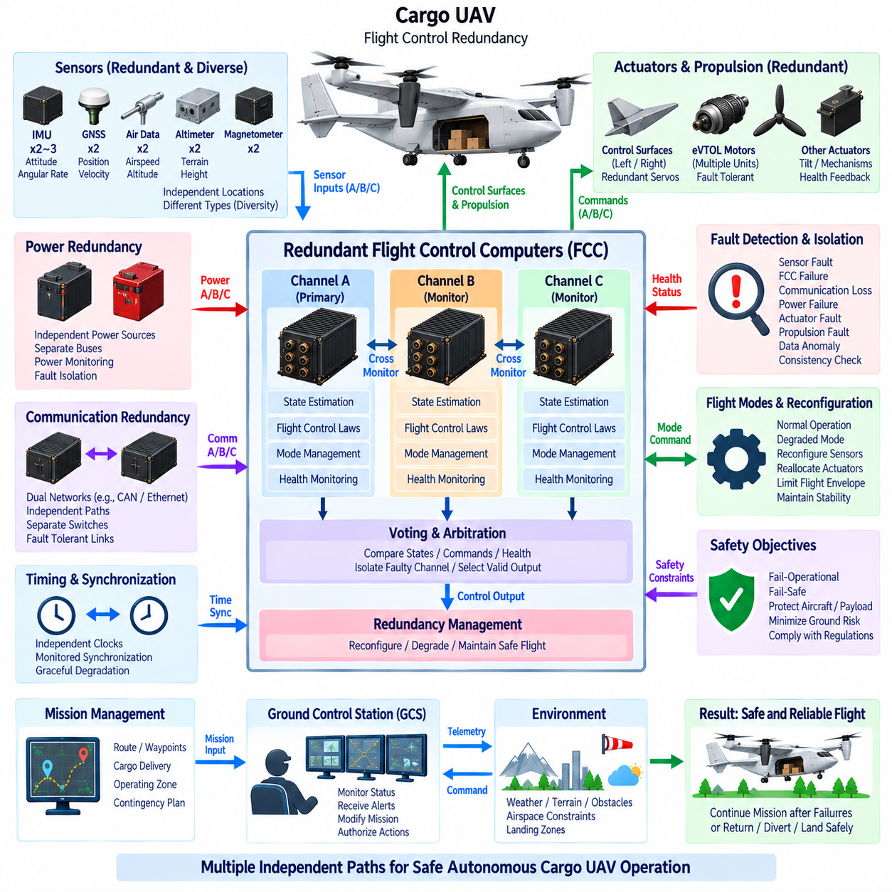

**Volume 18. Cargo UAV Architecture**

# Chapter 04. Flight Control System

## 04.01. Flight Control Computer

{width="7.268055555555556in" height="7.268055555555556in"}

The Flight Control Computer (FCC) is the real-time computational core of a UAV flight control system, transforming aircraft state information and mission-level commands into deterministic actuator commands. In a cargo UAV, the FCC must maintain controlled flight despite disturbances, sensor errors, payload variation, communication loss, and selected equipment failures. It therefore combines high-rate computation, deterministic execution, fault monitoring, and safety-oriented interfaces within a tightly controlled avionics environment.

The FCC receives information from inertial measurement units, air-data sensors, GNSS receivers, attitude and heading reference systems, propulsion controllers, actuator feedback sensors, and other aircraft subsystems. These measurements represent different physical quantities, update rates, latencies, and uncertainty levels. The computer must acquire and validate them predictably so that the control algorithms operate on a coherent representation of aircraft motion rather than on unrelated asynchronous measurements.

A fundamental FCC function is estimation of the aircraft state required for stabilization and guidance. Raw accelerometer, gyroscope, magnetic, pressure, position, velocity, and other measurements may contain bias, noise, drift, or transient errors. The flight control system combines validated measurements to estimate attitude, angular rates, velocity, position, altitude, and related dynamic states. Reliable estimation is especially important when a cargo UAV transitions between operating modes or encounters rapidly changing aerodynamic conditions.

Flight control computation is normally organized as interacting control loops operating at different rates. Fast inner loops stabilize angular rates and attitude, while outer loops regulate quantities such as velocity, altitude, flight path, heading, and position. Guidance functions provide references to these controllers according to the active flight mode. The FCC continuously calculates control errors and generates commands for aerodynamic surfaces, propulsion units, rotor systems, or other effectors appropriate to the UAV configuration.

Deterministic timing is as important as computational performance. A flight controller that produces mathematically correct results too late can still destabilize the aircraft. FCC software is therefore executed according to carefully defined periods, priorities, deadlines, and worst-case execution assumptions. High-rate stabilization tasks may execute much faster than navigation, health monitoring, communication, or mission-management functions, while scheduling prevents lower-criticality workloads from interfering with time-critical control calculations.

The FCC must also manage the interfaces between flight-control algorithms and physical actuators. Commands may be transmitted to servo controllers, motor controllers, propulsion control units, or distributed remote I/O modules through dedicated electrical interfaces or avionics networks. Command limiting, rate limiting, saturation handling, actuator-position feedback, and plausibility monitoring help prevent an erroneous computation or failed actuator from immediately becoming an uncontrolled aircraft response.

Cargo UAV operation makes mass properties particularly important. Loading and unloading cargo changes gross weight, center of gravity, inertia, propulsion demand, and sometimes aerodynamic response. The FCC may therefore receive validated mass and center-of-gravity information from higher-level aircraft or cargo-management functions and apply appropriate control parameters or operating limits. A controller designed around a single nominal loading condition may otherwise provide inadequate stability margins across the aircraft\'s complete payload envelope.

Flight-mode management determines which control laws, references, protections, and actuator strategies are active during each phase of operation. Depending on aircraft architecture, modes can include ground operation, takeoff, climb, cruise, approach, landing, hover, transition, emergency operation, or degraded control. Mode transitions require explicit entry conditions and consistency checks because an unintended transition can be more dangerous than remaining temporarily in a degraded but stable mode.

Fault detection is consequently integrated closely with FCC operation. Sensor values can be checked for range, rate, consistency, freshness, and disagreement with redundant sources. Actuator responses can be compared with commanded behavior, while processor, memory, power, communication, and timing functions can be monitored independently. Detected faults are classified according to their effect so that the system can reject invalid information, isolate failed channels, reconfigure control, or initiate a predefined failsafe response.

Redundancy becomes increasingly important as cargo UAV size and consequence of failure increase. Multiple flight-control channels may independently acquire sensor data and calculate aircraft commands, with comparison or voting mechanisms used to identify disagreement. Redundancy is not simply duplication: power supplies, clocks, communication paths, sensors, I/O circuitry, and software dependencies must be considered because duplicated computers connected to the same vulnerable resource can still fail simultaneously from a common cause.

The FCC architecture must therefore address common-cause and common-mode failures as well as individual component failures. Physical separation, independent power domains, diverse sensing, partitioned communication paths, watchdog mechanisms, and carefully controlled reset behavior can prevent one fault from propagating through the entire flight-control system. For highly critical functions, system designers evaluate whether redundancy provides genuine independence rather than merely increasing the number of identical processing units.

Communication architecture strongly influences FCC integration. The computer may exchange deterministic control information with remote avionics while receiving lower-rate configuration, diagnostic, and mission information from other systems. Network traffic must be separated according to timing and criticality so that large data transfers cannot delay essential control messages. Interface design therefore considers message rate, latency, jitter, timeout behavior, integrity checking, synchronization, and behavior after communication interruption.

Time synchronization is particularly significant in distributed avionics. Sensor measurements obtained at different moments can create apparent physical inconsistencies even when every sensor is individually accurate. Accurate timestamps and synchronized clocks allow the FCC to associate measurements with the correct aircraft state and compensate for known transport delays. This becomes increasingly important when high-dynamic motion, distributed IMUs, remote actuators, advanced perception sensors, or networked flight-control components are introduced.

FCC hardware must operate within demanding environmental constraints while maintaining predictable behavior. Processor capability, memory architecture, I/O resources, power consumption, thermal design, electromagnetic compatibility, vibration resistance, and environmental qualification all influence the final implementation. Computational margin is deliberately maintained so that worst-case workloads, diagnostic activity, transient communication demand, and future software growth do not consume the resources required for deterministic flight control.

Software architecture should preserve separation between safety-critical control functions and less critical services. Hardware abstraction, device drivers, sensor processing, state estimation, control laws, mode management, fault management, communication services, and built-in test functions can be organized into controlled layers or partitions. Such separation improves verification and limits fault propagation while making it easier to trace system requirements through software functions, interfaces, tests, and certification evidence.

Startup and shutdown behavior are also safety-relevant. After power application, the FCC must establish processor health, memory integrity, sensor availability, communication status, configuration validity, and actuator readiness before permitting active flight control. Built-in tests can identify failures before takeoff, while continuous monitoring detects faults during flight. Reset strategies must be carefully designed because an uncontrolled processor restart during a critical flight phase may itself constitute a hazardous event.

The relationship between the FCC and higher-level autonomy requires a clear authority boundary. Mission planning or autonomous decision systems may request destinations, trajectories, velocities, or flight modes, but the FCC remains responsible for executing commands within validated aircraft constraints. This separation prevents an AI or mission-level function from directly commanding unsafe actuator behavior. Safety monitors can reject references that violate flight envelopes, rate limits, geofencing constraints, or currently available control capability.

For autonomous cargo aircraft, this layered relationship enables sophisticated autonomy without making basic aircraft stability dependent on high-level intelligence. Perception and planning systems can optimize routes, detect obstacles, select landing areas, or respond to changing missions, while deterministic FCC functions continue controlling the vehicle. If autonomy becomes unavailable, the flight-control architecture should retain sufficient independent capability to maintain safe aircraft behavior according to the defined degraded-operation strategy.

Verification of an FCC extends from individual algorithms to integrated aircraft behavior. Control laws can first be evaluated through mathematical simulation, followed by software-in-the-loop and hardware-in-the-loop testing. Processor timing, communication faults, sensor failures, actuator failures, power disturbances, and abnormal mode transitions can then be injected systematically. Ground testing and flight testing provide progressively stronger evidence that the implemented controller behaves as intended across normal, boundary, and failure conditions.

For a scalable cargo UAV family, the FCC should support growth from smaller aircraft toward heavier and more complex platforms without assuming that one hardware configuration can simply be enlarged indefinitely. Increasing payload, propulsion complexity, actuator count, redundancy requirements, and flight consequence can drive changes in processing architecture and system assurance. A well-defined FCC platform therefore separates reusable control concepts from aircraft-specific configuration, interfaces, performance limits, and safety mechanisms.

Ultimately, the Flight Control Computer forms the bridge between aircraft dynamics and digital intelligence. Its purpose is not merely to execute autopilot software, but to provide a deterministic, monitored, fault-tolerant control authority capable of maintaining safe flight under real operational conditions. Within the Cargo UAV Architecture, it becomes the central execution element connecting sensing, estimation, control laws, actuators, propulsion, avionics communication, failsafe logic, and higher-level autonomous mission functions.

## 04.02. IMU/AHRS Integration

{width="7.268055555555556in" height="7.268055555555556in"}

An Inertial Measurement Unit (IMU) and an Attitude and Heading Reference System (AHRS) form the primary motion-sensing foundation of a UAV flight control system. The IMU measures physical motion directly, while the AHRS converts inertial and complementary sensor information into estimates of aircraft attitude, heading, and angular motion. Their integration provides the Flight Control Computer (FCC) with a continuously updated representation of vehicle orientation and dynamics required for stabilization, guidance, navigation, and autonomous flight.

A typical IMU contains three-axis gyroscopes and three-axis accelerometers arranged to measure angular velocity and specific force along orthogonal body axes. Higher-performance units may also incorporate temperature sensing, internal calibration, signal conditioning, and diagnostic functions. The gyroscopes provide rapid information about rotational motion, while accelerometers respond to translational acceleration and gravity-related effects. Together, these measurements allow the flight control system to observe short-term aircraft dynamics at high update rates.

Raw inertial measurements cannot directly provide reliable long-term attitude information. Gyroscope measurements contain bias and noise that accumulate during numerical integration, producing orientation drift over time. Accelerometers provide an independent reference related to gravity when dynamic acceleration is limited, but they are disturbed during maneuvering. Consequently, practical UAV systems combine multiple measurements rather than relying on a single inertial sensor to determine aircraft orientation continuously.

The AHRS performs this fusion by combining gyroscope and accelerometer measurements with additional references such as magnetometers, GNSS-derived information, or other navigation sensors. Sensor-fusion algorithms estimate roll, pitch, heading, angular rates, and associated error states while compensating for measurement uncertainty. The resulting attitude solution is more stable than direct integration of gyroscope data and more responsive than an orientation estimate derived only from slower external references.

Coordinate-frame management is fundamental to correct IMU and AHRS integration. Sensor measurements originate in the local sensor frame, while flight-control algorithms generally operate using defined aircraft body, navigation, or Earth-referenced frames. The installation orientation of each IMU must therefore be known accurately. Rotation matrices, quaternions, or equivalent transformations are used to convert measurements between coordinate systems while maintaining consistent axis directions and sign conventions throughout the avionics architecture.

Quaternions are widely suitable for representing UAV attitude because they avoid the singularities associated with some Euler-angle representations and support efficient rotational calculations. Roll, pitch, and yaw remain useful for human interpretation, displays, and selected control interfaces, but the internal attitude estimator may maintain orientation as a quaternion. Consistency between mathematical representations is essential because an incorrect transformation or axis convention can create control errors even when every sensor operates correctly.

Timing accuracy is equally important. Gyroscope and accelerometer samples must be associated with precise acquisition times because the aircraft may rotate significantly between measurements. Timestamp errors, communication latency, or irregular sampling intervals can introduce estimation errors that appear similar to sensor noise. The FCC should therefore process inertial data using known sampling periods, synchronized clocks, and predictable communication paths, particularly when IMUs and flight-control processors are physically distributed.

The IMU interface must also provide sufficient update rate and deterministic latency for the control architecture. High-rate inertial measurements normally support fast stabilization loops, whereas GNSS, magnetometer, air-data, and other complementary measurements may arrive more slowly. The estimator must accommodate these asynchronous rates without allowing delayed information to corrupt the current state. Buffering, timestamp-based alignment, interpolation, or propagation techniques can be used to associate measurements with the appropriate estimated aircraft state.

Calibration determines how accurately raw sensor outputs represent actual motion. Accelerometer scale factor, gyroscope scale factor, zero bias, axis misalignment, temperature dependence, and cross-axis sensitivity can all affect the estimated attitude. Factory calibration provides an initial characterization, but aircraft-level integration must also consider installation alignment and environmental effects. Calibration parameters should be controlled configuration data so that the FCC applies the correct compensation for the installed sensor hardware.

Temperature is a particularly important source of inertial-sensor error because bias and scale characteristics may change as avionics warm up or encounter different operating environments. An IMU may include internal temperature compensation, while the AHRS or FCC can apply additional correction based on calibrated models. Startup behavior must account for sensor stabilization because measurements obtained immediately after power application may have different characteristics from those produced after the system reaches thermal equilibrium.

Vibration can significantly degrade inertial sensing in UAVs. Propellers, rotors, motors, engines, gearboxes, structural modes, and aerodynamic excitation can introduce mechanical energy into the IMU frequency range. Mechanical mounting, structural placement, filtering, and sensor bandwidth must therefore be considered together. Excessive filtering can add phase delay, while insufficient filtering can allow vibration-induced noise to propagate into state estimation and flight-control commands.

Sensor filtering must preserve the aircraft dynamics required by the controller. Low-pass filters can suppress high-frequency noise, notch filters can attenuate known vibration frequencies, and estimator algorithms can statistically balance different measurements. However, filtering cannot simply be maximized because every filter introduces some combination of delay, attenuation, or phase distortion. IMU signal conditioning must therefore be designed as part of the complete control-loop architecture rather than as an isolated sensor function.

Redundant IMUs can improve availability and fault tolerance in safety-critical cargo UAVs. Two or more independently powered sensing channels may provide simultaneous measurements to redundant FCC channels. Their outputs can be compared for disagreement, excessive bias, frozen data, implausible rates, timing errors, or communication failures. Triple-channel arrangements can support voting or fault isolation when system safety requirements justify the additional hardware and integration complexity.

Redundancy is effective only when common-cause failures are considered. Multiple identical IMUs mounted on the same structure may all experience the same excessive vibration, thermal condition, power disturbance, or electromagnetic interference. Physical separation, independent power paths, diverse sensor technologies, separate communication channels, and appropriate installation design can reduce these dependencies. The architecture should distinguish genuine sensing diversity from simple duplication of the same vulnerability.

Fault detection within the IMU/AHRS chain must operate continuously. Measurements can be checked against physical limits, previous samples, redundant sensors, estimated aircraft dynamics, and external references. A sudden impossible angular rate may indicate a sensor fault, while gradual divergence may indicate increasing bias. The estimator should identify suspect information before it destabilizes the control solution and transition toward available valid measurements according to predefined fault-management logic.

GNSS integration provides an important external reference for inertial navigation. The IMU offers high-rate short-term motion information but accumulates error, whereas GNSS provides bounded position and velocity information at a lower rate and can become unavailable or degraded. Combining them allows the navigation solution to exploit complementary characteristics. During temporary GNSS loss, inertial propagation can maintain continuity, although uncertainty grows until reliable external measurements become available again.

Magnetometers can provide heading information but require careful integration because aircraft electrical systems, motors, high-current cables, ferromagnetic structures, and payload equipment may distort the local magnetic field. Magnetic measurements should therefore be calibrated and monitored rather than treated as an unquestionable heading reference. Larger cargo UAVs may require thoughtful sensor placement or alternative heading references when propulsion and electrical architecture create significant magnetic disturbances.

The relationship between the AHRS and FCC depends on system partitioning. Some architectures use a smart AHRS that performs internal filtering and delivers completed attitude estimates, while others send calibrated raw IMU measurements to the FCC for centralized state estimation. A hybrid architecture may provide both raw measurements and independently computed attitude solutions. The appropriate choice depends on latency, redundancy, computational architecture, verification strategy, fault containment, and required system assurance.

For cargo UAVs, changes in payload can indirectly affect inertial estimation through altered vibration, structural response, acceleration characteristics, and center-of-gravity location. Although the IMU measures motion rather than cargo properties directly, its installation relative to the aircraft reference frame and center of rotation influences observed accelerations. Accurate configuration information becomes increasingly important as payload mass increases and the aircraft operates across a wider range of loading conditions.

Initialization is a critical operational phase for the AHRS. Before active flight, the system must establish sensor health, initial orientation, bias estimates, timing status, and availability of external references. Stationary alignment can improve initial bias and attitude estimates when operational conditions permit. The FCC should not assume that valid attitude information exists immediately after power-up, and readiness logic should distinguish between sensor communication availability and a fully converged navigation solution.

Verification should include sensor-level, estimator-level, and aircraft-level testing. Recorded data and simulation can evaluate fusion algorithms, while hardware-in-the-loop testing can reproduce motion profiles and inject timing errors, sensor bias, noise, dropouts, and failures. Ground tests can evaluate vibration and electromagnetic effects, and flight testing confirms performance under actual dynamic conditions. Particular attention should be given to transitions between normal, degraded, and redundant sensing configurations.

Within the cargo UAV architecture, IMU and AHRS integration ultimately provides the trusted dynamic state upon which flight control depends. The quality of this function is determined not only by sensor specifications but also by calibration, mounting, coordinate transformations, synchronization, filtering, redundancy, fault management, and estimator design. A robust integration architecture enables the FCC to maintain stable and predictable control while supporting increasingly autonomous operation across 2.5-ton, 5-ton, and future 10-ton cargo UAV platforms.

## 04.03. Autopilot Architecture

{width="7.268055555555556in" height="7.268055555555556in"}

Autopilot architecture defines how sensing, state estimation, guidance, navigation, flight control, mode management, and actuator command generation are organized into a coordinated system that can fly a UAV with limited or no continuous human control. In a cargo UAV, the autopilot is not a single algorithm but a layered control architecture connecting mission objectives to deterministic aircraft behavior while maintaining defined operational and safety constraints.

At the lowest functional level, the autopilot depends on reliable aircraft-state information. IMUs, AHRS, GNSS receivers, air-data sensors, magnetometers, radar or laser altimeters, propulsion feedback, and actuator sensors provide measurements describing vehicle motion and system condition. These inputs are validated and fused before control decisions are generated, preventing individual raw measurements from directly determining safety-critical aircraft responses.

State estimation transforms sensor measurements into a coherent representation of aircraft position, velocity, attitude, angular rates, altitude, and other dynamic variables. The estimator must accommodate sensors operating at different update rates and with different uncertainty characteristics. High-rate inertial information supports rapid control response, while GNSS and other external references constrain accumulated drift and improve long-term navigation accuracy.

The stabilization layer forms the innermost part of the autopilot control hierarchy. Fast feedback loops regulate angular rates and aircraft attitude so that disturbances caused by wind, propulsion variation, structural motion, or control inputs do not destabilize the vehicle. These loops typically operate at substantially higher frequencies than mission-planning functions because aircraft stability depends on timely and predictable correction of dynamic errors.

Above stabilization, guidance functions determine how the aircraft should move to satisfy navigation and mission objectives. Guidance may generate desired attitude, heading, altitude, vertical speed, airspeed, ground speed, or trajectory references. Rather than commanding actuators directly, higher-level functions normally provide references to lower-level controllers, creating a hierarchy in which each layer operates within clearly defined authority and dynamic limits.

Navigation determines where the aircraft is and how it is moving relative to the intended route. Position and velocity information from GNSS can be combined with inertial navigation and other measurements to maintain a continuous navigation solution. Waypoints, routes, corridors, approach paths, landing locations, and geofencing constraints can then be represented within a common reference framework used by guidance and mission-management functions.

Flight-mode management coordinates the behavior of the complete autopilot. A cargo UAV may require ground, takeoff, climb, cruise, descent, approach, landing, hover, transition, return-to-home, emergency, and degraded-operation modes depending on its configuration. Each mode activates appropriate guidance logic, control laws, limits, and monitoring functions. Mode transitions must satisfy explicit conditions so that an unintended command cannot abruptly place the aircraft in an incompatible control state.

For eVTOL or hybrid cargo UAVs, transition management can become one of the most demanding autopilot functions. Hover, conversion, and wing-borne flight may involve substantially different aerodynamic behavior, actuator effectiveness, propulsion distribution, and control authority. The autopilot must coordinate these changes while preserving stability and trajectory continuity, often scheduling control parameters according to airspeed, configuration, propulsion state, or transition progress.

Control allocation translates desired forces and moments into commands for the available aircraft effectors. A conventional fixed-wing UAV may use elevators, ailerons, rudders, throttles, and related surfaces, while an eVTOL platform may coordinate multiple electric motors, variable-pitch rotors, tilting propulsion units, and aerodynamic surfaces. Allocation logic must respect actuator limits while distributing control effort according to the current flight configuration and available hardware.

Actuator commands are subject to physical and safety constraints before transmission. Position limits, rate limits, thrust limits, saturation handling, command validity checks, and feedback monitoring prevent calculated demands from exceeding available system capability. When an actuator or propulsion unit becomes unavailable, a fault-tolerant architecture may redistribute control effort among remaining effectors if sufficient control authority exists.

Cargo loading introduces additional variables into autopilot operation. Gross weight, center of gravity, inertia, and aerodynamic characteristics may change significantly between missions or during cargo handling. Validated loading information can therefore influence control gains, flight-envelope limits, takeoff and landing parameters, energy planning, and performance calculations. The autopilot should ensure that commanded maneuvers remain appropriate for the current aircraft mass configuration.

Mission management occupies a higher architectural layer than basic stabilization and control. It interprets mission plans containing routes, waypoints, altitude profiles, cargo destinations, operating zones, and contingency procedures. The mission manager determines the next operational objective, while guidance and flight-control layers determine how to achieve it. This separation allows mission logic to change without directly modifying the fundamental mechanisms that maintain aircraft stability.

Autonomous functions can extend this hierarchy with perception, obstacle avoidance, dynamic route planning, landing-zone assessment, weather response, or fleet-level coordination. However, high-level autonomy should operate through controlled interfaces rather than directly manipulating actuators. The deterministic autopilot retains responsibility for aircraft stabilization and flight-envelope compliance, while autonomous systems request trajectories, modes, or other bounded objectives that can be validated before execution.

Human supervision remains important even when routine flight is autonomous. The Ground Control Station can upload mission plans, monitor aircraft state, authorize selected operations, modify permitted objectives, or initiate contingency procedures. Communication loss must not leave the autopilot without defined behavior. Depending on mission and regulatory requirements, the aircraft may continue a validated mission, hold, divert, return, land, or enter another predefined safe state.

Failsafe logic is therefore integrated across the autopilot architecture. Events such as GNSS degradation, communication loss, low energy, propulsion faults, sensor disagreement, actuator failures, excessive deviation, or flight-envelope violations can trigger predefined responses. Failsafe behavior should be state-dependent because the safest action during cruise may differ from the safest action during hover, transition, approach, or cargo loading operations.

Autopilot health monitoring continuously evaluates sensors, processors, communication interfaces, control loops, actuators, propulsion systems, and navigation quality. Monitoring functions detect stale data, excessive estimation uncertainty, control saturation, abnormal tracking errors, timing violations, and hardware failures. The system can then isolate faulty information, reconfigure available resources, reduce operational capability, or transition to a degraded control mode before a fault develops into loss of control.

Redundant autopilot architectures may use multiple FCC channels executing equivalent or independently monitored control functions. Dual or triple channels can compare state estimates, mode states, and calculated commands to identify disagreement. Effective redundancy also requires consideration of independent power, clocks, sensors, communication paths, and I/O resources, because several processors sharing the same failure source do not provide true fault tolerance.

Deterministic scheduling ensures that stabilization and other time-critical functions execute within known deadlines regardless of activity in higher-level software. Navigation, mission management, communication, logging, diagnostics, and autonomy may operate at different rates and criticality levels. Partitioning processor time and memory helps prevent a computationally intensive noncritical task from delaying the control loops required to maintain stable flight.

The autopilot communication architecture connects sensors, FCCs, propulsion controllers, actuator electronics, navigation equipment, cargo systems, and other avionics. Different interfaces may carry high-rate deterministic control data and lower-rate mission or diagnostic information. Message priority, latency, synchronization, integrity checking, timeout behavior, and fault containment must therefore be considered as part of the control-system design rather than as independent networking concerns.

Software architecture should maintain clear separation among hardware interfaces, sensor processing, state estimation, control laws, guidance, navigation, mode management, fault management, and mission functions. Defined interfaces improve traceability and verification while reducing unintended coupling. Safety-critical functions can be isolated from less critical services so that logging, user interfaces, payload applications, or advanced autonomy cannot interfere with deterministic flight-control execution.

Initialization establishes whether the autopilot is ready to assume control. Before flight, the system verifies processor health, software configuration, sensor availability, attitude and navigation validity, actuator status, propulsion readiness, energy condition, communication state, and required mission information. Arming logic should prevent flight initiation when essential prerequisites are not satisfied and should distinguish between equipment presence and genuinely valid operational data.

Verification progresses from individual algorithms toward complete aircraft behavior. Mathematical simulation evaluates control and guidance logic, software-in-the-loop testing examines implemented software, and hardware-in-the-loop testing introduces actual processors and interfaces. Fault injection can reproduce sensor failures, delayed messages, actuator faults, communication loss, and abnormal transitions before flight. Ground and flight tests then confirm integrated behavior under representative operational conditions.

For a scalable cargo UAV family, autopilot architecture should preserve common functional principles while allowing aircraft-specific control laws, actuator configurations, propulsion systems, performance limits, and redundancy strategies. A 2.5-ton platform may use a different physical implementation from a 5-ton or 10-ton aircraft, yet the layered relationship among sensing, estimation, guidance, control, safety, and mission management can remain consistent across the family.

Ultimately, autopilot architecture provides the structured path from mission intent to controlled aircraft motion. Sensors describe the vehicle and environment, estimation determines its dynamic state, navigation establishes its location, guidance determines the desired motion, control laws calculate required forces and moments, and control allocation commands the available effectors. Mode management, monitoring, redundancy, and failsafe mechanisms surround these functions so that increasingly autonomous cargo UAVs can operate predictably, safely, and systematically.

## 04.04. Failsafe Design

{width="7.268055555555556in" height="7.268055555555556in"}

Failsafe design defines how a UAV detects abnormal conditions, evaluates their severity, and transitions toward a controlled state when normal operation can no longer be guaranteed. In a cargo UAV, failsafe behavior must protect the aircraft, payload, people, and surrounding infrastructure without depending on continuous human intervention. It therefore combines fault detection, decision logic, degraded operation, redundancy, emergency modes, and predefined recovery actions within the flight control architecture.

A failsafe system begins with continuous monitoring of information required for safe flight. The Flight Control Computer (FCC) evaluates sensors, navigation quality, communication links, propulsion systems, actuators, electrical power, energy reserves, processor health, and flight-control performance. Monitoring is not limited to detecting complete equipment failure; gradual degradation, excessive uncertainty, delayed data, abnormal tracking error, or disagreement between redundant channels may also indicate that normal operation is becoming unsafe.

Fault detection must distinguish temporary disturbances from persistent failures. A single missing communication packet or short GNSS disturbance should not necessarily trigger an emergency landing, while sustained data loss may require immediate reconfiguration. Persistence timers, validity checks, confidence levels, hysteresis, and cross-comparison can prevent unnecessary mode transitions while ensuring that genuine faults are recognized before they develop into hazardous aircraft behavior.

Fault classification determines the appropriate response. Some faults can be tolerated without changing the mission, while others require reduced performance, route modification, return-to-home, diversion, controlled landing, or immediate emergency action. The failsafe architecture therefore considers both fault severity and available aircraft capability. A system should not execute the same response for every failure because the safest action depends on flight phase, vehicle configuration, environment, remaining energy, and available control authority.

Sensor failures are managed through validation, redundancy, and estimation. IMU, AHRS, GNSS, air-data, altitude, and other measurements can be checked for range, rate, freshness, consistency, and agreement with independent sources. When one sensor becomes unreliable, the estimator may reject it and continue using remaining valid information. The resulting navigation or control performance may be reduced, but controlled flight can continue when sufficient observability and sensor diversity remain available.

GNSS loss is particularly important for autonomous cargo UAVs because navigation, route tracking, geofencing, and landing functions may depend heavily on accurate position information. Temporary GNSS degradation can be bridged using inertial navigation and other available references, although position uncertainty grows over time. The failsafe logic must monitor this uncertainty and determine whether the aircraft can continue, hold, return, divert, or land before navigation accuracy becomes unacceptable.

Communication loss must also have explicitly defined behavior. Loss of the Ground Control Station link cannot leave the aircraft waiting indefinitely for operator commands. Depending on the approved mission concept, the UAV may continue along a validated route, enter a holding pattern, return to a predefined recovery location, divert to an alternate site, or execute a controlled landing. The selected action should consider remaining energy, airspace constraints, weather, terrain, and navigation capability.

Propulsion faults can rapidly reduce available flight capability, especially in eVTOL and distributed-propulsion aircraft. The flight controller must identify abnormal thrust, motor speed, temperature, current, vibration, or propulsion-controller status and determine whether sufficient remaining propulsion exists. Control allocation can redistribute thrust among healthy units where the configuration permits, while flight-envelope limits may be reduced to prevent commands that exceed degraded propulsion capability.

Actuator failures require similar reconfiguration. A control surface, servo, tilt mechanism, or other effector may become unavailable, move slowly, become stuck, or disagree with its commanded position. Feedback monitoring allows the FCC to compare requested and actual behavior. If sufficient redundant control authority remains, the control allocator can compensate using other effectors. Otherwise, the system must transition toward an emergency condition compatible with the remaining controllability.

Electrical power failures require coordinated response because avionics, sensors, actuators, communication equipment, and propulsion-support systems may depend on different power domains. Independent power sources and essential buses can prevent a single electrical fault from disabling the complete flight-control system. When power becomes limited, load shedding can disconnect nonessential equipment so that critical sensing, computation, communication, and control functions remain operational for as long as necessary.

Low-energy conditions are different from sudden power failures and should be predicted before they become emergencies. The aircraft can continuously estimate remaining battery energy, fuel, hybrid-system capability, mission distance, reserve requirements, and expected landing demand. Failsafe logic can progressively restrict mission options as energy margin decreases, initiating return or diversion while sufficient reserve remains instead of waiting until propulsion capability becomes critically limited.

Flight-envelope protection prevents commands or disturbances from driving the aircraft beyond validated operating boundaries. Airspeed, attitude, angular rate, load factor, altitude, descent rate, thrust demand, battery condition, and other parameters may be monitored according to aircraft configuration. When limits are approached, the autopilot can constrain commands or prioritize recovery. Envelope protection remains important even when the original unsafe request originates from mission autonomy or a remote operator.

Failsafe behavior must be aware of the current flight mode. A propulsion fault during cruise may permit diversion to an alternate landing site, whereas the same fault during hover or transition may require a much faster response. Similarly, GNSS loss during high-altitude cruise differs from loss during precision landing. State-dependent logic therefore combines detected faults with flight phase, altitude, speed, configuration, terrain, and available recovery options before selecting an action.

Degraded operation is often preferable to immediate mission termination. If one sensor, communication path, FCC channel, or actuator fails but sufficient capability remains, the aircraft can enter a degraded mode with reduced speed, maneuver limits, autonomy, or mission scope. This approach preserves controlled operation while explicitly acknowledging reduced system capability. Degraded modes must be predefined and verified rather than improvised dynamically after a failure occurs.

Redundancy supports failsafe design by providing alternative resources after failures. Dual or triple FCCs, multiple IMUs, independent power domains, redundant communication links, and distributed propulsion can increase fault tolerance. However, redundancy must address common-cause failures. Identical channels sharing the same power supply, network, software dependency, cooling path, or environmental vulnerability may fail together and therefore provide less protection than their component count suggests.

Voting and cross-monitoring mechanisms help determine which redundant channel remains trustworthy. Multiple FCCs can compare state estimates, mode states, health information, and actuator commands. When disagreement occurs, the architecture must determine whether a faulty channel can be isolated reliably. Triple-channel systems can support majority voting in selected functions, while dual-channel architectures may require independent monitors or additional evidence because simple disagreement does not identify which channel is correct.

Failsafe mode transitions must themselves be safe. Rapid switching between normal and emergency states can create unstable behavior if thresholds fluctuate around a boundary. Transition logic therefore uses controlled entry conditions, persistence requirements, hysteresis, and clearly defined recovery criteria. Some emergency states may intentionally be latched so that normal operation cannot resume automatically until the underlying condition has been verified or appropriate operator authorization has been received.

Return-to-home is useful but should not be treated as a universal failsafe solution. Returning may be inappropriate when navigation is unreliable, energy is insufficient, severe weather blocks the route, propulsion capability is degraded, or the original home location is no longer safe. A robust cargo UAV architecture can maintain several recovery alternatives, including holding areas, diversion airports, emergency landing zones, or mission-specific safe locations, and select among them according to current conditions.

Emergency landing logic must balance aircraft controllability with risks on the ground. The system may evaluate reachable landing locations using altitude, energy, glide or powered-flight capability, terrain, obstacles, and available navigation information. For highly autonomous aircraft, perception systems may assist landing-zone assessment, but safety-critical execution should remain bounded by validated flight-control constraints. The objective is a controlled termination of flight rather than simply stopping the mission.

Cargo characteristics can influence failsafe decisions. A heavily loaded aircraft may have different glide performance, hover endurance, landing distance, structural limits, and energy requirements from an unloaded vehicle. Center-of-gravity location and payload security may further restrict emergency maneuvers. Failsafe logic should therefore use validated aircraft configuration and cargo information when determining achievable recovery trajectories, allowable accelerations, and suitable landing strategies.

Human interaction must remain clearly defined during emergencies. The Ground Control Station should present fault status, aircraft capability, selected failsafe mode, and relevant recovery information without requiring the operator to diagnose every low-level failure. Operator commands may modify or authorize selected actions where permitted, but the aircraft must retain autonomous protection against unsafe commands, excessive delay, or complete communication loss during time-critical events.

Failsafe software should be separated appropriately from noncritical mission and payload applications. Fault monitors, safety state machines, command validation, envelope protection, and essential recovery logic require deterministic execution and controlled interfaces. A computationally intensive perception task, cargo application, logging process, or user-interface function should not prevent emergency logic from executing within its required deadline. Architectural partitioning therefore contributes directly to fault containment.

Verification of failsafe behavior requires systematic fault injection rather than testing only normal flight. Simulation, software-in-the-loop, and hardware-in-the-loop environments can introduce sensor bias, GNSS loss, communication interruption, actuator faults, propulsion degradation, processor resets, power failures, and timing errors. Tests should examine not only whether a fault is detected but also whether classification, transition, reconfiguration, recovery, and eventual restoration behave correctly.

Ground and flight testing progressively validate failsafe responses under realistic dynamics and environmental conditions. Individual failures are introduced only within carefully controlled test boundaries, while combinations of faults are analyzed according to system safety requirements. Particular attention is required at mode transitions such as takeoff, hover-to-cruise conversion, approach, and landing because available recovery time and control authority may be substantially lower than during steady cruise.

For a scalable cargo UAV family, failsafe philosophy can remain consistent while recovery strategies evolve with aircraft size and configuration. A 2.5-ton, 5-ton, and future 10-ton aircraft may differ significantly in propulsion redundancy, energy architecture, landing capability, operational airspace, and consequence of failure. Larger platforms therefore require increasingly rigorous fault containment, redundancy management, emergency planning, verification, and system-level assurance.

Ultimately, failsafe design converts abnormal conditions from uncontrolled surprises into predefined system states and responses. Detection identifies what has changed, classification determines its significance, redundancy preserves available capability, degraded modes limit exposure, and recovery logic directs the aircraft toward the safest achievable outcome. Integrated with the FCC, autopilot, propulsion, power, navigation, communication, and cargo systems, this architecture provides a fundamental safety foundation for autonomous cargo UAV operation.

## 04.05. Flight Control Redundancy

{width="7.268055555555556in" height="7.268055555555556in"}

Flight control redundancy is the architectural principle of providing multiple independent sensing, computing, communication, power, and actuation resources so that a UAV can maintain controlled flight after selected failures. In a cargo UAV, redundancy must extend beyond duplicating the Flight Control Computer (FCC). The objective is to preserve sufficient control authority, state knowledge, and system integrity when individual components or complete control channels become unavailable.

A flight control channel typically includes sensor inputs, processing hardware, flight-control software, communication interfaces, power supplies, and connections to actuators or propulsion controllers. If several FCCs depend on the same IMU, power converter, network switch, or communication bus, failure of that shared resource can disable every channel simultaneously. Effective redundancy therefore begins by identifying complete functional paths rather than simply counting computers.

Dual-channel architectures provide two flight-control paths capable of cross-monitoring each other. Each channel can independently calculate aircraft state and control commands, allowing disagreements to be detected rapidly. However, disagreement between two channels does not inherently identify which one is correct. Additional monitoring, sensor evidence, command validation, or a separate arbitration mechanism is therefore required when continued operation depends on isolating the faulty channel.

Triple-channel architectures provide additional fault-isolation capability because three independently operating channels can support majority voting for suitable functions. If two channels agree and one produces substantially different information, the inconsistent channel can potentially be isolated. Triple redundancy increases hardware, wiring, power, thermal, communication, software, and verification complexity, so its application must be driven by system safety requirements rather than by redundancy alone.

Voting can be applied at different architectural levels. Systems may compare raw sensor measurements, estimated states, flight modes, calculated control commands, or health information. Voting too early can conceal useful diagnostic information, while voting too late can allow an erroneous value to propagate through multiple functions. The selected voting boundary should therefore support rapid fault isolation while preserving independence and avoiding unnecessary coupling among otherwise separate flight-control channels.

Cross-monitoring complements voting by continuously comparing redundant channels. An FCC can evaluate whether another channel\'s attitude, position, angular rate, mode state, timing, or actuator commands remain within defined disagreement limits. Cross-monitoring also identifies frozen data, delayed execution, unexpected resets, and communication failures. Thresholds must account for legitimate numerical differences so that normal computational variation is not incorrectly classified as a fault.

Sensor redundancy is fundamental because multiple computers cannot maintain reliable flight if they all receive the same incorrect aircraft-state information. Multiple IMUs, GNSS receivers, air-data sources, altitude sensors, and other critical measurements can provide independent evidence of vehicle behavior. Sensor-fusion algorithms can reject inconsistent measurements and continue with remaining valid sources, although the resulting navigation accuracy or operational envelope may be reduced.

Sensor diversity can provide protection beyond identical duplication. Two identical sensors may respond similarly to vibration, temperature, electromagnetic interference, software defects, or environmental conditions. Combining different sensing principles or independently located sensors can reduce susceptibility to common-mode failures. Diversity must nevertheless be balanced against calibration complexity, differing error characteristics, additional interfaces, and the verification burden created by heterogeneous equipment.

Power redundancy prevents a single electrical failure from eliminating all flight-control capability. Independent battery feeds, DC/DC converters, protected buses, circuit protection, and power-monitoring functions can supply separate FCC and sensor channels. Essential flight-control resources should avoid unnecessary common electrical dependencies. Cross-tied power may provide useful backup capability, but isolation mechanisms must prevent a short circuit or converter fault from propagating between otherwise independent power domains.

Communication redundancy is equally important in distributed avionics. Separate buses, network paths, or point-to-point interfaces can preserve access to sensors and actuators after a communication failure. Redundant networks should consider not only physical wiring but also switches, gateways, transceivers, synchronization sources, and protocol dependencies. A duplicated cable connected through one common network device may still represent a single point of failure.

Timing resources can also create hidden dependencies. Redundant FCCs may require synchronized time for sensor alignment, voting, event correlation, and distributed control, yet reliance on one clock source can create a common vulnerability. Architectures can provide independent clocks with monitored synchronization or redundant time sources. Loss of precise synchronization should result in a defined degraded condition rather than uncontrolled disagreement among flight-control channels.

Actuator redundancy determines whether valid redundant computation can still influence the aircraft after a mechanical or electronic failure. Critical control functions may use multiple actuators, independent servo channels, distributed propulsion units, or alternative control effectors. Feedback sensors allow the FCC to determine whether commanded movement occurred. When one effector becomes unavailable, control allocation can redistribute required forces and moments if sufficient remaining authority exists.

Distributed propulsion offers additional redundancy opportunities for eVTOL cargo UAVs. Multiple motors and propulsors can allow continued flight after loss of an individual propulsion unit, provided aircraft geometry, available thrust, power capacity, and control laws support the failure condition. Motor count alone does not guarantee tolerance because several propulsion units may share an inverter, battery bus, cooling system, structural support, or communication path that can create a common failure.

Redundancy management determines how available resources are reconfigured after a fault. The system must detect the failure, isolate the affected channel, confirm remaining capability, and establish a stable configuration without introducing excessive control transients. Reconfiguration may involve switching sensor sources, removing an FCC from voting, transferring network paths, redistributing propulsion, limiting maneuverability, or entering a predefined degraded flight mode.

Fail-operational and fail-safe objectives represent different redundancy goals. A fail-operational architecture maintains sufficient functionality to continue controlled operation after a defined failure, whereas a fail-safe architecture prioritizes transition toward a safe condition. Cargo UAV missions may require combinations of both concepts. For example, the aircraft may remain fully controllable after one FCC failure but subsequently divert or land because redundancy has been reduced below the level required for normal mission continuation.

Common-cause failure analysis is essential because nominally redundant components may still fail together. Shared software, requirements errors, environmental exposure, manufacturing defects, cooling systems, power sources, maintenance procedures, or physical damage can defeat multiple channels simultaneously. Physical separation, electrical isolation, independent routing, design diversity, and fault containment help ensure that redundant channels provide genuine independence rather than merely duplicated hardware.

Software redundancy requires particular care. Running identical software on multiple processors protects against random hardware faults but may not protect against a systematic software defect triggered by the same input. Architectural monitoring, independent safety functions, diverse implementations, or dissimilar verification approaches can reduce selected systematic risks. The degree of software diversity should reflect the safety objective and the complexity introduced by maintaining multiple implementations.

Physical installation influences redundancy effectiveness. Redundant FCCs located next to each other may both be affected by fire, fluid ingress, impact, overheating, connector damage, or localized structural failure. Similarly, redundant harnesses routed through the same bundle can be severed together. Separation should therefore be considered across equipment location, wiring routes, connectors, power distribution, cooling, antennas, and sensors according to credible aircraft-level hazards.

Redundancy must be coordinated with flight-mode management. Losing one FCC during cruise may allow continued operation with reduced redundancy, while the same configuration may not be acceptable before takeoff or during a demanding transition mode. The system should know both current capability and the redundancy required for the next flight phase. Entry into a critical mode can be inhibited when insufficient independent resources remain available.

Health monitoring provides the information required for this capability assessment. Each redundant channel can report processor status, memory integrity, timing performance, sensor validity, communication condition, power quality, actuator availability, and internal diagnostic results. The redundancy manager combines this information with cross-channel comparisons to determine which resources remain trustworthy and which operational modes can still be supported safely.

Cargo configuration can affect redundancy requirements because aircraft mass, center of gravity, and inertia influence the amount of control authority required after failures. A heavily loaded aircraft may have less performance margin after losing a propulsion unit than a lightly loaded aircraft. Redundancy management should therefore evaluate actual aircraft configuration when determining whether remaining actuators and propulsion systems can support continued flight, diversion, hover, transition, or landing.

Initialization must verify redundant resources before flight. Merely detecting two or three installed FCCs is insufficient; each required channel must demonstrate valid power, sensors, software configuration, communication, timing, and actuator interfaces. Preflight tests can identify latent faults that would otherwise remain hidden until another failure occurs. Dispatch or arming logic should ensure that the available redundancy satisfies the requirements for the intended mission.

Maintenance and diagnostics are important because redundancy can conceal failures during normal operation. A system may continue functioning correctly after one channel fails, allowing the defect to remain unnoticed unless health information is recorded and reported. Built-in test, fault logging, maintenance messages, and post-flight analysis help ensure that degraded redundancy is restored before subsequent missions and prevent repeated operation with hidden loss of fault tolerance.

Verification of redundant flight control requires deliberate failure injection. Simulation, software-in-the-loop, and hardware-in-the-loop environments can disconnect sensors, corrupt data, reset FCCs, interrupt networks, remove power channels, or simulate failed actuators and propulsion units. Testing must verify detection, voting, isolation, reconfiguration, degraded operation, and recovery while confirming that transient behavior remains within acceptable aircraft limits.

Integrated ground and flight tests then demonstrate redundancy under representative physical conditions. Tests should examine individual failures, latent faults, selected combinations, and failures occurring during critical transitions such as takeoff, hover, conversion, approach, and landing. Verification must also address common dependencies because successfully disconnecting one FCC provides little evidence about the system\'s ability to survive failures that affect several channels simultaneously.

For a scalable cargo UAV family, redundancy architecture becomes increasingly significant as aircraft mass, mission range, autonomy, and consequence of failure increase. A 2.5-ton platform may establish the fundamental redundant control architecture, while 5-ton and future 10-ton platforms may require stronger separation, additional channels, more extensive propulsion tolerance, and higher system assurance. Common architectural principles can remain reusable even when implementation rigor increases.

Ultimately, flight control redundancy creates multiple credible paths for maintaining aircraft control when components fail. Independent sensing establishes trustworthy state information, redundant FCCs preserve computation, separated networks and power domains maintain connectivity, and redundant actuators or propulsion preserve control authority. Cross-monitoring, voting, fault isolation, and reconfiguration integrate these resources into a coherent architecture capable of supporting safe autonomous cargo UAV operation.
