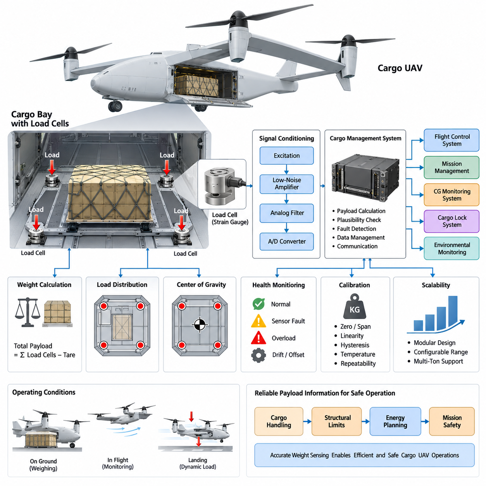
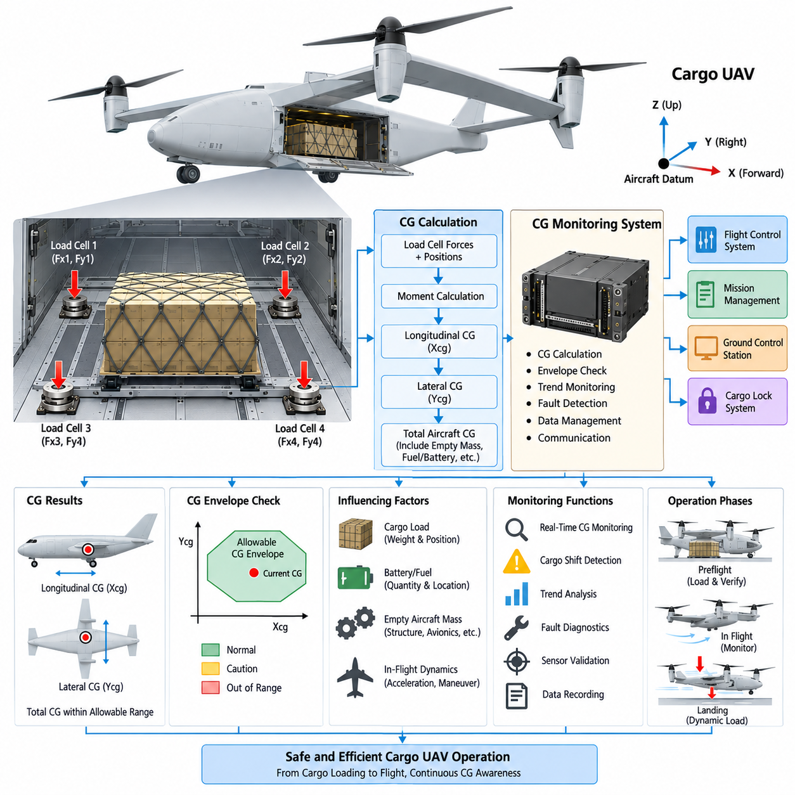
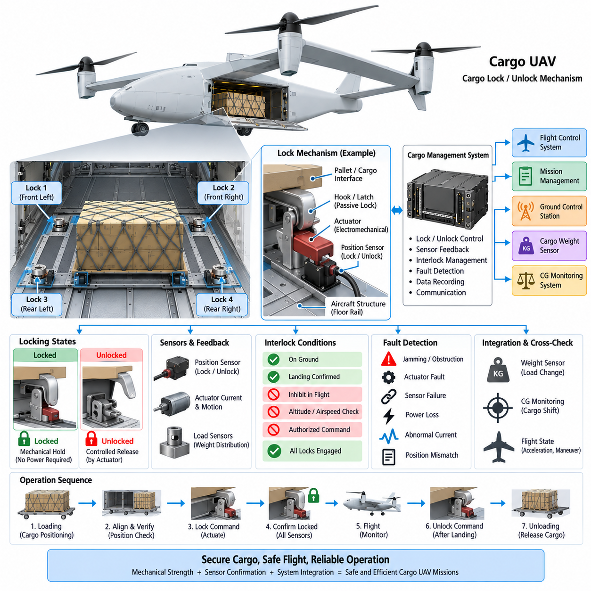
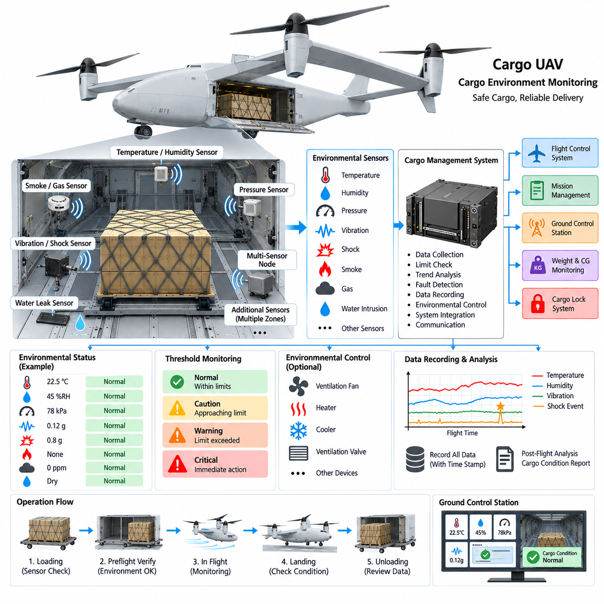
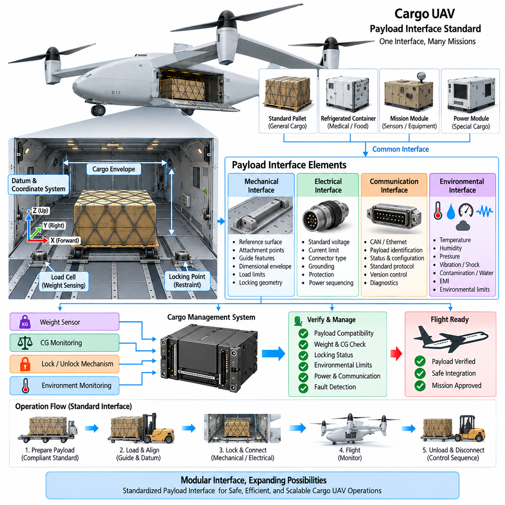

**Volume 18. Cargo UAV Architecture**

# Chapter 05. Cargo Management System

## 05.01. Cargo Weight Sensor

{width="7.268055555555556in" height="7.268055555555556in"}

화물 중량 센서(Cargo Weight Sensor)는 항공기가 이륙하기 전에 실제 탑재중량(Payload)을 정확하게 파악하고, 가능한 경우 운항 중에도 이를 지속적으로 감시해야 하기 때문에 화물 관리 시스템(Cargo Management System)의 핵심 구성요소이다. 화물 무인항공기(Cargo UAV)에서 측정된 중량은 허용 총중량(Gross Mass), 요구 추력(Required Thrust), 에너지 소비(Energy Consumption), 비행거리(Flight Range), 구조 하중(Structural Loading), 임무 계획(Mission Plan)의 유효성에 직접적인 영향을 미친다.

센싱 아키텍처(Sensing Architecture)는 일반적으로 화물 인터페이스(Cargo Interface)에 작용하는 기계적 하중(Mechanical Loading)을 전기적 측정값(Electrical Measurement)으로 변환한다. 스트레인 게이지 로드셀(Strain-Gauge Load Cell)은 직접적인 힘 측정과 성숙한 신호 조절 기술(Signal-Conditioning Technique)을 제공하기 때문에 널리 사용된다. 화물칸 설계에 따라 센서는 화물 바닥 아래, 팔레트 지지부(Pallet Support), 또는 전용 체결 지점(Attachment Point)에 통합할 수 있다.

단일 로드셀(Single Load Cell)은 집중하중(Concentrated Load)을 측정할 수 있지만, 대형 화물 무인항공기에서는 분산 배치(Distributed Arrangement)가 일반적으로 더욱 유용하다. 3개, 4개 또는 그 이상의 측정 지점을 사용하면 전체 탑재중량을 산출하는 동시에 화물 플랫폼(Cargo Platform)에 하중이 어떻게 분포하는지도 파악할 수 있다. 이러한 분산 측정(Distributed Measurement)은 항공기가 소형 화물 구성에서 수 톤급 탑재중량으로 발전할수록 더욱 중요해진다.

각 로드셀 채널(Load-Cell Channel)에는 안정적인 여자 전원(Excitation), 저잡음 증폭(Low-Noise Amplification), 아날로그 필터링(Analog Filtering), 아날로그-디지털 변환(Analog-to-Digital Conversion)이 필요하다. 스트레인 게이지 신호는 매우 작기 때문에 배선 저항, 전자기 간섭(Electromagnetic Interference), 온도 변화, 커넥터 품질, 접지(Grounding)가 측정 정확도에 큰 영향을 줄 수 있다. 따라서 전자장치와 배선은 잡음을 최소화하면서 정비성(Maintainability)과 환경 보호(Environmental Protection)를 확보하도록 설계해야 한다.

기본적인 탑재중량 추정(Payload Estimation)은 모든 지지 지점에서 측정한 힘을 결합하여 수행한다. 화물을 적재하기 전에 시스템은 빈 화물 인터페이스와 영구적으로 설치된 고정장치의 중량을 나타내는 영점 또는 용기중량 기준(Zero or Tare Reference)을 설정한다. 적재 후 증가한 측정값은 보정된 스케일 계수(Calibrated Scale Factor)를 이용하여 탑재질량(Payload Mass)으로 변환하며, 타당성 검증 로직(Plausibility Logic)은 개별 센서 값이 물리적으로 일관성을 유지하는지 확인한다.

중량 측정(Weight Measurement)은 독립적인 표시 기능으로만 취급해서는 안 된다. 화물 관리 시스템(Cargo Management System)은 검증된 탑재중량 정보를 항공전자 시스템(Avionics)과 임무 관리 영역(Mission-Management Domain)에 전달하여 이륙중량(Takeoff Mass), 성능 여유(Performance Margin), 에너지 요구량(Energy Requirement), 항로 실행 가능성(Route Feasibility)을 다시 계산하도록 할 수 있다. 측정된 화물 중량이 승인된 한도를 초과하면 시스템은 명확한 경고를 생성하고 잘못된 임무 가정이 전파되는 것을 방지해야 한다.

센서 배치(Sensor Placement)는 구조적 하중 경로(Structural Load Path)와 밀접하게 관련된다. 로드셀은 바닥 굽힘(Floor Bending), 마찰(Friction), 제어되지 않은 예압(Uncontrolled Preload), 구조 변형(Structural Deformation)에 의해 왜곡된 힘이 아니라 정의된 기계적 인터페이스를 통해 전달되는 힘을 측정해야 한다. 또한 착륙 충격, 화물 취급 또는 비정상 하중으로 인해 센서가 영구적으로 과부하되는 것을 방지하면서 주 구조물이 화물을 계속 지지할 수 있도록 기계적 스토퍼(Mechanical Stop)를 적용할 수 있다.

온도 보상(Temperature Compensation)은 화물 무인항공기가 넓은 환경 온도 범위에서 운용될 수 있기 때문에 특히 중요하다. 센서 소자와 지지 구조물 모두 온도에 따라 치수가 변화할 수 있으며, 실제 탑재중량이 변하지 않았음에도 겉보기 하중 변화(Apparent Load Variation)가 발생할 수 있다. 보상 계수(Compensation Coefficient), 온도 측정값, 보정 테이블(Calibration Table), 소프트웨어 보정(Software Correction)을 결합하여 목표 운용 범위 전체에서 유효한 정확도를 유지할 수 있다.

동적 비행(Dynamic Flight)은 또 다른 문제를 발생시킨다. 로드 센서(Load Sensor)는 질량 자체가 아니라 힘에 반응하기 때문이다. 가속, 기동, 난기류(Turbulence), 착륙 또는 진동이 발생하면 겉보기 화물 힘(Apparent Cargo Force)이 정적 중량과 크게 달라질 수 있다. 따라서 시스템은 안정적인 지상 중량 측정 상태(Ground-Based Weighing Condition)와 동적 감시(Dynamic Monitoring)를 구분하고, 짧은 시간 동안 발생하는 관성 하중(Inertial Load)을 실제 탑재중량 변화로 잘못 판단하지 않아야 한다.

따라서 필터링(Filtering)은 측정 안정성과 고장 검출 속도(Fault-Detection Speed) 사이에서 균형을 유지해야 한다. 저역통과 필터링(Low-Pass Filtering)은 구조 진동과 추진 시스템에 의한 진동을 억제할 수 있으며, 시간 구간 평균화(Time-Window Averaging)는 비행 전 중량 추정값을 안정화할 수 있다. 그러나 지나친 필터링은 화물 이동, 부분적인 화물 이탈, 구조 파손 또는 비정상적인 하중 전달과 관련된 급격한 변화를 숨길 수 있으므로 정적 처리 경로와 동적 처리 경로를 분리하는 방법이 유리할 수 있다.

탑재중량과 항공기의 중요도가 증가할수록 이중화(Redundancy)와 진단(Diagnostics)의 중요성도 높아진다. 개별 채널은 단선(Open Circuit), 단락(Short Circuit), 포화(Saturation), 비정상적인 오프셋(Implausible Offset), 과도한 드리프트(Excessive Drift), 인접 센서와의 불일치 여부를 검사할 수 있다. 분산 시스템은 정상 채널들의 합계를 예상 하중 패턴(Expected Loading Pattern)과 비교함으로써 일부 센서 고장이 전체 중량 추정값을 손상시키기 전에 이를 검출할 수도 있다.

화물 중량 시스템(Cargo Weight System)은 동일한 화물 관리 시스템 아키텍처에 정의된 인접 무게중심 감시 시스템(CG Monitoring System)에 중요한 정보를 제공할 수 있다. 여러 하중 측정 지점의 기하학적 좌표(Geometric Coordinate)를 알고 있다면 각 지점에서 측정된 힘을 이용하여 유효 하중 중심(Effective Center of Loading)을 추정할 수 있다. 따라서 중량과 무게중심(Center of Gravity) 정보는 서로 독립된 시스템이 아니라 상호 연계된 센싱 아키텍처(Coordinated Sensing Architecture)를 통해 생성할 수 있다.

보정(Calibration)은 로드셀, 기계적 인터페이스, 증폭기, 변환기, 배선, 소프트웨어 계수를 포함하는 전체 측정 체인(Measurement Chain)을 대상으로 수행해야 한다. 분산 센싱을 사용하는 경우 보정 하중(Calibration Load)은 목표 운용 범위 전체를 포함하고 다양한 적재 위치를 고려해야 한다. 단일 명목 스케일 계수에만 의존하지 않고 영점(Zero), 스팬(Span), 선형성(Linearity), 히스테리시스(Hysteresis), 반복성(Repeatability), 교차축 감도(Cross-Axis Sensitivity), 온도 영향을 평가해야 한다.

센서 측정 범위(Sensor Range)는 최대 운용 탑재중량보다 충분한 여유를 확보해야 한다. 측정 범위를 지나치게 작게 선정하면 과도 하중이 발생할 때 기계적 또는 전기적 포화가 발생할 수 있으며, 불필요하게 큰 범위를 선택하면 유효 측정 분해능(Measurement Resolution)이 감소한다. 설계 시 정적 화물 질량, 예상 기동 하중, 착륙 하중, 취급 충격, 구조적 증폭(Structural Amplification), 센서와 장착 하드웨어의 과부하 능력(Overload Capability)을 함께 고려해야 한다.

전기 아키텍처(Electrical Architecture)는 전원 이상과 항공전자 시스템 고장이 발생하는 상황에서도 측정 무결성(Measurement Integrity)을 유지해야 한다. 센서 여자 전원과 데이터 획득 전자장치(Data Acquisition Electronics)는 항공전자 전원에서 공급되는 안정화 전원을 사용할 수 있으며, 국부 필터링(Local Filtering)과 과도전압 보호(Transient Protection)를 적용할 수 있다. 높은 무결성이 필요한 설계에서는 독립 측정 채널 또는 분리된 전원 경로(Segregated Power Path)를 사용하여 단일 전기적 고장이 모든 화물 하중 정보를 상실시키는 가능성을 줄일 수 있다.

중량 측정 전자장치와 화물 관리 시스템 사이의 통신(Communication)은 단순한 질량 숫자만 전달해서는 안 된다. 개별 하중 지점의 힘, 전체 탑재중량, 측정 유효성(Measurement Validity), 온도, 보정 상태, 고장 플래그(Fault Flag), 과부하 이력(Overload History), 타임스탬프(Timestamp) 등을 함께 전달할 수 있다. 시간적으로 연계된 데이터(Time-Correlated Data)를 사용하면 다른 항공전자 기능이 현재 검증된 측정값과 오래되거나 성능이 저하된 정보를 구별할 수 있다.

비행 전 운용(Preflight Operation)에서는 화물 적재와 화물 잠금(Cargo Locking)이 완료된 후 제어된 중량 측정 상태(Controlled Weighing State)를 설정해야 한다. 항공기는 측정된 탑재중량이 신고된 화물 명세(Declared Manifest)와 일치하는지, 구조 및 성능 한도 내에 있는지, 허용 가능한 하중 분포를 가지는지를 검증할 수 있다. 불일치는 잘못된 화물 문서, 불완전한 적재, 고정되지 않은 화물, 보정 오류 또는 점검이 필요한 비정상 기계적 인터페이스를 의미할 수 있다.

비행 중 감시(In-Flight Monitoring)는 동적 조건에서 정밀한 중량 측정이 불가능한 경우에도 추가적인 안전 보장 계층(Assurance Layer)을 제공할 수 있다. 분산된 힘의 변화 추세를 분석하면 화물 이동(Cargo Shifting), 비대칭 하중 전달(Asymmetric Load Transfer), 잠금장치 성능 저하 또는 예상하지 못한 화물 이탈을 감지할 수 있다. 비행제어 시스템의 가속도 데이터와 결합하면 측정된 힘을 단순한 정적 중량값이 아니라 항공기 운동 상황에 따라 해석할 수 있다.

화물 잠금(Cargo Locking)과 중량 센싱(Weight Sensing)을 연계하면 상호 검증 로직(Cross-Checking Logic)을 구현할 수도 있다. 화물 인터페이스가 잠긴 상태에서 측정 하중이 예상하지 못하게 감소하면 센서 고장이나 구조적 문제를 의미할 수 있으며, 화물 방출(Cargo Release) 명령이 실행되면 측정된 힘에서도 예측 가능한 변화가 발생해야 한다. 이러한 관계를 활용하면 화물 관리 시스템이 중량 센싱, 잠금장치, 탑재체 인터페이스(Payload Interface) 사이의 기능적 타당성을 교차 검증할 수 있다.

대형 화물 무인항공기(Heavy Cargo UAV)의 경우 측정 아키텍처는 탑재중량 등급이 변경될 때마다 완전히 재설계하기보다 확장 가능하도록 구성해야 한다. 로드셀 용량, 채널 수, 기계적 인터페이스, 보정 데이터를 설정할 수 있는 모듈형 센싱 유닛(Modular Sensing Unit)을 적용하면 점차 대형화되는 항공기를 지원할 수 있다. 기본 기능은 정확한 힘 측정, 측정값 검증, 탑재중량 계산, 고장 진단, 신뢰할 수 있는 화물 데이터의 배포로 일관되게 유지된다.

궁극적으로 화물 중량 센서(Cargo Weight Sensor)는 단순한 전자 저울(Electronic Scale)이 아니라 항공기의 운용 보장 아키텍처(Operational Assurance Architecture)를 구성하는 요소이다. 신뢰할 수 있는 탑재중량 정보는 화물 취급을 구조 한계, 추진 능력, 에너지 계획, 비행제어 가정, 임무 안전과 연결한다. 중량 센싱 시스템을 무게중심 감시 시스템(CG Monitor), 화물 잠금장치(Cargo Lock), 환경 감시(Environmental Monitoring), 탑재체 인터페이스와 통합 설계함으로써 일관된 화물 관리 시스템(Cargo Management System)을 구축할 수 있다.

## 05.02. CG Monitoring System

{width="7.268055555555556in" height="7.268055555555556in"}

무게중심 감시 시스템(CG Monitoring System)은 항공기의 질량 분포가 허용 가능한 비행 영역(Flight Envelope) 내에 유지되는지를 지속적으로 판단한다. 화물 무인항공기(Cargo UAV)에서는 동일한 질량이라도 서로 다른 위치에 배치되면 피칭(Pitching), 롤링(Rolling), 구조 모멘트(Structural Moment)가 달라지기 때문에 전체 탑재중량만으로는 충분하지 않다. 따라서 무게중심(CG) 정보는 안전한 적재와 비행 준비를 위한 핵심 입력 정보가 된다.

무게중심 추정(CG Estimation)의 기본 원리는 힘(Force)과 모멘트(Moment)의 관계에 기반한다. 화물 플랫폼(Cargo Platform)이 기하학적 위치를 알고 있는 여러 개의 로드셀(Load Cell)에 의해 지지되는 경우, 각 센서는 전체 수직 하중의 일부를 측정한다. 화물 관리 시스템(Cargo Management System)은 이러한 힘과 각 센서의 좌표를 결합하여 합력의 작용 위치(Resultant Load Position)를 계산하고 종방향 및 횡방향 무게중심을 추정한다.

단순화된 종방향 계산(Longitudinal Calculation)에서는 각 측정 힘에 정의된 항공기 기준점(Aircraft Reference Datum)으로부터의 거리를 곱한다. 이러한 모멘트의 합을 전체 측정 힘으로 나누어 유효 종방향 무게중심 위치를 결정한다. 동일한 원리를 항공기 폭 방향에 적용하면 횡방향 무게중심(Lateral CG)을 추정하고 비대칭 화물 적재(Asymmetric Cargo Loading)를 식별할 수 있다.

무게중심 기준 좌표계(CG Reference Coordinate System)는 구조, 화물, 항공전자, 비행제어 엔지니어링 전반에 걸쳐 명확하게 정의되어야 한다. 공통 항공기 기준점(Common Aircraft Datum)을 사용하면 화물 위치, 팔레트 위치, 구조 스테이션(Structural Station), 허용 무게중심 한계를 서브시스템 간에 교환할 때 발생할 수 있는 모호성을 방지할 수 있다. 좌표 정의는 기계 설계와 보정에서부터 임무 계획 및 실제 적재 절차까지 일관되게 유지되어야 한다.

분산 로드셀 아키텍처(Distributed Load-Cell Architecture)는 전체 하중과 하중 분포를 동시에 측정할 수 있기 때문에 무게중심 감시를 위한 실용적인 기반을 제공한다. 예를 들어 화물 플랫폼의 네 모서리 근처에 배치된 4개의 센서는 탑재체가 전방, 후방, 좌측 또는 우측으로 집중되어 있는지를 판단할 수 있다. 대형 화물 데크(Cargo Deck) 또는 복잡한 다중 팔레트 구성에서는 추가 측정 지점을 사용하여 관측성(Observability)을 향상시킬 수 있다.

무게중심 감시 시스템은 화물 무게중심(Cargo CG)과 항공기 전체 무게중심(Total Aircraft CG)을 구분해야 한다. 화물 센서는 탑재체의 영향을 직접 측정하지만, 전체 항공기 계산에서는 기체 자체 중량(Empty-Aircraft Mass), 배터리, 연료 또는 하이브리드 에너지 구성요소, 항공전자 장비, 추진 장비 및 기타 가변 질량도 고려해야 한다. 이러한 요소들은 항공기 관리 시스템이 유지하는 질량 특성 모델(Mass-Property Model)을 통해 통합할 수 있다.

연료 탱크가 서로 다른 종방향 또는 횡방향 위치에 배치된 경우 연료 소비에 따라 항공기 무게중심이 점진적으로 변화할 수 있다. 따라서 하이브리드 화물 무인항공기(Hybrid Cargo UAV)의 무게중심 추정기는 화물 측정값뿐 아니라 연료량과 탱크 위치도 반영해야 할 수 있다. 배터리 중심 항공기는 일반적으로 소모성 질량 변화가 작지만, 모듈형 배터리(Modular Battery)의 설치 위치에 따라 초기 질량 분포가 달라질 수 있다.

허용 무게중심 영역(Allowable CG Envelope)은 일반적으로 하나의 이상적인 점이 아니라 일정한 영역으로 정의된다. 시스템은 추정된 종방향 및 횡방향 무게중심을 공기역학(Aerodynamics), 구조, 안정성(Stability), 제어 권한(Control Authority), 인증 분석(Certification Analysis)을 통해 설정된 경계와 비교한다. 탑재체가 최대 중량 요구조건을 만족하더라도 위치 때문에 항공기가 승인된 무게중심 영역을 벗어난다면 허용할 수 없다.

전방 무게중심(Forward CG)은 일반적으로 피치 평형(Pitch Equilibrium)을 유지하는 데 필요한 제어력을 증가시키는 반면, 지나치게 후방에 위치한 무게중심(Aft CG)은 종방향 안정성(Longitudinal Stability)을 감소시키고 복원 여유(Recovery Margin)를 줄일 수 있다. 횡방향 편차는 지속적인 롤 보상(Roll Compensation)을 요구하고 추진 또는 양력 시스템 사이에 불균등한 하중을 발생시킬 수 있다. 화물 질량이 전체 항공기 질량에서 차지하는 비율이 증가할수록 이러한 영향은 더욱 중요해진다.

비행 전 무게중심 검증(Preflight CG Verification)은 화물 배치와 잠금(Cargo Locking)이 완료된 후 수행해야 한다. 측정된 적재 상태를 계획된 화물 명세(Cargo Manifest) 및 예상 팔레트 위치와 비교할 수 있다. 계산된 무게중심이 경고 임계값(Warning Threshold)을 초과하면 비행제어 시스템이 불리한 적재 상태를 보상하도록 의존하기보다 운항자가 비행 전에 화물 위치를 조정할 수 있다.

여러 단계의 운용 임계값(Operational Threshold)을 적용하면 단순한 유효 또는 무효 판단보다 유용한 정보를 제공할 수 있다. 정상 영역(Normal Region)은 충분한 여유가 있음을 나타내며, 주의 경계(Caution Boundary)는 운용 한계에 접근하는 구성을 식별할 수 있다. 인증 또는 승인된 영역을 초과하면 명확한 고장 상태(Fault Condition)를 생성하고, 화물 구성이 수정되고 성공적으로 재검증될 때까지 임무 승인을 제한할 수 있어야 한다.

무게중심 추정 정확도(CG Estimation Accuracy)는 로드 센서 정확도, 장착 위치의 기하학적 특성, 구조 강성(Structural Stiffness), 보정 품질(Calibration Quality)에 크게 의존한다. 센서 오프셋이나 잘못된 좌표 정의는 전체 중량이 정상적으로 보이는 경우에도 체계적인 무게중심 오차를 발생시킬 수 있다. 따라서 보정 과정에서는 전체 탑재중량뿐 아니라 화물 플랫폼의 여러 위치에 알려진 시험 질량(Test Mass)을 배치하여 계산된 위치도 검증해야 한다.

대형 화물 데크는 완전히 강체가 아니기 때문에 구조 변형(Structural Deformation)도 고려해야 한다. 무거운 집중하중(Concentrated Load)은 바닥 구조를 변형시키고 이상적인 해석 모델과 다른 방식으로 센서 사이의 반력(Reaction Force)을 재분배할 수 있다. 기계 설계, 유한요소해석(Finite-Element Analysis), 보정 시험(Calibration Testing), 보상 모델(Compensation Model)을 결합하여 대표적인 탑재중량 분포에서 이러한 영향을 특성화할 수 있다.

비행 중에는 로드셀이 정적인 중력 질량이 아니라 반력(Reaction Force)을 측정하기 때문에 가속과 회전 운동에 의해 원시 무게중심 추정값(Raw CG Estimate)이 교란될 수 있다. 기동, 난기류(Turbulence), 진동, 착륙 과정에서는 일시적으로 매우 비대칭적인 센서 측정값이 발생할 수 있다. 따라서 감시 알고리즘은 비행 상태 정보를 활용하여 실제 화물 재분포와 정상적인 항공기 동역학에 의해 발생한 관성 효과(Inertial Effect)를 구분해야 한다.

관성측정장치(IMU)와 비행제어 정보(Flight-Control Information)는 동적 무게중심 감시(Dynamic CG Monitoring)를 크게 향상시킬 수 있다. 가속도계와 각속도 측정값은 항공기의 운동 상태를 설명하고, 로드 센서는 화물 인터페이스를 통해 전달되는 힘을 측정한다. 이러한 정보를 결합하면 관측된 하중 변화가 명령된 기동과 일치하는지 또는 실제 화물 이동 가능성을 나타내는지를 판단할 수 있다.

비행 중 무게중심 감시(In-Flight CG Monitoring)는 화물 이동(Cargo Shift)을 검출하는 데 특히 중요하다. 부적절한 고정으로 팔레트나 컨테이너가 이동하면 전체 측정 화물 중량은 거의 변하지 않을 수 있지만 로드셀 사이의 하중 분포는 크게 변할 수 있다. 따라서 무게중심 시스템은 전체 중량 측정 기능만으로는 발견할 수 없는 위험한 상태를 식별할 수 있다.

화물 잠금 시스템(Cargo Lock System)은 또 다른 상호 검증 정보(Cross-Validation Information)를 제공한다. 모든 잠금장치가 안전 상태를 보고하는 상황에서 무게중심 이동이 감지되면 센서 오류, 구조 변형 또는 비정상적인 화물 인터페이스 상태를 의미할 수 있다. 반대로 잠금 상태 변화와 측정 하중 분포 변화가 동시에 발생한다면 실제 화물 이동이 발생했다는 판단의 신뢰도를 높일 수 있으며 적절한 시스템 대응이 필요하다.

고장 진단(Fault Diagnostics)은 개별 센서의 유효성, 통신 무결성(Communication Integrity), 보정 상태, 독립적인 정보원 사이의 일관성을 감시해야 한다. 하나의 로드셀이 고장났을 때 그럴듯하지만 잘못된 무게중심 값이 아무런 경고 없이 생성되어서는 안 된다. 시스템은 정상 센서만으로 성능 저하 상태의 추정(Degraded Estimation)이 가능한지를 판단하고 그에 따른 정확도 또는 가용성 수준을 관련 항공전자 기능에 명확하게 전달해야 한다.

수 톤급 화물 항공기에서는 잘못된 무게중심 정보가 비행 안전에 직접 영향을 줄 수 있기 때문에 이중화 센싱(Redundant Sensing)의 가치가 더욱 높아진다. 추가 로드 채널, 독립적인 측정 전자장치, 이중화 통신 경로(Redundant Communication Path), 예상 항공기 응답과의 분석적 상호 검증 등을 활용하여 고장 검출 성능을 향상시킬 수 있다. 적절한 이중화 수준은 항공기 크기, 탑재체 중요도, 해당 기능에 부여된 안전 등급(Safety Classification)을 고려하여 결정해야 한다.

무게중심 데이터(CG Data)는 정의된 유효성 정보(Validity Information)와 시간 정보(Timing Information)를 포함하여 비행제어 시스템(Flight Control System), 임무 관리 기능(Mission-Management Function), 지상통제시스템(Ground Control Station)에 전달되어야 한다. 비행제어기는 추정된 적재 상태를 제어 파라미터 선택에 활용할 수 있으며, 임무 소프트웨어는 성능 여유를 평가할 수 있다. 동시에 지상 운용자는 실제 적재 구성이 승인된 임무 구성과 일치하는지 확인할 수 있다.

과거 무게중심 데이터(Historical CG Data)는 정비와 운용 측면에서도 유용한 정보를 제공한다. 반복적인 비행 데이터를 분석하면 지속적으로 발생하는 비대칭 적재 관행, 점진적인 센서 드리프트(Sensor Drift), 구조 변화 또는 비정상적인 화물 인터페이스 동작을 발견할 수 있다. 기록된 중량, 무게중심, 잠금 상태, 비행 상태, 고장 정보는 비행 후 분석(Post-Flight Analysis)을 지원하고 운용상의 적재 문제와 센서 또는 구조 성능 저하를 구분하는 데 활용할 수 있다.

확장 가능한 화물 무인항공기 제품군(Scalable Cargo UAV Family)을 위해 무게중심 감시 시스템은 서로 다른 화물 데크 크기, 센서 수, 탑재중량 등급을 지원할 수 있는 모듈형 아키텍처(Modular Architecture)를 사용해야 한다. 구성 데이터(Configuration Data)를 통해 센서 좌표, 최대 하중, 항공기 기준점, 허용 무게중심 영역을 정의할 수 있다. 이를 통해 동일한 기본 감시 개념을 소형 화물 항공기에서 2.5톤급, 5톤급, 최종적으로 10톤급 시스템까지 확장할 수 있다.

궁극적으로 무게중심 감시 시스템(CG Monitoring System)은 실제 화물 배치(Physical Cargo Placement)를 항공기 동역학(Aircraft Dynamics) 및 비행 안전(Flight Safety)과 연결한다. 분산 중량 센싱(Distributed Weight Sensing), 기하학적 모델링(Geometric Modeling), 보정, 비행 상태 정보, 화물 잠금 상태, 진단, 항공전자 통신을 통합함으로써 항공기는 탑재체가 기체 균형에 어떤 영향을 미치는지를 지속적으로 파악할 수 있다. 이를 통해 화물 적재는 단순한 정적 지상 작업에서 지속적으로 감시되는 항공기 수준 기능(Aircraft-Level Function)으로 발전한다.

## 05.03. Cargo Lock/Unlock Mechanism

{width="7.268055555555556in" height="7.268055555555556in"}

화물 잠금 및 해제 메커니즘(Cargo Lock and Unlock Mechanism)은 화물 적재, 이륙, 순항, 기동, 착륙, 하역의 전 과정에서 탑재체를 항공기 구조물에 안전하게 고정하는 물리적 인터페이스(Physical Interface)이다. 화물 무인항공기(Cargo UAV)에서는 탑재체를 종방향, 횡방향, 수직방향의 힘으로부터 구속하면서도 명령이 내려졌을 때 제어된 방식으로 해제할 수 있어야 한다. 이 기능의 신뢰성은 구조 건전성(Structural Integrity), 항공기 균형(Aircraft Balance), 임무 안전(Mission Safety)에 직접적인 영향을 미친다.

일반적인 잠금 아키텍처(Locking Architecture)는 기계적 구속(Mechanical Restraint), 전기적으로 제어되는 구동(Actuation), 독립적인 위치 감지(Position Sensing)를 결합한다. 기계적 구성요소는 화물 하중을 지지하고, 액추에이터(Actuator)는 메커니즘을 잠금 상태와 해제 상태 사이에서 전환한다. 센서는 전기적 명령이 실제 기계적 체결로 성공적으로 변환되었다고 가정하는 대신 잠금장치의 실제 위치를 확인한다.

기계적 하중 경로(Mechanical Load Path)는 팔레트, 컨테이너 또는 탑재체 인터페이스(Payload Interface)에서 발생하는 힘을 보강된 항공기 구조물로 직접 전달해야 한다. 잠금 구성요소는 운용 하중을 지속적으로 견디기 위해 액추에이터 토크(Actuator Torque)에 의존해서는 안 된다. 일단 체결되면 후크(Hook), 핀(Pin), 웨지(Wedge), 래치(Latch) 또는 이와 동등한 확실한 잠금 요소(Positive-Locking Element)가 화물을 기계적으로 유지하여 단순히 안전 상태를 유지하기 위해 전력을 계속 공급할 필요가 없도록 해야 한다.

확실한 잠금(Positive Locking)은 진동, 기동 하중, 난기류(Turbulence), 착륙 충격이 화물 인터페이스에 반복적인 힘을 발생시킬 수 있기 때문에 대형 화물 무인항공기에서 특히 중요하다. 적절하게 설계된 메커니즘은 전원이 상실된 경우에도 의도하지 않은 해제(Unintended Release)를 방지해야 한다. 따라서 운용 하중이 잠금장치를 해제 방향으로 움직이기보다 체결 상태를 유지하도록 기계적 형상(Mechanical Geometry)을 구성할 수 있다.

액추에이터는 항공기 크기와 탑재중량 등급에 적합한 전기기계식(Electromechanical), 유압식(Hydraulic) 또는 기타 기술을 사용할 수 있다. 전기기계식 액추에이터(Electromechanical Actuator)는 전기적 통합, 제어성(Controllability), 정비 편의성이 중요한 경우에 유리하다. 대형 수 톤급 시스템은 더 높은 구동력을 요구할 수 있지만, 가능한 경우 액추에이터는 주 구조 하중 경로(Primary Structural Load Path)와 기능적으로 분리되어야 한다.

잠금 상태 감지(Lock-State Sensing)는 일반적으로 잠금 상태와 해제 상태를 모두 명확하게 확인할 수 있어야 한다. 리미트 스위치(Limit Switch), 근접 센서(Proximity Sensor), 홀 효과 센서(Hall-Effect Sensor), 위치 인코더(Position Encoder)를 사용하여 래치의 움직임과 최종 체결 상태를 감시할 수 있다. 독립적인 센싱을 사용하면 액추에이터가 예상 전류, 작동 시간 또는 명령 위치에 도달했다는 이유만으로 화물 관리 시스템(Cargo Management System)이 화물이 안전하게 고정되었다고 판단하는 것을 방지할 수 있다.

분산형 화물 인터페이스(Distributed Cargo Interface)에서는 팔레트 또는 화물 플랫폼 주변에 여러 개의 잠금장치를 설치할 수 있다. 각 잠금 지점은 개별 상태를 보고하여 부분 체결(Partial Engagement)을 감지할 수 있어야 한다. 예를 들어 4개의 잠금장치 중 3개가 완전히 체결되고 하나가 불완전한 상태라면, 특히 대형 또는 비대칭 화물의 경우 이를 완전히 고정된 탑재체와 동일한 상태로 판단해서는 안 된다.

화물 관리 시스템(Cargo Management System)은 잠금 명령, 센서 피드백, 고장 검출(Fault Detection), 운용 인터록(Operational Interlock)을 통합 관리한다. 화물을 적재하는 동안 시스템은 화물이 올바른 위치에 도달할 때까지 인터페이스를 해제 상태로 유지할 수 있다. 정렬이 확인되면 잠금 명령을 통해 구동을 시작하고, 이후 필요한 모든 잠금 지점이 안전한 체결 상태에 도달하여 이를 유지하는지 검증한다.

비행 전 검증(Preflight Verification)에서는 잠금 상태를 화물 중량(Cargo Weight) 및 무게중심(CG) 정보와 상호 검증해야 한다. 탑재체가 정확한 질량과 무게중심을 가지고 있더라도 하나 이상의 기계적 구속장치가 올바르게 체결되지 않았다면 안전하지 않다. 중량 센싱(Weight Sensing), 무게중심 감시(CG Monitoring), 잠금 확인(Lock Confirmation)을 결합하면 항공기는 여러 개의 독립적인 측정값이 아니라 하나의 통합된 조건으로 화물 준비 상태(Cargo Readiness)를 평가할 수 있다.

인터록(Interlock)은 정상 비행 중 의도하지 않은 잠금 해제를 방지해야 한다. 해제 명령은 비행 단계(Flight Phase), 고도, 대기속도(Airspeed), 착륙 상태, 임무 모드 또는 기타 항공기 상태에 따라 차단할 수 있다. 일반적인 물류 임무에서는 항공기가 의도적인 공중 화물 투하(Controlled Aerial Cargo Delivery)를 위해 특별히 설계되지 않은 한, 착륙과 안전한 지상 상태가 확인된 이후에만 잠금 해제를 허용하는 것이 일반적이다.

명령 권한(Command Authorization)은 자율 화물 항공기에서 또 다른 중요한 설계 요소이다. 잠금 해제 요청은 지상통제시스템(Ground Control Station), 임무 컴퓨터(Mission Computer), 현장 정비 인터페이스(Local Maintenance Interface), 자동 하역 시스템(Automated Unloading System) 등에서 발생할 수 있다. 화물 관리 시스템은 해제 메커니즘을 작동시키기 전에 명령 출처, 시스템 상태, 적용되는 안전 조건을 검증해야 한다.

메커니즘은 요청된 잠금 해제(Requested Unlock)와 실제로 확인된 물리적 해제(Confirmed Physical Release)를 구분해야 한다. 해제 명령 이후 시스템은 예상되는 기계적 상태에 도달할 때까지 액추에이터의 움직임과 센서 상태 변화를 감시해야 한다. 허용 시간 내에 과정이 완료되지 않으면 걸림(Jamming), 과도한 화물 힘, 액추에이터 고장, 구조 변형, 오염 또는 잠금 구성요소의 손상을 의미할 수 있다.

액추에이터 전류(Actuator Current)와 움직임 정보(Motion Information)는 유용한 진단 정보를 제공할 수 있다. 비정상적인 전류 증가는 기계적 장애물을 의미할 수 있으며, 예상보다 낮은 전류는 액추에이터 단선이나 하중 전달 실패를 나타낼 수 있다. 이러한 측정값을 위치 센싱 및 시간 정보와 결합하면 실제 기계적 상태를 확인하기 위한 독립 센서를 대체하지 않으면서 상태 감시(Condition Monitoring)를 수행할 수 있다.

화물 중량 센서(Cargo Weight Sensor)를 이용하여 잠금 및 해제 동작을 검증할 수도 있다. 화물이 고정된 경우 분산 하중 측정값(Distributed Load Measurement)은 예상되는 적재 구성과 일치해야 한다. 잠금 해제 또는 화물 분리 동작이 발생하면 인터페이스 힘에서도 예측 가능한 변화가 나타날 수 있다. 따라서 잠금 상태와 측정된 하중 분포가 서로 일치하지 않는 경우 비정상적인 화물 이동 또는 센서와 메커니즘의 고장을 식별할 수 있다.

무게중심 감시 시스템(CG Monitoring System)은 추가적인 상호 검증 기능을 제공한다. 잠금장치가 부분적으로 해제되면 전체 화물 중량이 거의 일정하게 유지되더라도 탑재체가 이동할 수 있다. 이에 따른 계산 무게중심(Calculated Center of Gravity)의 이동은 화물 위치가 변하고 있다는 증거를 제공하며, 이러한 변위가 항공기 제어성(Controllability)이나 구조적 여유를 위협할 정도로 커지기 전에 경고를 발생시킬 수 있다.

페일세이프 동작(Fail-Safe Behavior)은 전원 상실, 통신 고장, 제어기 리셋, 액추에이터 고장에 대해 명확하게 정의되어야 한다. 대부분의 화물 고정 응용에서는 전력이 상실되더라도 탑재체가 자동으로 해제되는 것이 아니라 메커니즘이 기계적으로 잠긴 상태를 유지해야 한다. 비상 또는 특수 화물 투하 임무는 다른 동작을 요구할 수 있지만, 이러한 기능은 정상적인 화물 고정 로직과 의도적으로 분리하여 설계해야 한다.

수동 해제 기능(Manual Release Capability)은 정비, 복구 또는 비상 하역을 위해 필요할 수 있다. 수동 메커니즘은 전기적 구동을 사용할 수 없는 경우 승인된 작업자가 화물을 해제할 수 있도록 하면서 우발적인 작동 가능성을 최소화해야 한다. 또한 수동 해제 상태를 감지할 수 있도록 설계하여 항공기가 수동 오버라이드(Manual Override)가 적용되었거나 잠금장치가 정상 상태로 복원되지 않은 상황에서 임무를 시작하지 않도록 하는 것이 바람직하다.

기계 설계(Mechanical Design)는 공차(Tolerance), 마모(Wear), 오염(Contamination), 온도, 부식(Corrosion), 구조 변형을 고려해야 한다. 화물 인터페이스는 반복적인 적재 사이클을 경험하며 먼지, 습기, 결빙 또는 화물 취급 과정의 손상에 노출될 수 있다. 따라서 어느 정도의 정렬 오차가 발생하더라도 잘못된 잠금(False Locking)이나 과도한 액추에이터 하중이 발생하지 않도록 충분한 체결 여유와 견고한 가이드 구조(Robust Guidance Feature)가 필요하다.

잠금 메커니즘은 정적인 화물 중량과 크게 다른 동적 하중(Dynamic Load)도 견딜 수 있어야 한다. 이륙 가속, 기동, 난기류, 비상 착륙, 지상 화물 취급은 여러 방향의 힘을 발생시킬 수 있다. 따라서 구조 용량을 단순히 명목 탑재중량만으로 선정해서는 안 되며 정의된 제한 하중(Limit Load)과 극한 하중(Ultimate Load) 조건을 기반으로 구조 크기를 결정해야 한다.

이중화(Redundancy)는 여러 개의 독립적인 잠금 지점, 이중화 센서, 분리된 전기 채널(Segregated Electrical Channel), 기계적 보조 고정장치(Secondary Mechanical Retention)를 통해 구현할 수 있다. 필요한 아키텍처는 탑재중량과 안전성 평가(Safety Assessment)에 따라 결정된다. 수 톤급 화물 무인항공기에서는 감지되지 않은 단일 잠금장치 고장이 심각한 결과를 초래할 수 있으므로 고장 격리(Fault Containment)와 지속적인 기계적 구속이 중요한 설계 목표가 된다.

항공전자 시스템과의 통신(Avionics Communication)에는 개별 잠금 상태, 전체 화물 고정 상태(Overall Cargo-Secure Status), 액추에이터 상태, 고장 정보, 명령 상태, 데이터 유효성(Data Validity)이 포함되어야 한다. 비행제어 시스템(Flight Control System)과 임무 관리 기능은 일반적으로 각 액추에이터를 직접 제어할 필요가 없으며, 화물 관리 시스템이 생성한 검증된 화물 고정 상태를 받아 적절한 임무 인터록을 적용할 수 있다.

정비 데이터(Maintenance Data)에는 작동 횟수, 비정상 액추에이터 전류, 불완전한 체결, 수동 오버라이드, 감지된 충격, 반복적으로 발생하는 센서 불일치 등을 기록해야 한다. 이러한 이력을 이용하면 마찰이나 마모가 증가하는 메커니즘을 예방적으로 점검할 수 있다. 자율 운용 플릿(Autonomous Fleet)에서는 상태 데이터를 중앙 정비 계획(Centralized Maintenance Planning)에 활용하여 성능이 저하된 잠금장치가 실제 운용 고장으로 발전하기 전에 조치할 수 있다.

모듈형 화물 인터페이스(Modular Cargo Interface)를 적용하면 동일한 기본 잠금 아키텍처를 다양한 탑재중량 등급과 항공기 크기에 사용할 수 있다. 잠금 모듈(Lock Module)은 공통 전기 인터페이스, 진단 기능, 상태 정의, 제어 로직을 유지하면서 구조 용량과 액추에이터 구동력을 확장할 수 있다. 이러한 접근 방식은 소형 화물 무인항공기에서 2.5톤급, 5톤급, 10톤급 플랫폼으로 발전하는 확장형 아키텍처를 지원한다.

궁극적으로 화물 잠금 및 해제 메커니즘(Cargo Lock and Unlock Mechanism)은 기계적 구속, 구동, 센싱, 진단, 안전 로직(Safety Logic)을 하나의 화물 고정 기능(Cargo-Retention Function)으로 통합한다. 이를 화물 중량 센싱, 무게중심 감시, 비행 상태 정보, 임무 제어와 연계하면 탑재체의 안전 상태를 단순히 가정하는 것이 아니라 지속적으로 검증할 수 있다. 이를 통해 항공기와 운송 대상 화물 사이에 제어되고 신뢰할 수 있는 물리적 인터페이스를 구축할 수 있다.

## 05.04. Cargo Environment Monitoring

{width="7.268055555555556in" height="7.268055555555556in"}

화물 환경 감시(Cargo Environment Monitoring)는 화물 적재, 지상 취급, 이륙, 순항, 기동, 착륙, 하역 과정에서 탑재체 주변의 물리적 환경 상태를 지속적으로 파악하는 기능이다. 화물 무인항공기(Cargo UAV)에서는 항공기 자체가 정상적으로 운항되고 있더라도 환경 조건이 민감한 전자장비, 의료용품, 배터리, 생물학적 물질, 산업 장비 및 기타 임무 핵심 화물(Mission-Critical Cargo)에 영향을 줄 수 있다.

감시 아키텍처(Monitoring Architecture)는 항공기가 운송할 것으로 예상되는 화물 유형에 따라 설계해야 한다. 일반적인 측정 항목에는 온도, 상대습도(Relative Humidity), 압력, 진동, 충격, 연기, 가스, 수분 또는 침수(Water Intrusion)가 포함된다. 모든 임무에 모든 센서가 필요한 것은 아니므로 모듈형 아키텍처(Modular Architecture)를 사용하면 화물 관리 시스템(Cargo Management System)이 탑재체 요구조건에 따라 적절한 감시 기능을 활성화할 수 있다.

온도 감시(Temperature Monitoring)는 많은 탑재체가 명확한 보관 및 운송 온도 한계를 가지고 있기 때문에 가장 기본적인 기능 중 하나이다. 대형 화물칸 전체에 여러 개의 온도 센서를 분산 배치하면 하나의 측정 지점에 의존하지 않고 국부적인 고온 또는 저온 영역을 식별할 수 있다. 센서 위치는 공기 흐름, 외부 표면, 추진 시스템 열원, 배터리, 항공전자 장비, 화물 포장 등을 고려하여 결정해야 한다.

상대습도 감시(Relative Humidity Monitoring)는 결로(Condensation), 부식, 포장 성능 저하 또는 수분 흡수에 민감한 화물에 보완적인 정보를 제공한다. 결로 위험은 온도와 습도의 관계에 따라 달라지므로 두 요소를 함께 평가하는 것이 중요하다. 화물 관리 시스템은 환경 변화 추세(Environmental Trend)를 계산하여 실제 수분이나 화물 손상이 발생하기 전에 한계에 접근하는 상태를 감지할 수 있다.

압력 센싱(Pressure Sensing)은 화물칸이 고도에 따른 압력 변화를 경험하거나 특정 탑재체가 압력이 제어된 운송 환경을 요구할 때 중요하다. 비가압 화물칸(Unpressurized Cargo Compartment)에서도 압력 데이터는 다른 센서의 측정값을 해석하고 예상 비행 환경을 검증하는 데 유용한 정보를 제공한다. 예상하지 못한 급격한 압력 변화는 화물칸 손상이나 비정상적인 환기 동작을 나타낼 수도 있다.

진동 감시(Vibration Monitoring)는 추진 시스템, 공기역학적 하중, 구조 모드(Structural Mode), 항공기 기동으로부터 화물 인터페이스에 전달되는 지속적인 기계적 가진(Mechanical Excitation)을 특성화한다. 화물 데크 또는 특정 탑재체 체결 지점에 설치된 가속도계(Accelerometer)를 통해 진동의 크기와 주파수 성분을 측정할 수 있다. 이러한 데이터는 운송된 장비가 규정된 운송 환경을 초과하는 진동에 노출되었는지를 판단하는 데 활용된다.

충격 감시(Shock Monitoring)는 평균적인 진동 측정으로 충분히 표현되지 않는 짧은 시간의 이벤트를 대상으로 한다. 강한 착륙, 화물 취급 충격, 심한 난기류, 구속장치 작동 또는 구조물과의 접촉은 높은 과도 가속도(Transient Acceleration)를 발생시킬 수 있다. 최대 가속도, 지속시간, 방향, 발생 시간을 기록하면 외관상 손상이 즉시 확인되지 않더라도 점검이 필요한 화물을 식별할 수 있다.

민감한 탑재체의 경우 분산 가속도계(Distributed Accelerometer)를 사용하면 항공기 전체에서 발생한 동적 이벤트와 국부적인 화물 충격을 구분할 수 있다. 여러 센서가 동시에 유사한 가속도를 감지하면 항공기 운동에서 발생한 이벤트일 가능성이 높다. 반면 특정 화물 위치에서만 강한 반응이 발생하면 국부적인 이동, 충돌 또는 구속장치 문제를 의미할 수 있다. 이러한 정보는 화물 잠금 및 무게중심 감시(CG Monitoring) 기능을 보완한다.

연기 및 화재 감지(Smoke and Fire Detection)는 열적 위험을 발생시키거나 열에 의해 손상될 수 있는 화물에 중요하다. 광학식 연기 센서(Optical Smoke Sensor), 온도 변화율 감시(Temperature-Rate Monitoring), 가스 센서 또는 기타 감지 기술을 이용하여 비정상적인 상태를 조기에 발견할 수 있다. 감시 아키텍처는 일반적인 온도 변화와 화재 또는 배터리 관련 이상을 의미할 수 있는 급격한 열 상승을 구분해야 한다.

가스 감시(Gas Monitoring)는 특정 화물 등급 또는 배터리를 대량으로 운송하는 물류 임무에서 필요할 수 있다. 임무 목적에 따라 누출, 연소, 열폭주(Thermal Runaway), 위험물과 관련된 가스를 감지할 수 있는 센서를 선정할 수 있다. 가스 센서는 교차 감도(Cross-Sensitivity), 노화, 보정 요구조건을 가질 수 있으므로 측정값 자체뿐 아니라 데이터 유효성과 센서 상태 정보도 함께 관리해야 한다.

침수 또는 수분 유입 감지(Water or Moisture Intrusion Sensing)는 비, 결로, 세척 작업 또는 실링(Sealing) 성능 저하에 노출되는 화물칸을 보호할 수 있다. 출입문, 바닥 배수구, 저점(Low Point), 취약한 인터페이스 주변에 센서를 설치하면 물이 화물 데크 전체로 확산되기 전에 이를 감지할 수 있다. 수분 감지와 습도 및 온도 데이터를 결합하면 환경적인 결로와 외부에서 직접 유입된 액체를 구분하는 데 도움이 된다.

센서 분포(Sensor Distribution)는 화물칸의 물리적 크기와 내부 공기 흐름을 반영해야 한다. 작고 균일한 공간에서는 하나의 환경 센서로 충분할 수 있지만, 여러 팔레트나 컨테이너를 운송하는 수 톤급 화물 항공기에서는 단일 센서가 실제 환경을 잘못 나타낼 수 있다. 분산 센서 구역(Distributed Sensor Zone)을 사용하면 특정 화물 위치와 환경 상태를 연결하고 국부적인 이상을 식별할 수 있다.

화물 관리 시스템(Cargo Management System)은 환경 측정값을 수집하고 유효성을 평가하며 임무별 한계와 비교하고 관련 이벤트를 기록한다. 단순히 원시 센서 값(Raw Sensor Value)을 전달하는 대신 정상(Normal), 주의(Caution), 경고(Warning), 위험(Critical)과 같은 해석된 상태를 생성할 수 있다. 허용 가능한 환경 조건은 일반 화물과 민감한 탑재체 사이에서 크게 다를 수 있으므로 임계값은 설정 가능해야 한다.

많은 환경 조건에서는 순간적인 임계값 초과뿐 아니라 지속시간(Time Duration)도 중요하다. 짧은 온도 이탈(Temperature Excursion)은 허용될 수 있지만 장시간 노출되면 화물이 손상될 수 있다. 따라서 감시 로직은 크기와 지속시간을 동시에 평가하여 누적 노출(Cumulative Exposure)을 추적할 수 있다. 동일한 방법을 진동 누적량(Vibration Dose), 습도 노출 또는 반복적인 충격 이벤트에도 적용할 수 있다.

비행 전 운용(Preflight Operation)에서는 필요한 환경 센서를 사용할 수 있는지 확인하고 화물칸이 허용 가능한 초기 환경 상태에 있는지 검증해야 한다. 시스템은 선택된 화물 프로파일(Cargo Profile)과 센서 구성을 비교하고 필요한 감시 채널이 정상적으로 동작하는지 확인할 수 있다. 이를 통해 온도 감시가 필요한 임무가 온도 센서의 고장 또는 사용 불가능 상태에서 시작되는 것을 방지할 수 있다.

비행 중에는 환경 데이터를 비행 단계(Flight Phase) 및 항공기 상태와 연계할 수 있다. 온도 변화는 고도, 추진 시스템 운전 또는 환기 모드와 관련될 수 있으며, 진동은 천이 비행(Transition), 기동 또는 착륙 과정에서 증가할 수 있다. 항공전자 데이터와 시간 동기화(Time Synchronization)를 수행하면 비행 후 분석에서 환경 한계 초과가 언제, 어떠한 항공기 상태에서 발생했는지를 판단할 수 있다.

환경 감시는 화물 관리 시스템 아키텍처에 정의된 화물 중량(Cargo Weight), 무게중심(CG), 잠금 기능과도 연계되어야 한다. 비정상적인 충격과 함께 하중 분포 또는 무게중심 변화가 발생하면 화물 이동을 의미할 수 있다. 마찬가지로 비정상적인 진동과 잠금 상태 이상(Lock-Status Anomaly)이 동시에 발생하면 각각의 측정값을 독립적으로 사용하는 것보다 기계적 구속 문제를 판단할 수 있는 더 강력한 근거를 제공한다.

단순한 감시만으로 충분하지 않은 경우 능동 환경 제어(Active Environmental Control)를 추가할 수 있다. 팬(Fan), 히터(Heater), 냉각 장치(Cooling Unit), 환기 밸브(Ventilation Valve), 온도 조절 화물 컨테이너(Conditioned Cargo Container)를 센서 피드백에 따라 제어할 수 있다. 이러한 시스템에서 환경 감시는 폐루프 환경 관리 기능(Closed-Loop Environmental Management Function)의 일부가 되며, 독립적인 한계 감시와 고장 검출을 통해 제어기 고장이 위험한 화물 환경을 만들지 않도록 해야 한다.

전원 아키텍처(Power Architecture)는 항공기 전원 전환 또는 부분적인 전기 고장이 발생할 때 어떤 감시 기능을 계속 유지해야 하는지를 고려해야 한다. 중요 센서는 보호되거나 이중화된 전원 공급(Redundant Power Supply)을 사용할 수 있으며, 중요도가 낮은 채널은 일반 화물 시스템 전원을 사용할 수 있다. 센서 전자장치는 추진, 전력 변환, 통신, 액추에이터 시스템에서 발생하는 전자기 간섭(Electromagnetic Interference)도 견딜 수 있어야 한다.

분산 센서와 화물 관리 시스템 사이의 통신은 센서 식별 정보, 측정값, 타임스탬프(Timestamp), 유효성, 진단 상태를 유지해야 한다. 아키텍처에 따라 센서는 로컬 아날로그 인터페이스(Local Analog Interface), CAN 기반 네트워크(CAN-Based Network), 직렬 통신(Serial Communication), 이더넷 게이트웨이(Ethernet Gateway)를 통해 연결할 수 있다. 선택된 네트워크는 단순한 센싱 기능에 불필요한 복잡성을 추가하지 않으면서 충분한 신뢰성을 제공해야 한다.

고장 진단(Fault Diagnostics)은 단선(Open Circuit), 단락(Short Circuit), 측정값 고정(Frozen Value), 비현실적인 변화율, 통신 손실, 보정 유효기간 만료(Calibration Expiration), 인접 센서 간의 불일치를 식별해야 한다. 이미 유효하지 않은 것으로 확인된 측정값으로 환경 경보를 발생시켜서는 안 된다. 동시에 특정 화물 프로파일에 필수적인 센서가 상실된 경우에는 그 자체가 운용 경고 또는 임무 제한(Mission Restriction)이 될 수 있다.

데이터 기록(Data Recording)은 화물 배송 이후 추적성(Traceability)을 제공한다. 완전한 환경 이력(Environmental History)을 통해 화물이 규정된 운송 조건 내에서 유지되었는지를 입증하고, 손상이 발견되었을 때 원인 조사에 활용할 수 있다. 고가 또는 민감한 화물의 경우 기록 데이터에는 온도, 습도, 압력, 진동, 충격 이벤트, 경보, 비행 단계, 화물 식별 정보, 센서 상태 정보 등이 포함될 수 있다.

지상통제시스템(Ground Control Station)과 통합하면 원격 운용자가 개별 센서를 직접 제어하지 않고도 화물 상태를 감시할 수 있다. 인터페이스는 운용자에게 원시 데이터를 과도하게 제공하기보다 의미 있는 상태, 변화 추세, 예외 상황을 강조해야 한다. 중요한 환경 이벤트는 우선순위가 높은 경보를 발생시키고, 상세한 센서 이력은 진단과 비행 후 평가를 위해 사용할 수 있다.

확장 가능한 화물 무인항공기 제품군(Scalable Cargo UAV Family)은 모듈형 환경 감시 아키텍처(Modular Environmental Monitoring Architecture)를 통해 이점을 얻을 수 있다. 소형 항공기는 제한된 온도, 습도, 충격 센서 구성을 사용할 수 있으며, 2.5톤급, 5톤급, 10톤급 플랫폼에서는 여러 화물 구역과 특수 센서 모듈을 지원할 수 있다. 공통 인터페이스와 데이터 정의를 사용하면 전체 화물 관리 시스템을 재설계하지 않고도 감시 기능을 확장할 수 있다.

궁극적으로 화물 환경 감시(Cargo Environment Monitoring)는 탑재체가 존재하는지, 올바르게 균형을 이루고 있는지, 기계적으로 안전하게 고정되어 있는지를 확인하는 수준을 넘어 항공기의 인지 범위를 확장한다. 온도, 습도, 압력, 진동, 충격 및 임무별 위험 요소를 지속적으로 관찰함으로써 화물 관리 시스템은 탑재체가 요구되는 운송 환경 내에서 유지되는지를 판단할 수 있다. 이는 성공적인 항공기 운항과 성공적인 화물 배송을 연결하는 핵심 기능을 제공한다.

## 05.05. Payload Interface Standard

{width="7.268055555555556in" height="7.268055555555556in"}

탑재체 인터페이스 표준(Payload Interface Standard)은 화물 무인항공기(Cargo UAV)와 운송되는 탑재체 사이의 공통적인 물리적, 전기적, 통신 및 운용 경계(Operational Boundary)를 정의한다. 표준화된 인터페이스를 사용하면 임무마다 항공기를 다시 설계하지 않고도 다양한 팔레트, 컨테이너, 임무 모듈(Mission Module), 특수 화물 시스템을 통합할 수 있다. 따라서 이는 모듈형 화물 운용(Modular Cargo Operation)과 확장 가능한 무인항공기 물류(Scalable UAV Logistics)의 기반이 된다.

기계적 인터페이스(Mechanical Interface)는 탑재체가 항공기 구조물에 어떻게 배치되고, 지지되고, 구속되며, 하중을 전달하는지를 정의한다. 표준화된 기준면(Reference Surface), 체결 지점(Attachment Point), 가이드 구조(Guide Feature), 치수 영역(Dimensional Envelope)을 사용하면 호환 가능한 화물 모듈을 예측 가능한 정렬 상태로 반복 설치할 수 있다. 기계적 표준화는 탑재체 하중이 이를 견디도록 설계된 구조적 하중 경로(Structural Load Path)를 통해 기체로 전달되도록 보장한다.

정의된 화물 영역(Cargo Envelope)은 탑재체 또는 컨테이너의 최대 치수와 허용 가능한 설치 공간을 규정한다. 이 영역은 물리적인 화물칸뿐 아니라 적재 여유 공간, 도어 움직임, 잠금 메커니즘, 센서 가시성(Sensor Visibility), 환기 경로, 정비 접근성도 고려해야 한다. 따라서 치수 표준을 만족하는 탑재체는 설치할 때마다 전체 패키징 분석(Packaging Analysis)을 반복하지 않고도 적합성을 평가할 수 있다.

인터페이스는 단순히 최대 총중량만 규정하는 것이 아니라 허용 탑재중량과 하중 분포(Load Distribution)를 정의해야 한다. 집중하중(Concentrated Load)은 전체 화물 질량이 항공기 한계 내에 있더라도 국부적인 구조 응력을 발생시킬 수 있다. 바닥 하중, 체결 지점 하중, 종방향 분포, 횡방향 분포, 허용 무게중심 위치에 대한 요구조건을 정의하면 기계적 호환성을 더욱 완전하게 평가할 수 있다.

표준화된 기준점(Datum Point)과 좌표계(Coordinate System)는 탑재체 정보를 화물 관리 시스템(Cargo Management System)과 통합하는 데 필수적이다. 탑재체 위치, 로드셀 좌표, 잠금 지점, 무게중심 데이터는 공통 항공기 좌표계(Common Aircraft Coordinate System)를 기준으로 정의해야 한다. 이를 통해 항공기는 모호한 기하학적 좌표 변환 없이 탑재체의 설치 위치와 질량 특성이 전체 항공기 무게중심(CG)에 미치는 영향을 판단할 수 있다.

화물 잠금 인터페이스(Cargo Locking Interface)는 탑재체와 항공기 구속 시스템 사이의 형상 및 체결 요구조건을 정의해야 한다. 표준화된 핀(Pin), 슬롯(Slot), 레일(Rail), 후크(Hook), 리셉터클(Receptacle) 또는 이와 동등한 구조를 사용하면 자동 잠금 메커니즘이 다양한 탑재체 모듈과 함께 작동할 수 있다. 또한 일반적인 제조 편차가 안정적인 체결을 방해하지 않도록 공차와 정렬 여유(Alignment Margin)를 정의해야 한다.

잠금 호환성(Lock Compatibility)은 기계적 치수 이상의 내용을 포함한다. 항공기는 탑재체가 올바른 위치에 배치되었는지와 필요한 모든 잠금 지점이 완전히 체결되었는지를 판단할 수 있어야 한다. 위치 타깃(Position Target), 존재 감지 센서(Presence Sensor), 잠금 상태 표시 또는 부호화된 인터페이스 기능(Encoded Interface Feature)을 사용하여 자동 검증을 지원할 수 있다. 탑재체가 단순히 화물칸 내부에 물리적으로 들어간다는 이유만으로 비행 준비가 완료되었다고 판단해서는 안 된다.

전기 인터페이스(Electrical Interface)는 냉장, 감시, 컴퓨팅, 통신, 조명 또는 기타 능동 기능을 필요로 하는 탑재체에 전력을 제공한다. 표준에서는 사용 가능한 전압 수준, 최대 전류, 커넥터 특성, 접지(Grounding), 회로 보호(Circuit Protection), 전원 시퀀싱(Power Sequencing)을 정의해야 한다. 항공기는 탑재체 측에서 발생하는 단락, 과부하, 역극성(Reverse Polarity), 비정상적인 전력 소비로부터 자체 시스템을 보호할 수 있어야 한다.

서로 다른 탑재체 등급은 서로 다른 수준의 전력을 요구할 수 있다. 수동형 팔레트(Passive Pallet)는 항공기 전력을 전혀 필요로 하지 않을 수 있지만, 온도 제어 의료 컨테이너 또는 지능형 물류 모듈(Intelligent Logistics Module)은 지속적인 전원 공급이 필요할 수 있다. 따라서 인터페이스는 화물 무인항공기 제품군 전체에서 공통된 보호 및 커넥터 설계 철학을 유지하면서 여러 표준 전력 프로파일(Standardized Power Profile)을 정의할 수 있다.

통신 인터페이스(Communication Interface)는 지능형 탑재체가 식별 정보, 상태, 구성 정보 및 감시 데이터를 화물 관리 시스템과 교환할 수 있도록 한다. 시스템 복잡도에 따라 CAN 기반 네트워크(CAN-Based Network), 직렬 인터페이스(Serial Interface), 이더넷(Ethernet) 또는 기타 정의된 프로토콜을 사용할 수 있다. 핵심 요구조건은 핵심 항공전자 소프트웨어를 임무별로 수정하지 않고도 항공기가 데이터 계약(Data Contract)을 이해할 수 있도록 하는 것이다.

탑재체 식별(Payload Identification)을 이용하면 설치 이후 자동 구성이 가능하다. 호환 가능한 모듈은 탑재체 유형, 일련번호, 질량 특성(Mass Properties), 요구 환경 한계, 전력 요구량, 통신 기능, 정비 정보를 제공할 수 있다. 화물 관리 시스템은 탑재체가 운용 상태로 전환되기 전에 이러한 정보를 임무 화물 명세(Mission Manifest) 및 항공기 성능과 비교할 수 있다.

인터페이스 데이터에는 유효성(Validity)과 버전 정보(Version Information)가 포함되어야 하며, 이를 통해 호환되지 않는 구성을 검출할 수 있다. 기계적 호환성이 전기적 또는 소프트웨어 호환성을 보장하는 것은 아니다. 지원되지 않는 인터페이스 버전, 통신 프로파일 또는 전력 요구조건을 사용하는 탑재체는 비행 전에 식별되어야 한다. 따라서 버전 관리된 인터페이스 정의(Version-Controlled Interface Definition)는 장기간 운용되는 화물 무인항공기 플랫폼에서 중요하다.

환경 인터페이스 요구조건(Environmental Interface Requirement)은 탑재체와 항공기 측 커넥터 시스템이 견뎌야 하는 조건을 정의한다. 온도, 습도, 진동, 충격, 오염, 수분 노출, 전자기 간섭(Electromagnetic Interference), 압력 변화 등이 인터페이스 신뢰성에 영향을 줄 수 있다. 커넥터, 센서, 잠금 메커니즘, 노출 접촉면은 목표 화물 운용 환경에 적합하도록 선정해야 한다.

탑재체 인터페이스는 화물 환경 감시(Cargo Environment Monitoring) 기능과도 연계되어야 한다. 특수 탑재체는 연결될 때 필요한 온도, 습도, 충격 또는 기타 운송 환경 한계를 선언할 수 있다. 화물 관리 시스템은 이에 따라 적절한 감시 임계값(Monitoring Threshold)을 설정하고 임무 승인 전에 필요한 센서를 사용할 수 있는지 검증할 수 있다.

중량 센싱(Weight Sensing)은 표준화된 기계적 인터페이스에 직접 통합할 수 있다. 표준화된 지지 지점 아래에 로드셀(Load Cell)을 배치하면 항공기가 신고된 화물 정보에만 의존하지 않고 실제 탑재체 질량을 측정할 수 있다. 지지 구조의 기하학적 위치를 알고 있기 때문에 분산 측정값을 이용하여 하중 분포 정보를 생성하고 화물 무게중심 계산도 지원할 수 있다.

무게중심 감시(CG Monitoring)는 표준화된 탑재체 질량 특성 정보로부터 상당한 이점을 얻을 수 있다. 지능형 탑재체 모듈은 명목 질량, 내부 무게중심, 설치 방향 정보를 제공할 수 있으며, 항공기 센서는 실제 적재 상태를 독립적으로 추정할 수 있다. 신고된 정보와 측정된 정보를 비교하면 유용한 타당성 검증(Plausibility Check)이 가능하며 잘못된 화물 구성이 비행제어 계산에 입력되는 위험을 줄일 수 있다.

표준화된 인터페이스는 화물 잠금 및 해제 메커니즘(Cargo Lock and Unlock Mechanism)과 자연스럽게 통합되어야 한다. 화물 정렬, 존재 감지, 잠금 체결, 중량 측정, 무게중심 검증을 하나의 연계된 적재 절차(Coordinated Loading Sequence)로 구성할 수 있다. 필요한 모든 조건이 충족되면 화물 관리 시스템은 임무 관리 및 비행제어 기능에 사용할 수 있는 검증된 화물 고정 상태(Validated Cargo-Secure State)를 생성할 수 있다.

인터페이스 형상이 예측 가능하면 적재 및 하역 자동화(Loading and Unloading Automation)를 구현하기가 쉬워진다. 지상 로봇, 무인운반차(Automated Guided Vehicle), 지게차, 컨베이어 또는 로봇 화물 처리 장치가 표준화된 치수와 기준 구조를 사용하여 팔레트를 정렬할 수 있다. 이는 수동 위치 조정에 대한 의존도를 낮추고 화물이 창고, 지상 차량, 무인항공기 사이를 제한적인 사람의 개입만으로 이동하는 자율 물류(Autonomous Logistics)의 기반을 제공한다.

표준화된 탑재체 인터페이스는 연결 및 분리 과정에서 안전 상태(Safe State)를 정의해야 한다. 적절한 기계적 체결이 이루어지기 전에 전원이 공급되어서는 안 되며, 통신 초기화 과정에서 의도하지 않은 액추에이터 명령이 발생해서도 안 된다. 마찬가지로 잠금 해제 시에도 전원이 공급되는 탑재체, 데이터 연결, 기계적 구속이 제어된 순서에 따라 해제되도록 정의된 시퀀싱(Sequencing)을 따라야 한다.

항공기는 고장난 탑재체로부터 보호되어야 하기 때문에 고장 격리(Fault Containment)는 필수적이다. 전기적 절연(Electrical Isolation), 전류 제한(Current Limiting), 네트워크 분할(Network Segmentation), 통신 검증, 기계적 하중 한계를 적용하여 탑재체 측 고장이 중요 항공전자 시스템으로 전파되는 것을 방지할 수 있다. 따라서 인터페이스는 단순한 커넥터와 장착 구멍의 집합이 아니라 제어된 시스템 경계(Controlled System Boundary)로 취급해야 한다.

진단(Diagnostics)은 비행 전에 기계적, 전기적, 통신 인터페이스가 정상 상태인지 판단할 수 있어야 한다. 시스템은 탑재체 존재 여부, 잠금 체결, 전력 소비, 통신 상태, 센서 가용성, 중량 일관성(Weight Consistency), 무게중심 적합성을 검증할 수 있다. 하나의 인터페이스 영역에서 발생한 고장은 일반적인 탑재체 고장(Generic Payload Fault)으로 숨기지 않고 명확하게 식별하여 보고해야 한다.

인터페이스 구성요소는 반복적인 적재 사이클을 경험하기 때문에 정비 및 구성 관리(Maintenance and Configuration Management)가 중요하다. 커넥터는 마모되고, 잠금 접촉면은 변형될 수 있으며, 가이드 구조에는 손상이 누적되고, 센서에는 드리프트가 발생할 수 있다. 연결 횟수, 비정상 하중, 전기적 고장, 통신 오류, 잠금 문제를 기록하면 운용 신뢰성에 영향을 주기 전에 성능이 저하되는 인터페이스 모듈을 식별할 수 있다.

모듈성(Modularity)은 서로 다른 탑재 용량으로 발전하는 화물 무인항공기 제품군에서 특히 중요하다. 소형 항공기와 2.5톤급, 5톤급, 10톤급 플랫폼은 서로 다른 기계적 하중 지지 하드웨어를 사용할 수 있지만 공통 인터페이스 개념, 데이터 정의, 전기적 보호, 진단, 운용 상태를 유지할 수 있다. 따라서 표준화가 모든 항공기에 물리적으로 완전히 동일한 구성요소를 사용해야 한다는 것을 의미하지는 않는다.

인터페이스 아키텍처(Interface Architecture)는 일반 화물뿐 아니라 특수 임무 모듈도 지원할 수 있다. 의료 물류 컨테이너, 냉장 화물 모듈, 센서 패키지, 비상 대응 장비, 통신 모듈 및 기타 임무 탑재체가 공통된 항공기 측 통합 설계 철학을 공유할 수 있다. 이를 통해 화물 무인항공기는 단순한 전용 운송 수단에서 다양한 임무에 대응할 수 있는 구성 가능한 항공 물류 플랫폼(Configurable Aerial Logistics Platform)으로 발전할 수 있다.

궁극적으로 탑재체 인터페이스 표준(Payload Interface Standard)은 화물 관리 시스템 아키텍처에 정의된 화물 중량 센서(Cargo Weight Sensor), 무게중심 감시 시스템(CG Monitoring System), 화물 잠금 및 해제 메커니즘(Cargo Lock and Unlock Mechanism), 화물 환경 감시(Cargo Environment Monitoring)를 서로 연결한다. 기계적 체결, 전력 공급, 통신, 센싱, 안전, 운용 시퀀싱을 표준화함으로써 항공기는 다양한 탑재체를 예측 가능하고 검증 가능한 통합 절차를 통해 수용할 수 있다.
