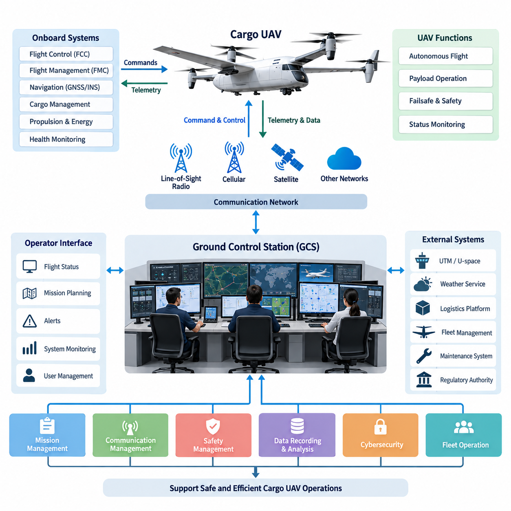
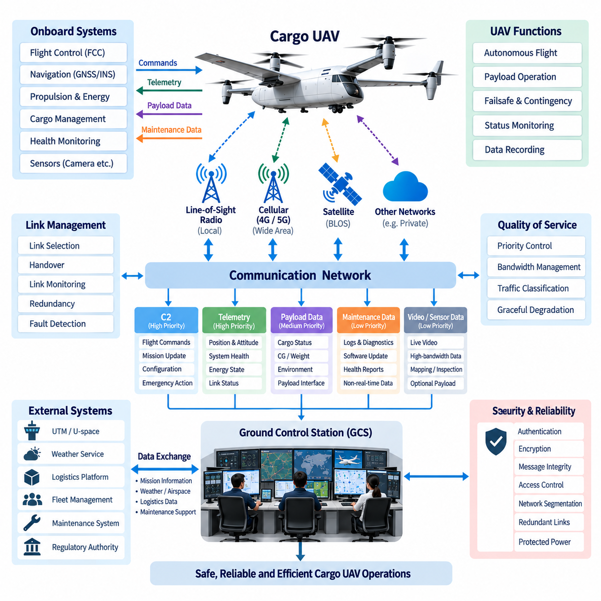
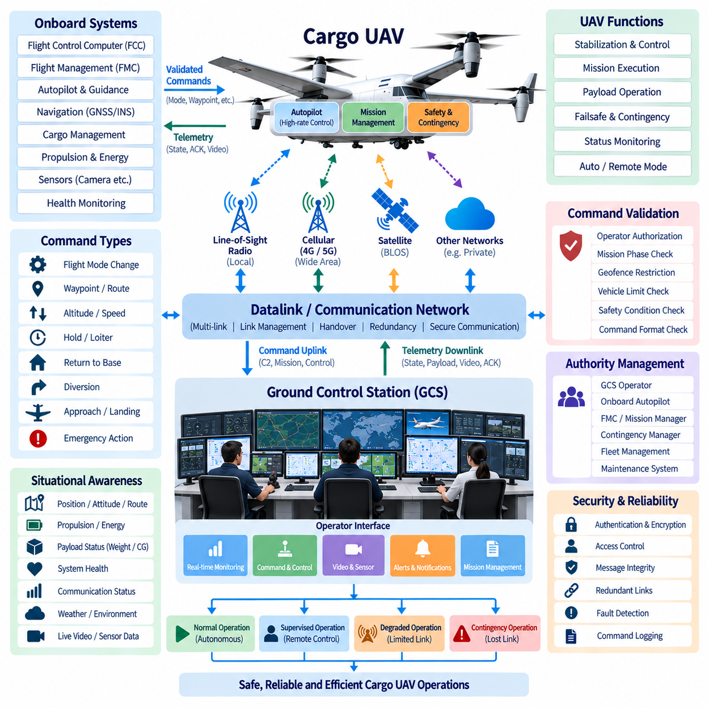
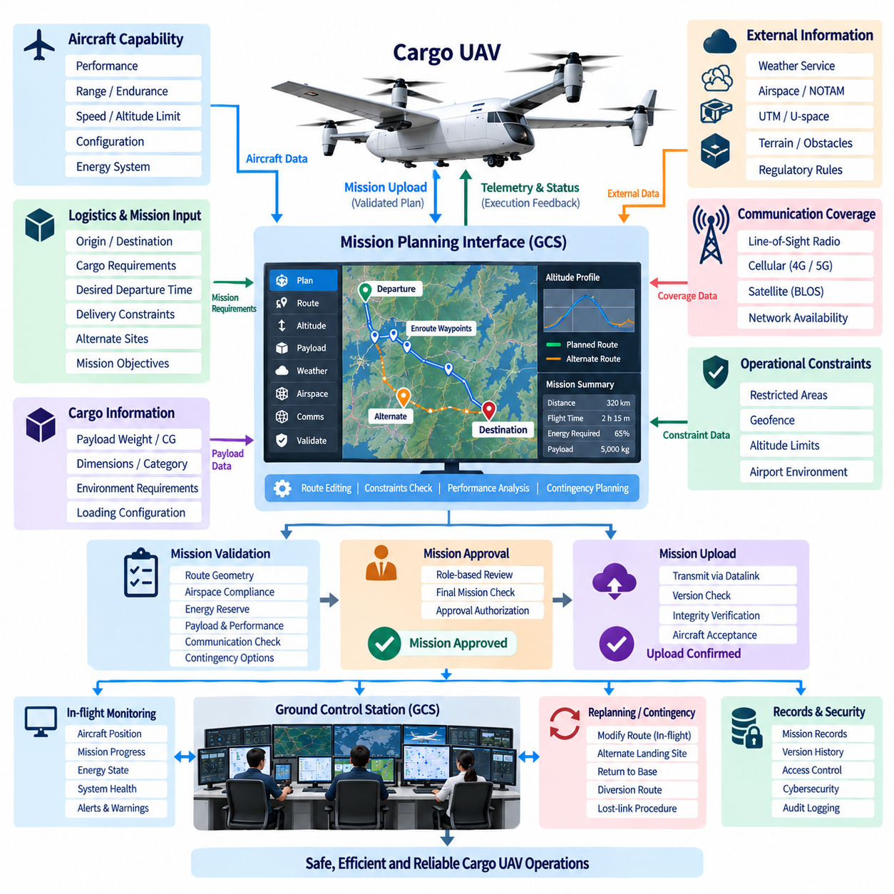
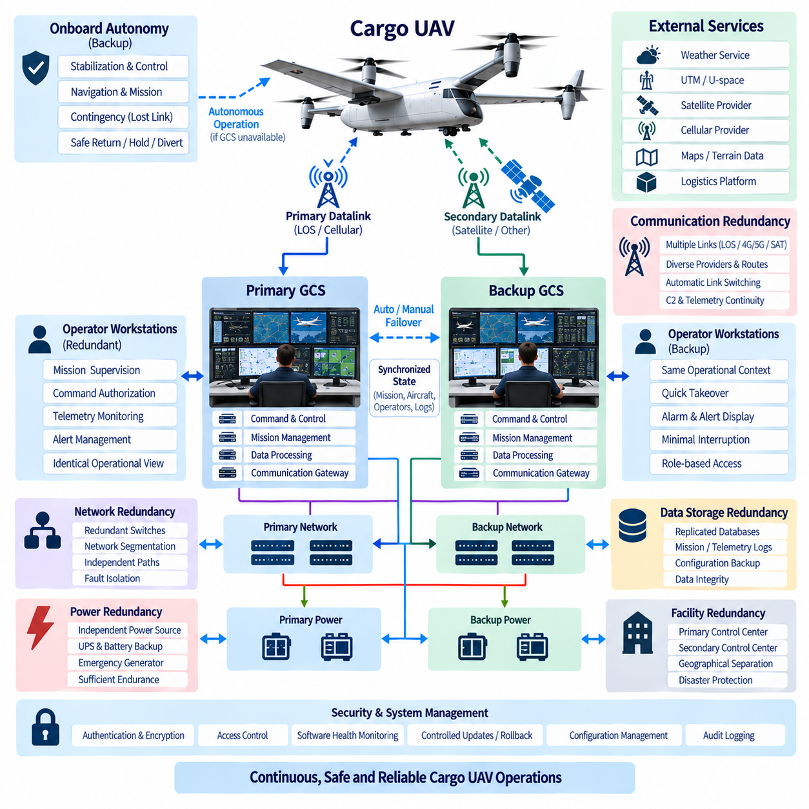

**Volume 18. Cargo UAV Architecture**

# Chapter 06. Ground Control Station

## 06.01. GCS Architecture

{width="7.268055555555556in" height="7.268055555555556in"}

지상통제소(Ground Control Station, GCS)는 인간 운용자(Human Operator)와 무인항공기(Unmanned Aircraft)를 연결하는 지상의 지휘(Command), 감독(Supervision), 임무 관리(Mission Management) 환경이다. 화물 무인항공기(Cargo UAV) 시스템에서 GCS는 단순한 항공기 조종 이상의 기능을 지원해야 한다. 항공기가 고가 또는 안전 필수 화물(Safety-Critical Payload)을 탑재한 상태로 장거리 자율 물류 임무(Long-Range Autonomous Logistics Mission)를 수행할 수 있기 때문이다. 따라서 GCS 아키텍처(GCS Architecture)는 임무 통제(Mission Control), 비행 모니터링(Flight Monitoring), 통신(Communication), 화물 감독(Payload Supervision), 안전 관리(Safety Management), 운용 데이터 서비스(Operational Data Service)를 하나의 통합된 지상 시스템으로 구성해야 한다.

GCS는 독립적인 사용자 단말기(User Terminal)가 아니라 전체 UAV 시스템(Overall UAV System)의 일부로 고려해야 한다. GCS는 비행제어컴퓨터(Flight Control Computer, FCC), 비행관리컴퓨터(Flight Management Computer, FMC), 항법 시스템(Navigation System), 화물관리시스템(Cargo Management System), 추진 및 에너지 시스템(Propulsion and Energy System), 기내 상태 모니터링 기능(Onboard Health-Monitoring Function)과 정보를 교환한다. 이러한 인터페이스(Interface)를 통해 지상 운용자는 모든 저수준 제어 루프(Low-Level Control Loop)에 직접 개입하지 않고도 항공기 상태, 임무 진행 상황, 화물 상태, 시스템 고장 및 잔여 운용 능력을 확인할 수 있다.

실용적인 GCS 아키텍처는 운용자 인터페이스(Operator Interface), 임무 관리 컴퓨팅(Mission-Management Computing), 통신 게이트웨이(Communication Gateway), 운용 데이터베이스(Operational Database), 외부 서비스 인터페이스(External-Service Interface)를 중심으로 구성할 수 있다. 운용자 워크스테이션(Operator Workstation)은 인간-기계 인터페이스(Human-Machine Interface, HMI)를 제공하며, 백엔드 컴퓨터(Backend Computer)는 텔레메트리(Telemetry), 임무 데이터(Mission Data), 지도(Map), 경보(Alert), 항공기 구성 정보(Aircraft Configuration Information)를 처리한다. 통신 게이트웨이는 무선 및 네트워크별 기능을 상위 애플리케이션(Higher-Level Application)으로부터 분리하여 동일한 임무 소프트웨어가 다양한 데이터링크(Datalink) 기술이나 통신 사업자를 통해 동작할 수 있도록 한다.

운용자 인터페이스(Operator Interface)는 사용 가능한 모든 항공기 파라미터(Parameter)를 단순히 표시하는 것이 아니라 운용 우선순위(Operational Priority)에 따라 정보를 제공해야 한다. 위치(Position), 고도(Altitude), 속도(Velocity), 기수방향(Heading), 비행 모드(Flight Mode), 경로 상태(Route Status), 항법 품질(Navigation Quality), 추진계 상태(Propulsion Condition), 에너지 잔량(Energy Reserve), 통신 품질(Communication Quality), 중요 경고(Critical Warning)가 주요 운용 상황 정보를 구성한다. 세부 엔지니어링 파라미터(Engineering Parameter)는 보조 화면을 통해 접근할 수 있도록 하여 정상적인 자율비행 중 운용자에게 과도한 정보를 제공하지 않으면서 이상 상태를 분석할 수 있도록 해야 한다.

임무 관리 기능(Mission-Management Function)은 물류 목표(Logistics Objective)를 항공기가 실행할 수 있는 운용 절차로 변환한다. 화물 임무(Cargo Mission)는 출발 준비(Departure Preparation), 지상주행 또는 이륙(Taxi or Launch), 상승(Climb), 순항(Cruise), 웨이포인트 항법(Waypoint Navigation), 접근(Approach), 착륙(Landing), 화물 이송(Cargo Transfer), 귀환 또는 재배치(Return or Repositioning)를 포함할 수 있다. GCS는 임무 정의(Mission Definition)를 유지하면서 경로 제약(Route Constraint), 항공기 성능(Aircraft Performance), 화물 특성(Payload Characteristics), 기상 조건(Weather Assumption), 목적지 정보(Destination Information), 운용 제한(Operational Restriction)이 임무 수행 전과 수행 중에 지속적으로 일관성을 유지하는지 확인한다.

통신 아키텍처(Communication Architecture)는 GCS의 핵심 요소이다. GCS는 항공기와의 연결이 항상 유지된다고 가정할 수 없기 때문이다. 지휘통제(Command and Control), 텔레메트리(Telemetry), 화물 정보(Payload Information), 정비 데이터(Maintenance Data), 선택적인 고대역폭 센서 스트림(High-Bandwidth Sensor Stream)은 서로 다른 지연시간(Latency), 대역폭(Bandwidth), 무결성(Integrity), 가용성(Availability) 요구사항을 가진다. 따라서 아키텍처는 모든 네트워크 트래픽(Network Traffic)을 동일하게 취급하지 않고 운용 중요도(Operational Criticality)에 따라 데이터를 분류하고 통신 자원을 할당해야 한다.

지휘통제 경로(Command-and-Control Path)는 승인된 비행 명령(Authorized Flight Command), 임무 변경(Mission Change), 비상 명령(Emergency Instruction), 안전한 감독에 필요한 항공기 상태와 같은 높은 우선순위 정보를 전달한다. 세부 진단 로그(Diagnostic Log)나 대용량 정비 데이터셋(Maintenance Dataset)과 같이 중요도가 낮은 데이터는 일정한 지연이나 일시적인 통신 중단을 허용할 수 있다. 이러한 분리는 비필수 데이터 전송이 비행 안전에 필요한 통신 용량을 소비하는 것을 방지하고, 통신 성능이 저하된 상황에서도 필수적인 운용 기능을 유지할 수 있도록 한다.

화물 UAV가 가시권 밖 비행(Beyond Visual Line of Sight, BVLOS)을 수행할 수 있으므로 임무 요구조건이 필요한 경우 GCS는 다중 통신 경로(Multiple Communication Path)를 지원해야 한다. 가시선 통신(Line-of-Sight Radio)은 출발지와 목적지 주변의 지역 운용에 사용하고, 셀룰러(Cellular), 사설 무선망(Private Wireless), 위성통신(Satellite Communication) 또는 기타 비가시권 통신망(Beyond-Line-of-Sight Network)을 통해 임무 범위를 확장할 수 있다. 통신 관리 계층(Communication-Management Layer)은 링크 품질(Link Quality)을 감시하고 사용 가능한 통신 경로를 선택하거나 전환함으로써 임무 애플리케이션이 각각의 물리적 통신 링크를 직접 관리할 필요가 없도록 한다.

항공기 자율성(Aircraft Autonomy)과 GCS 권한(GCS Authority)은 명확하게 분리되어야 한다. 안정화 제어(Stability Control), 항법(Navigation), 추진 제어(Propulsion Control), 즉각적인 고장안전 대응(Failsafe Response)은 지상 통신의 지연시간에 의존할 수 없기 때문에 지상 링크가 단절되더라도 항공기는 안전한 비행을 유지할 수 있는 충분한 기내 자율 기능(Onboard Autonomy)을 보유해야 한다. GCS는 감독 명령(Supervisory Command)과 임무 수준 권한(Mission-Level Authority)을 담당하고, 기내 시스템은 결정론적인 비행제어 기능(Deterministic Flight-Control Function)과 사전에 정의된 비상 대응 절차(Predefined Contingency Behavior)를 독립적으로 실행한다.

이러한 분리는 계층형 제어 아키텍처(Hierarchical Control Architecture)를 형성한다. 빠른 내부루프 제어(Fast Inner-Loop Control)는 항공기 내부에서 수행하고, 자율 유도 및 항법(Autonomous Guidance and Navigation)은 기체 수준에서 동작하며, 임무 감독(Mission Supervision)은 GCS 수준에서 수행한다. 인간 운용자는 승인된 임무 목표를 변경하거나 비상 절차(Contingency Procedure)를 시작할 수 있지만, 일상적인 안정화 및 액추에이터 제어(Actuator Control)는 기내 시스템이 담당한다. 이러한 분할은 통신 성능에 대한 의존성을 낮추고 장거리 및 고도 자율화 화물 운송 임무로 시스템을 확장하기 쉽게 한다.

GCS 내부의 안전 관리(Safety Management)는 경보 우선순위 설정(Alert Prioritization), 비상 대응 선택(Contingency Selection), 운용 경계 모니터링(Operational Boundary Monitoring), 비상상황 조정(Emergency Coordination)을 포함한다. GCS는 운용자가 필요한 대응 수준을 즉시 이해할 수 있도록 주의 정보(Advisory), 주의 경보(Caution), 위험 경고(Warning)를 구분해야 한다. 항법 성능 저하, 데이터링크 단절, 비정상적인 에너지 소비, 추진계 고장, 화물 이상, 경로 이탈, 지오펜스(Geofence) 충돌 등의 이벤트는 항공기의 기내 고장안전 로직(Onboard Failsafe Logic)과 연계된 사전 정의 절차를 실행할 수 있다.

화물 감독(Cargo Supervision)은 일반적인 소형 UAV 지상통제소에서는 상대적으로 중요하지 않았던 추가 기능을 요구한다. GCS는 화물관리시스템(Cargo Management System)으로부터 해당 측정값을 제공받을 경우 화물 중량(Payload Weight), 무게중심(Center of Gravity, CG) 정보, 화물 잠금장치 상태(Cargo-Lock Status), 화물칸 환경 조건(Compartment Environmental Condition), 화물 인터페이스 상태(Payload-Interface Health)를 표시할 수 있다. 이를 통해 운용자는 적재, 출발, 운송, 도착, 하역에 이르는 전체 과정에서 화물이 기계적으로 안전하게 고정되어 있으며 운용 가능한 상태를 유지하고 있는지 확인할 수 있다.

GCS 아키텍처는 또한 일관된 운용 기록(Operational Record)을 유지해야 한다. 텔레메트리(Telemetry), 운용자 명령(Operator Command), 임무 변경(Mission Revision), 경보(Alarm), 통신 이벤트(Communication Event), 항공기 구성(Aircraft Configuration), 화물 상태(Cargo Status), 정비 관련 정보(Maintenance-Relevant Information)를 시간정보(Time Stamp)와 함께 저장하여 이후 분석에 활용할 수 있다. 특히 비정상 임무를 재구성할 때 정확한 이벤트 상관관계(Event Correlation)가 중요하다. 정보가 서로 다른 갱신 주기로 동작하는 여러 항공기 컴퓨터, 지상 애플리케이션, 통신 네트워크, 외부 서비스에서 발생할 수 있기 때문이다.

사이버보안(Cybersecurity)은 아키텍처에 통합되어야 한다. 지휘 경로(Command Path)에 대한 비인가 접근(Unauthorized Access)은 항공기 운용에 직접적인 영향을 미칠 수 있기 때문이다. 인증(Authentication), 권한부여(Authorization), 암호화 통신(Encrypted Communication), 안전한 자격증명 관리(Secure Credential Management), 네트워크 분할(Network Segmentation), 소프트웨어 무결성 검사(Software Integrity Checking), 통제된 구성 변경(Controlled Configuration Change)을 통해 항공기 연결 인터페이스와 외부 인터페이스를 보호해야 한다. 특히 GCS가 공용 네트워크, 클라우드 서비스, 물류 플랫폼, 정비 시스템, 운용 당국과 동시에 연결되는 경우 보안 경계(Security Boundary)가 중요하다.

외부 인터페이스(External Interface)를 통해 GCS는 보다 광범위한 공역 및 물류 생태계(Airspace and Logistics Ecosystem)에 참여한다. 임무 애플리케이션은 무인교통관리(Unmanned Aircraft System Traffic Management, UTM) 또는 유스페이스(U-space) 서비스, 기상정보 제공자(Weather Provider), 지리공간 데이터베이스(Geospatial Database), 기단관리시스템(Fleet Management System), 화물 터미널(Cargo Terminal), 정비 시스템(Maintenance System), 기업 물류 플랫폼(Enterprise Logistics Platform)과 정보를 교환할 수 있다. 외부 연결은 정의된 게이트웨이를 통해 안전 필수 지휘 기능(Safety-Critical Command Function)과 분리하여 비즈니스 시스템의 장애나 사이버보안 사고가 항공기 제어 경로로 직접 전파되지 않도록 해야 한다.

다중 기체 운용(Fleet Operation)을 위해서는 아키텍처가 개별 항공기 제어(Aircraft-Specific Control)와 기단 수준 감독(Fleet-Level Supervision)을 구분해야 한다. 개별 UAV 세션(Session)은 상세한 기체 상태와 명령 권한(Command Authority)을 관리하고, 상위 기단 서비스(Fleet Service)는 임무 할당, 출발시간 조정, 항공기 가용성 모니터링, 물류 자원 최적화를 수행할 수 있다. 이러한 계층적 접근법을 적용하면 단일 운용센터가 모든 기체를 전체 임무 동안 수동 조종하지 않고도 여러 대의 화물 UAV를 감독할 수 있다.

화물 UAV의 적재 능력이 소형 물류 항공기에서 2.5톤급, 5톤급, 최종적으로 10톤급 플랫폼으로 증가함에 따라 확장성(Scalability)은 더욱 중요해진다. 항공기가 대형화될수록 통신 장애, 잘못된 명령, 화물 이상, 지상 시스템 장애가 초래하는 결과도 커진다. 따라서 GCS는 단순한 워크스테이션 중심 설비에서 중복 컴퓨팅(Redundant Computing), 네트워크(Networking), 통신 게이트웨이, 저장장치(Storage), 운용자 좌석(Operator Position), 재해복구 기능(Disaster-Recovery Capability)을 갖춘 고신뢰 운용 인프라(Resilient Operational Infrastructure)로 발전해야 한다.

불필요한 단일고장점(Single Point of Failure)을 제거함으로써 가용성(Availability)을 향상시킬 수 있다. 중요 GCS 서비스는 이중화 서버(Redundant Server), 독립 네트워크 경로(Independent Network Path), 이중화 통신장비(Duplicated Communication Equipment), 보호 전원(Protected Power Supply)을 기반으로 동작할 수 있다. 상태 동기화(State Synchronization)를 통해 장애 발생 시 대기 구성요소(Standby Component) 또는 대체 통제 위치(Alternate Control Position)가 필요한 기능을 인계받을 수 있다. 특히 여러 운용자 스테이션이나 지리적으로 분리된 시설이 동일 항공기에 접근할 경우 이중화 구조 자체가 모호한 통제 권한을 발생시키지 않도록 설계해야 한다.

따라서 운용 권한(Operational Authority)은 명확하고 추적 가능해야 한다. 시스템은 특정 시점에 어떤 스테이션, 운용자 역할(Operator Role), 자동화 서비스(Automated Service)가 특정 종류의 명령을 내릴 권한을 가지고 있는지 식별할 수 있어야 한다. 역할 기반 접근제어(Role-Based Access Control, RBAC)를 이용하여 임무 계획, 실제 비행 감독, 정비, 화물 운용, 관리 기능을 분리할 수 있다. 명령 중재(Command Arbitration)는 상충되는 지시를 방지하고 중요한 임무 또는 항공기 상태 변경을 누가 시작했는지 추적 가능한 기록을 제공한다.

항공기의 자율성이 증가하더라도 인간공학(Human Factors)은 여전히 핵심적인 요소이다. 고도로 자율화된 화물 UAV는 지속적인 수동 조작을 적게 요구하지만, 운용자는 시스템 의도(System Intent), 자동화 상태(Automation State), 성능 저하 모드(Degraded Mode), 개입에 따른 결과를 이해해야 한다. 따라서 GCS는 현재 비행 모드(Current Flight Mode), 활성 임무 구간(Active Mission Segment), 예상되는 다음 동작(Expected Next Action), 비상 상태(Contingency State), 경로나 모드가 변경된 주요 이유를 가능한 범위에서 표시함으로써 자율 시스템의 동작을 운용자가 이해할 수 있도록 해야 한다.

결과적으로 이러한 아키텍처는 자율 항공기(Autonomous Aircraft)와 광범위한 운용 환경(Operational Environment)을 연결하는 감독형 연결 계층(Supervisory Bridge)을 형성한다. 항공기 측 시스템은 실시간 제어(Real-Time Control)와 즉각적인 안전 기능을 담당하고, GCS는 임무 수준 지휘와 상황인식(Situational Awareness)을 제공하며, 외부 시스템은 공역, 물류, 기상, 정비, 기단 정보를 제공한다. 이러한 영역 사이에 명확한 인터페이스 경계(Interface Boundary)를 설정하면 시스템 간 결합도(Coupling)를 낮추면서 운용에 필요한 정보는 적절하게 교환할 수 있다.

성숙한 화물 UAV 프로그램에서 GCS는 궁극적으로 단순한 원격조종 콘솔(Remote-Piloting Console)이 아니라 운용 통제 인프라(Operational Control Infrastructure)로 발전한다. GCS의 효과적인 운용은 인간-기계 인터페이스(Human-Machine Interface), 임무 컴퓨팅(Mission Computing), 데이터링크(Datalink), 안전 로직(Safety Logic), 사이버보안(Cybersecurity), 이중화(Redundancy), 데이터 관리(Data Management), 화물 감독(Cargo Supervision), 외부 시스템 통합(External Integration)의 유기적인 설계에 달려 있다. 이러한 시스템 수준 접근법(System-Level Approach)은 점차 자율화되는 화물 항공기를 안전하게 감독하고 향후 기단 규모(Fleet-Scale)의 장거리 물류 운용(Long-Range Logistics Operation)으로 확장하기 위한 기반을 제공한다.

## 06.02. Datalink Design

{width="7.268055555555556in" height="7.268055555555556in"}

데이터링크(Datalink)는 화물 무인항공기(Cargo UAV)와 지상통제소(Ground Control Station, GCS)를 연결하여 명령(Command), 텔레메트리(Telemetry), 임무(Mission), 운용 정보(Operational Information)를 지속적으로 교환할 수 있도록 하는 통신 인프라(Communication Infrastructure)이다. 일반적인 네트워크 연결과 달리 항공용 데이터링크(Aviation Datalink)는 거리, 고도, 지형, 간섭, 이동성, 네트워크 가용성이 지속적으로 변하는 환경에서도 유효하게 동작해야 한다. 따라서 데이터링크 설계는 안정적인 지휘통제(Command and Control) 능력을 유지하면서 자율 화물 운용에 필요한 추가 정보를 지원하는 데 중점을 둔다.

데이터링크 아키텍처(Datalink Architecture)는 운용 중요도(Operational Importance)에 따라 통신 기능을 분리해야 한다. 지휘통제(Command and Control, C2) 메시지는 비행 모드, 임무 파라미터, 비상 대응, 운용 권한 등을 변경할 수 있으므로 예측 가능한 전달 성능이 요구된다. 텔레메트리(Telemetry)는 항공기 위치, 속도, 항법 상태, 추진계 상태, 에너지 상태, 시스템 건전성, 통신 품질 등을 제공한다. 화물 및 정비 정보는 통신 자원이 제한될 경우 일반적으로 더 낮은 우선순위 채널을 사용할 수 있다.

화물 UAV는 하나의 무선 시스템에 의존하기보다 여러 물리적 통신 기술(Physical Communication Technology)을 사용할 수 있다. 가시선 통신(Line-of-Sight, LOS) 무선은 출발지, 착륙 구역, 지역 운용 영역 주변에서 직접 연결을 제공할 수 있다. 4G 또는 5G와 같은 셀룰러 네트워크(Cellular Network)는 지상 통신 인프라가 존재하는 지역에서 통신 범위를 확장하며, 위성통신(Satellite Communication)은 원격 지역에서 비가시선 통신(Beyond-Line-of-Sight, BLOS)을 제공할 수 있다. 아키텍처는 이러한 서로 다른 링크를 공통 통신 관리 계층(Communication-Management Layer)을 통해 관리해야 한다.

링크 선택(Link Selection)은 단순한 수신 신호 강도만으로 결정해서는 안 된다. 가용 대역폭(Available Bandwidth), 지연시간(Latency), 패킷 손실(Packet Loss), 예상 통신 범위(Coverage Prediction), 네트워크 혼잡(Network Congestion), 간섭(Interference), 통신 비용(Communication Cost), 보안 상태(Security State), 예상 임무 궤적(Expected Mission Trajectory) 등이 선호 통신 경로 결정에 영향을 줄 수 있다. 통신 관리자(Communication Manager)는 이러한 파라미터를 지속적으로 평가하면서 주 통신 링크를 유지하고 보조 링크의 전환을 준비할 수 있다. 이를 통해 항공기와 GCS 애플리케이션은 특정 통신 기술에 강하게 종속되지 않고 운용 정보를 교환할 수 있다.

끊김 없는 핸드오버(Seamless Handover)는 장거리 화물 임무에서 특히 중요하다. 항공기는 지역 가시선 통신(LOS Radio)을 사용하여 출발한 후 순항 중 지상 광대역 네트워크(Terrestrial Broadband Network)로 전환하고, 인구 밀집 지역의 통신 범위를 벗어나면 위성 연결(Satellite Connectivity)이 필요할 수 있다. 데이터링크 시스템은 가능한 경우 이러한 전환 과정에서도 통신 세션(Communication Session)과 명령 권한(Command Authority)을 유지해야 한다. 적합한 다른 통신 경로를 사용할 수 있다면 일시적인 성능 저하가 불필요한 임무 중단으로 이어지지 않아야 한다.

상향링크(Uplink)와 하향링크(Downlink)는 서로 다른 운용 역할을 가진다. 상향링크는 주로 GCS에서 항공기로 승인된 명령, 임무 갱신, 구성 파라미터(Configuration Parameter), 선택된 제어 정보를 전달한다. 하향링크는 텔레메트리, 항법 상태, 건전성 정보, 화물 상태, 경보, 임무 진행 상황을 전달한다. 영상(Video)과 같은 고대역폭 센서 스트림(High-Bandwidth Sensor Stream)도 하향링크를 사용할 수 있지만, 안전 관련 항공기 상태나 필수 명령 응답(Command Acknowledgement)의 전달을 방해해서는 안 된다.

서비스 품질(Quality of Service, QoS) 메커니즘은 가용 대역폭이 감소할 때 중요 통신을 보호할 수 있다. C2 트래픽은 일반적으로 가장 높은 운용 우선순위를 부여하고, 그다음으로 필수 텔레메트리와 안전 정보를 배치해야 한다. 임무 지원 데이터, 화물 정보, 정비 로그, 영상 및 기타 대용량 데이터에는 점진적으로 낮은 우선순위를 부여할 수 있다. 이러한 트래픽 분류(Traffic Classification)를 통해 네트워크 성능이 정상 조건 이하로 떨어져도 데이터링크 전체가 사용 불가능해지는 대신 단계적으로 성능이 저하되도록 설계할 수 있다.

통신 지연시간(Communication Latency)은 항공기 제어 아키텍처(Aircraft Control Architecture)와 함께 고려해야 한다. 빠른 안정화 루프(Stabilization Loop), 액추에이터 제어(Actuator Control), 항법 필터링(Navigation Filtering), 즉각적인 고장안전 대응(Failsafe Response)은 지상 통신이 충분히 낮고 결정론적인 지연시간을 보장할 수 없기 때문에 항공기 내부에서 수행된다. 따라서 데이터링크는 지속적인 저수준 비행제어가 아니라 감독 제어(Supervisory Control)를 지원한다. 이러한 구조에서는 GCS가 임무 목표를 변경하거나 승인된 동작을 시작하는 동안 비행제어컴퓨터(Flight Control Computer, FCC)가 실시간 항공기 안정성을 유지한다.

통신 두절(Loss of Communication)은 정의되지 않은 고장이 아니라 예상 가능한 운용 조건(Expected Operational Condition)으로 다루어야 한다. 항공기는 링크 가용성(Link Availability)을 감시하고 통신 성능 저하가 설정된 임계값을 초과했는지 판단해야 한다. 임무 상태와 운용 규칙에 따라 현재 경로 유지, 지정 웨이포인트로 이동, 대기(Holding), 기지 귀환(Return to Base), 대체 착륙지로 우회 또는 다른 승인된 비상 절차를 수행할 수 있으며, 이러한 동작은 지상 명령을 무기한 기다리지 않고 실행될 수 있어야 한다.

이중화 데이터링크(Redundant Datalink)는 고장 의존성(Failure Dependency)을 정확히 이해할 때에만 가용성을 향상시킨다. 서로 다른 주파수를 사용하는 두 통신 채널이라도 동일한 모뎀(Modem), 안테나 시스템(Antenna System), 전원공급장치(Power Supply), 네트워크 사업자(Network Provider), 지상 게이트웨이(Ground Gateway)를 공유한다면 공통고장점(Common Failure Point)이 존재할 수 있다. 따라서 효과적인 이중화는 무선 하드웨어, 안테나, 통신 프로세서, 전원 도메인(Power Domain), 지상 인프라, 서비스 사업자, 라우팅 경로(Routing Path)를 함께 고려해야 한다. 화물 UAV의 안전 및 가용성 목표에 따라 필요한 영역에 다양성(Diversity)을 적용해야 한다.

안테나 아키텍처(Antenna Architecture)는 항공기 자세와 구조적 형상이 전파 조건을 지속적으로 변화시키기 때문에 데이터링크 성능과 밀접하게 연관된다. 기체 구조, 추진 장치, 화물칸, 배터리 및 기타 전도성 부품은 전파 음영(Shadowing)이나 감쇠(Attenuation)를 발생시킬 수 있다. 따라서 안테나 배치는 비행 자세, 예상 지상국 위치 관계, 운용 주파수, 구조 통합, 전자기 적합성(Electromagnetic Compatibility, EMC), 서로 다른 통신 시스템 사이의 상호 간섭 가능성을 고려해야 한다.

통신 서브시스템(Communication Subsystem)은 단순히 연결 또는 단절 상태만 표시하는 것이 아니라 측정 가능한 링크 건전성 정보(Link-Health Information)를 제공해야 한다. 신호 품질(Signal Quality), 지연시간, 패킷 손실, 처리량(Throughput), 재전송 활동(Retransmission Activity), 링크 가용성, 통신 오류를 항공기와 GCS 양쪽에서 모니터링할 수 있다. 이러한 측정값을 이용하면 통신 관리자가 완전한 링크 두절 이전에 점진적인 성능 저하를 감지하고, 운용자에게 남아 있는 통신 능력과 가능한 링크 전환에 대한 의미 있는 정보를 제공할 수 있다.

데이터 무결성(Data Integrity)은 손상된 정보가 정보 손실만큼 위험할 수 있기 때문에 필수적이다. 통신 프로토콜(Communication Protocol)은 전송 오류 검출, 메시지 구조 검증, 시퀀스 불연속(Sequence Discontinuity) 식별, 필요한 경우 중요 트랜잭션(Transaction) 확인을 위한 메커니즘을 제공해야 한다. 명령 메시지는 GCS가 해당 명령의 수신 및 승인 여부를 판단할 수 있도록 응답 확인(Acknowledgement)을 요구할 수 있다. 타임스탬프(Time Stamp)와 시퀀스 식별자(Sequence Identifier)는 현재 정보와 지연, 중복 또는 순서가 뒤바뀐 메시지를 구분하는 데에도 사용된다.

사이버보안(Cybersecurity)은 데이터링크 설계에 직접 통합되어야 한다. 인증(Authentication)은 항공기와 GCS가 승인된 시스템과 통신하고 있음을 확인하고, 암호화(Encryption)는 외부에 노출될 수 있는 네트워크를 통해 전송되는 정보를 보호한다. 메시지 무결성(Message Integrity) 메커니즘은 비인가 변경을 탐지하며, 접근제어 정책(Access-Control Policy)은 명령을 전송할 수 있는 사용자와 시스템을 제한한다. 공용 셀룰러 또는 위성 인프라를 사용하는 경우 자격증명 관리(Credential Management), 암호키 보호(Key Protection), 안전한 초기화(Secure Initialization), 통제된 소프트웨어 구성 관리가 더욱 중요해진다.

네트워크 분할(Network Segmentation)은 비필수 서비스가 지휘 경로(Command Path)에 직접 영향을 주는 것을 방지한다. 영상 전송, 정비 데이터 업로드, 화물 애플리케이션, 클라우드 연결(Cloud Connectivity), 기업 물류 서비스는 통신 인프라의 일부를 공유할 수 있지만 비행 필수 통신 기능에 제한 없이 접근해서는 안 된다. 게이트웨이(Gateway), 라우팅 정책(Routing Policy), 방화벽(Firewall), 애플리케이션 수준 권한관리(Application-Level Authorization)를 통해 운용 영역 사이의 경계를 설정하면서 필요한 정보는 통제된 인터페이스를 통해 교환할 수 있다.

데이터링크는 화물 상태가 임무 판단에 영향을 줄 수 있으므로 화물관리시스템(Cargo Management System)도 지원해야 한다. 사용 가능한 경우 화물 중량(Payload Weight), 무게중심 상태(Center-of-Gravity Status), 잠금 상태(Locking State), 화물칸 환경(Compartment Environment), 화물 인터페이스 건전성(Payload-Interface Health)을 GCS로 전송할 수 있다. 비정상적인 화물 상태에는 높은 전송 우선순위를 부여하여 운용자가 운송 중 임무 변경, 우회, 착륙 또는 기타 사전 정의된 대응이 필요한 상황을 신속하게 인지할 수 있도록 해야 한다.

기단 운용(Fleet Operation)을 위해 통신 아키텍처는 단일 항공기와 지상국 사이의 연결을 넘어 확장되어야 한다. 각각의 UAV에는 식별 가능하고 인증된 통신 세션(Authenticated Communication Session)이 필요하며, 기단 서비스(Fleet Service)는 임무 할당과 전체 운용 상태를 조정한다. 따라서 네트워크 주소 지정(Network Addressing), 세션 관리(Session Management), 대역폭 할당(Bandwidth Allocation), 명령 권한, 데이터 라우팅(Data Routing)은 동시에 연결되는 항공기 수가 증가해도 효율적으로 관리될 수 있어야 한다. 기단 규모가 증가하더라도 특정 UAV를 어떤 GCS 권한이 통제하는지 모호해져서는 안 된다.

장거리 2.5톤급, 5톤급, 10톤급 화물 UAV는 점진적으로 더 높은 수준의 통신 가용성(Communication Availability)과 운용 보증(Operational Assurance)을 요구한다. 항공기 크기, 화물 가치, 임무 거리, 사고 발생 시 영향이 증가함에 따라 데이터링크는 단순한 텔레메트리 연결에서 고신뢰 통신 서브시스템(Resilient Communications Subsystem)으로 발전해야 한다. 다중 링크(Multiple Links), 독립 통신 경로(Independent Communication Path), 보호 전원, 고장 모니터링(Fault Monitoring), 사이버보안, 명확하게 정의된 성능 저하 모드(Degraded Mode)는 전체 항공기 아키텍처에서 점점 더 중요한 요소가 된다.

데이터링크 정보는 다른 임무 데이터와 함께 기록되어야 한다. 링크 전환(Link Transition), 신호 성능 저하, 통신 중단, 명령 전송, 응답 확인, 지연시간 변화, 라우팅 이벤트(Routing Event), 통신 고장(Communication Fault)은 비행 후 분석(Post-Flight Analysis)에 중요한 근거를 제공한다. 이러한 기록을 항공기 텔레메트리 및 GCS 운용자 동작과 연계하여 분석하면 비정상 이벤트가 항공기, 통신 인프라, 지상 시스템 또는 여러 서브시스템 간 상호작용 중 어디에서 발생했는지를 판단할 수 있다.

데이터링크는 외부 운용 시스템(External Operational System)이 GCS 권한을 우회하지 않도록 하면서도 이들과 명확하게 연동되어야 한다. 무인교통관리(Unmanned Aircraft System Traffic Management, UTM) 또는 유스페이스(U-space) 서비스, 기상 시스템, 물류 플랫폼, 정비 인프라, 기단관리 서비스(Fleet-Management Service)는 최종적으로 임무에 영향을 줄 수 있는 정보를 제공할 수 있다. 그러나 외부 데이터가 항공기 명령으로 변환되기 전에 정의된 처리 및 권한 검증 경계(Processing and Authorization Boundary)를 통과해야 한다. 이를 통해 정보 서비스(Information Service)와 안전 관련 명령 권한(Safety-Relevant Command Authority)을 명확하게 분리할 수 있다.

성숙한 화물 UAV 데이터링크(Cargo UAV Datalink)는 하나의 무선 연결이 아니라 다중 경로(Multi-Path), 우선순위 인식(Priority-Aware), 보안성(Secure), 고장허용성(Fault-Tolerant)을 갖춘 통신 아키텍처이다. 그 목적은 항상 최대한 많은 데이터를 전송하는 것이 아니라 임무 전체에서 필요한 정보를 요구되는 신뢰성과 우선순위로 유지하는 것이다. C2 트래픽, 텔레메트리, 화물 데이터, 이중화 링크, 사이버보안, 자율 비상 대응(Autonomous Contingency Behavior)을 통합적으로 관리함으로써 데이터링크는 안전한 장거리 화물 UAV 운용을 가능하게 하는 핵심 기반이 된다.

## 06.03. Remote Control System

{width="7.268055555555556in" height="7.268055555555556in"}

원격제어시스템(Remote Control System)은 지상 운용자(Ground Operator)가 화물 무인항공기(Cargo UAV)의 동작을 감독하고, 명령하며, 승인된 경우 직접 개입할 수 있도록 하는 운용 인터페이스(Operational Interface)를 제공한다. 지상통제소(Ground Control Station, GCS)에서 원격제어(Remote Control)는 단순한 기존 무선조종과 동일한 개념이 아니다. 이는 인간의 판단을 기내 비행관리 및 비행제어 기능과 연결하면서 항공기의 자율 기능과 안전 필수 기능을 유지하는 감독 제어 계층(Supervisory Control Layer)을 형성한다.

대형 화물 UAV에서 항공기는 일반적으로 고속 안정화 제어(High-Rate Stabilization)와 액추에이터 제어(Actuator Control)를 자체적으로 담당해야 한다. 비행제어컴퓨터(Flight Control Computer, FCC)는 원격 통신 링크에 의존할 수 없는 주기로 자세 안정화, 제어 할당(Control Allocation), 액추에이터 명령, 즉각적인 안전 대응을 수행한다. 원격 운용자는 대신 비행 모드 변경, 웨이포인트 수정, 임무 지속, 대기(Holding), 우회(Diversion), 기지 귀환(Return-to-Base), 접근 승인 또는 기타 사전에 정의된 운용 동작과 같은 상위 수준 명령을 내린다.

이러한 분리는 운용자, GCS, 데이터링크(Datalink), 기내 자율 시스템(Onboard Autonomy), FCC, 물리적 액추에이터 사이에 계층형 제어 구조(Hierarchical Control Structure)를 형성한다. 인간의 명령은 항공기 동작에 영향을 주기 전에 감독 수준에서 해석되고 검증된다. 따라서 원격제어 아키텍처(Remote Control Architecture)는 자율비행 기능이 필요한 작업을 안전하게 수행할 수 있는 경우 지속적인 저수준 액추에이터 명령 전송을 피한다. 이러한 기능 분할은 통신 지연시간(Latency), 지터(Jitter), 패킷 손실(Packet Loss), 일시적인 데이터링크 중단에 대한 민감도를 감소시킨다.

여러 시스템이 동시에 항공기 운용에 관여할 수 있으므로 원격제어 권한(Remote Control Authority)은 명확하게 정의되어야 한다. GCS 운용자, 기내 자동조종장치(Autopilot), 비행관리컴퓨터(Flight Management Computer, FMC), 비상상황 관리자(Contingency Manager), 기단관리시스템(Fleet Management System), 정비 기능(Maintenance Function)은 각각 항공기 동작에 영향을 주는 요청을 생성할 수 있다. 권한관리 메커니즘(Authority-Management Mechanism)은 특정 기능을 어떤 명령 출처가 제어할 수 있는지 결정하고 상충되는 명령이 동시에 실행되는 것을 방지한다.

운용자 인터페이스(Operator Interface)는 인간의 의도(Human Intent)를 구조화되고 검증 가능한 명령으로 변환해야 한다. 단순히 수동 조종 스틱(Manual Stick) 입력에만 의존하지 않고 웨이포인트 이동, 고도 변경, 위치 대기, 임무 재개, 기지 귀환, 우회, 접근 시작, 착륙 중단 또는 승인된 비상 모드 활성화 등의 명령을 제공할 수 있다. 각 명령은 예상되는 항공기 반응(Expected Aircraft Response)을 명확하게 표시하여 운용자가 실행 전에 그 결과를 이해할 수 있도록 해야 한다.

원격 명령(Remote Instruction)이 항공기에서 수락되기 전에 명령 검증(Command Validation)이 수행되어야 한다. 시스템은 명령 형식, 운용자 권한, 항공기 운용 모드, 임무 단계(Mission Phase), 항법 상태, 지오펜스(Geofence) 제한, 기체 한계(Vehicle Limitation), 안전 조건을 검증할 수 있다. 정의된 운용 제약조건을 위반하는 명령은 거부하거나 추가 승인을 요구해야 한다. 이를 통해 우발적이거나 부적절한 운용자 동작이 시스템 수준의 검증 없이 비행 필수 기능으로 직접 전달되는 것을 방지한다.

원격제어시스템은 GCS 통신 환경을 구성하는 데이터링크 아키텍처(Datalink Architecture)에 의존한다. 명령은 상향링크(Uplink)를 통해 전달되고 항공기 상태, 명령 응답(Acknowledgement), 운용 피드백은 하향링크(Downlink)를 통해 반환된다. 통신 품질은 거리와 네트워크 상태에 따라 변화하기 때문에 제어시스템은 지속적으로 신뢰할 수 있는 연결을 가정하는 대신 지연시간, 패킷 손실, 재전송(Retransmission), 핸드오버(Handover), 일시적인 통신 중단을 고려해야 한다.

명령 응답 확인(Command Acknowledgement)은 원격 운용에서 특히 중요하다. GCS는 운용자가 명령을 생성한 상태, 네트워크를 통해 전송된 상태, 항공기가 수신한 상태, 기내 시스템이 승인한 상태, 최종적으로 실행된 상태를 서로 구분해야 한다. 이들은 각각 다른 상태이다. 명확한 응답 확인 체계(Acknowledgement Chain)를 제공하면 운용자가 단순히 지상통제소에서 명령을 입력했다는 이유만으로 항공기의 동작이 변경되었다고 잘못 판단하는 것을 방지할 수 있다.

지연시간(Latency)은 운용 파라미터(Operational Parameter)로 모니터링되고 표시되어야 한다. 수초 늦게 도착한 명령은 항공기가 이미 다른 임무 단계에 진입했거나 위치가 크게 변경된 경우 더 이상 적절하지 않을 수 있다. 타임스탬프(Time Stamp), 시퀀스 번호(Sequence Number), 명령 유효기간(Command Validity Period), 상태 검증(State Verification)을 사용하여 지연된 메시지가 의도하지 않은 동작을 발생시키는 것을 방지할 수 있다. 정의된 유효시간을 초과한 명령은 무조건 실행하는 대신 일반적으로 폐기해야 한다.

수동 원격조종(Manual Remote Piloting)은 특정 운용 상황에서 여전히 유용할 수 있지만 그 역할은 명확하게 제한되어야 한다. 지역 출발 운용, 정비 시험, 지상 이동(Ground Maneuvering), 특수 착륙 운용 또는 복구 절차(Recovery Procedure)는 통신 성능이 충분히 예측 가능한 경우 직접적인 조종사 입력을 사용할 수 있다. 그러나 장거리 비가시권 운용(Beyond Visual Line of Sight, BVLOS)에서는 지연시간이 변하는 네트워크를 통한 지속적인 수동제어보다 기내 자율 유도(Onboard Autonomous Guidance)와 감독형 원격 명령을 결합하는 방식이 더욱 견고하다.

자율 모드(Autonomous Mode)와 원격 감독 모드(Remotely Supervised Mode) 사이의 전환은 결정론적(Deterministic)이며 이해하기 쉬워야 한다. 운용자가 제어권을 요청하면 항공기는 요청된 모드의 사용 가능 여부와 제어권 이전 조건이 충족되었는지 확인해야 한다. GCS는 제어 권한이 기내 자율 시스템에 유지되는지, 원격 운용자에게 이전되었는지 또는 보호된 비상 모드(Protected Contingency Mode)로 전환되었는지를 명확하게 표시해야 한다. 모호한 제어권(Control Ownership)은 중요한 시스템 수준 위험요소가 될 수 있다.

데이터링크 두절(Loss of Datalink)이 발생했을 때 항공기가 운용자의 입력을 무기한 기다리는 상태가 되어서는 안 된다. 기내 시스템은 통신 성능 저하를 감지하고 현재 임무 단계에 적합한 사전 정의된 비상 동작(Predefined Contingency Behavior)을 수행해야 한다. 승인된 운용 개념(Operational Concept)에 따라 현재 경로 유지, 안전한 위치에서 대기, 기지 귀환, 대체 장소로 우회 또는 지정 위치 착륙 등을 수행하면서 통신 복구를 시도할 수 있다.

원격제어시스템은 여러 수준의 성능 저하 운용(Degraded Operation)을 지원해야 한다. 고대역폭 영상(High-Bandwidth Video)을 사용할 수 없더라도 명령 및 텔레메트리 채널이 정상이라면 감독 운용을 계속할 수 있다. 통신 대역폭이 더욱 감소하면 C2 메시지와 필수 항공기 상태를 유지하면서 비필수 정보를 제한할 수 있다. 통신 능력이 정의된 안전 임계값(Safety Threshold) 이하로 감소하는 경우에만 시스템이 자율 통신두절 모드(Autonomous Lost-Link Mode) 또는 비상 절차로 전환해야 한다.

효과적인 원격 개입(Remote Intervention)을 위해서는 상황인식(Situational Awareness)이 필요하다. GCS는 위치, 고도, 속도, 자세, 경로, 항법 품질, 추진계 상태, 에너지 잔량, 비행 모드, 통신 상태, 시스템 경고, 임무 진행 상황을 제공해야 한다. 사용 가능한 경우 화물 중량(Payload Weight), 무게중심 상태(Center-of-Gravity Condition), 화물 잠금 상태(Cargo-Lock Status), 화물칸 환경(Compartment Environment)과 같은 화물 관련 정보도 제공하여 항공기와 화물 상태를 모두 고려한 운용 판단이 가능하도록 해야 한다.

영상 및 센서 정보(Video and Sensor Information)는 원격 상황인식을 향상시킬 수 있지만 안전한 항공기 제어를 위한 유일한 근거가 되어서는 안 된다. 카메라 스트림(Camera Stream)은 대역폭 제한, 지연시간, 기상, 조명 또는 통신 중단의 영향을 받을 수 있다. 따라서 항법 및 기체 상태 텔레메트리(Navigation and Vehicle-State Telemetry)는 핵심적인 운용 정보로 유지되어야 한다. 센서 데이터는 항공기의 기내 인지(Onboard Perception), 항법, 자율 안전 기능을 대체하는 것이 아니라 보완해야 한다.

비상 제어(Emergency Control)는 그 결과가 중대할 수 있으므로 특별하게 다루어야 한다. 임무 중단(Abort), 대기, 기지 귀환, 비상 우회(Emergency Diversion), 통제 착륙(Controlled Landing) 등의 기능은 일반적인 임무 명령과 명확하게 구분해야 한다. 적절한 확인 메커니즘(Confirmation Mechanism)을 통해 우발적인 활성화를 줄이면서 실제 비상상황에서는 신속하게 실행할 수 있어야 한다. 시간에 민감한 대응이 필요한 경우 복잡한 인터페이스 절차로 인해 운용자의 대응이 지연되지 않도록 해야 한다.

사이버보안(Cybersecurity)은 원격제어 경로가 외부 명령을 통해 항공기 동작에 직접 영향을 줄 수 있는 통로이기 때문에 필수적이다. 운용자 인증(Operator Authentication), 역할 기반 권한관리(Role-Based Authorization), 암호화 통신(Encrypted Communication), 메시지 무결성 보호(Message Integrity Protection), 안전한 세션 관리(Secure Session Management), 명령 기록(Command Logging)을 통해 해당 경로를 보호해야 한다. 항공기는 정상적인 통신 인프라를 통해 전달된 메시지라도 승인되지 않았거나 검증되지 않은 출처의 명령은 거부해야 한다.

원격 운용은 상충되는 제어 세션(Conflicting Control Session)에 대한 보호도 필요하다. 기단 운용 환경에서는 여러 GCS 워크스테이션 또는 지리적으로 분리된 통제센터가 항공기 정보에 접근할 수 있지만, 적절하게 승인된 통제 주체(Authorized Control Entity)만 운용 명령을 내릴 수 있어야 한다. 따라서 통제소 사이의 제어권 인계(Control Handover)는 권한을 명시적으로 이전하면서 추적성을 유지하고 동시에 서로 상충되는 명령이 발생하지 않도록 정의된 절차를 따라야 한다.

중요한 모든 원격제어 이벤트(Remote-Control Event)는 기록되어야 한다. 운용자 신원, 명령 종류, 생성 시간, 전송 시간, 항공기 응답, 실행 결과, 통신 상태, 항공기 상태, 제어 권한 전환(Control-Authority Transition)은 운용 이력(Operational History)을 구성한다. 이러한 기록은 비행 후 분석(Post-Flight Analysis), 안전 조사(Safety Investigation), 정비 진단(Maintenance Diagnostics), 운용자 교육, 비정상 상황에서 인간 개입에 항공기가 올바르게 대응했는지 검증하는 데 활용할 수 있다.

기단 규모 화물 운용(Fleet-Scale Cargo Operation)은 원격제어의 역할을 더욱 변화시킨다. 궁극적으로 한 명의 운용자가 한 대의 항공기를 지속적으로 수동 조종하는 대신 여러 대의 고도 자율 항공기를 감독할 수 있다. 따라서 GCS는 예외 관리(Exception Management), 경보 우선순위 설정(Alert Prioritization), 임무 수준 개입(Mission-Level Intervention), 항공기 사이의 통제된 주의 전환(Controlled Transfer of Attention)을 강조해야 한다. 자동화 시스템은 일상적인 비행을 처리하고 인간 운용자는 판단, 승인 또는 조정이 필요한 상황에 집중해야 한다.

아키텍처가 2.5톤급에서 5톤급, 10톤급 화물 UAV로 발전함에 따라 원격제어는 공식적인 권한관리(Formal Authority Management), 통신 이중화(Communication Redundancy), 안전 모니터링(Safety Monitoring), 결정론적 비상 동작(Deterministic Contingency Behavior)에 더욱 의존하게 된다. 항공기가 대형화될수록 부적절한 명령이나 통신 장애가 초래하는 결과도 증가한다. 따라서 원격제어 기능은 독립적인 지상통제소 기능으로 추가되는 것이 아니라 전체 항공전자 및 안전 아키텍처(Avionics and Safety Architecture)의 일부로 설계되어야 한다.

성숙한 원격제어시스템(Remote Control System)은 궁극적으로 인간 감독(Human Supervision)과 기내 자율성(Onboard Autonomy)을 서로 경쟁시키는 것이 아니라 결합한다. 항공기는 시간에 민감한 제어(Time-Critical Control)와 즉각적인 안전 기능을 수행하고, GCS는 임무 수준 권한(Mission-Level Authority), 운용 상황인식(Operational Awareness), 통제된 개입(Controlled Intervention)을 제공한다. 명령 검증, 권한관리, 데이터링크 모니터링, 사이버보안, 고장안전 동작(Failsafe Behavior), 추적 가능한 운용자 상호작용(Traceable Operator Interaction)을 통합함으로써 안전한 장거리 화물 UAV 감독을 위한 확장 가능한 기반을 제공한다.

## 06.04. Mission Planning Interface

{width="7.268055555555556in" height="7.268055555555556in"}

임무계획 인터페이스(Mission Planning Interface)는 운용자가 운송 목표(Transportation Objective)를 실행 가능한 화물 무인항공기(Cargo UAV) 임무로 변환하는 핵심 환경이다. 지상통제소(Ground Control Station, GCS) 내에서 물류 요구사항(Logistics Requirements)을 항공기 성능, 항법 제약조건, 공역 정보, 화물 상태, 운용 규칙과 연결한다. 그 목적은 단순히 경로를 그리는 것이 아니라 비행관리컴퓨터(Flight Management Computer, FMC)와 기내 자율 시스템(Onboard Autonomous Systems)이 안전하게 해석할 수 있는 검증된 임무 정의(Validated Mission Definition)를 생성하는 것이다.

임무계획(Mission Planning)은 운용 의도(Operational Intent)를 정의하는 것에서 시작한다. 운용자는 출발지와 목적지, 화물 요구사항, 희망 출발시간, 배송 제약조건, 대체 장소, 기타 임무 목표를 정의한다. 인터페이스는 이러한 요구사항을 구조화된 임무 파라미터(Mission Parameter)로 변환하면서 관련 항공기 구성 및 성능 정보를 불러온다. 이를 통해 물류 목표를 배정된 UAV의 실제 성능과 현재 운용 상태를 기준으로 평가할 수 있다.

경로 구성(Route Construction)은 일반적으로 지리 좌표가 부여된 웨이포인트(Waypoint)를 순서가 지정된 비행경로로 연결하여 수행한다. 각 웨이포인트에는 위치, 고도, 속도, 항법 동작, 임무별 동작을 포함할 수 있다. 인터페이스는 전체 경로를 명확하게 표시하면서 운용자가 웨이포인트를 생성, 이동, 삽입, 삭제 및 검사할 수 있도록 해야 한다. 경로 편집은 직관적이어야 하며 동시에 유효하지 않거나 운용상 위험한 비행 구간이 생성되지 않도록 해야 한다.

고도계획(Altitude Planning)은 하나의 순항고도를 지정하는 것 이상의 기능을 요구한다. 지형, 장애물, 관제공역(Controlled Airspace), 기상, 통신 범위, 항공기 성능, 출발 및 도착 절차, 규제 제한 등이 허용 가능한 수직 비행 프로파일(Vertical Profile)에 영향을 줄 수 있다. 따라서 인터페이스는 경로를 수평 및 수직 관점에서 모두 표시하여 운용자가 상승, 순항, 하강, 접근 구간을 독립된 웨이포인트 값이 아니라 하나의 연속적인 임무로 평가할 수 있도록 해야 한다.

화물 정보(Cargo Information)는 화물 특성이 항공기 성능에 직접적인 영향을 주기 때문에 임무계획의 필수적인 요소이다. 화물 중량(Payload Weight), 무게중심(Center of Gravity), 크기, 화물 유형(Cargo Category), 환경 요구조건, 적재 구성은 가용 항속거리, 에너지 소비, 상승 성능, 착륙 성능, 경로 선택에 영향을 줄 수 있다. 따라서 화물관리시스템(Cargo Management System)이 제공하는 정보를 출발 전 임무 검증에 활용하고 운용 중 중요한 변화를 지속적으로 모니터링할 수 있다.

에너지 계획(Energy Planning)은 정의된 조건에서 계획된 임무를 완료하기 위한 충분한 에너지 예비량(Energy Reserve)이 존재하는지를 평가해야 한다. 계산에는 화물 질량, 경로 거리, 고도 프로파일, 예상 바람, 추진계 구성, 항공기 성능, 배터리 또는 연료 상태, 요구되는 예비 여유(Reserve Margin)를 고려할 수 있다. 하이브리드 화물 UAV의 경우 임무계획은 에너지관리시스템(Energy Management System, EMS)과 연계하여 배터리, 발전기, 연료전지, 터빈 또는 기타 기내 에너지원의 예상 사용량을 평가할 수 있다.

기상 정보(Weather Information)는 단순히 출발지의 일반적인 기상 조건으로 취급하는 것이 아니라 계획된 경로와 연계해야 한다. 풍향과 풍속, 강수, 가시거리, 온도, 결빙 위험(Icing Risk), 난기류(Turbulence), 주요 기상 현상은 경로 실현 가능성과 에너지 소비에 영향을 줄 수 있다. 계획 인터페이스는 관련 기상 정보를 지리적·시간적으로 표시하여 항공기가 서로 다른 임무 구간을 진행함에 따라 환경 조건이 어떻게 변화하는지 운용자가 이해할 수 있도록 한다.

공역 제약조건(Airspace Constraints)은 임무 표현에 통합되어야 한다. 제한구역(Restricted Area), 비행금지구역(Prohibited Zone), 관제공역, 임시 제한구역(Temporary Restriction), 지오펜스(Geofence), 공항 주변 환경, 고도 제한 및 기타 운용 경계가 경로 선택에 영향을 줄 수 있다. 인터페이스는 임무 승인 전에 충돌을 식별하고 어떤 경로 구간이 제약조건을 위반하는지 명확하게 표시해야 한다. 승인 가능한 대체 경로가 존재하는 경우 운용자는 원래의 물류 목표를 유지하면서 경로를 수정할 수 있다.

무인교통관리(Unmanned Aircraft System Traffic Management, UTM) 또는 유스페이스(U-space) 서비스와의 통합은 임무계획을 지역 GCS 환경을 넘어 확장한다. 적용되는 운용 환경에 따라 계획 궤적(Planned Trajectory), 운용 공간(Operational Volume), 식별 정보, 공역 제한, 승인 상태를 외부 교통관리 서비스와 교환할 수 있다. GCS는 외부 공역 정보와 항공기 명령 권한(Aircraft Command Authority) 사이에 명확한 경계를 유지하여 외부에서 수신한 데이터가 실행 가능한 임무에 영향을 주기 전에 검증되도록 해야 한다.

통신 범위(Communication Coverage) 역시 특히 비가시권(Beyond Visual Line of Sight, BVLOS) 화물 운용에서 경로 설계와 관련된다. 임무계획 시스템은 서로 다른 경로 구간에 대해 예상되는 가시선 통신(Line-of-Sight, LOS), 셀룰러(Cellular), 위성(Satellite) 또는 기타 네트워크 가용성을 연계할 수 있다. 통신이 약하거나 사용할 수 없는 지역을 출발 전에 식별함으로써 운용자는 이중화 링크(Redundant Link), 자율 통신두절 절차(Autonomous Lost-Link Procedure), 대체 경로 또는 추가 운용 제한이 필요한지를 판단할 수 있다.

임무계획에는 비상상황을 즉흥적인 운용자 판단으로 처리하는 대신 비상 경로(Contingency Route)를 명시적으로 포함해야 한다. 대체 착륙지(Alternate Landing Site), 대기 위치(Holding Location), 우회 경로(Diversion Route), 기지 귀환 경로(Return-to-Base Path), 통신두절 절차, 기타 사전 정의된 대응을 각 임무 단계와 연계할 수 있다. 이를 통해 기내 자율 시스템과 GCS는 정상적인 임무 수행을 지속할 수 없을 때 예상되는 동작에 대한 공통된 이해를 갖게 된다.

임무가 업로드되기 전에 인터페이스는 체계적인 검증(Systematic Validation)을 수행해야 한다. 경로 형상, 웨이포인트 순서, 고도 제한, 기체 성능, 화물 상태, 에너지 예비량, 지오펜스 준수, 통신 조건, 목적지 적합성, 필요한 비상 대응 옵션을 확인할 수 있다. 검증 결과는 임무 실행을 차단하는 오류(Blocking Error)와 경고(Warning) 또는 참고 정보(Advisory Information)를 구분하여 운용자가 임무 자체가 유효하지 않은 것인지 추가적인 주의가 필요한 것인지 이해할 수 있도록 해야 한다.

임무 승인(Mission Approval)은 임무 편집(Mission Editing)과 분리되어야 한다. 운용자는 경로를 생성하거나 수정할 수 있지만 이러한 작업이 자동으로 비행 승인을 의미해서는 안 된다. 검증이 완료되면 승인된 권한을 가진 담당자가 최종 임무 구성을 검토하고 업로드를 승인할 수 있다. 이러한 분리는 운용 절차의 규율을 강화하고 완료되지 않은 경로 변경이나 실험적인 계획 값이 운항 중인 항공기에 의도하지 않게 전송되는 가능성을 줄인다.

임무 업로드(Mission Upload)는 승인된 임무 정의를 데이터링크(Datalink)를 통해 항공기로 전송한다. 기내 시스템은 새로운 계획을 수락하기 전에 메시지 무결성(Message Integrity), 임무 버전(Mission Version), 호환성, 필수 파라미터를 검증해야 한다. GCS는 단순히 전송 성공을 가정하는 것이 아니라 항공기가 임무를 수신하고 승인했다는 확인을 받아야 한다. 특히 출발 직전이나 임무 수행 중 경로가 변경되는 경우 버전 식별(Version Identification)이 중요하다.

비행이 시작되면 인터페이스는 계획 환경(Planning Environment)에서 임무 모니터링 환경(Mission-Monitoring Environment)으로 전환된다. 항공기 위치를 승인된 비행 궤적과 비교하여 표시하고 현재 임무 단계, 다음 웨이포인트, 예상 도착시간(Estimated Arrival Time), 잔여 거리, 에너지 상태, 관련 경보를 함께 제공할 수 있다. 이를 통해 운용자는 계획된 동작과 실제 진행 상황을 비교하고 경로 이탈이 중대한 운용 문제로 발전하기 전에 식별할 수 있다.

비행 중 재계획(In-Flight Replanning)은 출발 이후 기상, 공역 제한, 목적지 가용성, 항공기 건전성, 화물 상태 또는 물류 우선순위가 변경될 수 있기 때문에 필요할 수 있다. 제안된 경로 변경은 활성 명령이 되기 전에 적절한 검증 절차를 거쳐야 한다. 시스템은 현재 승인된 임무(Current Approved Mission)와 제안된 수정안(Proposed Modification)을 명확하게 구분하여 운용자가 편집 중인 계획 경로와 항공기가 현재 실행하고 있는 궤적을 혼동하지 않도록 해야 한다.

협업형 기단 운용(Collaborative Fleet Operation)은 추가적인 계획 요구사항을 발생시킨다. 여러 화물 UAV가 출발 시설, 목적지, 통신 인프라, 충전 자원 또는 동일한 공역의 일부를 공유할 수 있다. 기단관리 서비스(Fleet-Management Service)는 임무 할당과 일정을 조정하고, 임무계획 인터페이스는 항공기별 경로 및 안전 제약조건을 유지할 수 있다. 이를 통해 각 항공기 임무에 필요한 세부 검증을 유지하면서 전체 물류 운용을 최적화할 수 있다.

인적요인(Human Factors)은 임무계획의 효과에 큰 영향을 준다. 지도, 고도 프로파일, 항공기 상태, 기상, 공역 제한, 통신 범위, 화물 정보, 경보를 계층 없이 동시에 표시하면 과도한 정보가 제공될 수 있다. 인터페이스는 운용상 중요한 충돌이나 문제를 우선적으로 강조하고 필요한 경우 세부 정보를 제공해야 한다. 일관된 기호, 명확한 상태 표시, 예측 가능한 편집 동작은 시간 제약이 있는 운용 환경에서 계획 오류 가능성을 줄인다.

사이버보안(Cybersecurity)과 접근제어(Access Control)는 임무 데이터 변경이 항공기 동작에 직접적인 영향을 줄 수 있기 때문에 필요하다. 인증(Authentication)과 역할 기반 권한관리(Role-Based Authorization)를 통해 누가 임무를 생성, 수정, 승인, 업로드 또는 취소할 수 있는지 결정해야 한다. 임무 파일과 전송되는 계획은 비인가 변경(Unauthorized Alteration)으로부터 보호되어야 하며 중요한 계획 작업은 기록되어야 한다. 외부 물류 또는 교통관리 시스템이 실행 가능한 비행계획을 제한 없이 변경할 권한을 가져서는 안 된다.

임무 기록(Mission Record)은 전체 물류 운용 과정에서 추적성(Traceability)을 제공한다. 시스템은 임무 버전, 운용자 변경사항, 승인 이벤트, 업로드된 경로, 비상 대응 정의, 실제 비행 궤적, 중요한 비행 중 변경사항을 보존할 수 있다. 계획된 임무와 실제 수행된 임무를 비교하면 운용 분석, 안전 조사, 성능 최적화, 규제 증빙(Regulatory Evidence), 향후 경로 및 에너지 계획 모델의 개선을 지원할 수 있다.

화물 UAV가 2.5톤급에서 5톤급, 10톤급 플랫폼으로 발전함에 따라 임무계획은 단순한 웨이포인트 프로그래밍(Waypoint Programming)보다 통합 항공운항 관리(Integrated Aviation Operations Management)에 가까워진다. 화물 가치, 항공기 성능, 경로 거리, 에너지 시스템 복잡성, 공역 상호작용, 우회에 따른 영향이 모두 증가한다. 따라서 계획 인터페이스는 통제된 작업흐름(Controlled Workflow) 안에서 물류, 항공전자(Avionics), 통신, 안전, 외부 운용 정보를 통합적으로 조정해야 한다.

성숙한 임무계획 인터페이스(Mission Planning Interface)는 궁극적으로 물류 의도(Logistics Intent)와 자율비행 실행(Autonomous Flight Execution)을 연결하는 가교 역할을 한다. 경로 설계, 화물 제약조건, 에너지 계획, 기상, 공역, 통신 범위, 비상계획(Contingency Preparation), 임무 검증, 승인, 업로드, 실시간 모니터링을 하나의 일관된 운용 프로세스로 통합한다. 각각의 실행 가능한 임무가 이해 가능하고 검증되며 추적 가능하고 항공기 성능과 호환되도록 보장함으로써 안전하고 확장 가능한 화물 UAV 운용을 위한 핵심 구성요소가 된다.

## 06.05. GCS Redundancy Design

{width="7.268055555555556in" height="7.268055555555556in"}

지상통제소 이중화(Ground Control Station Redundancy)는 개별 지상 시스템 구성요소에 고장이 발생하더라도 안전한 감독 제어(Supervisory Control)를 유지할 수 있도록 설계된다. 특히 비가시권(Beyond Visual Line of Sight, BVLOS) 화물 UAV 운용에서 GCS는 임무 감독, 명령 승인, 텔레메트리 모니터링, 비상상황 조정, 운용 통신을 지속적으로 담당할 수 있다. 따라서 이중화 설계는 단순히 두 번째 운용자 워크스테이션(Operator Workstation)을 설치하는 것이 아니라 전체 통제 체인(Control Chain)을 대상으로 해야 한다.

이중화 아키텍처(Redundancy Architecture)는 먼저 기능 손실이 안전한 운용 지속을 방해할 수 있는 기능을 식별하는 것에서 시작한다. 일반적으로 지휘통제(Command and Control) 처리, 항공기 텔레메트리 수신, 운용자 디스플레이, 임무 관리, 데이터링크 게이트웨이(Datalink Gateway), 인증 서비스(Authentication Service), 운용 데이터베이스, 시간 동기화(Time Synchronization), 네트워크, 전원이 포함된다. 각 기능은 고장 결과(Failure Consequence), 요구 복구시간(Required Recovery Time), 기내 자율 시스템이 기능 손실을 일시적으로 보완할 수 있는지에 따라 평가해야 한다.

구성요소 이중화(Component Redundancy)와 기능 이중화(Functional Redundancy) 사이에는 근본적인 차이가 있다. 동일한 컴퓨터 두 대는 하드웨어 이중화를 제공할 수 있지만 두 컴퓨터가 동일한 네트워크 스위치, 전원공급장치, 소프트웨어 서비스, 데이터베이스 또는 통신 게이트웨이에 의존한다면 운용 지속성을 보장하지 못한다. 따라서 효과적인 GCS 이중화는 컴퓨팅, 통신, 전원, 소프트웨어, 시설, 외부 인프라 전반의 공유 의존성과 공통원인고장(Common-Cause Failure)을 고려해야 한다.

중요 컴퓨팅 서비스(Critical Computing Service)는 주 시스템과 대기 처리 노드(Primary and Standby Processing Node)를 사용하여 구현할 수 있다. 주 노드는 활성 임무 및 통신 기능을 수행하고, 대기 노드는 운용 상태를 동기화하면서 기능 인계를 준비한다. 가용성 요구사항에 따라 활성-대기(Active-Standby) 또는 활성-활성(Active-Active) 구성을 사용할 수 있다. 선택된 방식은 고장 발생 시 두 개의 독립 시스템이 동시에 명령 권한(Command Authority)을 주장하는 상황을 방지해야 한다.

상태 동기화(State Synchronization)는 성공적인 장애조치(Failover)를 위해 필수적이다. 항공기 위치, 비행 모드, 활성 임무 버전, 웨이포인트 진행 상태, 경보, 운용자 동작, 명령 이력, 화물 상태, 통신 상태, 권한 상태는 이중화된 시스템 사이에서 일관성을 유지해야 할 수 있다. 오래된 임무 정보를 가지고 시작하는 대기 GCS는 컴퓨팅 하드웨어 자체가 정상적으로 작동하더라도 새로운 운용 위험을 발생시킬 수 있다.

이중화 운용자 워크스테이션(Redundant Operator Workstation)은 디스플레이 컴퓨터, 제어 장치 또는 로컬 애플리케이션에 장애가 발생했을 때 운용 연속성을 제공한다. 그러나 워크스테이션 이중화는 운용자가 임무 상태를 수동으로 다시 구성하도록 하는 것이 아니라 동일한 운용 상황(Operational Context)을 유지해야 한다. 대체 스테이션은 항공기 상태, 활성 경보, 임무 정보, 통신 상태, 명령 권한을 복구하여 최소한의 중단으로 운용 감독을 계속할 수 있어야 한다.

명령 권한(Command Authority)은 이중화 전환 과정에서 특히 신중하게 관리해야 한다. 특정 항공기에 대해 특정 운용 수준에서 일반적으로 하나의 승인된 통제 주체(Authorized Control Entity)만 활성 명령 권한을 보유해야 한다. GCS 컴퓨터, 운용자 스테이션 또는 통제센터 사이에서 제어권이 이전될 때 시스템은 새로운 권한을 활성화하기 전에 기존 권한을 명시적으로 해제하거나 중지해야 한다. 이를 통해 서로 상충되는 명령이 항공기에 전달되는 분할 제어(Split-Control) 상태를 방지한다.

데이터링크 서브시스템(Datalink Subsystem)은 GCS 컴퓨팅 이중화와 독립적인 이중화를 필요로 한다. 주 시스템과 백업 서버가 모두 정상적으로 작동하더라도 두 시스템이 장애가 발생한 동일한 통신 경로에 의존한다면 백업 서버의 효과는 제한적이다. 가시선 통신(Line-of-Sight, LOS), 셀룰러 네트워크(Cellular Network), 위성통신(Satellite Communication), 기타 적합한 링크를 통해 통신 다양성(Communication Diversity)을 제공할 수 있다. 링크 관리 기능(Link-Management Function)은 성능 저하를 감지하고 대체 경로를 선택하여 가능한 경우 필수 C2 및 텔레메트리 서비스를 유지해야 한다.

통신 이중화(Communication Redundancy)는 공통 고장 의존성(Common Failure Dependency)을 최소화해야 한다. 두 개의 모뎀이 동일한 안테나, 네트워크 사업자, 게이트웨이, 라우터 또는 전원을 공유한다면 실질적인 독립성을 제공하지 못할 수 있다. 안전 목표에서 높은 가용성을 요구하는 경우 안테나, 무선장치, 주파수, 네트워크 기술, 서비스 사업자, 라우팅 경로, 지상 통신 시설까지 다양성을 확대할 수 있다. 필요한 독립성 수준은 임무의 위험성과 운용 환경에 따라 결정해야 한다.

GCS 내부 네트워크 인프라(Network Infrastructure) 역시 고장허용 설계(Fault-Tolerant Design)를 필요로 한다. 중요 서버, 운용자 스테이션, 통신 게이트웨이, 저장 시스템은 이중화 네트워크 인터페이스와 독립적인 스위치를 사용할 수 있다. 네트워크 분할(Network Segmentation)을 통해 안전 관련 운용 트래픽을 영상, 정비, 관리, 기업 네트워크 트래픽과 분리해야 한다. 비필수 네트워크 영역에서 발생한 장애나 혼잡이 항공기 감독에 필요한 지휘통제 경로를 제거해서는 안 된다.

전원(Electrical Power)은 또 다른 주요 공통모드고장(Common-Mode Failure)의 원인이 될 수 있다. 하나의 보호되지 않은 전기회로에 연결된 이중화 컴퓨터는 시설 전원이 상실되면 동시에 고장날 수 있다. 따라서 중요 GCS 장비에는 독립적인 전력분배(Independent Power Distribution), 무정전전원장치(Uninterruptible Power Supply, UPS), 배터리 백업(Battery Backup), 필요한 경우 비상 발전(Emergency Generation)을 적용할 수 있다. 전원 아키텍처는 질서 있는 전환, 지속적인 임무 감독 또는 통제된 운용 종료를 위한 충분한 지속시간을 제공해야 한다.

데이터 저장 이중화(Data Storage Redundancy)는 운용 연속성과 임무 이후 추적성(Post-Mission Traceability)을 모두 지원한다. 임무계획, 항공기 구성, 명령 로그, 텔레메트리, 운용자 동작, 경보, 권한 기록, 시스템 이벤트가 단일 저장장치에 의존해서는 안 된다. 복제 데이터베이스(Replicated Database) 또는 이중화 저장 시스템을 이용하여 하드웨어 고장 이후에도 필수 기록을 보존하면서 활성 및 대기 GCS 서비스 사이의 일관성을 유지할 수 있다.

소프트웨어 이중화(Software Redundancy)는 단순한 하드웨어 복제와 다른 관점에서 고려해야 한다. 동일한 소프트웨어를 이중화된 컴퓨터에서 실행하더라도 동일한 소프트웨어 결함, 손상된 구성, 호환되지 않는 업데이트 또는 잘못된 입력으로 인해 동시에 장애가 발생할 수 있다. 따라서 이중화 설계에는 소프트웨어 상태 모니터링(Software Health Monitoring), 통제된 배포(Controlled Deployment), 롤백 기능(Rollback Capability), 구성관리(Configuration Management), 장애 서비스 격리(Isolation of Failed Services)가 포함되어야 한다. 중요한 업데이트가 주 시스템과 대기 시스템을 동시에 비활성화하지 않도록 해야 한다.

상태 모니터링(Health Monitoring)은 서비스가 완전히 상실되기 전에 장애조치를 시작하는 데 필요한 정보를 제공한다. GCS는 프로세서 상태, 애플리케이션 상태, 메모리 사용량, 네트워크 연결, 데이터링크 성능, 저장장치 상태, 동기화 상태, 전원 가용성, 외부 서비스 연결 상태를 모니터링할 수 있다. 고장 감지(Fault Detection)는 일시적인 성능 저하와 지속적인 장애를 구분하여 불필요한 시스템 전환 자체가 운용 시스템을 불안정하게 만들지 않도록 해야 한다.

장애조치 동작(Failover Behavior)은 결정론적(Deterministic)이어야 하며 충분히 시험되어야 한다. 주 서비스에 장애가 발생하면 어떤 구성요소가 장애를 감지하는지, 대기 시스템이 인계 권한을 어떻게 확인하는지, 명령 권한을 어떻게 이전하는지, 운용자에게 어떻게 통보하는지를 아키텍처에서 정의해야 한다. 복구시간(Recovery Time)은 운용 안전 요구사항과 일치해야 한다. 인프라 서비스에는 자동 장애조치(Automatic Failover)가 적합할 수 있지만 비행 명령 권한 이전에는 추가적인 통제 로직이 필요할 수 있다.

항공기의 기내 자율 시스템(Onboard Autonomy)은 물리적으로 GCS에 포함되지는 않지만 전체 이중화의 중요한 계층을 형성한다. 주 및 백업 지상통제 기능을 일시적으로 모두 사용할 수 없더라도 UAV는 안정화, 항법 또는 즉각적인 안전 기능을 상실해서는 안 된다. 사전에 정의된 통신두절 동작(Lost-Link Behavior)을 통해 지상 인프라가 복구를 시도하는 동안 비행 유지, 대기, 우회, 기지 귀환 또는 기타 승인된 비상 절차를 수행할 수 있다.

지리적 이중화(Geographical Redundancy)는 개별 장비 고장을 넘어서는 보호 기능을 제공한다. 보조 통제센터(Secondary Control Center)는 주 GCS에 영향을 주는 건물 전원 상실, 화재, 네트워크 장애, 환경적 손상 또는 기타 시설 수준 고장으로부터 운용을 보호할 수 있다. 보조 시설이 실제 운용 백업으로 기능하려면 동기화된 임무 정보, 호환 가능한 통신 접속, 운용자 기능, 보안 자격증명(Security Credential), 정의된 권한 이전 절차를 갖추어야 한다.

지리적으로 분리된 통제센터(Geographically Separated Control Center)는 추가적인 동기화 및 권한관리 문제를 발생시킨다. 두 장소 모두 항공기 텔레메트리를 수신할 수 있지만 동시 명령 기능은 엄격하게 통제해야 한다. 시스템은 어느 통제센터가 주 센터(Primary)이고 어느 센터가 대기 센터(Standby)인지, 어떤 조건에서 권한을 이전할 수 있는지 식별해야 한다. 권한 이전 이벤트는 기록되고 운용자에게 명확하게 표시되어 운용 조직이 하나의 명확한 통제 체계(Chain of Control)를 유지하도록 해야 한다.

외부 서비스(External Service)가 숨겨진 단일고장점(Single Point of Failure)이 되지 않도록 해야 한다. 기상정보 제공자, 무인교통관리(Unmanned Aircraft System Traffic Management, UTM) 또는 유스페이스(U-space) 서비스, 셀룰러 사업자, 위성통신 서비스, 인증 인프라, 지도 시스템, 물류 플랫폼 등이 GCS 운용을 지원할 수 있다. 아키텍처는 어떤 외부 의존성이 비행 지속에 필수적인지 결정하고 외부 연결이 항상 유지된다고 가정하는 대신 해당 서비스를 사용할 수 없을 때의 성능 저하 모드(Degraded Mode)를 정의해야 한다.

사이버보안(Cybersecurity)은 이중화 및 성능 저하 운용 상태에서도 유효하게 유지되어야 한다. 백업 시스템은 주 시스템에 장애가 발생했다는 이유로 인증, 암호화(Encryption), 접근제어(Access Control), 명령 검증(Command Validation)을 우회해서는 안 된다. 보안 자격증명과 암호화 자료(Cryptographic Material)는 보호된 메커니즘을 통해 계속 사용할 수 있어야 하며, 침해된 구성요소 하나가 모든 백업 자원까지 자동으로 침해하지 않도록 이중화 시스템 사이에 충분한 격리(Isolation)를 적용해야 한다.

정비 절차(Maintenance Procedure)는 이중화 가용성(Redundancy Availability)을 유지해야 한다. 서버, 통신 링크, 전원 채널 또는 워크스테이션 하나를 정비를 위해 오프라인 상태로 전환하면 남아 있는 고장허용 능력이 감소하고 허용 가능한 운용 상태가 변경될 수 있다. 따라서 GCS는 이중화 수준이 저하된 상태를 식별하여 운용자에게 알려야 한다. 특정 화물 임무에서는 출발 전에 완전한 이중화가 요구될 수 있으며, 다른 임무에서는 정의된 제한조건 아래에서 운용을 허용할 수 있다.

이중화 검증(Redundancy Verification)은 단순히 복제 장비가 존재하는지를 확인하는 것이 아니라 의도적인 고장주입(Fault Injection) 및 복구 시험을 통해 수행해야 한다. 시험에는 서버 장애, 워크스테이션 손실, 스위치 장애, 데이터링크 중단, 데이터베이스 장애, 전원 상실, 동기화 오류, 통신 핸드오버, 통제센터 전환 등이 포함되어야 한다. 목표는 장애가 발생하더라도 올바른 상태, 권한, 경보, 데이터 무결성을 유지하면서 전체 운용 기능이 지속되는지를 검증하는 것이다.

화물 UAV가 2.5톤급에서 5톤급, 10톤급 플랫폼으로 확대됨에 따라 요구되는 GCS 복원력(GCS Resilience)의 중요성도 증가한다. 더 큰 화물, 더 긴 운항 경로, 비가시권 운용, 높아지는 사고 영향도는 컴퓨팅, 통신, 전원, 통제 시설 사이에 더욱 강한 독립성을 요구할 수 있다. 따라서 이중화는 모든 서브시스템을 동일하게 복제하는 방식이 아니라 항공기 위험도(Aircraft Risk)와 운용 보증 요구사항(Operational Assurance Requirements)에 따라 발전해야 한다.

성숙한 GCS 이중화 아키텍처(GCS Redundancy Architecture)는 이중화 컴퓨팅, 운용자 인터페이스, 데이터링크, 네트워크, 저장장치, 전원, 보안 서비스, 필요에 따라 지리적으로 분리된 통제센터를 기내 자율 비상 대응 능력(Onboard Autonomous Contingency Capability)과 통합한다. 핵심 목표는 통제된 연속성(Controlled Continuity)이다. 장애를 감지하고, 명령 권한을 명확하게 유지하며, 운용 상태를 동기화하고, 필수 감독 기능을 지속하거나 사전에 정의된 성능 저하 모드로 안전하게 전환할 수 있어야 한다.
