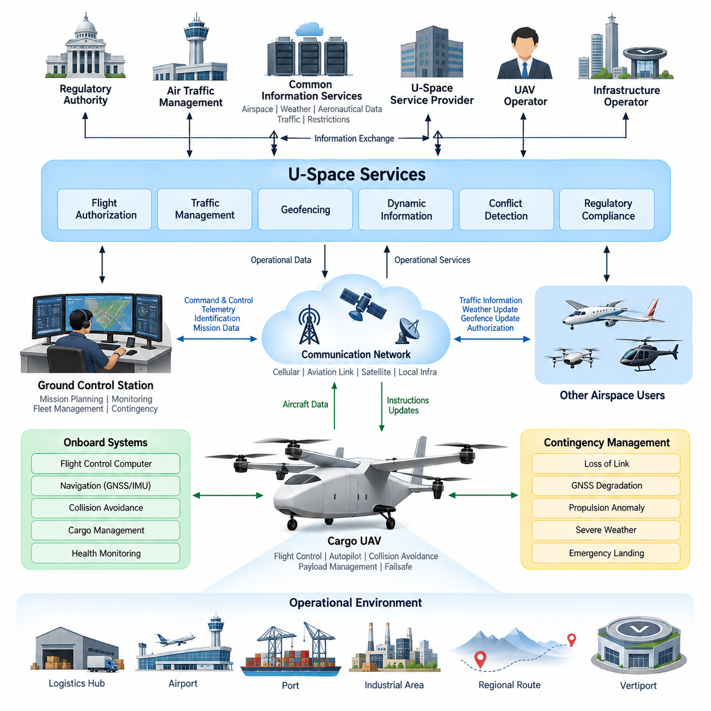
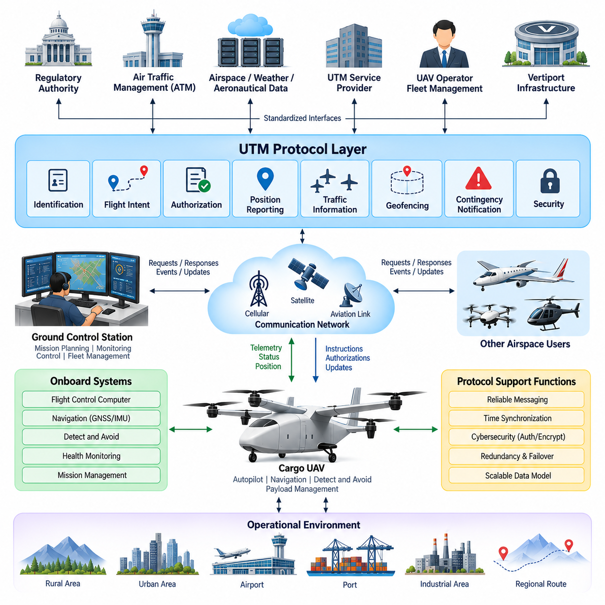
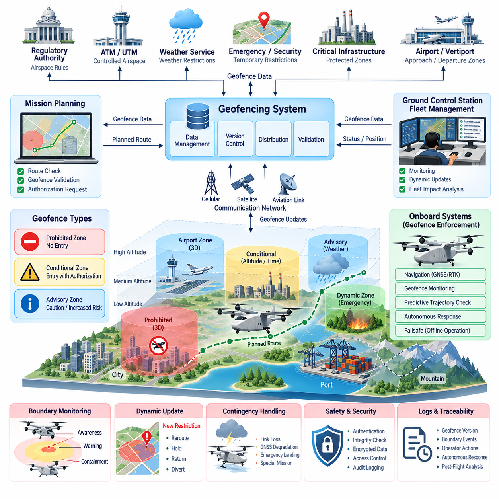
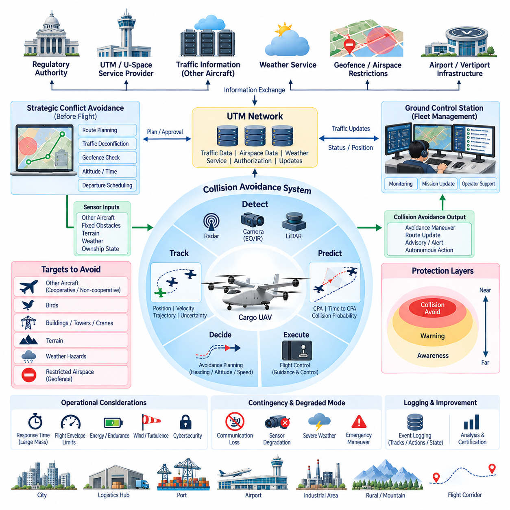
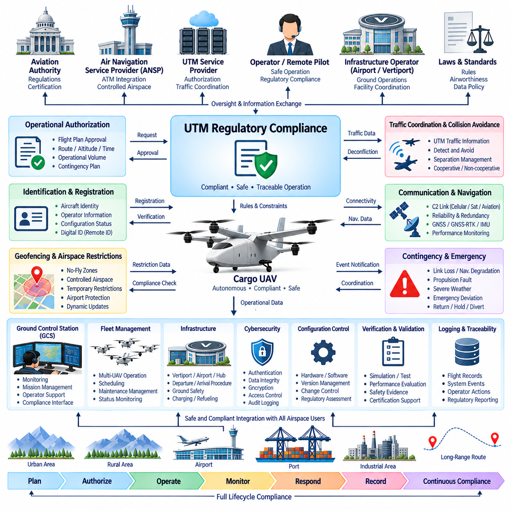

**Volume 18. Cargo UAV Architecture**

# Chapter 07. UTM

## 07.01. U-Space Architecture

{width="7.268055555555556in" height="7.268055555555556in"}

U-Space is a digital airspace management architecture designed to enable safe, scalable, and highly automated operations of unmanned aircraft within shared airspace. In a cargo UAV environment, it provides the coordination layer between aircraft operators, service providers, air traffic authorities, infrastructure operators, and other airspace users. Rather than functioning as a single centralized control system, U-Space is organized as an interconnected ecosystem of digital services that continuously exchange operational information.

The architecture separates onboard flight control from external traffic and airspace coordination. The Flight Control Computer and autopilot remain responsible for immediate aircraft stabilization, navigation, guidance, and safety-critical responses, while U-Space manages strategic information such as flight authorization, airspace constraints, traffic conditions, route conflicts, and operational restrictions. This separation prevents external network services from becoming part of the aircraft\'s fundamental stabilization loop while still allowing network-level coordination.

A typical U-Space environment contains UAV operators, U-Space Service Providers, Common Information Services, air navigation organizations, regulatory authorities, and supporting infrastructure. Common information functions distribute authoritative data such as airspace structures, operational restrictions, weather information, aeronautical data, and relevant traffic information. Service providers combine these shared resources with aircraft and mission information to deliver operational services to individual UAV operators and fleet management systems.

Before departure, the cargo UAV mission planning system generates a proposed route using origin, destination, aircraft performance, payload, energy availability, weather, and operational constraints. The route is submitted through the U-Space service environment for validation against controlled airspace, restricted areas, temporary limitations, geofencing boundaries, and other planned operations. The resulting authorization becomes an operational constraint for the Ground Control Station and mission management system rather than simply a static flight plan.

During flight, the aircraft maintains a digital operational identity and periodically communicates its position, altitude, velocity, trajectory, operational status, and other required information. These data allow U-Space services to construct a continuously updated traffic picture. Other participating aircraft can therefore be considered at both strategic and tactical levels. The architecture must accommodate temporary communication interruptions without allowing loss of network connectivity alone to create an immediately unsafe aircraft state.

Traffic management operates through several time horizons. Strategic conflict management evaluates intended trajectories before flight and attempts to prevent incompatible operations from being authorized. Dynamic management updates restrictions and traffic information as conditions change. Tactical functions support responses when actual trajectories deviate from their plans or unexpected aircraft enter the operating region. The onboard collision avoidance system remains an independent final safety layer when immediate separation action becomes necessary.

The Ground Control Station provides the primary operational interface between the cargo UAV and the U-Space ecosystem. Mission authorization, route updates, geofence changes, traffic advisories, weather warnings, and contingency information can be received through the GCS communication architecture. In the opposite direction, aircraft position, mission status, system health, contingency state, and operational intent can be distributed to external services. This interface should remain logically separated from direct safety-critical flight-control channels.

Cargo UAV operations introduce requirements beyond those of small delivery drones because aircraft mass, kinetic energy, route length, and operational consequence increase substantially. A 2.5-ton, 5-ton, or future 10-ton cargo platform may travel between logistics hubs, ports, airports, industrial complexes, and regional distribution centers. U-Space therefore becomes part of a larger logistics infrastructure in which flight authorization, cargo schedules, vertiport availability, charging or refueling, maintenance status, and fleet dispatch must eventually be coordinated.

Geofencing is one of the major enforcement mechanisms connecting U-Space information with onboard autonomy. Static boundaries may represent permanently prohibited or controlled areas, while dynamic geofences can represent temporary restrictions, emergency scenes, hazardous weather, infrastructure incidents, or special operations. Updated boundaries are transferred to mission systems and compared with the planned and actual trajectory. The aircraft should detect approaching violations early enough to support rerouting rather than relying only on last-second containment.

Communication architecture is critical because U-Space depends on reliable exchange between airborne and ground systems. Different links may be used for command and control, telemetry, identification, traffic information, and high-bandwidth mission data. Cellular networks, dedicated aviation links, satellite communication, and local infrastructure can coexist within a heterogeneous communication architecture. Redundant paths are particularly important for long-range cargo UAVs because communication availability can vary substantially throughout a regional or international mission.

Cybersecurity must be incorporated from the architectural level rather than added after deployment. Aircraft identity, operator identity, authorization messages, trajectory exchanges, geofence updates, and command-related information require authentication, integrity protection, controlled access, and traceability. Compromised U-Space information could otherwise produce incorrect routing or false operational restrictions. Security monitoring, credential management, secure communication, logging, and controlled software updates therefore form part of the overall operational trust architecture.

Contingency management connects U-Space with the aircraft failsafe architecture. Loss of command link, degraded GNSS, propulsion anomalies, insufficient energy reserve, severe weather, navigation uncertainty, or emergency landing requirements may force deviation from the authorized trajectory. The aircraft and GCS should classify the contingency, select an appropriate response, and communicate updated operational intent whenever connectivity permits. External traffic services can then warn surrounding operators and help preserve separation around the affected vehicle.

U-Space should also interface with conventional Air Traffic Management when cargo UAV routes intersect controlled or mixed-use airspace. The boundary between UTM-style automated services and traditional ATM cannot be treated as an isolated gateway because larger cargo UAVs may operate across both environments during a single mission. Information exchange must therefore support coordinated airspace status, flight intent, identification, traffic awareness, and transition procedures while preserving the authority and safety responsibilities of conventional aviation systems.

Scalability becomes increasingly important as operations evolve from individual aircraft to fleets. A fleet management system may simultaneously supervise dozens or eventually hundreds of cargo UAV missions, while U-Space coordinates those missions with unrelated operators using the same airspace. Automated authorization, trajectory negotiation, conflict detection, dynamic rerouting, fleet prioritization, and exception handling are therefore essential. Human operators should concentrate on abnormal conditions and supervisory decisions rather than manually coordinating every routine flight.

The resulting architecture can be viewed as a layered operational system extending from onboard avionics to regional airspace infrastructure. Flight control maintains aircraft stability and immediate safety, mission management executes the approved trajectory, the GCS supervises the vehicle, fleet systems coordinate multiple aircraft, U-Space services coordinate shared low-altitude operations, and ATM interfaces connect those operations with the wider aviation system. Each layer exchanges information while retaining clearly defined responsibilities and failure boundaries.

For heavy cargo UAV development, U-Space should ultimately be treated as part of the aircraft\'s system-of-systems architecture rather than merely as an external regulatory service. Aircraft avionics, datalinks, GCS, fleet management, geofencing, collision avoidance, cybersecurity, logistics infrastructure, and regulatory compliance must be engineered around compatible operational interfaces. This approach enables the architecture to scale from initial 2.5-ton platforms toward 5-ton and 10-ton cargo UAV networks while maintaining controlled, traceable, and increasingly automated airspace integration.

## 07.02. UTM Protocol Design

{width="7.268055555555556in" height="7.268055555555556in"}

Unmanned Traffic Management protocol design defines how UAVs, Ground Control Stations, fleet systems, UTM service providers, and aviation authorities exchange operational information in a consistent and reliable manner. For cargo UAV operations, the protocol layer must support aircraft identification, flight intent, authorization, position reporting, traffic information, airspace constraints, contingency notification, and mission updates while maintaining clear separation from safety-critical onboard flight-control functions.

The protocol architecture should follow a distributed service-oriented model rather than assuming that every participant communicates through one central server. UAV operators and fleet systems interact with UTM service providers, while authoritative airspace, regulatory, weather, and aeronautical information can originate from separate information services. Standardized interfaces allow these independently operated systems to exchange data without requiring identical internal software or hardware architectures.

Aircraft identification forms one of the fundamental protocol functions. Each participating UAV must be associated with a unique operational identity that can be correlated with its operator, approved mission, aircraft configuration, and current operational state. Identification messages should remain compact enough for frequent transmission while providing sufficient information for authorized services to determine which aircraft is operating, which mission it belongs to, and which entity is responsible for the operation.

Flight intent exchange describes where an aircraft plans to operate over time. Instead of representing a mission only as a sequence of geographic waypoints, a UTM protocol can represent the intended trajectory using position, altitude, time, route corridor, operational volume, and uncertainty information. This enables traffic management services to compare multiple intended operations and identify potential conflicts before aircraft physically approach each other.

Flight authorization protocols connect mission planning with controlled airspace access. A Ground Control Station or fleet management system submits a proposed operation containing aircraft identity, operator information, departure and destination areas, requested time window, altitude range, route, and relevant mission constraints. The UTM service evaluates the request and returns approval, rejection, conditional approval, or modification requirements that the mission system must interpret without ambiguity.

Position reporting provides the dynamic state information required to maintain traffic awareness after departure. Depending on operational requirements, reports may include latitude, longitude, altitude, ground speed, vertical speed, heading, timestamp, navigation quality, and operational status. Message timestamps are particularly important because traffic management decisions depend not only on where an aircraft is reported to be, but also on when that state was measured and how reliable the position estimate is.

Traffic information protocols distribute relevant information about surrounding aircraft and operational volumes. The objective is not necessarily to transmit every known aircraft to every UAV. UTM services can filter information according to geographic region, altitude, trajectory relevance, and conflict probability. This reduces unnecessary communication load while allowing the GCS, mission computer, and appropriate onboard systems to maintain sufficient situational awareness for the current operation.

Geofencing information requires a protocol capable of representing both static and dynamic airspace constraints. A restriction may contain geographic boundaries, altitude limits, activation and expiration times, restriction categories, authority information, and operational conditions. Dynamic updates must include version or validity information so that the receiving system can determine whether its locally stored geofence database remains current before executing or modifying a mission.

Protocol design must distinguish strategic conflict management from tactical collision avoidance. Strategic UTM messages support trajectory coordination, operational-volume negotiation, and rerouting before an immediate collision threat develops. Tactical collision avoidance operates on a much shorter time scale and should not depend exclusively on remote network services. The cargo UAV therefore requires onboard sensing and avoidance capabilities that remain available even when UTM connectivity becomes degraded or unavailable.

Communication between the Ground Control Station and UTM services should use clearly defined message states and transaction sequences. A flight request, for example, progresses through submission, validation, authorization, activation, modification, completion, or cancellation states. Explicit state transitions prevent different systems from interpreting the same mission differently and provide traceability when an operation is modified by the operator, service provider, or airspace authority.

Asynchronous event messages are equally important because many operational changes cannot wait for periodic polling. Temporary flight restrictions, severe weather warnings, traffic conflicts, emergency operations, geofence changes, vertiport closures, or authorization modifications may need to be delivered immediately. Publish-subscribe or event-driven communication mechanisms can therefore complement request-response interfaces, allowing subscribed systems to receive relevant changes as soon as they become available.

Cargo UAV protocols must support contingency communication as a normal architectural function rather than treating emergencies as exceptional data outside the protocol. Loss of command link, GNSS degradation, propulsion faults, insufficient energy, unexpected diversion, emergency landing, and inability to follow the authorized trajectory should be represented using standardized contingency states. UTM services can then distribute the affected aircraft\'s status and revised operational intent to relevant airspace participants.

Reliability mechanisms are required because wireless and wide-area networks cannot guarantee continuous connectivity. Messages may require sequence numbers, acknowledgements, retransmission policies, expiration times, duplicate detection, and local buffering. However, excessive retransmission can overload degraded networks, so the protocol should differentiate between critical operational messages and lower-priority information. Aircraft systems must also define safe behavior for periods when UTM information cannot be refreshed.

Time synchronization is essential across the entire UTM ecosystem. Aircraft telemetry, trajectory predictions, authorization windows, geofence activation, conflict calculations, and event logs all depend on consistent timestamps. GNSS-derived time or other synchronized network time sources can establish a common temporal reference. Systems should additionally indicate timestamp quality and detect abnormal clock offsets because inaccurate timing can transform otherwise correct position information into misleading traffic data.

Cybersecurity requirements influence every protocol interface. Authentication confirms the identity of aircraft, operators, GCS systems, and service providers, while integrity mechanisms protect messages against unauthorized modification. Encryption can protect sensitive operational information during transmission, and authorization policies determine which participant may access or modify particular data. Security credentials must be managed throughout aircraft commissioning, operation, maintenance, software update, and eventual retirement.

Protocol redundancy should avoid creating a single communication dependency for heavy cargo operations. Cellular networks may provide primary connectivity in populated areas, dedicated aviation links may support command and operational traffic, and satellite communication can extend coverage across remote regions. The protocol should preserve consistent aircraft identity, mission state, and message semantics when communication moves between networks so that link switching does not appear as a new or unrelated operation.

Interoperability with conventional Air Traffic Management becomes increasingly important as cargo UAV size and mission range increase. A regional cargo mission may transition between UTM-managed low-altitude environments and controlled airspace supervised through conventional ATM procedures. Gateway interfaces must therefore translate or correlate flight intent, identification, authorization, traffic status, and contingency information without losing operational meaning or creating conflicting sources of authority.

Fleet-scale operation adds another protocol dimension because a single operator may manage many aircraft simultaneously. Fleet management systems require interfaces for bulk mission submission, aircraft status aggregation, route modification, priority management, vertiport scheduling, and exception handling. The protocol should support efficient grouping and filtering so that hundreds of routine status updates do not prevent urgent messages associated with one abnormal aircraft from receiving immediate attention.

Data models should remain extensible as cargo UAV technology evolves from 2.5-ton platforms toward 5-ton and 10-ton aircraft. Core fields such as identity, position, trajectory, authorization, and operational state should remain stable, while optional extensions can represent payload restrictions, energy state, vehicle performance, weather tolerance, vertiport compatibility, or future autonomous coordination functions. Version management is therefore necessary to allow newer and older systems to coexist during gradual deployment.

The complete UTM protocol architecture ultimately connects mission planning, GCS supervision, fleet management, U-Space services, airspace information, geofencing, traffic coordination, cybersecurity, contingency management, and conventional ATM interfaces. Its purpose is not to remotely control the aircraft at every instant, but to establish a trusted digital coordination framework around autonomous flight. This separation allows onboard systems to preserve immediate flight safety while network services coordinate increasingly dense and complex cargo UAV operations.

For heavy cargo UAV networks, protocol design should therefore be treated as a system-level architecture extending from the aircraft to regional aviation infrastructure. Clearly defined interfaces, message semantics, timing, security, redundancy, state management, and failure behavior enable independent systems to cooperate predictably. Such an architecture provides the communication foundation required to scale from initial individual cargo missions toward automated regional fleets and eventually interconnected long-range unmanned cargo transportation networks.

## 07.03. Geofencing System

{width="7.268055555555556in" height="7.268055555555556in"}

Geofencing is a digital airspace protection mechanism that defines where a cargo UAV may operate and where flight is restricted, conditional, or prohibited. Within a UTM and U-Space architecture, the geofencing system converts regulatory, operational, safety, and infrastructure constraints into machine-readable geographic boundaries. These boundaries become active mission constraints that can be evaluated by mission planning, Ground Control Station, fleet management, and onboard navigation systems.

A geofence is more than a two-dimensional polygon drawn on a map. For autonomous cargo UAV operations, it should normally represent a three-dimensional or four-dimensional operational constraint containing latitude, longitude, altitude limits, and applicable time. This allows the same geographic region to have different restrictions at different altitudes or times. Such representation is particularly important for regional cargo routes that cross urban areas, airports, ports, industrial zones, and controlled airspace.

Static geofences represent restrictions that remain relatively stable over time. Examples include prohibited airspace, airport protection zones, military facilities, critical infrastructure, national borders, permanent obstacle regions, and locations requiring special authorization. These boundaries can be stored in an onboard or GCS geofence database and updated through controlled configuration management. Each dataset should include its source, version, validity period, coordinate reference, and applicable operational rules.

Dynamic geofences represent temporary or rapidly changing restrictions. Emergency response areas, wildfire zones, severe weather regions, temporary flight restrictions, security events, accident sites, moving hazardous operations, or temporarily unavailable vertiports can generate dynamic boundaries. UTM or U-Space services distribute these changes to affected operators, and the receiving system must determine whether an active or planned cargo UAV mission intersects the newly restricted region.

The geofencing architecture should distinguish prohibited zones from conditional and advisory zones. A prohibited zone prevents entry under defined operating conditions, while a conditional zone may permit entry only with appropriate authorization, altitude, aircraft capability, or mission priority. An advisory zone may allow continued operation while warning the operator or autonomy system of increased risk. This classification prevents every airspace constraint from producing the same aircraft response.

Mission planning is the first major enforcement stage. Before departure, the planned trajectory is compared with the active geofence database, including altitude and time constraints. If the route intersects a prohibited region, the mission planner should reject or reroute the trajectory. Conditional areas should trigger authorization checks, while advisory areas can influence risk evaluation. This strategic verification reduces the probability that an aircraft begins a mission with an inherently invalid flight plan.

Geofence monitoring continues after takeoff because authorized routes and airspace conditions can change during flight. The aircraft position, predicted trajectory, and current geofence set are continuously compared to identify potential boundary violations. Monitoring should consider not only the current aircraft position but also speed, heading, climb rate, navigation uncertainty, and expected future trajectory. Early prediction provides enough time for controlled rerouting instead of requiring abrupt maneuvering near the boundary.

A practical system should use multiple protection regions around critical boundaries. An outer awareness region can notify the mission system that the aircraft is approaching a restricted area, while a warning region can initiate route correction or request operator attention. A final containment boundary can activate stronger autonomous actions when violation becomes imminent. The exact behavior depends on aircraft performance, airspace requirements, vehicle mass, and the operational consequence associated with boundary penetration.

Navigation uncertainty must be included in geofence calculations. GNSS and GNSS-RTK can provide accurate positioning under favorable conditions, but multipath, interference, jamming, atmospheric effects, sensor faults, or degraded satellite visibility can increase position uncertainty. The system should therefore avoid treating the reported position as a mathematically exact point. Safety margins can expand restricted boundaries according to navigation integrity, aircraft dynamics, and required containment performance.

The onboard geofencing function should remain available when external communication is temporarily lost. A cargo UAV cannot depend exclusively on continuous network access to determine whether it is entering prohibited airspace. The current valid geofence dataset, mission authorization, critical boundaries, and associated response rules should therefore be locally available. Network connectivity is used to obtain updates, while onboard logic preserves basic containment capability during communication degradation.

UTM and U-Space interfaces provide the mechanism for distributing authoritative geofence information. Updates may contain boundary geometry, altitude range, activation time, expiration time, restriction category, issuing authority, priority, and version information. The Ground Control Station or fleet system validates the message before integrating it into the active operational database. Version control prevents obsolete restrictions from unintentionally replacing newer information and supports traceability during post-flight analysis.

Dynamic geofence updates require deterministic conflict handling. A new restriction may appear directly across an active flight route, making the previously authorized trajectory invalid. The system must determine whether the aircraft can reroute, hold, return, divert to an alternate landing site, or continue under an existing authorization. Heavy cargo UAVs require particular care because their speed, inertia, energy state, landing requirements, and maneuvering limits may prevent instantaneous compliance with newly introduced boundaries.

Geofencing must interact closely with detect-and-avoid and collision avoidance functions without replacing them. Geofencing primarily protects against entry into defined airspace regions, whereas detect-and-avoid responds to dynamic collision hazards such as other aircraft. A route that is completely valid according to geofence rules can still contain a traffic conflict. Conversely, an empty region with no nearby aircraft may still be prohibited. Both functions therefore contribute independent layers of operational safety.

Contingency conditions may justify controlled deviation from normal geofence behavior. Propulsion degradation, severe weather, loss of navigation capability, insufficient energy, medical or public-safety missions, and emergency landing requirements can create situations in which remaining inside the original authorized corridor is more dangerous than leaving it. The architecture should define how emergency status is declared, recorded, communicated, and coordinated with UTM services while maintaining clear authority over exceptional actions.

Cybersecurity is critical because malicious modification of geofence data could redirect an aircraft, block legitimate operations, or intentionally guide a UAV toward restricted infrastructure. Geofence messages and databases therefore require authenticated sources, integrity verification, secure distribution, access control, and audit logging. Sensitive updates may also require encryption. The aircraft and GCS should reject invalid, corrupted, unauthorized, expired, or inconsistent geofence information rather than applying it automatically.

Fleet operations introduce additional complexity because one geofence update can affect many aircraft simultaneously. A fleet management system should identify all active and planned missions intersecting a changed restriction and evaluate their consequences. Some aircraft may require rerouting, others may need departure delays, and unaffected missions should continue normally. Automated impact analysis becomes increasingly important when dozens or hundreds of cargo UAVs share regional logistics corridors.

Vertiports and logistics hubs can also use local geofences to structure arrival and departure operations. Protected approach corridors, landing zones, ground safety regions, obstacle areas, charging facilities, cargo-handling zones, and emergency landing areas can be represented as operational boundaries. Temporary restrictions can isolate a pad during maintenance or an incident. This connects airspace-level geofencing with the physical infrastructure used by automated cargo transportation networks.

For 2.5-ton, 5-ton, and future 10-ton cargo UAVs, geofence response must reflect vehicle performance rather than simply applying rules developed for small drones. Higher mass and kinetic energy increase the distance required for deceleration, turning, holding, diversion, and emergency landing. Boundary prediction must therefore consider aircraft-specific flight envelopes and response times. Geofence margins can become adaptive according to speed, altitude, weather, payload, navigation quality, and contingency state.

Logging and traceability are essential for certification, operational monitoring, and incident investigation. The system should record the geofence dataset version, received updates, authorization state, aircraft position, predicted boundary encounters, warnings, rerouting decisions, operator actions, and autonomous responses. Synchronized timestamps allow these events to be reconstructed after flight and provide evidence that the aircraft and supporting systems applied the correct restrictions at the appropriate time.

The complete geofencing system therefore extends from authoritative airspace information through UTM and U-Space services to fleet management, GCS mission planning, onboard navigation, and autonomous failsafe functions. Static and dynamic boundaries, predictive monitoring, navigation uncertainty, cybersecurity, communication redundancy, contingency handling, and traceability must operate as one coordinated architecture. This transforms geofencing from a simple map restriction into an active airspace safety mechanism for autonomous cargo UAV operations.

As cargo UAV networks expand toward regional and eventually long-range unmanned logistics, geofencing becomes a fundamental interface between digital airspace governance and physical aircraft autonomy. Its purpose is not merely to prevent boundary violations, but to ensure that each aircraft understands the spatial, vertical, temporal, and operational conditions governing its mission. A robust geofencing architecture enables scalable fleet operation while preserving predictable behavior across normal, degraded, and emergency conditions.

## 07.04. UAV Collision Avoidance

{width="7.268055555555556in" height="7.268055555555556in"}

UAV collision avoidance is the safety architecture that detects potential conflicts with other aircraft, obstacles, terrain, and restricted operating volumes, evaluates the associated collision risk, and generates an appropriate avoidance response. For cargo UAVs, the function must operate across strategic and tactical time scales because large aircraft have greater inertia, longer maneuvering distances, and higher consequences if safe separation is lost.

Collision avoidance should be organized as multiple independent safety layers rather than as a single algorithm. UTM and U-Space services provide strategic traffic coordination before conflicts become immediate, while onboard Detect-and-Avoid systems monitor the local environment during flight. Flight control provides the final execution layer by converting avoidance commands into safe aircraft motion. This layered architecture prevents failure of one information source from eliminating the entire protection capability.

Strategic conflict avoidance begins during mission planning. Planned trajectories are compared with known traffic, authorized operational volumes, geofences, altitude restrictions, weather conditions, and scheduled airspace activities. When predicted trajectories violate required separation criteria, the UTM or fleet management system can modify departure time, altitude, route, speed profile, or operational volume before takeoff. Strategic deconfliction reduces the number of situations that must later be solved through aggressive tactical maneuvers.

Tactical collision avoidance operates during flight and responds to conflicts that cannot be resolved entirely through preflight coordination. Nearby cooperative aircraft may transmit identification, position, velocity, and trajectory information through network or aviation surveillance mechanisms. Non-cooperative aircraft, birds, structures, cranes, terrain, or unexpected objects require onboard perception. The system therefore combines external traffic information with local sensing to construct a continuously updated representation of collision hazards.

The onboard sensor architecture can combine radar, LiDAR, electro-optical cameras, infrared cameras, GNSS, IMU, and other navigation or surveillance sources according to aircraft requirements. Each sensor provides different advantages in range, field of view, weather tolerance, angular resolution, and object classification. Sensor fusion combines these complementary measurements so that collision avoidance does not depend on a single sensing technology whose performance may degrade under specific environmental conditions.

Object detection alone is insufficient because the aircraft must determine whether a detected object actually represents a collision threat. Tracking algorithms estimate the position, velocity, heading, and uncertainty of surrounding traffic over time. The system then predicts relative motion and evaluates parameters such as closest point of approach, time to closest approach, separation distance, and collision probability. These predictions convert raw perception data into information suitable for avoidance decisions.

Trajectory prediction should account for uncertainty in both the cargo UAV and surrounding objects. Sensor noise, communication delay, navigation errors, unknown pilot intent, wind, and maneuvering behavior can make future positions uncertain. Instead of assuming a single deterministic trajectory, the avoidance system can represent predicted motion using uncertainty regions or probabilistic estimates. Safety margins should increase when confidence in the traffic state decreases.

Conflict detection determines when predicted separation falls below acceptable thresholds. Different thresholds may be applied according to aircraft type, relative velocity, operational environment, navigation quality, and regulatory requirements. A slowly moving UAV in an isolated logistics corridor may require a different protection volume from a high-speed cargo aircraft approaching controlled airspace. Heavy cargo UAVs generally require earlier conflict detection because their maneuvering response cannot be assumed to match that of small multirotor drones.

Avoidance planning determines how the aircraft should modify its trajectory after a significant conflict is identified. Candidate actions may include horizontal turning, altitude change, speed adjustment, holding, route deviation, or combinations of these maneuvers. The selected solution must avoid the immediate threat without creating a secondary conflict, entering prohibited airspace, exceeding the flight envelope, violating terrain clearance, or consuming an unacceptable amount of remaining energy.

The avoidance planner must therefore interact with geofencing and mission management. A geometrically simple escape maneuver may be invalid if it crosses an airport protection zone, restricted area, terrain boundary, or temporary emergency geofence. Conversely, strict adherence to the original mission route may become unsafe when another aircraft unexpectedly enters the corridor. Collision safety normally requires higher immediate priority, while the system subsequently coordinates the resulting route deviation with UTM and the Ground Control Station.

Flight Control Computer integration is required to convert an avoidance trajectory into executable guidance and control commands. The planner should provide commands that respect aircraft-specific limits for bank angle, climb rate, acceleration, airspeed, propulsion capability, and structural loading. For large cargo UAVs, avoidance cannot be designed independently of vehicle dynamics. A maneuver that is feasible for a small drone may be physically impossible or operationally unsafe for a multi-ton aircraft.

Avoidance behavior should follow escalating protection stages. At long range, the system can increase monitoring or request strategic rerouting. As the predicted conflict becomes more significant, it can generate advisories and prepare an alternate trajectory. When required separation can no longer be maintained through normal coordination, autonomous avoidance may become necessary. This staged approach avoids unnecessary aggressive maneuvers while preserving rapid response when the available decision time becomes short.

Communication with the Ground Control Station supports supervisory awareness but should not create excessive dependence on human reaction time. The GCS can display conflicting traffic, predicted encounter geometry, avoidance status, route changes, and system confidence. Operators may participate in strategic decisions when sufficient time exists, but an imminent collision requires onboard autonomous action because network latency, communication loss, or delayed human response may prevent timely intervention.

UTM and U-Space services complement onboard collision avoidance by distributing traffic information and coordinating operational intent. After an avoidance maneuver changes the authorized trajectory, the aircraft or GCS should communicate the revised state when connectivity permits. Traffic services can then update surrounding participants and evaluate whether the new trajectory creates additional conflicts. This creates a feedback loop between local autonomous safety and network-level traffic coordination.

Loss of communication must not disable the fundamental collision avoidance capability. The aircraft should retain local sensing, tracking, threat assessment, avoidance planning, and flight-control execution when external traffic services become unavailable. The absence of network information may reduce situational awareness and require larger safety margins, reduced speed, route changes, holding, or other degraded-mode behavior. The architecture should explicitly define these transitions rather than treating connectivity loss as an undefined failure.

Sensor degradation also requires fault-tolerant behavior. Radar may experience interference, cameras may be affected by darkness or glare, LiDAR performance may degrade in precipitation, and GNSS may suffer interference or jamming. Health monitoring should evaluate sensor availability and measurement quality continuously. When one source becomes unreliable, fusion algorithms can reduce its influence and rely more strongly on remaining sources while increasing uncertainty and adjusting operational limits.

Collision avoidance must also distinguish airborne traffic from terrain and fixed obstacles. Buildings, towers, cranes, mountains, power infrastructure, and vertiport structures do not behave like moving aircraft, but they can constrain available escape trajectories. Terrain and obstacle databases can provide strategic knowledge, while onboard perception confirms local conditions. Combining these sources allows the planner to avoid solving an airborne conflict by directing the cargo UAV toward a fixed environmental hazard.

Weather introduces another dynamic constraint. Strong winds, turbulence, precipitation, icing, or convective weather can reduce maneuvering performance and sensor effectiveness while simultaneously limiting safe escape directions. Collision avoidance should therefore consider environmental state when evaluating candidate trajectories. A theoretically collision-free path may still be unacceptable if wind prevents the aircraft from achieving the required turn, climb, or lateral displacement within the available time.

Cybersecurity is important because false traffic information could intentionally trigger unnecessary maneuvers or conceal a genuine collision threat. Cooperative traffic messages should therefore be authenticated and checked for consistency with available sensor observations when possible. The system should detect implausible positions, duplicated identities, abnormal timestamps, corrupted messages, and inconsistent trajectories. No single unverified network message should automatically be allowed to command safety-critical aircraft motion.

Fleet-scale cargo operations require coordinated collision management across many aircraft. Fleet systems can reduce conflict probability by scheduling departure slots, assigning altitude layers, separating routes, and managing shared logistics corridors. Local Detect-and-Avoid remains necessary because unexpected traffic and deviations cannot be eliminated through scheduling. Strategic fleet coordination and tactical onboard avoidance therefore operate together as complementary mechanisms rather than competing control systems.

All significant collision avoidance events should be recorded for validation, certification, and operational improvement. Logs should include sensor observations, tracked objects, predicted trajectories, uncertainty estimates, conflict thresholds, selected avoidance actions, flight-control responses, operator interactions, and UTM messages. Accurate time synchronization allows the complete encounter to be reconstructed and supports verification that the system detected and responded to hazards within the required performance envelope.

For 2.5-ton, 5-ton, and future 10-ton cargo UAVs, collision avoidance must be treated as an integrated system-of-systems safety function. UTM coordination, geofencing, onboard perception, sensor fusion, trajectory prediction, conflict detection, avoidance planning, flight control, communications, cybersecurity, and contingency management must cooperate while maintaining appropriate independence. This architecture enables autonomous cargo aircraft to preserve safe separation during normal, degraded, and unexpected operating conditions.

The ultimate objective is not simply to react immediately before impact, but to maintain a continuously protected operational envelope around the aircraft. Strategic coordination prevents predictable conflicts, tactical sensing detects unexpected hazards, predictive algorithms determine how encounters may evolve, and autonomous control executes safe responses when necessary. Together these layers provide the foundation for scalable cargo UAV operations across logistics hubs, ports, airports, industrial regions, and long-range transportation corridors.

## 07.05. UTM Regulatory Compliance

{width="7.268055555555556in" height="7.268055555555556in"}

UTM regulatory compliance establishes the legal, operational, technical, and safety framework that allows unmanned aircraft to participate in managed airspace while meeting the requirements of aviation authorities. For cargo UAVs, compliance must be integrated into the system architecture because aircraft mass, operating range, autonomous capability, and interaction with controlled airspace increase both operational risk and regulatory responsibility.

Regulatory compliance begins by defining the operational concept under which the cargo UAV will fly. The operator must identify the intended routes, altitude ranges, departure and destination facilities, population exposure, airspace classes, communication coverage, weather limits, and expected level of autonomy. These conditions form the operational envelope against which aircraft capabilities, UTM services, procedures, and safety mitigations can be evaluated.

The UTM architecture must preserve clear responsibilities among the aircraft operator, remote pilot or supervisor, UTM service provider, air navigation organization, infrastructure operator, and aviation authority. Automation can perform authorization checks, trajectory coordination, monitoring, and conflict detection, but regulatory responsibility cannot become ambiguous. Each function should therefore define who provides information, who validates it, who makes operational decisions, and who retains final authority during abnormal conditions.

Aircraft identification and registration provide the foundation for regulatory traceability. Each cargo UAV should be associated with a recognized aircraft identity, responsible operator, configuration status, and applicable authorization. Digital identification information enables UTM services and authorities to correlate an aircraft observed in the airspace with an approved operation. Identity management must remain consistent across onboard avionics, Ground Control Station, fleet management, maintenance, and operational records.

Operational authorization connects regulatory requirements with individual missions. Before departure, the operator submits required information such as aircraft identity, route, altitude, time window, operational volume, departure and destination locations, and relevant contingency information. UTM or associated authority interfaces can evaluate the request against current airspace restrictions and applicable rules. Authorization status must then be communicated unambiguously to the mission planning and supervisory systems.

Geofencing supports compliance by converting regulatory airspace restrictions into machine-readable operational constraints. Prohibited areas, controlled zones, temporary restrictions, airport protection regions, critical infrastructure, and emergency airspace can be represented using geographic, altitude, and time boundaries. The mission system should verify these restrictions before flight and continue monitoring them during operation because regulatory conditions may change after departure.

Traffic coordination and collision avoidance are also regulatory concerns because the aircraft must preserve appropriate separation from other airspace users. Strategic UTM functions can identify trajectory conflicts before flight, while tactical Detect-and-Avoid systems respond to unexpected aircraft or obstacles during operation. Compliance therefore depends on coordination between network-level traffic services and onboard safety functions rather than assuming that either mechanism can independently manage every encounter.

Command and control communication must satisfy the availability and performance required by the intended operation. Cargo UAVs operating over long distances may use cellular, dedicated aviation, satellite, or multiple redundant links. Compliance analysis should consider communication coverage, latency, continuity, failure detection, and recovery behavior. Loss of a primary link must lead to a defined degraded or contingency state rather than leaving the aircraft without predictable operational behavior.

Navigation performance must likewise be matched to the authorized airspace and mission. GNSS, GNSS-RTK, IMU, and other navigation sources provide aircraft position and trajectory information to onboard control and UTM reporting functions. The architecture should monitor accuracy, integrity, availability, and synchronization so that degraded navigation can be recognized. Required responses may include larger separation margins, route restrictions, return, holding, diversion, or emergency landing.

Contingency procedures are a major part of regulatory compliance. Loss of command link, navigation degradation, propulsion faults, insufficient energy, severe weather, sensor failures, UTM communication loss, or inability to follow the authorized route must have predefined responses. The aircraft, GCS, and UTM interfaces should represent these states consistently so that operators and surrounding airspace participants can understand the aircraft\'s condition and expected behavior.

Emergency authority must be clearly separated from normal operational authorization. A cargo UAV facing an immediate safety threat may need to deviate from its approved trajectory, altitude, or geofence constraints to protect the aircraft and people on the ground. The architecture should define when such deviation is permitted, how the emergency state is declared, how external services are informed, and how the complete sequence is recorded for subsequent regulatory review.

Cybersecurity contributes directly to regulatory assurance because UTM operations depend on trusted digital information. Aircraft identity, authorization, position reports, geofence updates, traffic information, and command-related data should be protected against unauthorized modification or impersonation. Authentication, integrity checking, encryption where appropriate, credential management, access control, secure software update, and audit logging support confidence that regulatory decisions are based on valid information.

Software and hardware configuration control is essential because compliance evidence applies to a defined aircraft and system configuration. Changes to flight-control software, navigation algorithms, communication equipment, sensors, UTM interfaces, or safety parameters can alter operational behavior. Configuration management should therefore identify approved versions, control updates, document modifications, and determine whether a change requires additional verification, validation, or regulatory assessment.

Verification and validation provide evidence that regulatory requirements have been implemented correctly. Testing should cover normal operation, boundary conditions, communication failures, navigation degradation, sensor faults, geofence updates, traffic conflicts, contingency transitions, and recovery procedures. Simulation, software-in-the-loop, hardware-in-the-loop, ground testing, controlled flight testing, and operational demonstrations can progressively build evidence before higher-risk cargo missions are authorized.

Logging and traceability allow authorities and operators to reconstruct how the system behaved during a mission. Relevant records can include authorization messages, aircraft position, flight trajectory, geofence versions, traffic advisories, communication status, system health, operator commands, autonomous decisions, contingency events, and software configuration. Accurate timestamps and synchronized records are particularly important when information originates from several independent systems.

The Ground Control Station provides a major compliance interface because it presents regulatory and operational information to the supervising operator. Authorization status, active restrictions, communication health, navigation quality, traffic conflicts, contingency state, and route deviations should be visible without unnecessary ambiguity. The interface should support timely decisions while preventing the operator from unknowingly commanding actions that conflict with current operational limitations.

Fleet management introduces additional compliance requirements when one organization operates many cargo UAVs. The system must maintain the authorization, aircraft configuration, operator assignment, maintenance status, route, and operational state of each vehicle independently. Automated scheduling and mission allocation should prevent an aircraft from being dispatched when required approvals, maintenance conditions, communication capabilities, or infrastructure resources are unavailable.

Vertiports, airports, logistics hubs, and supporting infrastructure also become part of the compliance environment. Departure and arrival procedures may depend on protected operating volumes, pad availability, obstacle clearance, ground safety zones, cargo handling, charging or refueling status, and emergency response capability. Digital coordination between aircraft, infrastructure, fleet systems, and UTM services helps ensure that an authorized airspace operation is also compatible with conditions at its physical destination.

Interoperability with conventional Air Traffic Management is increasingly important as cargo UAV size and range grow. A regional or long-range mission may transition between UTM or U-Space environments and controlled airspace managed through established aviation procedures. Compliance architecture must preserve aircraft identity, flight intent, authorization status, traffic information, and operational responsibility across these transitions without creating conflicting instructions or unclear authority.

International operations add another level of complexity because regulatory frameworks, airspace services, communication requirements, data policies, and operational approval processes can differ between jurisdictions. A future long-range cargo network should therefore separate stable aircraft-level safety functions from configurable regulatory rules and service interfaces. This enables the same basic aircraft architecture to adapt to different national or regional operating environments without redesigning every safety-critical subsystem.

Heavy cargo UAV compliance should be proportional to aircraft risk and operational consequence. A 2.5-ton, 5-ton, or 10-ton autonomous cargo aircraft cannot simply inherit assumptions developed for lightweight drones. Higher kinetic energy, longer stopping and maneuvering distances, larger operational volumes, complex propulsion systems, and interaction with conventional aviation require stronger safety evidence, redundancy, contingency planning, system monitoring, and operational governance.

Regulatory compliance should therefore be maintained throughout the complete aircraft lifecycle rather than demonstrated only once before entry into service. Manufacturing configuration, software updates, maintenance, component replacement, operational changes, incident findings, and evolving airspace rules may affect continued compliance. Periodic review and controlled change management allow the approved safety and operational baseline to remain valid as both the aircraft and UTM ecosystem evolve.

The complete UTM regulatory compliance architecture integrates operational authorization, identification, geofencing, traffic coordination, Detect-and-Avoid, communication, navigation, cybersecurity, contingency management, configuration control, testing, logging, fleet supervision, infrastructure integration, and ATM interoperability. Compliance becomes a continuous system property supported by technical design, operational procedures, digital records, and clearly assigned responsibilities.

For future 2.5-ton, 5-ton, and 10-ton cargo UAV networks, this integrated approach provides the foundation for moving from experimental flights toward repeatable commercial operations. Regulatory requirements are translated into system constraints, verified through testing, enforced during missions, monitored through UTM and onboard systems, and preserved through traceable records. The result is an architecture capable of supporting increasingly autonomous cargo transportation while maintaining accountable and predictable integration with the wider aviation system.
