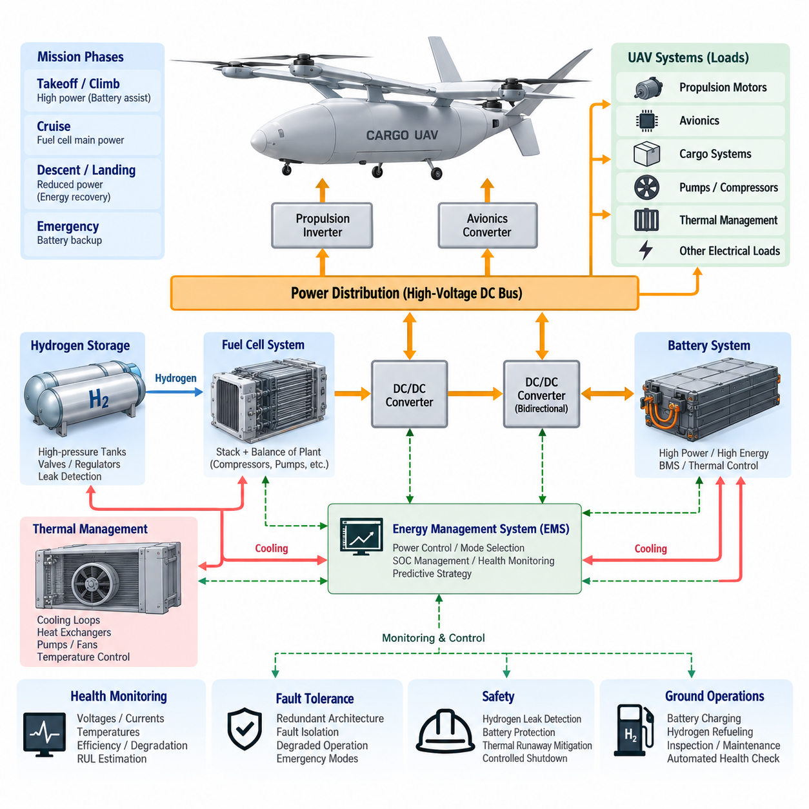
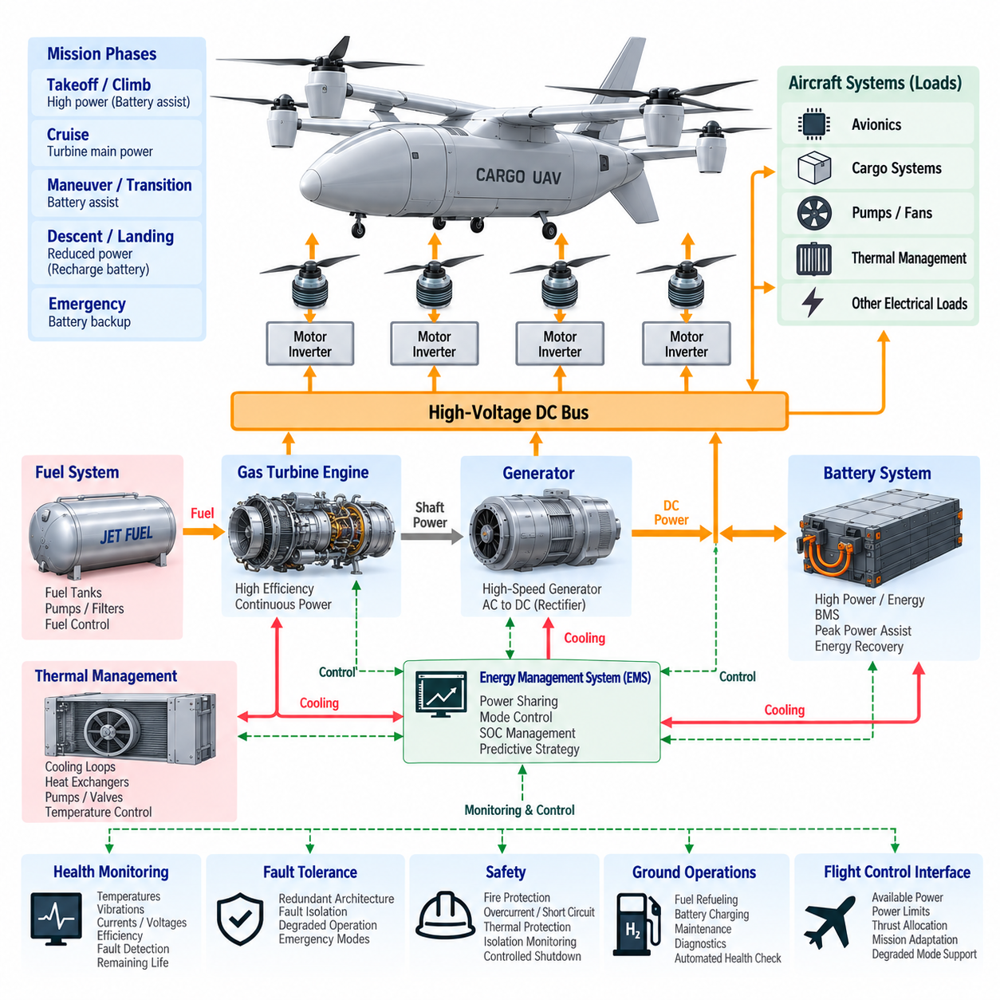
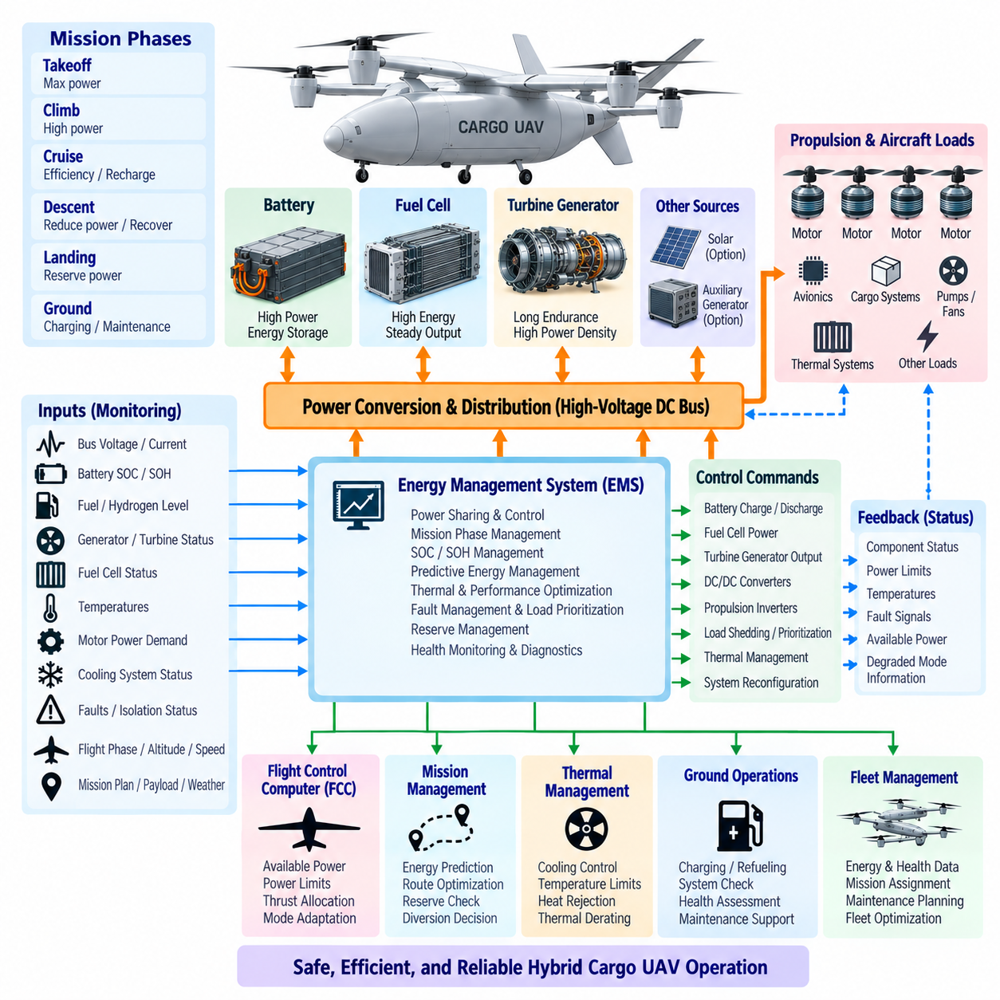
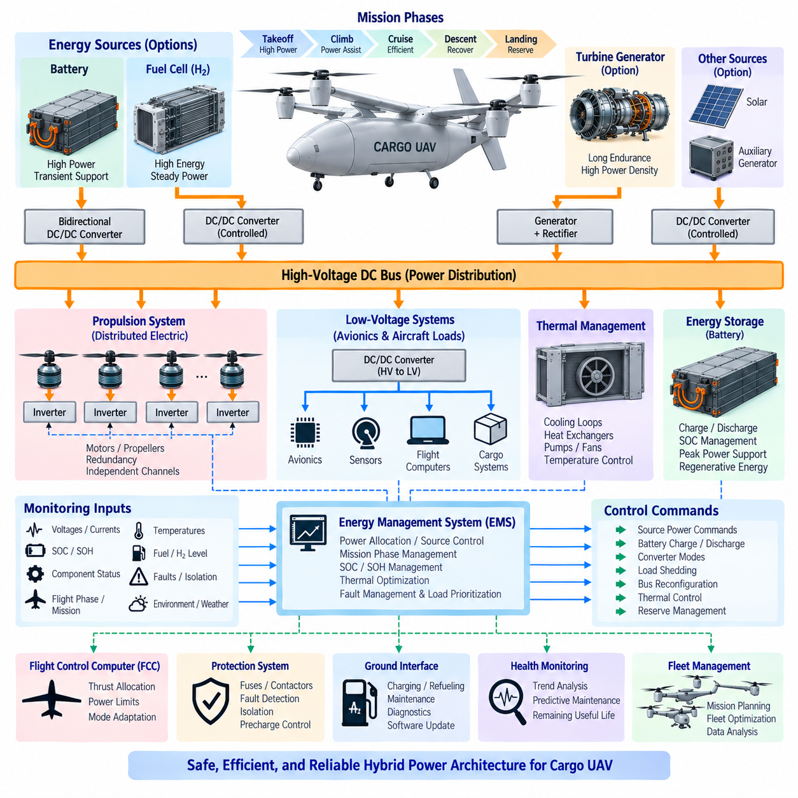
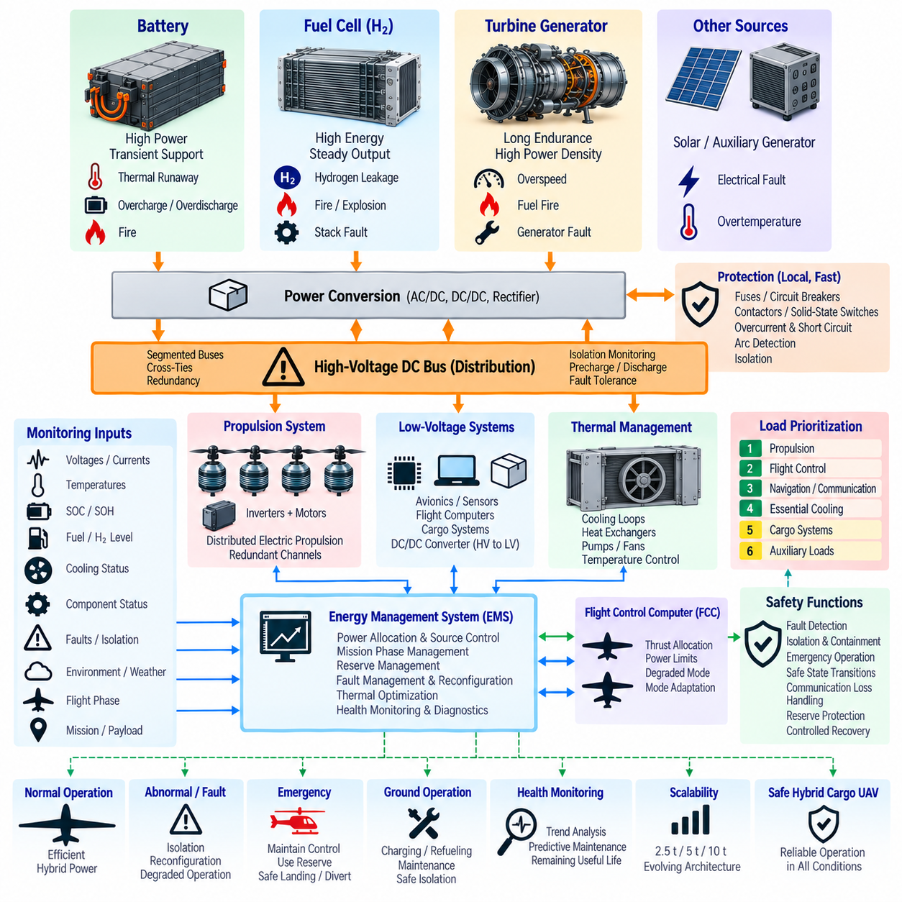

**Volume 18. Cargo UAV Architecture**

# Chapter 08. Hybrid Power System

## 08.01. Battery-Fuel Cell Hybrid

{width="7.268055555555556in" height="7.268055555555556in"}

A battery--fuel cell hybrid power system combines the high specific power and rapid transient response of electrochemical batteries with the high specific energy and long-duration operating capability of hydrogen fuel cells. In a cargo UAV, this combination addresses one of the central limitations of pure battery propulsion: increasing mission range normally requires additional battery mass, which directly reduces payload capability and can create a diminishing-return cycle as aircraft weight grows.

The fuel cell normally serves as the principal energy-producing source during sustained flight, converting hydrogen and oxygen electrochemically into electrical power while producing water and heat as primary by-products. The battery operates as a complementary power buffer rather than merely a secondary energy store. It can supply rapid power during takeoff, vertical climb, acceleration, maneuvering, gust rejection, and emergency conditions where propulsion demand changes faster than the fuel-cell system can efficiently respond.

This division between energy and power is fundamental to hybrid sizing. Fuel-cell capacity should be selected primarily around continuous cruise demand and mission energy requirements, while battery capacity and discharge capability should reflect peak propulsion loads, transient duration, reserve requirements, and emergency operation. Designing both sources for the maximum instantaneous load would unnecessarily increase mass, cost, cooling requirements, and installation volume, reducing the principal advantages of hybridization.

The electrical architecture typically connects the fuel-cell stack to a regulated high-voltage DC bus through a DC/DC converter. The battery may be connected through a bidirectional DC/DC converter or, in some architectures, directly to a compatible DC bus. Propulsion inverters, motors, avionics converters, pumps, compressors, thermal-management equipment, cargo systems, and other electrical loads then receive controlled power through the aircraft power-distribution network.

A bidirectional battery interface provides significant control flexibility because battery charge and discharge currents can be managed independently of instantaneous DC-bus conditions. During a high-power event, the battery supplements fuel-cell output and stabilizes bus voltage. When propulsion demand decreases, excess fuel-cell capacity can recharge the battery. This architecture enables the Energy Management System to control power flow while maintaining battery state of charge within an operationally desirable region.

Fuel-cell response characteristics differ fundamentally from those of batteries. A battery can change electrical output extremely rapidly, whereas a fuel-cell system depends on hydrogen delivery, air compression, membrane conditions, temperature, pressure, humidity, and balance-of-plant dynamics. Aggressive load changes can reduce efficiency or accelerate degradation. The battery therefore decouples fast propulsion dynamics from slower fuel-cell dynamics, allowing the fuel cell to operate within a smoother and more efficient power envelope.

Hydrogen storage becomes a major aircraft-level design issue because energy capacity cannot be evaluated independently from tanks, regulators, valves, piping, structural protection, leak detection, ventilation, and refueling interfaces. High-pressure gaseous hydrogen is a practical candidate for many UAV architectures, but its tank volume and installation constraints affect fuselage packaging and center of gravity. The storage system must therefore be designed together with payload volume, structural load paths, landing gear, propulsion, and aerodynamic configuration.

Thermal management is equally important because the hybrid system contains several heat-generating components with different preferred operating temperatures. Fuel-cell stacks, batteries, DC/DC converters, propulsion inverters, motors, compressors, and avionics cannot necessarily share identical cooling conditions. The aircraft may require coordinated liquid and air cooling loops, heat exchangers, pumps, fans, valves, temperature sensors, and control logic while minimizing aerodynamic drag, parasitic electrical consumption, mass, and failure exposure.

The Energy Management System coordinates these components according to mission phase and system condition. Before takeoff, it verifies battery state of charge, hydrogen availability, stack temperature, isolation status, cooling readiness, and power-system health. During takeoff and climb, battery assistance can satisfy peak demand. During efficient cruise, the fuel cell assumes a larger proportion of propulsion power while simultaneously maintaining an appropriate battery energy reserve for landing, diversion, or abnormal events.

During descent or other low-power phases, the control strategy can reduce fuel-cell output while preserving stack operating stability and battery charge limits. If regenerative energy is available from the propulsion architecture, the battery provides a natural destination for recovered electrical energy, subject to charge acceptance, temperature, voltage, and state-of-charge constraints. The EMS must prevent situations in which excessive regeneration or fuel-cell generation drives the battery or DC bus outside permissible limits.

Hybrid control should therefore be predictive rather than purely reactive. Mission distance, payload mass, altitude profile, wind, temperature, diversion requirements, remaining hydrogen, battery state of charge, component degradation, and expected landing energy can be considered when determining the desired fuel-cell operating point. A mission-aware controller can deliberately preserve battery reserve early in flight instead of discovering near the destination that insufficient transient or emergency power remains.

Fault tolerance is especially important for cargo UAV applications because electrical propulsion may contain multiple motors whose continued operation determines controllability. A hybrid architecture should avoid making the fuel cell, battery, DC/DC converter, cooling loop, or common DC bus an uncontrolled single point of failure. Segmented buses, redundant contactors, isolation devices, cross-ties, independent monitoring channels, and selectively redundant power converters can allow healthy sections to continue supplying critical propulsion and avionics loads after a localized failure.

A fuel-cell failure does not necessarily require immediate loss of propulsion if the battery is sized to support a defined emergency flight period. Conversely, a battery fault may permit continued reduced-power operation from the fuel cell if electrical isolation and propulsion topology support it. The useful design question is therefore not simply whether redundancy exists, but which degraded flight states remain achievable after each credible fault and how long the aircraft can safely maintain them.

Hydrogen-related failures require a distinct safety strategy. Pressure anomalies, leakage, valve malfunction, ventilation failure, abnormal temperature, and sensor disagreement must be detected before they develop into hazardous conditions. Hydrogen equipment should be physically and functionally separated from ignition-sensitive electronics where practical, and shutdown logic should isolate the affected storage or supply section without unnecessarily disabling unrelated electrical systems. Detection, containment, ventilation, and controlled isolation form complementary protection layers.

Battery safety remains equally critical because hybridization does not eliminate thermal runaway, internal short circuit, overcurrent, overcharge, cell imbalance, or insulation faults. The Battery Management System monitors cell voltage, current, temperature, state of charge, state of health, and isolation condition, while contactors and protection devices disconnect unsafe sections. Battery placement and enclosure design should also prevent a localized thermal event from immediately propagating toward hydrogen storage, flight computers, or redundant propulsion channels.

System sizing requires optimization across mission energy, peak power, payload, range, reserve, thermal conditions, and component mass. Increasing fuel-cell rating reduces battery assistance but enlarges the stack and balance-of-plant system. Increasing battery capacity improves transient capability and emergency endurance but adds substantial mass. Increasing hydrogen capacity extends range but increases tank mass and volume. The optimum solution is therefore a mission-level compromise rather than the maximum possible size of any individual component.

For heavy cargo UAVs, this optimization becomes progressively more important because propulsion power can vary dramatically among vertical takeoff, climb, transition, cruise, descent, and landing. A hybrid system can exploit these differences by assigning high-energy-duration operation to the fuel cell and short-duration high-power operation to the battery. This makes hybridization particularly attractive for aircraft whose mission requires both electrically driven propulsion and significantly longer endurance than practical battery-only configurations can provide.

Health monitoring should extend beyond conventional voltage and current supervision. Fuel-cell stack voltage dispersion, membrane condition indicators, hydrogen consumption, compressor performance, coolant temperatures, converter efficiency, battery resistance, cell imbalance, insulation resistance, and thermal trends can be combined into system-level health estimates. These estimates support remaining-energy prediction, remaining-useful-life assessment, maintenance planning, and early identification of gradual degradation before it becomes an in-flight fault.

The hybrid system must also interface closely with the Flight Control Computer and mission-management functions. Available propulsion power is not always constant because it depends on battery temperature, state of charge, fuel-cell health, hydrogen pressure, cooling capability, altitude, and component limitations. The power system should therefore communicate real-time power capability and degraded-mode constraints so that flight control and mission planning can adapt trajectory, climb rate, speed, payload assumptions, or landing strategy.

Ground operations are part of the architecture rather than an external consideration. Battery charging, hydrogen refueling, leak inspection, pressure verification, thermal conditioning, maintenance access, electrical isolation, and emergency response must be incorporated into operational procedures. Turnaround time depends on how effectively these processes can be performed in parallel while maintaining safety. Standardized service interfaces and automated health checks can reduce human error and improve fleet availability for logistics operations.

A mature battery--fuel cell hybrid architecture ultimately functions as an integrated aircraft energy system rather than two independent power sources connected together. Its effectiveness depends on coordinated electrical distribution, hydrogen storage, thermal management, power electronics, battery management, fuel-cell control, fault isolation, mission prediction, and flight-control interaction. Proper integration allows the cargo UAV to combine high transient propulsion power with extended endurance while maintaining sufficient energy reserve and fault tolerance for safety-critical operation.

## 08.02. Turbine-Electric Hybrid

{width="7.268055555555556in" height="7.268055555555556in"}

A turbine--electric hybrid propulsion system combines the high energy density and rapid refueling capability of aviation fuel with electrically driven propulsion. Instead of mechanically connecting a gas turbine directly to propellers or rotors, the turbine drives an electrical generator. Generated electrical power is distributed through a high-voltage network to propulsion motors, energy-storage systems, avionics, and auxiliary loads, creating greater freedom in propulsion placement and aircraft configuration.

The gas turbine acts primarily as the aircraft's continuous energy-conversion source. Chemical energy stored in aviation fuel is converted into shaft power and then into electrical power through a high-speed generator. Because the turbine can operate independently of individual propulsion motors, its rotational speed can be optimized around an efficient operating region rather than continuously following rotor-speed commands, potentially improving efficiency and simplifying propulsion-power coordination during steady flight.

Electrical propulsion motors convert distributed electrical energy back into mechanical thrust at the propellers or rotors. This arrangement separates the location of the turbine from the locations where thrust must be generated. A cargo UAV can therefore employ multiple electrically driven propulsion units without requiring complex mechanical shafts, gearboxes, and transmissions connecting every rotor to a central engine, enabling distributed electric propulsion and more flexible aerodynamic integration.

A practical architecture normally includes the turbine engine, generator, rectifier or active power converter, high-voltage DC bus, propulsion inverters, electric motors, battery system, power-distribution units, and supervisory control. The generator output is conditioned before entering the common electrical bus, where power can be distributed to multiple propulsion channels. Local inverters then independently control motor torque and speed according to commands from the flight-control system.

The battery provides an important complementary function even when the turbine generator supplies most mission energy. During vertical takeoff, rapid climb, acceleration, transition, or other peak-power conditions, propulsion demand may exceed the preferred continuous rating of the turbine generator. The battery can temporarily supply the difference, allowing the turbine and generator to be sized closer to sustained mission power instead of the aircraft's short-duration maximum electrical demand.

During cruise, the turbine generator can become the dominant electrical source because propulsion demand is usually more stable than during takeoff or maneuvering. If generator capacity exceeds instantaneous aircraft demand, controlled surplus power may recharge the battery. This enables the Energy Management System to restore battery state of charge and preserve electrical reserve for landing, go-around, diversion, emergency maneuvering, or temporary turbine-generator loss later in the mission.

The high-voltage DC bus forms the electrical backbone of the hybrid architecture. It allows generator power, battery power, and potentially other sources to be combined before distribution to propulsion and aircraft loads. Bus voltage must remain within controlled limits despite rapid motor transients, generator variations, switching events, regenerative conditions, and faults. Power converters therefore provide voltage regulation, current control, electrical isolation where required, and coordinated protection.

Energy management determines how turbine-generator power and battery power are shared throughout the mission. The controller considers propulsion demand, battery state of charge, turbine efficiency, generator limits, temperatures, fuel remaining, flight phase, reserve requirements, and component health. Rather than continuously forcing the turbine to follow every transient load, the system can maintain relatively stable generation while the battery absorbs short-term differences between generated and demanded electrical power.

Predictive energy management can further improve mission efficiency. Flight distance, payload mass, altitude, weather, expected hover duration, cruise speed, diversion routes, and landing requirements can be incorporated into power scheduling. The controller may intentionally use battery energy during high-demand phases and recharge it during efficient turbine operation, while maintaining sufficient reserve to satisfy abnormal and emergency flight requirements throughout the remaining mission.

Thermal management becomes a major design challenge because energy passes through several conversion stages. Heat is generated by the turbine, generator, rectifier, DC/DC converters, propulsion inverters, motors, batteries, and electrical distribution equipment. These components operate at different temperature levels and may require separate cooling approaches. Air cooling, liquid cooling, fuel-based heat exchange, dedicated radiators, pumps, and controlled airflow can be integrated into an aircraft-level thermal architecture.

The turbine itself introduces additional thermal and packaging constraints compared with a battery-only aircraft. Hot exhaust flow, combustion-zone temperatures, intake requirements, vibration, acoustic emissions, and fire protection influence installation location. The turbine and exhaust system must be separated appropriately from batteries, wiring, composite structures, avionics, hydrogen-sensitive equipment if present, and cargo areas while maintaining acceptable aerodynamic performance and maintenance accessibility.

Fuel storage provides a significant endurance advantage because liquid aviation fuel offers much higher practical mission energy per storage volume than current battery systems. Increasing range can therefore be achieved without the same proportional battery-mass growth encountered in pure electric aircraft. This characteristic makes turbine--electric architectures particularly relevant as cargo UAV size, payload, range, and mission duration increase from short-range electric logistics toward regional and longer-distance autonomous cargo transportation.

Hybridization also enables turbine downsizing. If the battery supports temporary peak loads, the turbine generator does not necessarily need to match maximum takeoff power. It can instead be sized according to continuous cruise power, thermal limits, battery recharge requirements, reserve strategy, and degraded-operation needs. The optimum rating depends on mission profile because excessive turbine capacity adds mass, while insufficient capacity can cause excessive battery cycling or inadequate sustained power.

Distributed electric propulsion creates important opportunities for redundancy. Multiple propulsion motors can be supplied through electrically separated channels rather than a single mechanical transmission. Segmented DC buses, independent inverters, redundant contactors, multiple power-distribution units, and controlled bus cross-ties can prevent a localized electrical failure from disabling all propulsion. The architecture should ensure that a single fault does not automatically propagate across otherwise healthy propulsion channels.

The turbine-generator set itself requires careful fault analysis because it can become a major common energy source. Generator faults, turbine shutdown, converter failure, lubrication problems, excessive temperature, fuel-system faults, or control-system failures must be detected rapidly. A sufficiently capable battery can provide temporary emergency propulsion after turbine-generator loss, allowing controlled landing, diversion, or transition to a predefined degraded flight mode rather than immediate total power loss.

Conversely, battery failure should not necessarily terminate the mission if the turbine generator and electrical architecture can sustain essential propulsion independently. Isolation contactors and protection devices should disconnect the failed battery section while preserving generator operation and healthy propulsion channels. Designing both directions of degraded operation provides stronger fault tolerance than treating the battery merely as a passive backup connected permanently to a common electrical bus.

Protection coordination is essential because high-power cargo UAV propulsion networks can carry substantial DC currents and fault energy. Contactors, circuit breakers, fuses, solid-state protection devices, isolation monitoring, arc detection, current sensors, and converter-level protection must operate selectively. A fault in one motor, inverter, cable, or distribution branch should be isolated quickly while minimizing disturbance to the remaining bus sections and flight-critical electrical loads.

The turbine--electric system must exchange real-time information with the Flight Control Computer. Available electrical power depends on turbine condition, generator rating, battery state of charge, converter temperatures, cooling capability, altitude, ambient temperature, and active faults. The propulsion controller should communicate current and predicted power limits so that flight control can adapt thrust allocation, climb rate, speed, maneuver authority, or landing strategy before electrical limitations become critical.

Motor-level control can exploit the flexibility of electrical propulsion by allocating thrust independently among propulsion units. If one motor or inverter becomes unavailable, remaining motors may receive redistributed commands within their thermal and electrical limits. This capability is especially valuable in multi-rotor, lift-plus-cruise, and distributed-propulsion cargo UAV configurations, where propulsion redundancy can be coordinated with flight-control reconfiguration to maintain controllability after selected failures.

Health monitoring should cover the complete energy-conversion chain rather than individual components in isolation. Turbine temperatures, shaft speed, vibration, fuel flow, generator current, winding temperature, converter efficiency, DC-bus stability, motor temperature, battery resistance, insulation condition, and cooling performance can be combined into integrated health estimates. Trend analysis supports predictive maintenance and can identify efficiency deterioration before it develops into a mission-threatening failure.

System efficiency must be evaluated across the entire conversion path. Fuel energy is converted through turbine shaft power, generator output, electrical conversion, distribution, inverter switching, motor torque, and finally propulsive thrust. Losses at each stage generate heat and reduce effective mission efficiency. Consequently, selecting a highly efficient motor alone does not guarantee an efficient aircraft; optimization must consider the complete fuel-to-thrust energy chain under realistic mission conditions.

Ground operations include liquid-fuel servicing, battery charging, electrical isolation, cooling-system inspection, turbine maintenance, generator diagnostics, and automated health verification. Compared with hydrogen systems, conventional liquid fuel may simplify infrastructure availability, but turbine maintenance and high-temperature components introduce different operational requirements. Modular generator units, accessible power electronics, standardized electrical interfaces, and condition-based maintenance can reduce turnaround time and improve fleet availability.

For progressively larger cargo UAVs, turbine--electric propulsion offers a scalable transition beyond practical battery-only endurance. Smaller aircraft may rely primarily on batteries, intermediate platforms can use hybrid generation, and heavy long-range aircraft can make the turbine generator the dominant mission-energy source while retaining batteries for transient power and emergency reserve. This creates a natural architectural pathway from electric eVTOL systems toward regional autonomous cargo aircraft.

A mature turbine--electric hybrid architecture is therefore an integrated energy, propulsion, thermal, safety, and flight-control system rather than a turbine simply connected to a generator. Its value comes from combining fuel-based endurance with electrically distributed thrust, controllable power sharing, battery-supported peak capability, and fault-tolerant propulsion. Proper integration can provide the range, payload scalability, redundancy, and operational flexibility required for future multi-ton cargo UAV platforms.

## 08.03. Energy Management System (EMS)

{width="7.268055555555556in" height="7.268055555555556in"}

An Energy Management System (EMS) is the supervisory control layer that coordinates generation, storage, distribution, and consumption of electrical energy within a hybrid cargo UAV. It determines how power should be shared among batteries, fuel cells, turbine generators, and other sources while maintaining propulsion capability, electrical stability, efficiency, thermal limits, and sufficient energy reserve throughout the complete mission.

The EMS operates above individual component controllers rather than replacing them. Battery Management Systems, fuel-cell controllers, turbine-generator controllers, propulsion inverters, DC/DC converters, and Power Distribution Units retain their local protection and regulation functions. The EMS receives their operating states and constraints, interprets aircraft-level requirements, and generates coordinated power commands that allow these independently controlled subsystems to operate as one integrated energy architecture.

Real-time monitoring provides the foundation for EMS decision making. Important inputs include DC-bus voltage, source currents, battery State of Charge, battery State of Health, fuel quantity, hydrogen availability, generator output, fuel-cell condition, converter temperatures, motor demand, cooling capacity, insulation status, and active faults. Flight phase, payload, altitude, airspeed, ambient conditions, and mission progress provide additional context for determining the appropriate energy strategy.

Power balancing is one of the primary EMS functions. At every operating point, generated and stored electrical power must satisfy propulsion and aircraft loads while maintaining DC-bus stability. During rapid load increases, the EMS can command the battery to supplement a slower primary source. During low-demand periods, surplus generator or fuel-cell output can recharge the battery, provided voltage, temperature, charging-current, and State-of-Charge limits remain satisfied.

Mission-phase management allows the EMS to apply different control objectives during takeoff, climb, cruise, descent, landing, and ground operation. Takeoff may prioritize maximum available propulsion power, while cruise emphasizes energy efficiency and restoration of battery reserve. Descent can reduce primary-source output or accept recoverable energy, whereas landing strategy preserves sufficient electrical margin for hover, go-around, diversion, or other high-power contingencies.

For a battery--fuel cell hybrid architecture, the EMS normally treats the fuel cell as a relatively steady energy source and the battery as a dynamic power buffer. Fuel-cell commands should avoid unnecessary rapid load variations that reduce efficiency or accelerate degradation. The battery absorbs short-duration differences between propulsion demand and fuel-cell generation, enabling the stack and its balance-of-plant equipment to remain within a more stable operating region.

In a turbine--electric hybrid architecture, the EMS performs a similar coordination function but considers turbine efficiency, generator rating, fuel consumption, rotational dynamics, thermal state, and battery reserve. The turbine generator can supply sustained mission power while the battery supports peak propulsion loads. During efficient steady operation, generator output may exceed immediate demand so that controlled surplus energy restores battery State of Charge before later high-power mission phases.

State-of-Charge management cannot be based solely on maintaining the highest possible battery charge level. Excessively high State of Charge can limit the ability to accept regenerated or surplus energy, while excessively low State of Charge reduces emergency and transient power capability. The EMS therefore maintains a target operating window that varies according to mission phase, remaining distance, expected power demand, charging opportunities, battery temperature, and reserve policy.

State-of-Health information allows the control strategy to adapt as components age. A degraded battery may have lower usable capacity or reduced peak-current capability, while an aging fuel cell or turbine generator may experience efficiency or power limitations. Rather than assuming nominal performance, the EMS can apply updated power limits and reserve margins, allowing mission planning and propulsion management to reflect the actual condition of installed energy-system components.

Predictive energy management extends control beyond instantaneous measurements. Mission route, payload mass, altitude profile, wind, temperature, expected hover time, cruise speed, diversion locations, and landing requirements can be used to forecast future energy demand. The EMS can then schedule generation and storage proactively, preserving battery energy before anticipated high-power events and operating the primary energy source near efficient regions whenever mission conditions permit.

The EMS should continuously estimate remaining usable energy rather than simply reporting fuel quantity or battery percentage. Battery energy, fuel or hydrogen reserves, conversion efficiencies, thermal derating, component health, and predicted mission consumption must be considered together. This integrated estimate provides a more meaningful indication of whether the aircraft can complete its route, reach an alternate landing location, or maintain required emergency reserves.

Reserve-energy management is particularly important for autonomous cargo aircraft because a technically reachable destination may still be operationally unacceptable if insufficient energy remains for contingencies. The EMS can maintain dedicated margins for landing, go-around, diversion, degraded propulsion, communication loss, adverse wind, or unexpected holding. Reserve thresholds should influence mission continuation decisions before the aircraft enters a condition from which safe alternatives become limited.

Thermal constraints must be incorporated directly into energy allocation. Battery discharge capability, generator output, converter current, motor torque, and fuel-cell performance can all be reduced by excessive temperature. The EMS therefore exchanges information with the Thermal Management System and may reduce power, redistribute loads, modify charging, or change source operating points before thermal limits are exceeded. Energy optimization without thermal awareness can produce an operationally unsafe command.

The high-voltage DC bus provides a common electrical interface through which the EMS observes and influences system behavior. Sudden propulsion changes, source transitions, converter faults, or regenerative power can disturb bus voltage. Coordinated converter commands can stabilize the bus while preventing excessive current circulation between sources. The EMS must distinguish normal transient behavior from abnormal conditions requiring isolation, load shedding, or transition into a degraded operating mode.

Load prioritization becomes essential when available generation is lower than total electrical demand. Propulsion, flight control, navigation, communication, safety monitoring, and essential thermal equipment receive higher priority than noncritical cargo or convenience loads. The EMS can command staged load shedding to preserve flight-critical functions. This strategy converts an energy shortage from an uncontrolled system collapse into a managed reduction of nonessential capability.

Fault management requires close coordination between the EMS and local protection systems. Fast electrical protection should remain local because overcurrent, short-circuit, isolation, or converter faults may require responses faster than a supervisory controller can provide. After immediate isolation occurs, the EMS evaluates the remaining architecture, identifies available sources and buses, recalculates power capability, and establishes a stable degraded configuration compatible with continued safe flight.

A segmented power architecture increases the effectiveness of EMS-based fault recovery. Independent propulsion buses, redundant contactors, cross-ties, multiple converters, and isolated battery or generation channels can provide alternative power paths. The EMS determines whether healthy sections should remain separated or be interconnected after a failure. Reconfiguration must consider not only electrical availability but also fault propagation risk, thermal loading, remaining energy, and propulsion controllability.

Communication with the Flight Control Computer is fundamental because energy availability directly constrains achievable thrust. The EMS should provide current and predicted power capability, temporary peak-power availability, continuous-power limits, reserve state, and degraded-mode restrictions. Flight control can use this information to modify thrust allocation, climb rate, acceleration, airspeed, maneuvering, or landing strategy rather than requesting power that the electrical system cannot safely deliver.

The mission-management system can use EMS predictions at a higher level. If projected energy falls below required reserve, the aircraft may reduce speed, change altitude, shorten the route, select an alternate destination, or initiate an early landing. This creates a closed relationship between energy management and autonomous mission planning, where power-system constraints become active inputs to navigation and operational decision making instead of passive cockpit-style indications.

Health monitoring and diagnostics provide the data required for long-term optimization. Trends in battery resistance, cell imbalance, generator efficiency, fuel-cell stack voltage, turbine temperature, converter losses, insulation resistance, cooling performance, and abnormal current patterns can reveal gradual degradation. The EMS can record these trends across missions and provide information for predictive maintenance, component replacement, fleet reliability analysis, and remaining-useful-life estimation.

Energy-management software must itself be designed as a safety-relevant function. Invalid sensor values, communication loss, corrupted commands, processor faults, and inconsistent subsystem states must not result in uncontrolled power transitions. Plausibility checking, command limits, watchdog monitoring, fallback strategies, redundant measurements, deterministic state transitions, and clearly defined authority boundaries between the EMS and local controllers are therefore important architectural principles.

Ground operation represents another EMS operating mode. Before flight, the system can coordinate battery charging, thermal conditioning, generator checks, fuel or hydrogen verification, insulation tests, and automated health assessment. After landing, it can record energy consumption, component temperatures, fault history, and degradation indicators. These records support maintenance decisions and improve future mission-energy predictions using accumulated operational data.

For a fleet of cargo UAVs, EMS information can also support fleet-level planning. Aircraft with different battery health, fuel state, thermal condition, or component degradation may have different effective mission capability even when they share the same physical configuration. Energy and health estimates can therefore help assign suitable aircraft to missions, schedule charging or refueling, plan maintenance, and reduce unnecessary removal of healthy vehicles from service.

The ultimate objective of the EMS is not simply to minimize energy consumption. It must balance efficiency, propulsion performance, component life, thermal stability, reserve energy, fault tolerance, and mission completion probability. A mature EMS transforms batteries, fuel cells, turbine generators, converters, propulsion motors, and thermal systems from separate components into a coordinated aircraft-level energy system capable of supporting safe and scalable hybrid cargo UAV operation.

## 08.04. Hybrid Power Architecture

{width="7.268055555555556in" height="7.268055555555556in"}

A hybrid power architecture integrates multiple energy sources, storage devices, power converters, distribution networks, propulsion loads, and supervisory controllers into a unified aircraft electrical system. For a cargo UAV, the objective is not simply to combine two power sources, but to allocate energy and power according to mission requirements while maintaining efficiency, redundancy, thermal stability, controllability, and safe degraded operation after credible failures.

The architecture can support different primary energy sources depending on aircraft size and mission range. A battery--fuel cell configuration combines high-energy hydrogen generation with high-power battery buffering, while a turbine--electric configuration combines liquid-fuel endurance with distributed electric propulsion. The underlying electrical architecture can remain conceptually similar, allowing batteries, generators, and fuel cells to interface through controlled power converters and common distribution networks.

A high-voltage DC bus typically forms the central power backbone because propulsion motors require substantial electrical power and distributed conversion can be efficiently implemented from a common DC network. Fuel cells or generators feed the bus through regulated converters or rectifiers, while batteries may connect through bidirectional DC/DC converters. Propulsion inverters convert DC power into controlled motor power, and additional converters supply avionics, sensors, actuators, cargo equipment, and low-voltage systems.

The architecture should distinguish between energy sources and power sources. Fuel cells and turbine generators are well suited to sustained energy production, whereas batteries can deliver rapid transient power. During takeoff, climb, transition, aggressive maneuvering, or emergency operation, batteries can supplement the primary source. During cruise or other stable operating phases, the primary source can supply most propulsion demand and potentially restore battery State of Charge using available surplus capacity.

Power-source sizing must therefore be performed at aircraft and mission level. The primary generator or fuel-cell system does not necessarily need to equal maximum propulsion power if the battery can reliably support short-duration peaks. Conversely, the battery does not need to store the complete mission energy when a continuous energy source is available. Proper hybridization reduces unnecessary mass by assigning continuous energy and transient power requirements to components best suited to each function.

A bidirectional battery interface provides significant architectural flexibility. Controlled charging and discharging allow the battery to stabilize the DC bus, support transient propulsion loads, absorb surplus generation, and potentially accept regenerative energy. The converter can also limit battery current independently of bus conditions and isolate the battery during faults. These capabilities make the battery an actively controlled element of the aircraft power network rather than a passive backup source.

Power distribution should be segmented according to safety and propulsion requirements. A single common bus may simplify the architecture but can create vulnerability to bus faults. Multi-ton cargo UAVs can instead employ left/right, forward/aft, or propulsion-group bus segments with controlled cross-ties. Healthy segments can remain electrically isolated during normal operation or be interconnected when additional power transfer is required, depending on the selected redundancy philosophy.

Distributed electric propulsion benefits directly from this segmented architecture. Each propulsion group can contain dedicated inverters, motors, protection devices, and local monitoring. A failure in one inverter, motor, cable, or bus section should not automatically disable unrelated propulsion channels. Flight-control allocation and electrical reconfiguration can work together so that remaining motors provide achievable thrust within their electrical, mechanical, and thermal limits after a localized failure.

The Energy Management System provides supervisory coordination across the hybrid architecture. It receives information from batteries, fuel cells, turbine generators, converters, distribution units, propulsion systems, thermal controllers, and aircraft computers. Based on mission phase and component condition, it determines source power commands, battery charge or discharge targets, converter modes, reserve margins, load priorities, and appropriate electrical configurations for normal and degraded operation.

Local controllers retain responsibility for fast component-level regulation and protection. A Battery Management System protects battery cells, generator controllers regulate generation, fuel-cell controllers manage stack operation, and motor inverters regulate torque. The supervisory EMS should not replace these deterministic local functions. Instead, hierarchical control separates fast protection from slower aircraft-level optimization, reducing unnecessary dependence on a single central software function.

The Flight Control Computer and power architecture must exchange information continuously. Flight control determines the thrust required to achieve aircraft motion, while the power system determines how much electrical power can safely be delivered. Available power may change with State of Charge, fuel availability, altitude, temperature, cooling capacity, component degradation, or active faults. Sharing these constraints enables thrust commands to remain consistent with actual energy-system capability.

A separate low-voltage electrical domain normally supplies flight computers, navigation equipment, communication systems, sensors, control electronics, valves, relays, and safety devices. High-voltage propulsion power can be converted through redundant DC/DC converters into 28 V, 24 V, 12 V, or another selected aircraft low-voltage level. Critical avionics should retain power even when sections of the propulsion network are isolated, preventing a propulsion fault from unnecessarily disabling command and control functions.

Protection coordination is essential throughout both high- and low-voltage networks. Fuses, contactors, circuit breakers, solid-state switches, isolation monitors, current sensors, and converter protection must detect and isolate faults selectively. Protection thresholds and response times should prevent cable or component damage while avoiding unnecessary disconnection of healthy equipment. High-energy DC faults require particular attention because they can produce sustained arcs and rapid thermal damage.

Precharge circuitry is normally required when connecting batteries or generators to high-voltage buses containing large inverter and converter capacitors. Direct connection can create severe inrush current, contactor damage, and bus disturbance. Controlled precharge raises bus voltage gradually before the main contactors close. The architecture should monitor precharge voltage, timing, insulation, and contactor state so abnormal connection conditions are detected before full propulsion power becomes available.

Electrical isolation monitoring provides another important safety layer. Insulation degradation in cables, motors, converters, batteries, generators, or cooling systems can create hazardous leakage paths. Continuous insulation monitoring allows developing faults to be detected before they become severe. The response can range from maintenance notification to channel isolation or immediate shutdown depending on fault magnitude, location, aircraft operating state, and remaining redundant capability.

Thermal architecture must be developed together with electrical architecture because electrical power capability depends strongly on temperature. Batteries, generators, fuel cells, inverters, motors, and converters produce heat at different rates and temperature levels. Cooling loops, pumps, heat exchangers, fans, radiators, and temperature sensors therefore become power-system components. The EMS can coordinate thermal limits with power allocation and prevent overheating through controlled derating.

The hybrid architecture should support multiple operating modes rather than one fixed power-flow configuration. Normal flight, takeoff boost, cruise optimization, battery recharge, ground charging, maintenance, emergency battery operation, primary-source-only operation, load shedding, and degraded propulsion may each require different contactor and converter states. Clearly defined state transitions prevent conflicting commands and ensure that power-network reconfiguration occurs predictably.

Emergency operation should be designed from defined aircraft-level safety objectives. Loss of a fuel cell or turbine generator may trigger battery-supported flight, while battery isolation may leave the primary generator supplying reduced propulsion capability. Loss of one bus can cause selected cross-ties to close or loads to transfer to healthy sections. The required emergency endurance depends on whether the aircraft must continue flight, divert, perform a controlled landing, or only maintain essential systems temporarily.

Load prioritization protects flight-critical capability when available power becomes limited. Propulsion, Flight Control Computers, navigation, communication, essential actuators, and safety monitoring normally receive the highest priority. Thermal equipment required to preserve propulsion may also be critical. Cargo conditioning, nonessential payload electronics, auxiliary equipment, and convenience loads can be reduced or disconnected through staged load shedding before essential flight functions are compromised.

Health monitoring should span the complete power architecture. Voltage, current, temperature, insulation resistance, contactor cycles, converter efficiency, battery degradation, generator condition, fuel-cell performance, motor temperature, cooling behavior, and fault history provide evidence of system health. Combining these measurements supports early fault detection, predictive maintenance, remaining-useful-life estimation, and improved mission planning based on actual rather than nominal aircraft capability.

Physical installation must preserve the logical redundancy designed into the electrical diagrams. Two redundant buses provide limited benefit if their cables share the same vulnerable routing, connector, cooling path, or structural zone. Power channels should therefore consider physical separation, fire zones, environmental exposure, electromagnetic compatibility, maintenance access, connector protection, and common-cause failures when translating the electrical schematic into an aircraft installation.

Ground interfaces form another part of the architecture. Battery charging, fuel or hydrogen servicing, external electrical power, maintenance isolation, diagnostics, software updates, cooling-system servicing, and automated preflight checks require standardized interfaces. Ground mode should prevent unintended propulsion activation while allowing individual energy-system components to be tested. Recorded operational data can also be transferred to fleet-management and maintenance systems during turnaround.

As cargo UAV size increases, the same architectural principles can scale while energy-source emphasis changes. A smaller 2.5-ton-class platform may favor battery-dominant electric propulsion, a 5-ton-class aircraft may benefit from stronger hybrid generation, and a future 10-ton-class long-range platform can make turbine-electric generation increasingly dominant. Common DC distribution, modular converters, distributed propulsion, hierarchical control, and standardized interfaces can support this evolutionary path.

A mature hybrid power architecture therefore integrates energy generation, electrical storage, conversion, distribution, propulsion, thermal management, protection, avionics power, health monitoring, and flight control as one coordinated aircraft system. Its success is measured not only by efficiency or range, but by whether the aircraft can deliver required thrust, preserve critical functions, isolate failures, manage energy reserves, and complete or safely terminate its mission under both normal and degraded conditions.

## 08.05. Hybrid Power Safety

{width="7.268055555555556in" height="7.268055555555556in"}

Hybrid power safety is an aircraft-level discipline that ensures batteries, fuel cells, turbine generators, converters, high-voltage distribution, propulsion motors, and thermal systems continue operating safely during normal, abnormal, and emergency conditions. Safety must be designed into the architecture from the beginning because combining multiple energy sources creates new interactions, fault paths, stored-energy hazards, and common-cause failure mechanisms that do not exist in simpler single-source systems.

The safety process begins by identifying hazards associated with each energy source and with their integration. Battery thermal runaway, hydrogen leakage, fuel fire, turbine overspeed, generator faults, high-voltage electric shock, DC arcing, converter short circuits, insulation degradation, cooling loss, and unintended propulsion activation represent different hazard classes. Their combinations must also be analyzed because one failure can initiate secondary failures in adjacent energy or propulsion systems.

Functional hazard analysis should determine how power-system failures affect aircraft-level functions rather than considering component damage alone. Complete propulsion-power loss, asymmetric thrust, loss of flight-control power, uncontrolled battery discharge, inability to isolate a failed bus, or incorrect energy-availability information can directly influence continued safe flight. Safety objectives should therefore be derived from the consequences of each failure condition and allocated to appropriate electrical, mechanical, software, and operational protections.

A fundamental principle is the elimination of uncontrolled single points of failure. Critical propulsion should not depend entirely on one battery contactor, converter, generator controller, DC bus, cooling pump, communication link, or software process when its failure could cause catastrophic loss of thrust. Segmented buses, independent propulsion channels, redundant power paths, cross-ties, and physically separated wiring can provide continued capability after selected failures while limiting fault propagation.

Electrical protection must respond faster than supervisory energy-management functions when severe faults occur. Fuses, circuit breakers, contactors, solid-state switches, converter protection, current sensing, and arc detection can isolate short circuits and overcurrent conditions locally. The Energy Management System then evaluates the remaining healthy architecture and establishes a degraded configuration. Separating fast protection from supervisory optimization prevents software latency or communication failure from delaying critical electrical isolation.

High-voltage DC systems require particular attention because substantial stored energy can remain in batteries and DC-link capacitors even after propulsion has stopped. Precharge circuits limit inrush current during startup, while controlled discharge circuits reduce residual voltage after shutdown. High-voltage interlocks, insulation monitoring, contactor-state feedback, service disconnects, and clearly defined maintenance procedures help prevent unintended energization during ground handling, inspection, or emergency response.

Insulation monitoring provides continuous detection of leakage between high-voltage conductors and the aircraft structure or low-voltage systems. Degradation may result from damaged cables, moisture, contamination, motor winding faults, converter failures, coolant leakage, or connector damage. The safety response should depend on fault severity and architecture, ranging from warning and maintenance action to isolation of an affected propulsion channel when continued operation would create unacceptable risk.

Battery safety requires protection at cell, module, pack, and aircraft levels. The Battery Management System monitors voltage, current, temperature, State of Charge, and State of Health while enforcing charge and discharge limits. Fuses and contactors provide electrical isolation, while enclosure design, thermal barriers, venting, propagation resistance, and temperature monitoring address thermal events. A single-cell failure should be prevented from rapidly disabling unrelated propulsion or avionics channels.

Thermal runaway deserves special consideration because battery faults can continue generating heat after electrical isolation. Physical separation, fire-resistant barriers, controlled vent paths, temperature sensing, and propagation mitigation must therefore complement electrical protection. Battery installation should prevent hot gases, flames, conductive debris, or pressure from directly affecting redundant power channels, flight computers, structural elements, fuel systems, hydrogen storage, or critical control wiring.

Fuel-cell aircraft introduce hydrogen-specific hazards that require dedicated detection and containment strategies. Hydrogen leakage can create flammable mixtures in enclosed spaces, so storage tanks, regulators, valves, piping, ventilation paths, and leak sensors must be integrated as a complete safety system. Automatic isolation should stop hydrogen flow when dangerous conditions are detected while preserving unaffected electrical systems whenever continued operation remains safer than complete shutdown.

Hydrogen storage also requires mechanical protection because high-pressure tanks contain significant stored energy. Structural mounting, crash loads, impact protection, pressure relief, thermal exposure, and controlled venting must be considered together. Tank and piping locations should reduce exposure to propulsion failures, battery fires, landing damage, and maintenance errors. Multiple isolation zones can limit the amount of hydrogen released following a localized line, valve, or subsystem failure.

Turbine--electric systems introduce combustion, rotating machinery, and liquid-fuel hazards. Turbine overspeed, excessive exhaust temperature, lubrication loss, fuel leakage, generator seizure, or fire must be detected and controlled. Fire zones, fuel shutoff valves, temperature monitoring, containment, ventilation, and appropriate separation from batteries and avionics reduce propagation risk. Emergency shutdown should isolate fuel without unnecessarily removing electrical power from independent healthy sources.

Thermal management itself becomes safety-critical when cooling capability determines available propulsion power. Failure of a pump, fan, heat exchanger, coolant loop, or temperature sensor can progressively reduce battery, converter, generator, fuel-cell, or motor capability. Redundant cooling paths or graceful power derating may therefore be required. The system should identify thermal degradation early enough for flight control to reduce demand or initiate diversion before propulsion capability becomes insufficient.

Common-cause failures can defeat apparent electrical redundancy and must be considered during physical integration. Two independent power buses are not truly independent if their cables share the same fire zone, connector, cooling loop, structural attachment, software command, or vulnerable routing. Redundant components should therefore be separated where practical and evaluated for shared environmental, mechanical, thermal, electromagnetic, maintenance, manufacturing, and software-related failure mechanisms.

The Energy Management System plays an important role in safety but should operate within bounded authority. It can redistribute power, maintain reserves, perform load shedding, reconfigure buses, and request degraded operating modes, but local protection devices must remain capable of overriding unsafe commands. Sensor plausibility checks, command limits, watchdogs, communication timeout handling, deterministic state machines, and fallback modes help prevent an EMS software or data failure from creating hazardous power transitions.

Communication failures must be treated as defined operating conditions rather than unexpected exceptions. Loss of communication between the EMS, Flight Control Computer, battery controller, generator controller, or propulsion inverter should trigger predetermined local behavior. Components may maintain the last safe operating point, transition to a conservative power limit, or isolate themselves depending on safety analysis. Undefined behavior following network loss can be more dangerous than the original component fault.

The Flight Control Computer requires reliable information about available and predicted electrical power. If a power source fails or thermal derating reduces capacity, the aircraft may need to limit climb, acceleration, maneuvering, or hover duration. The power system should communicate continuous and temporary power limits together with degraded-mode status. Flight control can then redistribute thrust among healthy motors and select commands that remain achievable within the remaining electrical capability.

Load shedding protects critical functions when generation or stored energy becomes insufficient. Propulsion, flight control, navigation, essential communication, safety monitoring, and required cooling normally receive priority. Noncritical cargo systems and auxiliary loads can be disconnected progressively. The sequence should be predetermined and verified so that reducing electrical consumption does not inadvertently remove equipment needed to maintain propulsion, cooling, fault detection, or autonomous landing.

Emergency energy reserve must be treated as a safety resource rather than ordinary usable capacity. The architecture may reserve battery energy for landing after turbine-generator or fuel-cell loss, or preserve fuel for diversion following battery degradation. The EMS should prevent routine optimization from consuming reserves below defined thresholds. Reserve requirements should reflect landing strategy, aircraft configuration, mission environment, alternate landing opportunities, and credible degraded propulsion conditions.

Safe state transitions are essential because hybrid systems can operate in many configurations. Startup, precharge, normal hybrid operation, battery-only operation, generator-only operation, recharge, load shedding, emergency operation, shutdown, and maintenance modes require controlled sequences of contactor and converter commands. Interlocks should prevent incompatible states such as connecting sources at unsuitable voltages or energizing propulsion while maintenance isolation is active.

Fault detection should combine direct thresholds with analytical diagnostics. Overcurrent or overtemperature may require immediate action, while gradual battery resistance growth, generator efficiency loss, insulation degradation, abnormal vibration, cooling deterioration, or fuel-cell voltage imbalance may indicate developing failures. Health monitoring and trend analysis enable maintenance before degradation reaches an operational safety limit and support more accurate estimation of remaining system capability.

Ground safety must address hazards that differ from those encountered in flight. Charging, hydrogen refueling, liquid-fuel servicing, maintenance, software testing, and high-voltage inspection can expose personnel to stored electrical energy, pressure, fuel, and unintended propulsion activation. Ground modes should inhibit propulsion, provide visible energy-state indication, verify isolation, support emergency disconnects, and define controlled procedures for charging, refueling, depressurization, and maintenance access.

Emergency responders and maintenance personnel also require a clear method for making the aircraft electrically and energetically safe. High-voltage disconnect locations, battery isolation, fuel shutoff, hydrogen isolation, pressure relief, residual-energy discharge, and fire-response considerations should be incorporated into aircraft design. Safety cannot depend exclusively on software because damaged aircraft may have lost computing, communication, sensing, or normal electrical-control capability.

Verification must demonstrate that safety mechanisms work under realistic combinations of failures and environmental conditions. Component testing, Hardware-in-the-Loop testing, power-bus fault injection, thermal testing, insulation-fault simulation, communication-loss testing, battery abuse testing, and integrated propulsion testing can validate assumptions made during safety analysis. Particular attention should be given to transitions between normal and degraded modes because many integration failures occur during reconfiguration rather than steady operation.

For multi-ton cargo UAVs, safety architecture must scale with increasing stored energy and propulsion power. A 2.5-ton platform may rely heavily on battery segmentation, while larger hybrid aircraft introduce fuel cells or turbine generators and additional energy domains. As the system grows toward 5-ton and 10-ton classes, physical separation, fire containment, redundant distribution, fault isolation, thermal management, and aircraft-level energy coordination become progressively more important.

A mature hybrid power safety architecture therefore combines prevention, detection, isolation, containment, reconfiguration, and controlled recovery. No single mechanism is sufficient. Electrical protection limits fault energy, physical design prevents propagation, monitoring identifies degradation, the EMS manages remaining resources, and flight control adapts aircraft operation. Together these layers allow a hybrid cargo UAV to maintain critical functions or reach a controlled safe condition when components inevitably fail.
