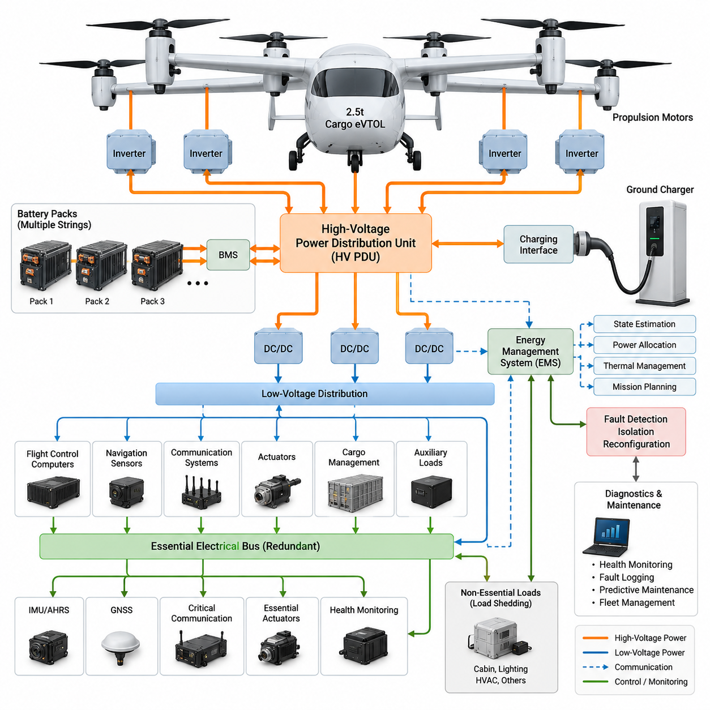
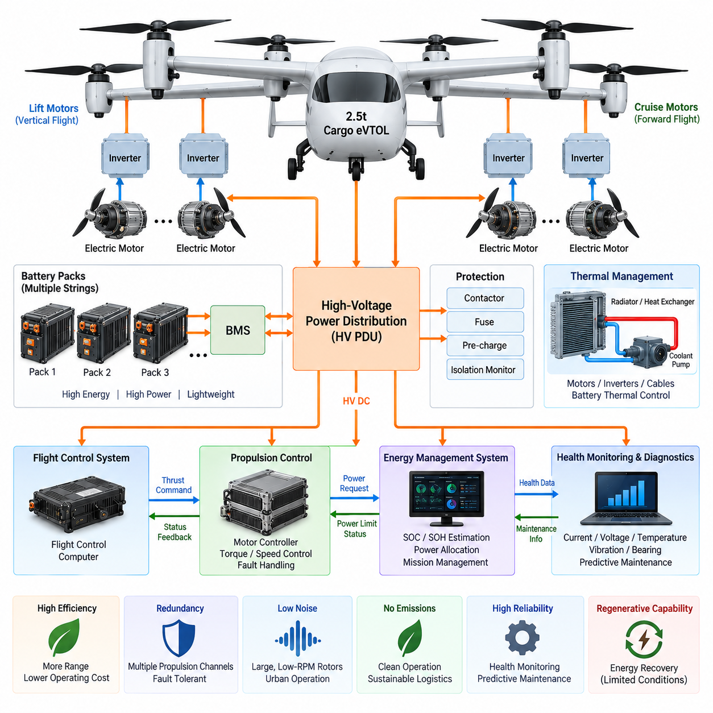
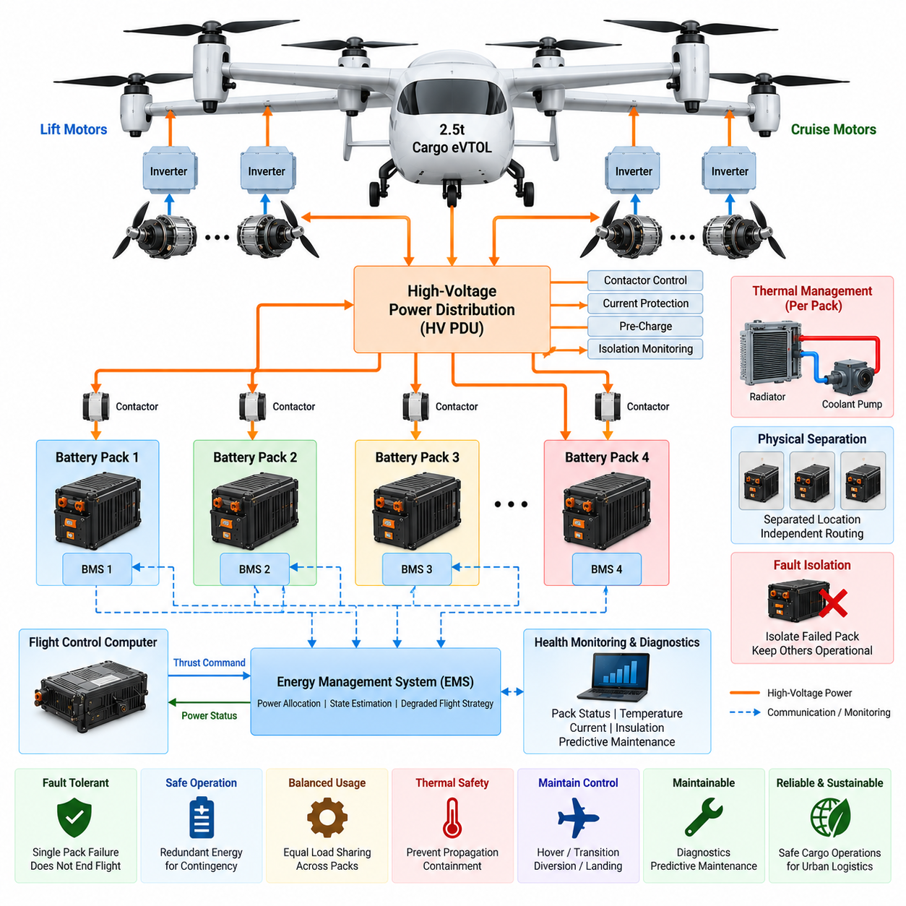
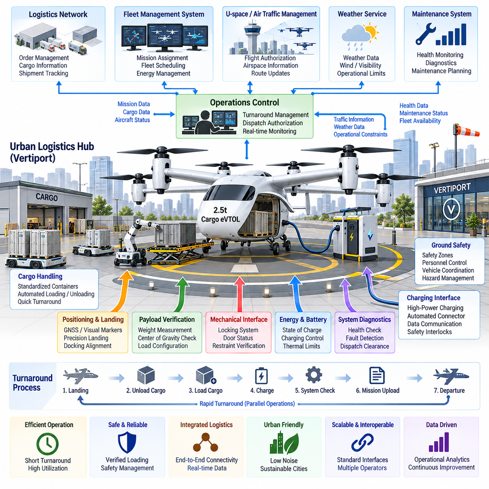
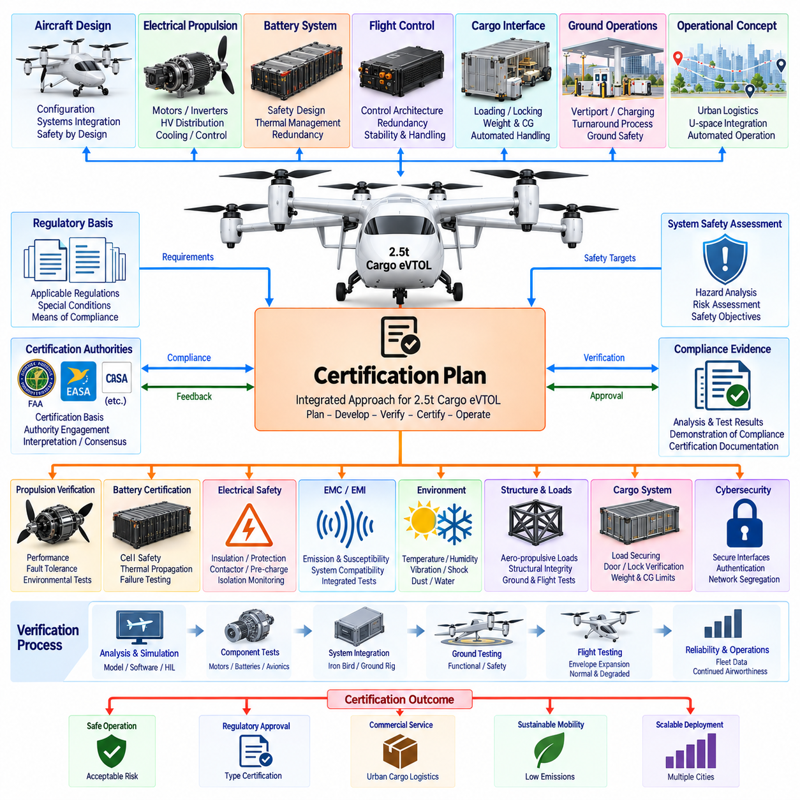

**Volume 18. Cargo UAV Architecture**

# Chapter 09. 2.5t Cargo UAV

## 09.01. eVTOL Electrical Architecture

{width="7.268055555555556in" height="7.268055555555556in"}

2.5톤급 화물 eVTOL은 추진 전력(Propulsion Power), 비행 필수 항공전자장비(Flight-Critical Avionics), 에너지 저장장치(Energy Storage), 보조 부하(Auxiliary Loads)를 상호 연계하면서도 독립적으로 보호되는 전력 영역(Power Domain)으로 구성하는 전기 아키텍처(Electrical Architecture)가 필요하다. 소형 UAV와 달리 대규모 전기에너지를 탑재하므로 고전류 경로(High-Current Path)의 고장이 빠르게 전파될 수 있다. 따라서 높은 전력 밀도(Power Density)와 함께 전기적 절연(Electrical Isolation), 고장 격리(Fault Containment), 이중화(Redundancy), 지속적인 상태 감시(Health Monitoring)를 확보해야 한다.

주 전기 영역(Primary Electrical Domain)은 추진 시스템(Propulsion System)에 전력을 공급하며, 일반적인 항공전자 버스(Avionics Bus)보다 상당히 높은 직류 전압(DC Voltage)을 사용하는 것이 일반적이다. 배전 전압(Distribution Voltage)을 높이면 동일한 추진 전력에서 전류가 감소하여 전선 질량, 저항 손실(Resistive Loss), 커넥터 크기, 열 부하(Thermal Loading)를 줄일 수 있다. 반면 고전압은 항공기 전체에서 절연(Insulation), 연면거리(Creepage), 공간거리(Clearance), 스위칭(Switching), 아크 관리(Arc Management), 작업자 보호에 대한 요구조건을 증가시킨다.

에너지 저장장치(Energy Storage)는 하나의 거대한 전원으로 구성하기보다 독립적으로 제어할 수 있는 여러 배터리 스트링(Battery String) 또는 배터리 팩(Battery Pack)으로 분할해야 한다. 각 에너지원에는 배터리 관리 시스템(BMS), 전류 센싱(Current Sensing), 온도 감시(Temperature Monitoring), 절연 감시(Isolation Monitoring), 접촉기(Contactor), 프리차지 회로(Pre-Charge Circuit), 적절하게 협조된 보호장치가 필요하다. 이러한 팩 분할(Pack Segmentation)을 통해 손상된 전기 구간을 차단하면서 정상 구간으로 제어 비행 또는 착륙에 필요한 전력을 계속 공급할 수 있다.

고전압 배전 시스템(High-Voltage Distribution System)은 에너지 저장장치와 추진 인버터(Propulsion Inverter)를 연결하는 전기적 백본(Electrical Backbone)을 형성한다. 중앙집중형 또는 분산형 고전압 전력분배장치(HV PDU)는 접촉기, 보호장치, 프리차지 경로, 버스 측정(Bus Measurement), 절연 기능을 관리한다. 단락(Short Circuit), 인버터 고장, 케이블 손상 또는 모터 측 전기 고장이 발생하더라도 모든 추진 채널(Propulsion Channel)이 동시에 상실되지 않도록 배전 계통을 분할해야 한다.

추진 채널(Propulsion Channel)은 항공기의 양력 및 제어 개념(Lift and Control Philosophy)에 따라 전기적으로 분리되어야 한다. 독립적인 전력 피더(Independent Feeder)를 통해 여러 모터 인버터 그룹에 전력을 공급할 수 있으며, 공통원인고장(Common-Cause Failure)의 위험을 줄이도록 물리적 배선 경로도 분리해야 한다. 특히 eVTOL에서는 추진장치가 양력(Lift), 자세 제어(Attitude Control), 기동 제어권(Maneuvering Authority)을 동시에 담당할 수 있으므로 전기적 이중화(Electrical Redundancy)는 공력 및 비행제어 이중화와 직접 대응해야 한다.

각 추진 인버터(Propulsion Inverter)는 고전압 직류 전력을 모터 구동에 필요한 제어된 다상 전력(Multiphase Power)으로 변환한다. 또한 상전류(Phase Current), DC 링크 전압(DC-Link Voltage), 반도체 온도(Semiconductor Temperature), 모터 속도, 권선 온도(Winding Temperature), 고장 상태를 현장에서 감시할 수 있기 때문에 중요한 진단 노드(Diagnostic Node)의 역할을 한다. 고속 보호 기능(Fast Protection)은 전력전자장치 가까이에서 수행하고, 상위 제어기(Supervisory Controller)는 추진 능력 저하에 대한 시스템 수준의 대응을 조정해야 한다.

비행 필수 전자장비(Flight-Critical Electronics)는 추진 버스(Propulsion Bus)에 직접 의존하지 않도록 설계해야 한다. 절연형 DC/DC 변환기(Isolated DC/DC Converter)를 이용하여 비행제어 컴퓨터(Flight-Control Computer), 항법 센서(Navigation Sensor), 통신장비, 액추에이터(Actuator), 화물 관리 시스템(Cargo Management System), 기타 항공전자장비를 위한 안정적인 저전압 버스(Low-Voltage Bus)를 생성한다. 복수의 변환기와 분리된 저전압 버스는 단일 변환기 고장이나 고전압 계통의 이상이 모든 비행제어 전자장비를 동시에 정지시키는 것을 방지한다.

전용 필수 전기 버스(Essential Electrical Bus)는 대규모 전력 시스템 고장이 발생한 이후에도 항공기의 제어 가능성을 유지하는 데 필요한 최소 기능을 보존해야 한다. 대표적인 필수 부하(Essential Load)에는 비행제어 컴퓨팅, 관성 센싱(Inertial Sensing), 항법, 필수 통신, 일부 핵심 액추에이터, 전력 시스템 감시, 비상 제어 기능이 포함된다. 가용 에너지 또는 발전 용량이 사전에 정의된 여유 수준 이하로 감소하면 비필수 부하(Nonessential Load)를 단계적으로 차단하는 부하 차단(Load Shedding)을 수행할 수 있다.

전기 아키텍처는 비행제어 시스템(Flight-Control System)과 긴밀하게 연동되어야 한다. 전기적 고장은 사용 가능한 추력(Available Thrust)을 즉각적으로 변화시킬 수 있기 때문이다. 배터리 팩 손실, 버스 격리(Bus Isolation), 인버터 정지, 모터 성능 저하, 변환기 고장 등의 상태를 결정론적 인터페이스(Deterministic Interface)를 통해 전달해야 한다. 비행제어 컴퓨터는 이를 기반으로 추력 명령을 재분배하고, 비행 영역(Flight Envelope)을 제한하거나, 비상 대응 로직(Contingency Logic) 또는 비상 착륙(Emergency Landing)을 실행할 수 있다.

에너지 관리(Energy Management)는 개별 배터리 및 변환기 제어기보다 상위 계층에서 전체 가용 에너지, 순간 전력 공급 능력, 열적 한계(Thermal Limit), 예비 에너지 여유(Reserve Margin)를 추정한다. 전기식 화물 항공기에서는 충전 상태(State of Charge)만으로 충분하지 않다. 배터리 건강 상태(State of Health), 셀 온도, 전압 강하(Voltage Sag), 팩 불균형(Pack Imbalance), 임무 단계(Mission Phase), 추진 전력 요구량, 대체 착륙지 또는 안전 착륙지까지 도달하는 데 필요한 에너지를 함께 고려해야 한다.

수직이착륙(Vertical Takeoff and Landing)은 호버(Hover), 상승(Climb), 천이비행(Transition) 과정에서 최대 추진 전력이 요구되므로 특히 가혹한 전기 설계 조건을 만든다. 케이블, 버스바(Busbar), 접촉기, 커넥터, 배터리 팩, 인버터는 과도한 전압 강하나 온도 상승 없이 이러한 과도 부하(Transient Load)를 견뎌야 한다. 반복되는 고출력 임무에서 수동 냉각(Passive Cooling)의 열 제거 속도보다 빠르게 열이 축적될 수 있으므로 열 설계(Thermal Design)와 전기 설계(Electrical Design)는 분리해서 다룰 수 없다.

접지(Grounding)와 전자기 적합성(EMC)은 개별 부품 수준이 아니라 항공기 전체 수준에서 설계해야 한다. 추진 인버터와 DC/DC 변환기의 고주파 스위칭(High-Frequency Switching)은 GNSS, IMU, 통신 링크, 비행제어 전자장비, 센서 인터페이스에 간섭을 발생시킬 수 있다. 제어된 귀환 경로(Return Path), 차폐(Shielding), 본딩(Bonding), 필터링(Filtering), 케이블 분리, 커넥터 종단 처리(Connector Termination), 물리적 구역화(Physical Zoning)를 통해 추진 시스템에서 발생하는 전자기 잡음이 안전 필수 정보를 손상시키는 것을 방지해야 한다.

배선 아키텍처(Wiring Architecture)는 전기적 효율과 항공기 질량 및 정비성(Maintainability) 사이의 균형을 고려해야 한다. 고전압 추진 케이블은 가능한 짧고 보호된 경로를 사용하면서 민감한 신호 배선과 분리해야 한다. 와이어 하니스(Wire Harness)는 진동, 굽힘, 온도, 마모, 유체 노출, 커넥터 고정, 구조물 변형 등을 고려해야 한다. 추진 전력 피더와 배터리 인터페이스는 항공기 운용 수명 동안 지속적으로 검사해야 하므로 정비 접근성(Maintenance Accessibility) 역시 중요하다.

충전 아키텍처(Charging Architecture)는 지상 인프라와 항공기 에너지 저장 시스템 사이의 안전한 연결을 지원해야 한다. 충전 제어 시스템은 대규모 에너지 전달을 시작하기 전에 커넥터 상태, 절연 상태, 배터리 온도, 팩 전압, 허용 전류, 통신 상태를 확인해야 한다. 인터록(Interlock)은 충전 중 추진 시스템이 활성화되는 것을 방지하고 위험한 전기 상태에서 커넥터가 분리되지 않도록 해야 하며, 진단 기록(Diagnostic Record)은 플릿 수준의 배터리 정비를 지원해야 한다.

고장 감지·격리·재구성(Fault Detection, Isolation, and Reconfiguration)은 단순히 하드웨어를 복제한 이중화를 실제 운용 가능한 안전 기능으로 전환한다. 시스템은 비정상 전류, 저전압(Undervoltage), 과전압(Overvoltage), 절연 성능 저하, 접촉기 고장, 변환기 고장, 과도한 온도 상승, 통신 손실을 지속적으로 감시해야 한다. 고장이 확인되면 해당 구역을 격리하고 정상 전력 경로를 재구성하여 가장 우선순위가 높은 추진 및 항공전자 기능을 유지해야 한다.

전기 시스템 상태 정보(Electrical Health Information)는 탑재 진단 시스템(Onboard Diagnostics)과 지상 정비 시스템(Ground Maintenance System)에 통합되어야 한다. 배터리 상태 추세, 접촉기 작동 이력, 인버터 온도, 절연 저항(Isolation Resistance), 버스 과도현상(Bus Transient), 변환기 부하, 고장 이력을 기록하면 단순한 주기적 교환이 아니라 예지정비(Predictive Maintenance)가 가능하다. 화물 UAV 플릿에서는 이러한 데이터를 활용하여 계획된 임무 수행에 충분한 전기 및 배터리 여유가 존재하는지 판단하는 운항 투입 결정(Dispatch Decision)도 지원할 수 있다.

최종적으로 이 아키텍처는 단순한 배터리, 모터, 케이블의 집합이 아니라 계층화된 에너지 및 안전 네트워크(Layered Energy and Safety Network)로 이해해야 한다. 분할된 에너지 저장장치가 보호된 고전압 배전 시스템에 전력을 공급하고, 다시 이 시스템이 이중화된 추진 채널과 절연된 저전압 항공전자 영역에 전력을 제공한다. 상위 에너지 관리, 비행제어, 진단, 열관리(Thermal Management), 고장 격리가 이러한 계층을 통합하여 개별 고장이 전체 시스템으로 확산되지 않도록 한다.

2.5톤급 플랫폼에서 이러한 전기 아키텍처는 향후 대형 화물 UAV로 확장하기 위한 공학적 기반도 제공한다. 첨부된 원고 구조에서는 eVTOL 전기 아키텍처(eVTOL Electrical Architecture) 이후에 순수 전기 추진(Pure Electric Propulsion), 배터리 이중화 설계(Battery Redundancy Design), 도심 물류 인터페이스(Urban Logistics Interface), 인증 계획(Certification Plan)을 순차적으로 배치하고 있다. 따라서 본 내용은 일반적인 하이브리드 전력 시스템(Hybrid Power System)과 구체적인 2.5톤급 화물 UAV 설계를 연결하는 시스템 수준의 기반으로 기능한다.

## 09.02. Pure Electric Propulsion

{width="7.268055555555556in" height="7.268055555555556in"}

2.5톤급 화물 eVTOL의 순수 전기 추진(Pure Electric Propulsion)은 연소 엔진(Combustion Engine), 터빈(Turbine), 탑재 연료 변환 장치(Onboard Fuel Conversion)에 의존하지 않고 저장된 전기에너지(Electrical Energy)를 직접 공기역학적 추력(Aerodynamic Thrust)으로 변환한다. 추진 계통(Propulsion Chain)은 주로 배터리 팩(Battery Pack), 고전압 배전(High-Voltage Distribution), 모터 인버터(Motor Inverter), 전기 모터(Electric Motor), 양력 또는 순항 추진기(Lift or Cruise Propulsor)로 구성된다. 이러한 직접적인 에너지 경로는 기계적 아키텍처(Mechanical Architecture)를 단순화하는 동시에 전기 효율(Electrical Efficiency), 열 성능(Thermal Performance), 고장 허용성(Fault Tolerance)을 항공기 성능을 결정하는 핵심 요소로 만든다.

이 규모의 화물 항공기에서 추진 전력(Propulsion Power)은 서로 다른 여러 운용 조건을 충족해야 한다. 수직이륙(Vertical Takeoff)과 호버(Hover)는 매우 높은 연속 전력을 요구하고, 천이비행(Transition)은 빠르게 변화하는 추력 요구조건을 발생시키며, 순항(Cruise)은 최대 출력보다 에너지 효율(Energy Efficiency)을 중시한다. 따라서 전기 추진 시스템(Electric Propulsion System)은 배터리, 인버터, 모터, 케이블 또는 열적 한계를 초과하지 않으면서 높은 과도 전력(Transient Power)과 지속 운전을 모두 지원해야 한다.

배터리 시스템(Battery System)은 주 에너지원(Primary Energy Source)으로서 항속거리(Range), 탑재량(Payload), 체공시간(Endurance), 예비 능력(Reserve Capability)을 크게 결정한다. 높은 비에너지(Specific Energy)는 배터리 질량을 줄이는 반면, 높은 비출력(Specific Power)은 이륙 및 상승 시 요구되는 높은 전력을 공급할 수 있도록 한다. 그러나 에너지 중심으로 최적화된 셀이 항상 최대 출력에도 적합한 것은 아니므로 이러한 요구조건은 상충할 수 있다. 따라서 배터리는 정격 용량만이 아니라 전체 임무 프로파일(Mission Profile)을 기준으로 선정해야 한다.

배터리 팩은 보호된 고전압 배전 채널(High-Voltage Distribution Channel)에 연결되는 여러 개의 전기적으로 독립된 구역으로 분할해야 한다. 각 팩에는 셀 전압, 전류, 온도, 충전 상태(State of Charge), 건강 상태(State of Health), 이상 상태를 감시하는 배터리 관리 시스템(Battery Management System)이 필요하다. 독립적인 접촉기(Contactor)와 보호장치를 사용하면 고장 난 팩을 격리하면서 정상 팩을 통해 항공기의 성능 저하 비행 전략(Degraded-Flight Strategy)에 따라 추진 전력을 계속 공급할 수 있다.

고전압 직류 배전(High-Voltage DC Distribution)은 최소한의 질량과 전기적 손실로 배터리 에너지를 추진 인버터에 전달한다. 버스 전압(Bus Voltage)을 높이면 동일한 전력에서 전류가 감소하여 더 작은 도체를 사용할 수 있고 저항 발열(Resistive Heating)을 줄일 수 있지만, 동시에 절연 및 보호 요구조건이 증가한다. 따라서 케이블 배선, 커넥터, 버스바(Busbar), 접촉기, 퓨즈(Fuse), 절연 감시(Isolation Monitoring), 프리차지 회로(Pre-Charge Circuit)는 부수적인 전기 부품이 아니라 추진 시스템 공학(Propulsion-System Engineering)의 핵심 요소가 된다.

추진 인버터(Propulsion Inverter)는 직류 에너지 시스템과 각 전기 모터 사이의 제어 가능한 인터페이스(Controllable Interface)이다. 인버터는 고전압 직류를 정밀하게 제어되는 다상 교류(Multiphase AC)로 변환하면서 모터 토크와 회전 속도를 제어한다. 수백 kW에서 잠재적으로 MW급에 이르는 전체 추진 전력이 시스템을 통과할 경우 작은 변환 손실도 크게 누적되므로, 반도체 스위칭 소자(Semiconductor Switching Device)는 호버, 상승, 천이비행, 순항의 전체 운전 영역에서 높은 효율을 유지해야 한다.

화물 eVTOL용 전기 모터는 경량 패키지에서 높은 토크 밀도(Torque Density), 높은 전력 밀도(Power Density), 높은 효율과 신뢰성을 제공해야 한다. 영구자석 동기전동기(Permanent-Magnet Synchronous Machine)는 높은 효율과 소형화 측면에서 유리하지만, 최종 모터 기술은 항공기 수준의 요구조건에 따라 결정된다. 모터의 전자기 설계(Electromagnetic Design), 권선 구성(Winding Configuration), 절연, 베어링, 회전자 구속(Rotor Containment), 온도 한계, 냉각, 진동 내구성, 인버터 호환성을 하나의 통합 추진장치로 설계해야 한다.

모터와 추진기(Propulsor)는 서로 독립적으로 최적화할 수 없다. 로터 직경(Rotor Diameter), 회전 속도, 블레이드 형상(Blade Geometry), 모터 토크, 운전 전압이 함께 추력 효율(Thrust Efficiency), 음향 특성(Acoustic Characteristics), 추진 시스템 질량을 결정한다. 더 크고 저속으로 회전하는 로터는 추진 효율을 향상시키고 일부 소음 성분을 감소시킬 수 있지만 구조 크기와 시스템 통합에 영향을 준다. 따라서 최적 설계는 공기역학, 전기, 구조, 음향, 열 설계를 동시에 최적화하여 도출해야 한다.

분산 전기 추진(Distributed Electric Propulsion)은 여러 개의 독립적으로 제어되는 모터가 양력과 제어력을 동시에 생성할 수 있기 때문에 eVTOL 항공기에 특히 유용하다. 추진장치 간 차등 추력(Differential Thrust)은 롤(Roll), 피치(Pitch), 요(Yaw) 제어에 기여하여 기존 기계식 제어기구에 대한 의존도를 줄일 수 있다. 그러나 하나의 추진 채널이 상실되더라도 제어 불가능한 추력 비대칭(Thrust Asymmetry)이 발생하거나 필요한 비행제어 권한(Flight-Control Authority)이 상실되지 않도록 추진장치의 수와 위치를 결정해야 한다.

이중화(Redundancy)는 단순히 추가 모터를 설치하는 것 이상으로 확장되어야 한다. 여러 추진장치가 하나의 배터리 버스, 접촉기, 케이블 경로, 냉각 회로, 제어기 또는 통신 인터페이스를 공유하면 하나의 상위 고장(Upstream Failure)이 여러 모터를 동시에 정지시킬 수 있다. 따라서 실제 고장 허용성(Fault Tolerance)을 확보하려면 전기적 독립성, 물리적 분리, 제어 독립성, 열적 분리(Thermal Segregation), 통신 이중화(Communication Redundancy)를 고려하여 겉으로 분리된 추진 채널 내부에 숨겨진 공통 고장 지점(Common Failure Point)이 존재하지 않도록 해야 한다.

열관리(Thermal Management)는 수직비행 중 배터리, 인버터, 모터, 커넥터, 도체에서 높은 전기 부하에 따른 열이 발생하기 때문에 주요 설계 제약조건 중 하나가 된다. 고출력 부품에는 액체 냉각(Liquid Cooling)이 필요할 수 있으며, 공기 흐름과 구조물을 통한 방열(Structural Heat Rejection)을 보조적으로 활용할 수 있다. 특히 화물 운항 간 지상 대기시간(Turnaround Time)이 짧은 경우 열관리 아키텍처는 최대 이륙 출력뿐 아니라 반복 임무에서 누적되는 열까지 처리해야 한다.

추진 효율(Propulsion Efficiency)은 모터 효율만을 기준으로 평가하는 것이 아니라 배터리 단자에서 실제 추력이 생성될 때까지 전체 경로를 기준으로 평가해야 한다. 배터리 내부 저항, 접촉기, 케이블, 버스바, 인버터 스위칭, 모터의 동손 및 자기 손실, 베어링, 프로펠러 공기역학에서 각각 손실이 발생한다. 각 단계의 효율 향상은 항속거리를 증가시키지만, 전기적 손실을 줄이기 위해 추가 냉각장치, 도체 질량 또는 더 큰 부품이 필요하면 그 이점이 상쇄될 수 있으므로 항공기 수준의 최적화가 필수적이다.

회생 운전(Regenerative Operation)은 특정 비행 조건에서 공기역학적 에너지가 추진기를 회전시키고 모터가 발전기(Generator)로 동작하도록 구성하면 기술적으로 가능할 수 있다. 실제 활용 가치는 항공기 구성, 비행 프로파일, 로터 공기역학, 배터리 충전 한계, 안전 제약조건에 크게 좌우된다. 지상 차량과 달리 eVTOL에서는 임무 에너지의 상당 부분을 일상적으로 회수할 수 있다고 가정할 수 없으므로, 항공기 수준의 분석으로 검증되지 않는 한 임무 에너지 산정이 회생 에너지에 의존해서는 안 된다.

추진 제어(Propulsion Control)는 비행제어 컴퓨터(Flight-Control Computer) 및 에너지 관리 시스템(Energy Management System)과 지속적으로 상호작용해야 한다. 비행제어기는 필요한 추력을 결정하고 로컬 모터 제어기(Local Motor Controller)는 전기적·열적 한계 내에서 토크 또는 속도 명령을 수행한다. 추진 채널의 성능이 저하되면 시스템은 잔여 추진 능력(Remaining Capability)을 신속하게 전달하여 항공기를 불안정하게 만들거나 정상 모터의 허용 운전 영역을 초과하지 않으면서 추력을 재분배할 수 있도록 해야 한다.

상태 감시(Health Monitoring)는 성능 저하가 추진 시스템 고장으로 발전하기 전에 이상을 조기에 식별하도록 지원한다. 주요 감시 변수에는 상전류(Phase Current), DC 링크 전압(DC-Link Voltage), 인버터 온도, 모터 권선 온도, 회전자 속도, 진동, 베어링 상태, 절연 상태, 냉각 시스템 성능이 포함된다. 이러한 신호와 운전 이력을 결합하면 상태 기반 정비(Condition-Based Maintenance)와 예지정비(Predictive Maintenance)가 가능하며, 짧은 운항 준비시간으로 반복적인 고출력 임무를 수행하는 상용 화물 플릿(Cargo Fleet)에서 특히 중요하다.

순수 전기 아키텍처(Pure-Electric Architecture)는 사용 가능한 추진 능력이 배터리 상태와 환경조건에 영향을 받기 때문에 운항 계획(Operational Planning)에도 변화를 요구한다. 지나치게 낮거나 높은 배터리 온도, 노화, 셀 불균형, 반복적인 고출력 운전, 예비 에너지 요구조건은 표시된 충전 상태가 충분해 보이더라도 실제 사용 가능한 임무 에너지를 감소시킬 수 있다. 따라서 운항 투입 로직(Dispatch Logic)은 단순한 배터리 잔량 비율에 의존하지 않고 전체 비행경로에 걸쳐 예상 출력 능력과 착륙 예비 에너지(Landing Reserve)를 평가해야 한다.

2.5톤급 화물 UAV에서 순수 전기 추진은 시스템 수준의 eVTOL 전기 아키텍처(eVTOL Electrical Architecture)에 이어 실제 추진 시스템을 구현하는 핵심 단계이다. 첨부된 전체 구성에서는 이후 배터리 이중화 설계(Battery Redundancy Design), 도심 물류 인터페이스(Urban Logistics Interface), 인증 계획(Certification Planning)으로 이어진다. 따라서 추진 시스템 설계는 충분한 추력과 항속거리뿐 아니라 이후 항공기 수준 설계에 필요한 전기적 분할(Electrical Partitioning), 상태 감시, 제어 가능성(Controllability), 고장 관리(Fault Management)의 기반까지 제공해야 한다.

## 09.03. Battery Redundancy Design

{width="7.268055555555556in" height="7.268055555555556in"}

2.5톤급 화물 eVTOL의 배터리 이중화(Battery Redundancy)는 단일 배터리 팩(Battery Pack), 전기 연결부(Electrical Connection), 보호장치(Protection Device), 배전 경로(Distribution Path)가 상실되더라도 제어 비행(Controlled Flight)에 필요한 에너지가 즉시 상실되지 않도록 설계해야 한다. 순수 전기 추진(Pure-Electric Propulsion)은 저장된 전기에너지에 전적으로 의존하므로 이중화는 단순한 항속 성능 확보 수단이 아니다. 이는 항공기 비행 안전 아키텍처(Flight-Safety Architecture)의 일부이며 추진 시스템, 비행제어 시스템(Flight Control), 에너지 관리(Energy Management)와 연계되어야 한다.

기본적인 설계 접근법은 전체 배터리 용량을 독립적으로 제어할 수 있는 여러 개의 배터리 팩 또는 스트링(Battery String)으로 분할하는 것이다. 각 구역에는 전용 감시(Monitoring), 스위칭(Switching), 보호(Protection), 전기적 격리(Electrical Isolation) 기능이 필요하다. 분할형 아키텍처(Segmented Architecture)는 하나의 배터리 내부 고장이 전체 에너지 저장 시스템(Energy-Storage System)으로 자동 확산되는 것을 방지하고, 특정 구역을 차단해야 하는 상황에서도 정상 배터리 팩을 계속 연결할 수 있도록 한다.

이중화는 단순히 정격 배터리 용량을 복제하는 방식이 아니라 고장 발생 이후 필요한 최소 전력(Minimum Electrical Power)을 기준으로 설계해야 한다. 잔여 배터리 채널(Remaining Battery Channel)은 필수 추진 기능에 필요한 충분한 순간 전력과 정의된 비상 임무(Contingency Mission)를 수행하기 위한 사용 가능 에너지를 제공해야 한다. 비행 단계에 따라 호버(Hover) 지속, 전진비행으로의 천이(Transition), 대체 경로 비행(Diversion), 또는 제어된 비상 착륙(Controlled Emergency Landing)이 요구될 수 있다.

각 배터리 팩에는 셀 전압, 팩 전류, 온도, 충전 상태(State of Charge), 건강 상태(State of Health), 셀 밸런싱(Balancing), 고장 상태를 감시하는 독립적인 배터리 관리 시스템(Battery Management System)이 필요하다. BMS는 해당 팩을 안전하게 연결 상태로 유지할 수 있는지를 판단하고 가용 전력 능력(Available Power Capability)을 항공기 에너지 관리 시스템(Energy Management System)에 전달해야 한다. 하나의 잘못된 측정값이 정상 배터리를 불필요하게 차단하거나 위험한 배터리를 계속 활성 상태로 유지할 수 있는 경우에는 센싱 이중화(Sensing Redundancy)가 특히 중요하다.

독립적인 접촉기(Contactor)는 배터리 구역을 고전압 버스(High-Voltage Bus)에 연결하거나 격리하는 핵심 수단이다. 양극 및 음극 스위칭 경로, 프리차지 회로(Pre-Charge Circuit), 전류 보호(Current Protection), 접촉기 상태 확인(Contactor-State Verification)을 상호 연계하여 고장 난 배터리 팩을 전기적으로 분리할 수 있어야 한다. 접촉기 용착(Welded Contactor), 개방 상태 고장(Failed-Open Contactor), 예기치 않은 버스 활성화, 프리차지 실패는 단순히 발생 가능성이 낮은 사건으로 가정하는 것이 아니라 시스템이 감지할 수 있는 고장으로 취급해야 한다.

프리차지 관리(Pre-Charge Management)는 추진 인버터(Propulsion Inverter)와 기타 고전압 장비가 상당한 크기의 DC 링크 커패시턴스(DC-Link Capacitance)를 포함하기 때문에 필수적이다. 방전된 버스에 배터리를 직접 연결하면 매우 큰 돌입전류(Inrush Current)가 발생하여 접촉기, 커넥터 또는 커패시터를 손상시킬 수 있다. 따라서 각 이중화 전력 경로는 주 접촉기를 닫기 전에 제어된 프리차지 절차를 통해 버스 전압을 형성하고, 전압 감시를 통해 정상적인 동기화 여부를 확인해야 한다.

전기적 보호(Electrical Protection)는 가능한 한 가장 작은 고장 구역만 선택적으로 격리할 수 있어야 한다. 하나의 추진 채널에서 단락(Short Circuit)이 발생했다고 해서 모든 배터리를 불필요하게 차단해서는 안 되며, 배터리 내부 고장이 발생했을 때 병렬로 연결된 다른 팩에서 역방향으로 에너지가 공급되어 고장이 지속되어서도 안 된다. 따라서 퓨즈(Fuse), 접촉기, 전류 센서(Current Sensor), 역전류 보호(Reverse-Current Protection), 배전 토폴로지(Distribution Topology)의 동작 특성을 상호 협조시켜 고장을 제거하면서 최대한 많은 정상 추진 능력을 보존해야 한다.

배터리 병렬 운전(Parallel Battery Operation)은 팩 전압, 임피던스(Impedance), 온도, 노화 상태, 충전 상태의 차이로 인해 전류 분담(Current Sharing)이 불균등해질 수 있으므로 세심한 관리가 필요하다. 하나의 팩은 과부하되고 다른 팩은 예상보다 적은 전력을 공급할 수 있다. 따라서 에너지 관리 시스템은 각 팩의 전류를 개별적으로 감시하고 허용 가능한 방전 전력(Allowable Discharge Power)을 동적으로 결정하여, 이중화된 배터리 팩이 관리되지 않는 단순 병렬 배터리 뱅크가 아니라 제어된 에너지원(Controlled Energy Source)으로 동작하도록 해야 한다.

물리적 분리(Physical Separation)는 전기적 분리만큼 중요하다. 명목상 독립적인 두 개의 배터리 팩이 동일하게 취약한 구획에 설치되거나 동일한 충격, 화재, 유체 누출 또는 구조 손상의 영향을 받을 수 있는 배선 경로를 공유한다면 실질적인 이중화 효과는 제한적이다. 배터리 위치, 고전압 피더(High-Voltage Feeder), 커넥터, 냉각 회로(Cooling Circuit), 제어 배선을 배치할 때 항공기의 무게중심(Center of Gravity)과 구조 요구조건을 충족하면서 공통원인고장(Common-Cause Failure)을 감소시켜야 한다.

열 전파(Thermal Propagation)는 배터리 이중화에서 가장 중요한 위험 요소 중 하나이다. 하나의 모듈 또는 배터리 팩 내부에서 발생한 열적 이상이 인접한 에너지 저장 구역으로 빠르게 확산되지 않도록 분할 구조를 설계해야 한다. 온도 감시, 열 차단벽(Thermal Barrier), 환기 또는 격납 전략(Containment Strategy), 냉각 격리(Cooling Isolation), 비상 차단(Emergency Disconnection)이 함께 작동해야 한다. 목적은 비정상적인 발열을 감지하는 것뿐 아니라 필요한 안전 비행 대응을 수행할 수 있을 만큼 독립된 에너지원을 유지하는 것이다.

냉각 아키텍처(Cooling Architecture) 역시 이중화 경계를 준수해야 한다. 여러 배터리 팩이 하나의 펌프(Pump), 열교환기(Heat Exchanger), 냉각수 매니폴드(Coolant Manifold), 제어기에 의존한다면 하나의 열관리 시스템 고장으로 전기적 이중화가 무력화될 수 있다. 따라서 특히 높은 방전 전류로 상당한 열이 발생하는 호버 및 상승(Climb) 단계에서는 안전 필수 배터리 그룹에 독립적인 냉각 루프(Independent Cooling Loop) 또는 적절하게 분할된 열관리 회로(Thermal Circuit)가 필요할 수 있다.

절연 감시(Isolation Monitoring)는 고전압 시스템과 항공기 구조물 또는 다른 전기 영역 사이의 절연 성능 저하를 감지하기 위해 필요하다. 케이블 손상, 습기, 오염, 커넥터 열화, 절연 파괴(Insulation Breakdown)는 일반적인 단락을 즉시 발생시키지 않으면서도 위험한 누설 경로(Leakage Path)를 형성할 수 있다. 지속적인 절연 감시를 통해 진행 중인 고장을 조기에 식별하고, 상태가 심각해지기 전에 특정 배터리 또는 배전 구역을 격리해야 하는지를 판단할 수 있다.

배터리 이중화는 추진 시스템 이중화(Propulsion Redundancy)와 직접 대응하도록 설계해야 한다. 모든 양력 모터(Lift Motor)를 하나의 배터리 그룹에서 공급하고 나머지 추진장치를 다른 그룹에서 공급한다면 두 개의 에너지원이 존재하더라도 허용할 수 없는 고장 조합이 발생할 수 있다. 따라서 허용된 어떤 에너지 저장 구역이 상실되더라도 필요한 제어권(Control Authority)을 유지할 수 있도록 기하학적·공기역학적으로 유효한 추진장치 분포가 남도록 배터리 채널을 할당해야 한다.

비행제어 컴퓨터(Flight-Control Computer)는 배터리 격리의 결과를 이해해야 한다. 사용 가능한 전력이 감소하면 가용 추력(Available Thrust)도 변화하기 때문이다. 하나의 배터리 팩을 사용할 수 없게 되면 에너지 관리 시스템은 변경된 전력 한계(Power Limit)를 추진 및 비행제어 기능에 전달해야 한다. 제어기는 이를 기반으로 최대 추력을 제한하고, 모터 명령을 재분배하며, 천이 전략을 변경하고, 비필수 부하(Nonessential Load)를 차단하거나, 잔여 전기 능력에 적합한 착륙 경로를 선택할 수 있다.

충전 상태 이중화(State-of-Charge Redundancy) 역시 정상 운항 전반에서 관리해야 한다. 하나의 배터리 팩이 다른 팩보다 훨씬 빠르게 방전되면 항공기가 물리적으로 여러 개의 배터리 팩을 보유하고 있더라도 임무 후반에는 실질적인 고장 허용 능력을 상실할 수 있다. 따라서 에너지 할당(Energy Allocation)은 독립 채널 사이의 예비 능력(Reserve Capability)을 균형 있게 유지하여 임무 후반에 하나의 배터리 팩이 상실되더라도 필요한 비상 대응에 충분한 에너지가 남도록 해야 한다.

배터리 건강 상태(State of Health)는 플릿(Fleet)의 운용 사이클이 누적될수록 더욱 중요해진다. 배터리 팩은 온도 노출, 제조 편차, 전력 부하, 정비 이력 등에 따라 서로 다른 속도로 노화된다. 용량 감소(Capacity Fade)와 내부 저항 증가는 가용 에너지뿐 아니라 최대 출력도 감소시킬 수 있다. 따라서 이중화 계산에서는 모든 배터리가 초기 정격 성능을 계속 제공한다고 가정하지 말고 측정 또는 추정된 현재 성능(Current Capability)을 사용해야 한다.

고장 감지·격리·재구성(Fault Detection, Isolation, and Reconfiguration)은 명확하게 정의된 안전 로직(Safety Logic)에 따라 자동으로 수행되어야 한다. 비정상 전류, 셀 전압, 온도, 절연 저항, 접촉기 동작, 통신 손실, 팩 불균형은 전력 제한에서 완전 격리에 이르는 단계적 대응을 유발할 수 있다. 격리 이후 시스템은 변경된 버스 구성(Bus Configuration)을 확인하고 선택된 비행 전략을 계속 수행하기 전에 충분한 정상 에너지와 추진 능력이 남아 있는지를 검증해야 한다.

지상 충전(Ground Charging)에서도 비행 중과 동일한 이중화 철학(Redundancy Philosophy)을 유지해야 한다. 각 배터리 팩은 독립적으로 감시되고 제어된 방식으로 충전되어야 하며, 이를 통해 불균형, 과도한 온도 또는 결함이 있는 구역을 운항 투입 전에 식별할 수 있다. 충전 인프라와 탑재 제어 시스템은 배터리 팩 사이의 위험한 교차 전류(Cross-Current)를 방지하고, 항공기 운항 승인 전에 접촉기, 절연 감시, 냉각, BMS 통신, 보호 기능이 정상적으로 작동하는지 확인해야 한다.

정비 진단(Maintenance Diagnostics)은 배터리 고장, 전류 이력, 온도 노출, 충·방전 사이클, 격리 이벤트(Isolation Event), 접촉기 작동, 비정상 전압 거동을 기록해야 한다. 추세 분석(Trend Analysis)을 이용하면 이중화 능력을 저하시키기 전에 성능 열화를 발견할 수 있다. 플릿 수준 데이터(Fleet-Level Data)를 이용하면 특정 배터리 팩, 냉각 구역, 커넥터 또는 임무 프로파일과 관련하여 반복적으로 나타나는 패턴을 식별할 수 있으며, 이를 통해 예지정비(Predictive Maintenance)와 보다 신뢰성 높은 배터리 교체 결정을 지원할 수 있다.

최종적인 배터리 이중화 아키텍처(Battery Redundancy Architecture)는 에너지 분할(Energy Segmentation), 독립적인 보호, 물리적 분리, 열적 격리(Thermal Containment), 상태 감시, 자동 재구성(Automatic Reconfiguration)이 통합된 시스템으로 이해해야 한다. 단순히 여러 개의 배터리 팩을 탑재하는 것만으로는 고장 허용성이 확보되지 않는다. 하나의 신뢰 가능한 단일 고장(Credible Single Failure)을 격리하면서도 안전한 항공기 운항에 필요한 전기적·열적·제어·추진 자원을 동시에 유지할 수 있을 때 실질적인 이중화가 성립한다.

첨부된 2.5톤급 화물 UAV 구성에서 배터리 이중화 설계(Battery Redundancy Design)는 eVTOL 전기 아키텍처(eVTOL Electrical Architecture)와 순수 전기 추진(Pure-Electric Propulsion) 이후에 위치하며, 도심 물류 인터페이스(Urban Logistics Interface)와 인증 계획(Certification Plan)에 앞서 배치된다. 따라서 이 설계는 앞에서 정의된 전력 시스템 개념을 안전 중심의 에너지 저장 아키텍처(Safety-Oriented Energy-Storage Architecture)로 구체화하며, 배터리 관련 고장이 발생한 이후에도 순수 전기 항공기가 제어 가능한 추진 상태를 유지하도록 하는 동시에 이후 운용 및 인증 설계의 기반을 제공한다.

## 09.04. Urban Logistics Interface

{width="7.268055555555556in" height="7.268055555555556in"}

2.5톤급 화물 eVTOL의 도심 물류 인터페이스(Urban Logistics Interface)는 항공기와 일상적인 도심 물류 운용에 필요한 지상 인프라(Ground Infrastructure), 디지털 서비스(Digital Service), 화물 취급 장비(Cargo-Handling Equipment), 운용 시스템(Operational System)을 연결한다. 이는 단순한 물리적 적재 인터페이스를 넘어서는 개념으로, 모든 도착과 출발 과정에서 착륙 승인(Landing Authorization), 화물 이송(Cargo Transfer), 충전, 항공기 상태, 임무 데이터(Mission Data), 플릿 스케줄링(Fleet Scheduling)을 체계적인 회항 준비 절차(Turnaround Process) 안에서 조정해야 한다.

도심 화물 운송에는 제한된 지상 공간에서도 반복적인 eVTOL 운항을 지원할 수 있는 전용 버티포트(Vertiport) 또는 물류 거점(Logistics Node)이 필요하다. 따라서 항공기 인터페이스는 착륙 구역 형상(Landing-Zone Geometry), 위치 기준(Positioning Reference), 안전 경계(Safety Boundary), 적재 접근성, 충전 연결, 정비 접근성을 지원해야 한다. 표준화된 지상 인터페이스(Standardized Ground Interface)는 특정 시설에 종속된 절차를 줄이고 동일한 항공기가 여러 물류 허브(Logistics Hub)에서 운항할 수 있도록 한다.

정밀 착륙(Precision Landing)은 공중 운항과 지상 물류를 연결하는 첫 번째 단계이다. GNSS, 시각 마커(Visual Marker), 로컬 위치결정 시스템(Local Positioning System), 기타 착륙 기준을 이용하여 항공기를 지정된 접지 구역(Touchdown Area)으로 유도할 수 있다. 정확한 최종 위치결정은 비행 안전뿐 아니라 착륙 후 화물 도어, 자동 적재장치(Automated Loader), 충전장비, 서비스 인터페이스를 고정된 지상 인프라와 정확하게 정렬하기 위해서도 중요하다.

화물 이송 인터페이스(Cargo-Transfer Interface)는 적재 오류를 방지하면서 항공기의 회항 준비시간(Turnaround Time)을 최소화해야 한다. 표준화된 화물 컨테이너, 팔레트(Pallet), 잠금 지점(Locking Point), 치수 영역(Dimensional Envelope), 기계식 가이드(Mechanical Guide)를 적용하면 자동 또는 반자동 장비를 이용하여 화물을 교환할 수 있다. 인터페이스는 비행 전에 화물이 올바르게 배치되고 기계적으로 고정되었는지 확인하면서, 착륙 후에는 불필요한 수작업 없이 신속하게 화물을 해제할 수 있어야 한다.

화물 식별(Cargo Identification)은 항공기의 임무와 디지털 방식으로 연결되어야 한다. 컨테이너 또는 화물 식별자(Shipment Identifier)를 이용하여 각각의 화물을 목적지, 중량, 취급 요구조건, 운용 상태와 연계할 수 있다. 출발 전에 물류 시스템은 실제 적재된 화물이 할당된 임무와 일치하는지 확인해야 한다. 이를 통해 경로 지정 오류(Routing Error)를 방지하고 출발 물류시설에서 항공 운송을 거쳐 도착 허브까지 화물의 추적성(Traceability)을 확보할 수 있다.

탑재중량(Payload Weight)과 무게중심(Center of Gravity) 정보는 적재 구성이 비행 성능과 제어 여유(Control Margin)에 직접적인 영향을 주기 때문에 2.5톤급 eVTOL에서 특히 중요하다. 지상 물류장비가 측정된 화물 정보를 제공하고 탑재 센서(Onboard Sensor)가 실제 적재 상태를 독립적으로 검증할 수 있다. 탑재 질량, 중량 분포 또는 무게중심이 계획된 임무에 대해 정의된 허용 영역(Allowable Envelope)을 초과하면 항공기는 운항 투입(Dispatch)을 거부해야 한다.

기계식 화물 인터페이스(Mechanical Cargo Interface)의 상태 역시 비행제어 시스템(Flight-Control System)과 화물 관리 시스템(Cargo-Management System)에 전달되어야 한다. 출발을 위한 추진 시스템이 활성화되기 전에 잠금 위치(Lock Position), 도어 상태(Door Status), 구속장치 상태(Restraint Condition), 화물 존재 여부(Payload Presence)를 확인해야 한다. 여러 잠금장치를 사용하는 경우 개별 상태 감시를 통해 불완전한 체결을 감지할 수 있다. 명령된 잠금 상태와 실제 측정 상태가 일치하지 않으면 문제가 해결될 때까지 정상적인 운항 투입을 허용해서는 안 된다.

충전(Charging)은 별도의 정비 작업으로 취급하기보다 물류 운용 주기(Logistics Cycle)에 통합해야 한다. 착륙 후 화물을 하역하고 다음 화물을 준비하는 동안 항공기를 고출력 충전 인프라(High-Power Charging Infrastructure)에 연결할 수 있다. 자동 충전 커넥터(Automated Charging Connector)는 회항 준비시간을 단축할 수 있지만, 고출력 에너지 전달을 시작하기 전에 전기적 인터록(Electrical Interlock), 절연 검사(Isolation Check), 통신 핸드셰이크(Communication Handshake), 배터리 온도 한계, 커넥터 상태 검증을 완료해야 한다.

충전 인터페이스(Charging Interface)는 단순히 전력만 전달하는 것이 아니라 추가적인 운용 정보도 교환해야 한다. 항공기와 지상 시스템은 배터리 충전 상태(State of Charge), 허용 충전 전류(Allowable Charging Current), 팩 온도, 건강 상태(State of Health), 예상 출발 시간, 필요한 임무 에너지(Required Mission Energy)를 교환할 수 있다. 이를 통해 불필요한 배터리 스트레스(Battery Stress)를 방지하면서 운용 우선순위에 따라 충전 전력을 조정하고 다음 운항 전에 충분한 에너지와 예비 에너지(Reserve Energy)를 확보할 수 있다.

신속한 회항 준비(Rapid Turnaround)를 위해서는 기존에는 순차적으로 수행되던 여러 작업을 동시에 조정해야 한다. 화물 하역, 입고 화물 확인, 배터리 충전, 시스템 진단(System Diagnostics), 임무 데이터 업로드(Mission Upload), 기상 평가(Weather Assessment), 출발 준비를 안전 의존 관계(Safety Dependency)가 명확하게 정의된 상태에서 병렬로 수행할 수 있다. 디지털 회항 관리 시스템(Digital Turnaround Manager)은 이러한 작업을 감독하고 모든 필수 조건이 충족된 이후에만 출발을 승인할 수 있다.

항공기는 여러 기체에 임무를 할당하는 플릿 관리 시스템(Fleet-Management System)과 연동되어야 한다. 플릿 소프트웨어(Fleet Software)는 항공기 위치, 탑재 능력, 배터리 상태, 정비 상태, 경로 가용성(Route Availability), 예상 수요를 고려하여 적절한 항공기를 선택할 수 있다. 순수 전기 eVTOL 운용에서는 에너지 가용성(Energy Availability) 자체가 스케줄링 자원이 되므로 플릿 할당(Fleet Assignment)과 충전 전략(Charging Strategy)을 서로 독립된 기능으로 관리하지 않고 함께 최적화해야 한다.

임무 정보(Mission Information)는 물류 네트워크에서 항공기와 지상통제 환경(Ground Control Environment)으로 전자적으로 전달되어야 한다. 임무 패키지(Mission Package)에는 출발지, 목적지, 경로 제약조건(Route Constraint), 화물 정보, 예비 에너지 요구조건, 착륙장 식별자(Landing-Site Identifier), 운용 제한조건이 포함될 수 있다. 항공기, 지상통제소(Ground Control Station), 물류 시스템, 목적지 시설이 개별적으로 입력한 서로 다른 데이터가 아니라 일관된 임무 정보를 사용하도록 형상관리(Configuration Control)를 적용하는 것이 중요하다.

도심 물류 인터페이스는 적용 가능한 경우 무인교통관리(Unmanned Traffic Management) 또는 U-스페이스(U-Space) 서비스와도 연계되어야 한다. 비행 승인(Flight Authorization), 공역 제한(Airspace Restriction), 지오펜싱(Geofencing) 정보, 교통 상황, 경로 갱신(Route Update)은 계획된 화물 임무의 수행 가능성에 영향을 줄 수 있다. 따라서 물류 시스템은 항공기의 출발 슬롯(Departure Slot)을 단순한 창고 운영상의 결정으로 간주해서는 안 되며, 현재의 항공 운항 제약조건을 운항 투입과 스케줄링에 반영해야 한다.

통신 아키텍처(Communication Architecture)는 안전 필수 항공기 제어(Safety-Critical Aircraft Control)와 상업용 물류 데이터(Commercial Logistics Data) 사이에 명확한 경계를 유지해야 한다. 화물 데이터베이스, 창고 시스템, 고객 정보, 스케줄링 플랫폼이 비행제어 네트워크(Flight-Control Network)에 직접 접근할 필요는 없다. 보안 게이트웨이(Secure Gateway)와 정의된 응용 인터페이스(Application Interface)를 이용하여 필요한 정보만 교환하면 사이버보안 노출(Cybersecurity Exposure)을 줄이면서 물류 자동화 시스템과 항공기 운용 시스템을 연계할 수 있다.

자동화된 물류 거점이 항공기, 충전기, 플릿 서버(Fleet Server), 화물 데이터베이스, 정비 시스템, 외부 네트워크와 연결될수록 사이버보안(Cybersecurity)은 더욱 중요해진다. 인증(Authentication), 권한 부여(Authorization), 암호화 통신(Encrypted Communication), 소프트웨어 무결성(Software Integrity), 로그 기록(Logging), 네트워크 분할(Network Segmentation)을 적용하여 비인가 명령이나 조작된 물류 정보가 항공기 운항 투입에 영향을 주지 못하도록 해야 한다. 운용 편의성이 비행 필수 시스템으로 연결되는 통제되지 않은 경로를 만들어서는 안 된다.

지상 안전 관리(Ground Safety Management)는 대형 eVTOL 특유의 위험요소를 고려해야 한다. 로터 안전거리 구역(Rotor Clearance Zone), 고전압 장비, 배터리 위험요소, 화물 취급 기계, 자동 지상차량(Automated Ground Vehicle)이 제한된 물류시설 안에서 동시에 존재할 수 있다. 따라서 인터페이스는 항공기 안전 상태(Aircraft Safe State), 추진 시스템 비활성화(Propulsion Inhibition), 충전 상태, 화물 접근, 작업자 및 장비 이동을 조정하여 서로 양립할 수 없는 작업이 동시에 수행되지 않도록 해야 한다.

도심 물류시설이 주거 또는 상업지역 가까이에서 운영될 수 있으므로 소음(Noise) 역시 중요한 인터페이스 고려사항이다. 비행 궤적(Flight Trajectory), 로터 운전 상태, 도착 및 출발 일정, 지상 운용 절차가 지역사회 소음 노출(Community Noise Exposure)에 영향을 줄 수 있다. 물류 계획을 통해 시간과 장소별로 운항을 분산시키는 동시에 항공기 수준의 추진 제어를 이용하여 지상이나 소음 민감 지역 주변에서 불필요한 고출력 운전을 최소화할 수 있다.

기상 및 환경 정보(Weather and Environmental Information)는 운항 투입 결정에 통합되어야 한다. 바람, 강수, 가시거리, 온도, 국지적 위험요소(Local Hazard)는 항공기 성능과 버티포트 이용 가능성 모두에 영향을 준다. 특히 온도는 배터리 출력 능력과 충전 특성에 영향을 주므로 순수 전기 운용에서 중요하다. 따라서 임무 스케줄링(Mission Scheduling)은 기상과 충전을 서로 독립적인 제약조건으로 취급하지 않고 환경조건과 항공기 에너지 상태를 함께 고려해야 한다.

정비 인터페이스(Maintenance Interface)는 모든 지상 운용 주기에서 신속한 자동 상태 평가(Automated Assessment)를 지원해야 한다. 착륙 후 항공기 상태 기록(Aircraft Health Record)을 정비 시스템으로 전달하여 다음 임무 전에 배터리, 추진 시스템, 항공전자장비(Avionics), 열관리 시스템, 화물 인터페이스의 고장을 평가할 수 있다. 경미한 이상은 지속적으로 감시할 수 있지만 정의된 한계를 초과하는 상태에서는 항공기를 자동으로 운항 대상에서 제외하고 정비 작업(Maintenance Action)을 생성할 수 있다.

반복적인 물류 임무에서 수집된 운용 데이터(Operational Data)는 플릿 활용률(Fleet Utilization)을 지속적으로 개선하는 데 사용할 수 있다. 회항 준비시간, 충전시간, 에너지 소비량, 탑재중량 분포, 경로 성능, 부품 온도, 지연, 정비 이벤트(Maintenance Event)를 분석하면 인프라 또는 항공기 운용에서 최적화할 수 있는 부분을 파악할 수 있다. 따라서 물류 인터페이스는 화물을 이송하기 위한 수단인 동시에 플릿 지능(Fleet Intelligence)을 생성하는 데이터 소스의 역할도 한다.

항공기가 여러 물류 사업자 또는 도시에서 운항하려면 상호운용성(Interoperability)이 중요하다. 공통 화물 치수, 전기 충전 인터페이스, 통신 프로토콜(Communication Protocol), 착륙 기준, 식별 방식, 운용 데이터 모델(Operational Data Model)을 적용하면 인프라의 파편화(Infrastructure Fragmentation)를 줄일 수 있다. 완전한 표준화가 불가능하더라도 명확하게 정의된 인터페이스 제어 문서(Interface Control Document)를 사용하면 항공기와 지상 시스템 공급업체가 전체 물류 체인을 다시 설계하지 않고도 장비를 통합할 수 있다.

성숙한 도심 물류 인터페이스는 궁극적으로 창고에서 항공기로, 비행을 거쳐 목적지 물류 네트워크로 이어지는 일관된 흐름을 형성한다. 화물 식별, 중량 확인, 적재, 잠금, 충전, 상태 점검, 임무 승인, 교통 조정, 착륙, 하역이 하나의 운용 프로세스(Operational Process)로 연결된다. 자동화(Automation)는 비행 필수 조건에 대한 독립적인 검증(Independent Verification)을 유지하면서 회항 준비시간을 단축할 때 가장 큰 가치를 제공한다.

첨부된 전체 구성에서 도심 물류 인터페이스(Urban Logistics Interface)는 eVTOL 전기 아키텍처(eVTOL Electrical Architecture), 순수 전기 추진(Pure-Electric Propulsion), 배터리 이중화 설계(Battery Redundancy Design) 이후에 위치하며, 바로 다음에 2.5톤급 인증 계획(2.5t Certification Plan)이 이어진다. 따라서 이 부분의 역할은 항공기의 전기 및 추진 능력을 실제 도심 화물 운용으로 연결하고, 항공기와 물류 인프라가 어떻게 상호작용하는지를 정의하여 이후 전체 항공기 및 운용 개념을 인증 관점에서 다룰 수 있는 기반을 제공하는 것이다.

## 09.05. 2.5t Certification Plan

{width="7.268055555555556in" height="7.268055555555556in"}

2.5톤급 화물 eVTOL의 인증 계획(Certification Planning)은 시제기(Prototype)가 완성된 이후가 아니라 항공기 아키텍처(Aircraft Architecture)를 설계하는 단계부터 시작해야 한다. 인증 프로그램(Certification Program)은 기체 구성, 전기 추진(Electrical Propulsion), 배터리 안전(Battery Safety), 비행제어(Flight Control), 화물 인터페이스(Cargo Interface), 지상 운용(Ground Operation), 운용 제한조건(Operational Limitation)을 체계적인 적합성 입증 자료(Compliance Evidence)와 연결해야 한다. 초기 단계의 인증 계획은 기술적으로 성공한 시제기가 이후 감항성(Airworthiness)을 입증하기 위해 대규모 재설계를 필요로 하는 위험을 줄여준다.

첫 번째 단계는 의도된 항공기 범주(Aircraft Category)와 운용 개념(Operating Concept)에 적용되는 인증 기준(Certification Basis)을 수립하는 것이다. 화물 eVTOL은 회전익 항공기(Rotorcraft), 동력양력 항공기(Powered-Lift Aircraft), 전기 추진 시스템(Electric Propulsion System), 잠재적으로 무인 항공기 운용(Unmanned Aircraft Operation)의 특성을 함께 가진다. 따라서 상세 검증 활동을 확정하기 전에 적용되는 규제 요구조건, 특별조건(Special Condition), 적합성 입증 방법(Means of Compliance), 인증기관별 해석을 식별해야 한다.

의도된 운용 개념(Concept of Operations)은 인증 범위에 큰 영향을 준다. 도심 화물 임무에는 수직이륙(Vertical Takeoff), 천이비행(Transition), 자동화된 순항(Automated Cruise), 인구 밀집지역 주변 운항, 버티포트(Vertiport) 이용, 원격 감독(Remote Supervision), 고도로 자동화된 착륙이 포함될 수 있다. 각각의 운용 가정은 항공기 수준 요구조건(Aircraft-Level Requirement)으로 변환되어야 하며, 인증은 단순한 부품 성능뿐 아니라 전체 임무와 예측 가능한 비정상 상태(Foreseeable Abnormal Condition)에서의 안전 운항을 입증해야 한다.

시스템 안전성 평가(System Safety Assessment)는 항공기 위험요소(Aircraft Hazard)와 필요한 시스템 무결성(System Integrity) 사이의 관계를 설정해야 한다. 추력 상실(Loss of Thrust), 비제어 추력(Uncontrolled Thrust), 배터리 화재, 비행제어 고장, 잘못된 항법 정보, 화물 이탈(Cargo Release), 통신 상실, 배전 시스템 고장 등이 분석해야 할 대표적인 위험요소이다. 이러한 고장의 결과에 따라 관련 항공기 시스템에 요구되는 이중화(Redundancy), 상태 감시(Monitoring), 독립성(Independence), 고장 감지(Fault Detection), 검증 수준(Verification Rigor)이 결정된다.

전기 추진 시스템(Electrical Propulsion System)은 배터리, 고전압 배전(High-Voltage Distribution), 인버터(Inverter), 모터, 냉각 시스템, 제어 전자장치(Control Electronics)가 하나의 통합된 계통으로 동작하므로 특히 강력한 인증 논리(Certification Argument)가 필요하다. 적합성 입증 자료는 모터 출력이나 인버터 효율을 개별적으로 평가하는 데 그치지 않고 정상 성능, 과도 성능(Transient Capability), 환경 내성(Environmental Tolerance), 전기적 보호, 고장 격리(Fault Containment), 정의된 고장 이후의 지속적인 안전 동작을 입증해야 한다.

배터리 인증(Battery Certification)은 정상적인 에너지 저장 성능을 넘어서는 위험요소를 다루어야 한다. 셀 고장, 내부 단락(Internal Short Circuit), 과충전(Overcharge), 과방전(Over-Discharge), 과열, 열 전파(Thermal Propagation), 절연 성능 저하, 접촉기(Contactor) 고장, 비정상 충전 상태 등에 대한 통제된 평가가 필요하다. 배터리 설계는 신뢰 가능한 고장(Credible Failure)을 감지하고 격리할 수 있으며, 그 결과 발생하는 항공기 수준의 영향이 임무에 대해 설정된 안전 목표(Safety Objective)를 충족한다는 것을 입증해야 한다.

배터리 이중화(Battery Redundancy)는 분석뿐 아니라 고장 중심 시험(Failure-Oriented Testing)을 통해 검증해야 한다. 배터리 채널 차단, 가용 전력 저하, 센서 고장 주입, 접촉기 및 통신 고장 모사를 통해 정상 채널이 계속 사용 가능한지를 확인할 수 있다. 인증 자료는 에너지 관리(Energy Management), 추진 제어(Propulsion Control), 비행제어가 일관되게 대응하여 지속 비행(Continued Flight), 우회 비행(Diversion), 또는 제어된 착륙(Controlled Landing)에 필요한 능력을 유지한다는 것을 보여주어야 한다.

비행제어 인증(Flight-Control Certification)은 분산 전기 추진(Distributed Electric Propulsion)의 고유한 동역학적 특성을 고려해야 한다. 여러 추진장치가 동시에 양력, 자세 제어(Attitude Control), 천이비행 제어권(Transition Authority)을 제공할 수 있으므로 모터 가용성(Motor Availability) 자체가 제어 아키텍처(Control Architecture)의 일부가 된다. 따라서 추진장치 고장, 비대칭 추력(Asymmetric Thrust), 센서 고장, 액추에이터 제한, 컴퓨팅 고장, 전력 저하 상태를 포함하여 정의된 조종성(Controllability) 및 안정성(Stability) 기준을 만족하는지 검증해야 한다.

하드웨어 및 소프트웨어 보증(Hardware and Software Assurance)은 각 기능의 안전 중요도(Safety Significance)에 따라 계획해야 한다. 비행제어 컴퓨터, 추진 제어기(Propulsion Controller), 배터리 관리 기능, 통신 게이트웨이(Communication Gateway), 감시 시스템은 고장 결과에 따라 서로 다른 보증 수준(Assurance Level)이 요구될 수 있다. 시스템 복잡성이 증가할수록 요구사항 추적성(Requirements Traceability), 형상관리(Configuration Management), 검증 독립성(Verification Independence), 변경관리(Change Control), 재현 가능한 시험 증거(Reproducible Test Evidence)가 인증 프로그램의 핵심 요소가 된다.

고전압 전기 안전(High-Voltage Electrical Safety)은 절연(Insulation), 연면거리(Creepage), 공간거리(Clearance), 접지(Grounding), 본딩(Bonding), 보호 협조(Protection Coordination), 커넥터 동작, 프리차지(Pre-Charge), 접촉기 시퀀싱(Contactor Sequencing), 절연 감시(Isolation Monitoring)를 포함하는 전용 검증이 필요하다. 예상되는 전압, 온도, 습도, 진동, 오염, 노화 범위에서 정상 및 비정상 상태를 시험해야 한다. 목적은 전기적 고장이 해당 영역 내에서 격리되고 항공기의 다른 부분에 통제되지 않은 위험을 발생시키지 않는다는 것을 입증하는 것이다.

전자기 적합성(Electromagnetic Compatibility)은 장비 수준과 통합 항공기 수준에서 모두 입증해야 한다. 고출력 인버터, 모터, 스위칭 변환기(Switching Converter), 통신장비, 충전 시스템은 전자기 교란(Electromagnetic Disturbance)을 발생시키거나 영향을 받을 수 있다. 추진 시스템의 스위칭이 비행제어, 항법, 센싱, 통신 기능을 손상시키지 않고 외부 전자기 환경이 안전 필수 전기 시스템(Safety-Critical Electrical System)의 위험한 동작을 유발하지 않는다는 것을 검증해야 한다.

환경 적합성(Environmental Qualification)은 항공기의 전체 수명주기 동안 경험할 수 있는 조건을 재현해야 한다. 극한 온도, 고도, 습도, 진동, 기계적 충격(Mechanical Shock), 수분 노출, 먼지, 유체 및 기타 관련 환경조건은 배터리, 커넥터, 전자장치, 센서, 추진 부품에 영향을 줄 수 있다. 적합성 시험을 통해 장비가 할당된 기능을 계속 수행하거나 허용된 운용 범위를 초과했을 때 안전한 상태로 전환된다는 것을 입증해야 한다.

구조 및 추진 인증(Structural and Propulsion Certification)은 로터 추력, 모터 토크, 배터리 질량, 비상 하중 조건(Emergency Load Case)이 기체 구조를 통해 전달되는 힘을 발생시키므로 상호 연계되어야 한다. 지상시험과 비행시험은 대표적인 추진 조건에서 구조적 응답(Structural Response)을 검증해야 하며, 필요한 경우 비대칭 또는 성능 저하 운전도 포함해야 한다. 따라서 추력 분포를 변화시키는 전기 시스템 고장도 구조 및 동적 검증 조건(Dynamic Verification Case)을 정의할 때 포함해야 한다.

화물 시스템 인증(Cargo-System Certification)은 탑재화물이 승인된 질량 및 무게중심(Center of Gravity) 범위 내에 있으며 전체 임무 동안 안전하게 구속되어 있음을 입증해야 한다. 중량 센싱(Weight Sensing), 화물 식별(Cargo Identification), 잠금장치(Locking Mechanism), 도어 감시(Door Monitoring), 구속 상태 검증(Restraint Verification)이 이러한 안전성 입증에 기여한다. 잘못된 적재, 불완전한 잠금, 예상하지 못한 화물 이동, 센서 불일치는 감지, 운항 투입 금지(Dispatch Inhibition), 또는 적절한 운용 절차를 통해 처리해야 한다.

지상 및 충전 인터페이스(Ground and Charging Interface)는 비행이 시작되기 전에도 위험한 상태가 발생할 수 있으므로 전체 안전성 입증의 일부를 구성한다. 인증 계획에서는 충전 인터록(Charging Interlock), 커넥터 연결 순서, 배터리 온도 한계, 절연 검사, 추진 시스템 비활성화(Propulsion Inhibition), 화물 접근 조건, 지상 작업자 보호를 검증해야 한다. 자동 회항 준비 기능(Automated Turnaround Function)은 충전장비 또는 화물 취급 시스템이 연결된 상태에서 추진 시스템을 활성화하는 것과 같은 상충되는 작업을 허용해서는 안 된다.

외부 시스템이 항공기 기능과 정보를 교환하는 모든 영역에서는 사이버보안(Cybersecurity)을 고려해야 한다. 플릿 관리(Fleet Management), 임무 계획(Mission Planning), 정비, 충전 인프라, 물류 네트워크, 교통관리 서비스(Traffic-Management Service)는 잠재적인 디지털 진입점(Digital Entry Point)을 형성한다. 인증 자료는 통제된 인터페이스, 인증(Authentication), 소프트웨어 무결성(Software Integrity), 네트워크 분할(Network Segregation), 안전한 업데이트 절차(Secure Update Process), 안전 관련 기능에 영향을 주는 비인가 또는 손상된 정보의 탐지 능력을 뒷받침해야 한다.

검증(Verification)은 분석과 시뮬레이션에서 시작하여 점차 실제 하드웨어에 가까운 환경으로 발전해야 한다. 모델 인 더 루프(Model-in-the-Loop), 소프트웨어 인 더 루프(Software-in-the-Loop), 하드웨어 인 더 루프(Hardware-in-the-Loop), 서브시스템 시험장치(Subsystem Rig), 추진 시험대(Propulsion Bench), 배터리 시험, 아이언 버드(Iron Bird) 또는 통합 시스템 시험장치(Integrated-System Rig), 지상 시험체, 최종적으로 비행시험 항공기를 이용하여 단계적으로 인증 자료를 확보할 수 있다. 이러한 접근은 위험한 고장 조건을 실제 항공기에 적용하기 전에 충분히 검증할 수 있도록 한다.

지상시험(Ground Testing)은 비행 영역(Flight Envelope)을 확대하기 전에 시스템의 통합 동작을 입증해야 한다. 전원 인가 및 종료 순서, 충전, 추진 시스템 작동, 냉각, 통신, 고장 격리, 비상 절차, 화물 잠금, 전력 저하 구성을 통제된 환경에서 시험할 수 있다. 계측 시스템(Instrumentation)은 전기적, 열적, 기계적, 소프트웨어 응답을 기록하여 시험 결과를 인증 요구조건 및 안전 가정(Safety Assumption)에 직접 추적할 수 있도록 해야 한다.

비행시험(Flight Testing)은 기본적인 조종성에서 시작하여 전체 운용 영역으로 점진적으로 확대해야 한다. 호버(Hover), 상승(Climb), 천이비행, 순항(Cruise), 하강(Descent), 착륙, 탑재중량 변화, 무게중심 한계, 환경 영향, 선택된 성능 저하 모드(Degraded Mode)를 검증해야 한다. 비행 중 의도적으로 적용하는 고장 조건은 사전 분석과 지상시험 결과를 기반으로 신중하게 선정하여 시험 항공기를 정당화할 수 없는 위험에 노출시키지 않으면서 필요한 인증 자료를 확보해야 한다.

항공기가 실제 운용 승인에 가까워질수록 신뢰성 입증(Reliability Evidence)의 중요성이 증가한다. 부품 적합성 시험만으로는 플릿 수준의 실제 동작을 완전히 입증할 수 없으므로 누적 운항시간, 반복 임무 사이클, 충전 사이클, 추진 시스템 작동 이벤트, 정비 결과를 함께 평가해야 한다. 신뢰성 성장 시험(Reliability Growth Testing)은 분석만으로 예측하기 어려운 고장 메커니즘을 발견하고 점검 주기(Inspection Interval)와 지속 감항성(Continued Airworthiness) 절차를 수립하는 근거를 제공할 수 있다.

인증 문서(Certification Documentation)는 규정 및 안전 목표에서 요구사항, 설계 구현, 검증 방법, 시험 결과, 최종 적합성 판정(Compliance Finding)에 이르는 추적성을 유지해야 한다. 배터리, 모터, 인버터, 소프트웨어, 구조 또는 운용 가정이 변경되면 인증에 미치는 영향을 평가해야 한다. 엄격하게 관리되는 형상 기준선(Configuration Baseline)은 특정 항공기 구성에서 생성된 시험 자료가 크게 변경된 설계에 잘못 적용되는 것을 방지한다.

최종적으로 인증 계획(Certification Plan)은 항공기 승인(Aircraft Approval)과 의도된 운용 환경을 하나의 체계로 통합해야 한다. 2.5톤급 화물 UAV의 구성에서는 인증이 전기 아키텍처(Electrical Architecture), 순수 전기 추진(Pure-Electric Propulsion), 배터리 이중화(Battery Redundancy), 도심 물류 통합(Urban Logistics Integration) 이후에 배치되므로 앞선 모든 설계 결정을 종합하는 단계가 된다. 최종 인증 자료는 완성된 항공기가 정상 상태, 성능 저하 상태(Degraded Condition), 예측 가능한 고장 상태(Foreseeable Failure Condition)에서 허용 가능한 안전성을 유지하면서 의도된 화물 임무를 수행할 수 있음을 입증해야 한다.
