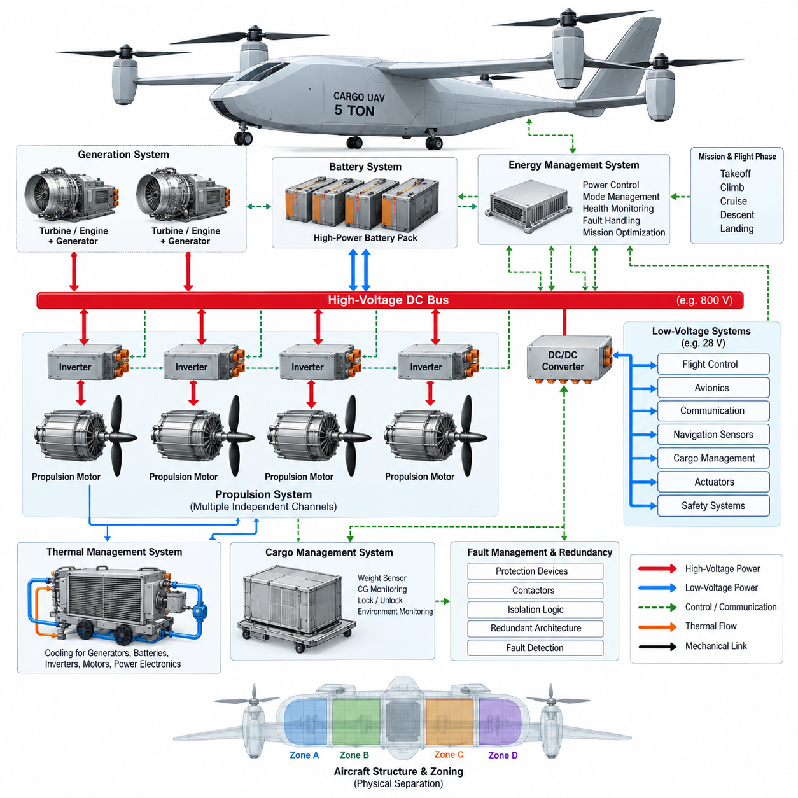
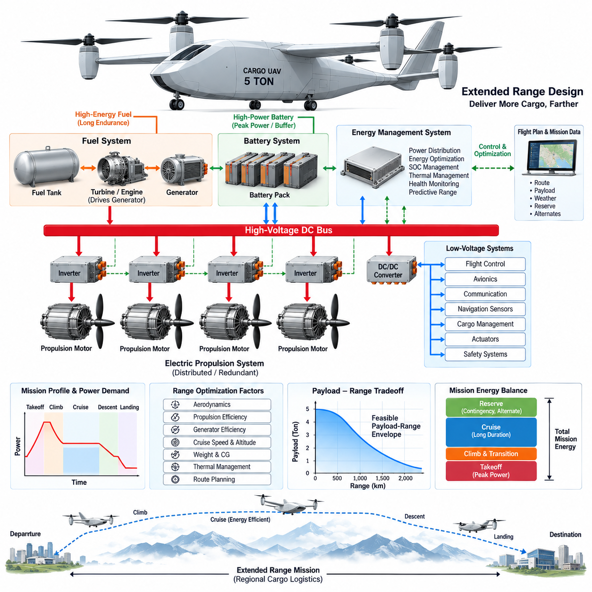
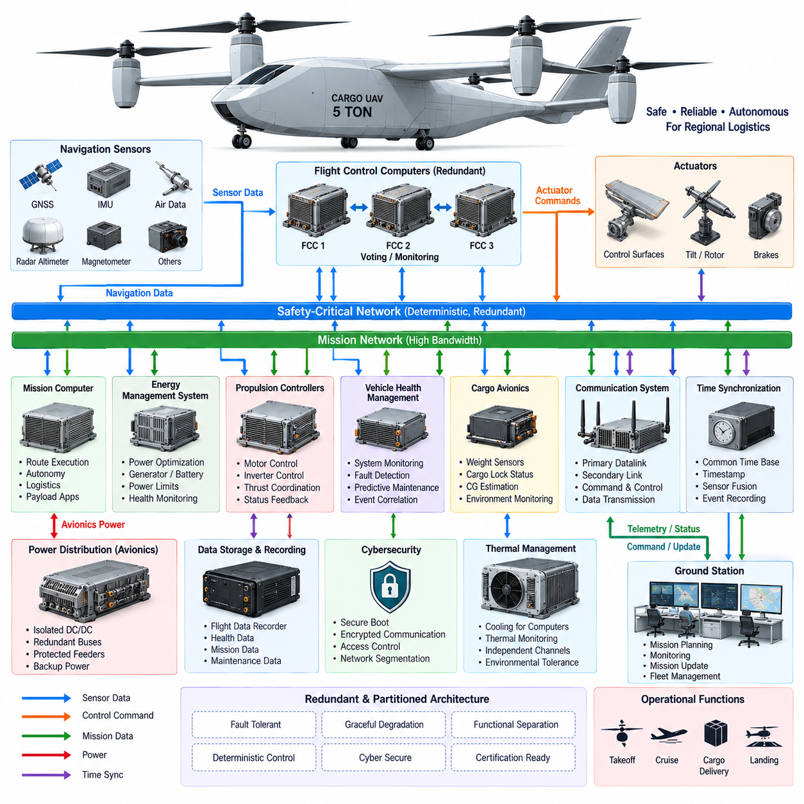
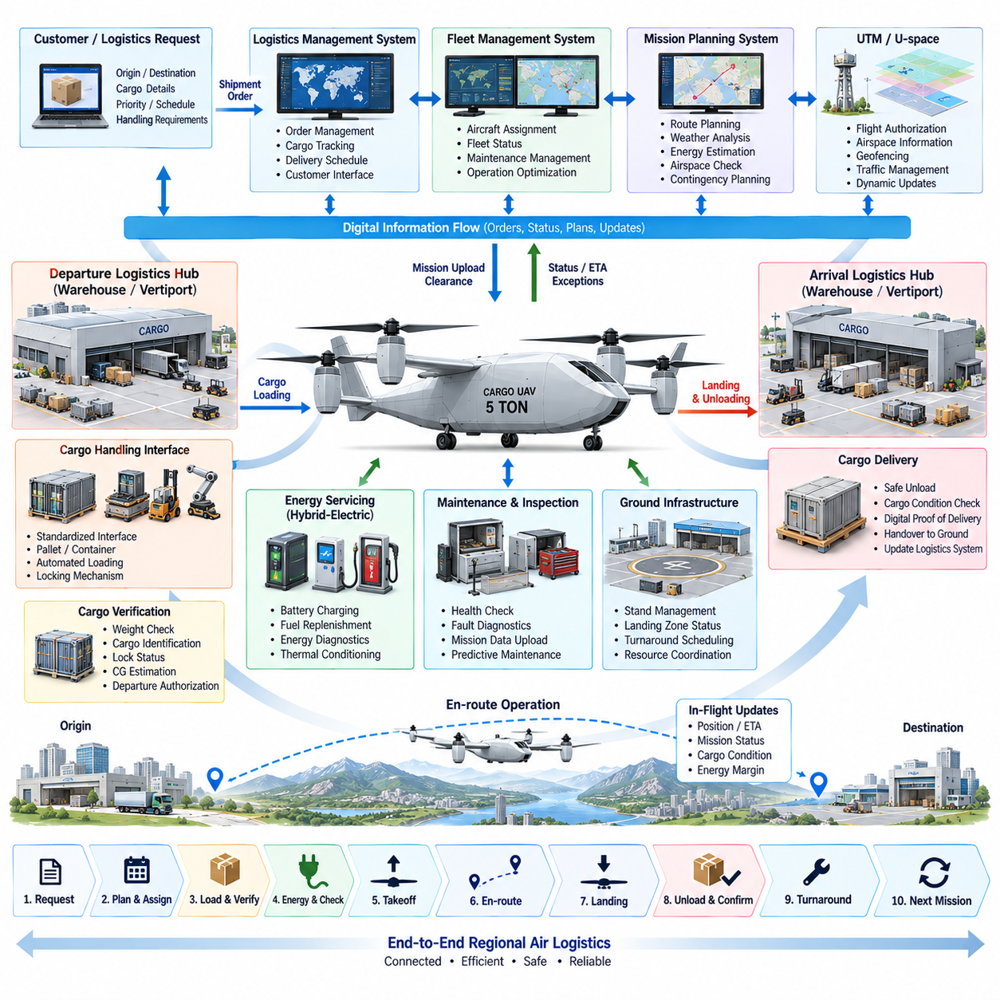
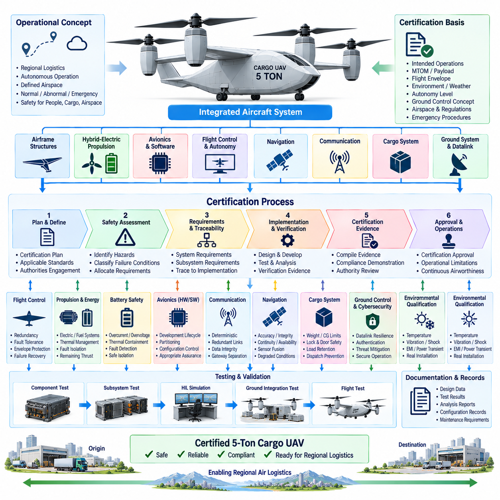

**Volume 18. Cargo UAV Architecture**

# Chapter 10. 5t Cargo UAV

## 10.01. Hybrid Electric Architecture

{width="7.268055555555556in" height="7.268055555555556in"}

A 5-ton cargo UAV requires a hybrid-electric architecture because the propulsion system must support high instantaneous power during takeoff and climb while maintaining sufficient energy capacity for regional cargo missions. A purely battery-electric system becomes increasingly constrained by battery mass as aircraft size and mission range grow. Hybridization separates the requirements for peak power and sustained energy, allowing different energy sources to be optimized for each operating condition.

The architecture is typically organized around a primary energy source, electrical generation system, high-voltage DC distribution network, battery energy-storage system, propulsion inverters, electric motors, and an Energy Management System. Fuel-based generation provides sustained cruise energy, while batteries supply transient power and absorb rapid load changes. The electrical bus becomes the central energy backbone connecting generation, storage, propulsion, avionics, and auxiliary loads.

A series hybrid-electric configuration is particularly suitable for an autonomous cargo aircraft because mechanical propulsion and thermal generation can be functionally separated. A turbine or internal-combustion engine drives one or more generators rather than directly driving the propellers. Generated electrical power is conditioned and distributed through the high-voltage network to independent propulsion channels, enabling flexible placement of motors and supporting distributed electric propulsion without complex mechanical transmission systems.

The high-voltage DC bus must accommodate large propulsion loads with minimum conductor mass and acceptable electrical losses. Increasing distribution voltage reduces current for a given power level, which decreases cable cross-section requirements and resistive losses. However, higher voltage introduces stronger requirements for insulation coordination, creepage and clearance, connector design, arc protection, electromagnetic compatibility, isolation monitoring, and safe maintenance procedures throughout the aircraft.

Battery packs perform more than an energy-storage function in the hybrid architecture. They provide power buffering during vertical takeoff, acceleration, climb, maneuvering, generator transients, and emergency operation. During cruise, the generator can operate near an efficient operating point while excess power recharges the battery when thermal and state-of-charge conditions permit. This arrangement prevents the generator from being sized exclusively for short-duration peak propulsion demand.

Propulsion power should be divided into multiple electrically isolated or independently protected channels. Each channel can include its own contactors, protection devices, inverter, motor controller, and propulsion motor. A single bus or inverter fault must therefore be prevented from disabling all thrust sources simultaneously. Cross-tie contactors may permit controlled energy sharing between healthy channels, but their operation must be governed by fault-containment logic to avoid propagating electrical failures.

The generation subsystem must also be designed around redundancy rather than maximum efficiency alone. Multiple smaller generator channels can provide greater fault tolerance than one centralized generator, although they increase mass and system complexity. Generator controllers regulate voltage, current, speed, and thermal limits while coordinating with the aircraft-level Energy Management System. A failed generator should be isolated rapidly while remaining sources and batteries automatically support essential propulsion and avionics loads.

The Energy Management System continuously determines how power is shared among generators, batteries, propulsion units, and auxiliary systems. Its decisions depend on flight phase, requested thrust, battery state of charge, battery temperature, generator capability, predicted mission energy, reserve requirements, and detected failures. Instead of merely reacting to instantaneous demand, advanced control can anticipate upcoming climb, cruise, descent, landing, and diversion requirements using mission-plan information.

Takeoff represents one of the most demanding operating states. The generators may operate near their continuous or short-term power limits while batteries provide additional peak power to the propulsion network. Once the aircraft transitions into efficient forward flight, propulsion demand decreases and the architecture can shift toward generator-dominant operation. Battery state of charge can then be gradually restored so that adequate electrical reserve remains available for landing, go-around, or emergency diversion.

Thermal management is inseparable from electrical architecture at this power level. Generators, rectifiers, DC/DC converters, batteries, inverters, motors, and high-current distribution components all generate heat. Independent or partially separated cooling loops can prevent a single thermal-system failure from simultaneously disabling multiple propulsion channels. Temperature measurements must therefore participate directly in power management, allowing controlled derating before component temperatures reach destructive or unsafe limits.

The low-voltage electrical domain should remain functionally separated from the propulsion high-voltage domain. Isolated DC/DC converters can supply flight-control computers, avionics, communication equipment, navigation sensors, cargo-management electronics, actuators, and safety systems. Critical avionics require redundant power feeds and independent backup energy so that loss of the main propulsion bus does not immediately remove flight-control authority, navigation capability, or command-and-control communication.

Fault management must coordinate electrical protection with flight-control behavior. Overcurrent, insulation failure, inverter faults, battery thermal events, generator loss, abnormal bus voltage, cooling degradation, or communication failures should trigger predefined isolation and reconfiguration actions. The flight-control system must simultaneously understand the resulting propulsion capability so that thrust allocation, trajectory, speed, altitude, landing-site selection, and mission continuation decisions remain consistent with available electrical power.

Physical separation is as important as logical redundancy. Redundant high-voltage cables, contactors, battery modules, communication links, and cooling circuits should not share unnecessary common routing that could allow fire, impact, fluid leakage, or structural damage to defeat multiple channels. Electrical zones can therefore be aligned with aircraft structural zones, creating distributed energy islands whose failures remain locally contained while healthy sections continue supplying sufficient power for controlled flight.

The hybrid architecture also creates a strong interface between propulsion control and cargo operation. Payload mass and center-of-gravity information influence required thrust, mission energy, climb performance, and reserve calculations. Before departure, the aircraft can combine measured cargo conditions with route distance, weather assumptions, battery state, fuel availability, generator health, and propulsion redundancy to determine whether the mission retains sufficient energy margins under defined contingency conditions.

For a 5-ton cargo UAV, hybrid-electric architecture should therefore be treated as an integrated aircraft-level energy and safety system rather than a simple combination of an engine and battery. Generation, storage, high-voltage distribution, propulsion, cooling, avionics power, fault containment, and mission planning must operate as coordinated layers. This system-level approach provides the foundation for the extended-range design, avionics architecture, regional logistics integration, and certification planning developed in the subsequent sections.

## 10.02. Extended Range Design

{width="7.268055555555556in" height="7.268055555555556in"}

For a 5-ton cargo UAV, extended-range design begins with the recognition that mission endurance cannot be increased efficiently by adding battery capacity alone. Every additional battery module increases stored electrical energy but also increases takeoff mass, structural loading, required lift, and propulsion power. A hybrid-electric aircraft therefore extends range by combining high-specific-energy fuel with batteries optimized primarily for peak power, transient response, reserve capability, and emergency operation.

Range must be treated as an aircraft-level energy problem rather than simply a fuel-capacity requirement. Payload mass, aerodynamic efficiency, cruise speed, altitude, propulsion efficiency, generator efficiency, battery condition, weather, reserve requirements, and diversion distance all influence usable mission radius. The design objective is therefore to minimize total energy consumed per unit of transported payload while maintaining sufficient margins for abnormal and emergency conditions.

A practical extended-range architecture can use fuel as the dominant energy source during sustained flight while retaining electrical propulsion throughout the aircraft. A turbine or engine drives electrical generators, and generated power passes through rectification and high-voltage distribution before reaching propulsion inverters and motors. Batteries remain connected to the electrical network as dynamic energy buffers, allowing the thermal generator to operate within a narrower and more efficient operating region.

Mission energy should be divided according to flight phase because power demand varies substantially between vertical takeoff, transition, climb, cruise, descent, and landing. Takeoff and climb require high propulsion power for relatively short periods, whereas cruise requires lower power for much longer durations. Designing the generator around sustained cruise and continuous-flight requirements while using batteries for temporary peak loads can reduce generator oversizing and improve overall aircraft mass efficiency.

Cruise optimization becomes especially important as mission distance increases. Small improvements in aerodynamic drag, propeller efficiency, motor efficiency, inverter efficiency, or generator efficiency accumulate over long operating periods. Cruise speed should therefore not automatically correspond to maximum aircraft speed. The preferred operating point is generally an energy-efficient combination of airspeed, altitude, propulsion loading, and generator output that minimizes energy consumption while satisfying mission-time requirements.

The Energy Management System must calculate not only present energy availability but also predicted energy requirements for the remaining route. It can combine flight-plan distance, aircraft mass, altitude profile, expected wind, propulsion efficiency, battery state of charge, fuel quantity, and generator health to estimate future energy margins. This transforms energy management from reactive power balancing into predictive mission-energy management capable of supporting autonomous range decisions.

Battery state of charge should be controlled within a mission-dependent operating window rather than simply maintained at the highest possible level. During high-power flight phases, controlled battery discharge supplements generator output. During efficient cruise, available generator capacity may restore part of the consumed battery energy. Before descent and landing, sufficient charge must remain available for approach, landing, go-around, generator failure, communication loss recovery, or diversion to an alternate landing site.

Fuel capacity must also be optimized rather than maximized. Additional fuel extends potential endurance but increases aircraft mass, which increases required lift and energy consumption. Fuel tank size, location, structural reinforcement, pumping equipment, fire protection, and changing center of gravity must therefore be evaluated together. The usable fuel quantity should be determined from defined mission profiles and reserve policies instead of simply occupying all available structural volume.

Center-of-gravity variation becomes important when both cargo and fuel represent significant fractions of aircraft mass. As fuel is consumed, the aircraft center of gravity may shift and alter stability, control effort, aerodynamic trim, and propulsion efficiency. Tank placement and fuel-transfer strategy can reduce these effects. The aircraft may also use fuel sequencing or active transfer to maintain the center of gravity within an energy-efficient and controllable region throughout the mission.

Extended-range operation requires propulsion redundancy to remain effective even after substantial energy has already been consumed. A nominal mission that reaches its destination with almost no electrical or fuel reserve is not operationally robust. Range calculations should therefore include contingency energy for generator loss, propulsion-channel degradation, unexpected headwind, holding, rerouting, rejected landing, go-around, and alternate-site recovery rather than considering only the ideal route.

Thermal conditions can directly reduce practical range. Continuous generator operation, sustained inverter loading, motor heating, battery cycling, and high ambient temperature may force power derating even when sufficient fuel remains onboard. Cooling-system capability must therefore be evaluated over the complete mission duration. Thermal prediction can be incorporated into energy management so that the aircraft avoids operating strategies that provide short-term performance at the expense of later propulsion availability.

Electrical distribution losses also become meaningful during long-duration missions. High-voltage operation reduces current and conductor losses, while efficient converters, short power paths, optimized cable sizing, and high-efficiency inverters reduce cumulative energy waste. The architecture should balance electrical efficiency against insulation mass, protection requirements, electromagnetic compatibility, maintainability, and fault containment rather than selecting bus voltage solely from theoretical transmission efficiency.

Payload-range tradeoff is a fundamental characteristic of the 5-ton cargo UAV. Maximum payload and maximum range normally cannot be achieved simultaneously because payload, fuel, batteries, and aircraft structure compete within the allowable takeoff mass. Mission planning should therefore use a payload-range envelope that identifies feasible combinations of cargo mass and distance. This enables the logistics system to determine whether a mission should carry less cargo, add an intermediate stop, or use another aircraft.

Route planning can further extend operational range without modifying aircraft hardware. Wind-aware routing, altitude optimization, energy-efficient climb profiles, reduced hover duration, optimized transition timing, and selection of suitable diversion sites can lower total mission energy. For autonomous operation, these calculations can be updated continuously as weather, airspace restrictions, aircraft health, and destination conditions change, allowing the aircraft to modify its flight strategy before energy margins become critical.

Extended-range design ultimately connects propulsion architecture, energy storage, aerodynamics, thermal management, cargo loading, flight planning, and safety into a single optimization problem. For the 5-ton cargo UAV, the objective is not simply to fly as far as possible, but to transport useful cargo over regional distances while preserving predictable energy reserves and fault tolerance. This architecture provides the energy foundation for the avionics, regional logistics, and certification considerations developed in the following sections.

## 10.03. 5t Avionics Architecture

{width="7.268055555555556in" height="7.268055555555556in"}

A 5-ton cargo UAV requires an avionics architecture that integrates flight control, navigation, propulsion coordination, energy management, communication, cargo supervision, and safety functions into a fault-tolerant airborne computing environment. Compared with smaller UAVs, the larger aircraft carries greater kinetic energy, payload value, electrical power, and operational responsibility, making avionics availability and deterministic behavior fundamental aircraft-level requirements rather than secondary equipment characteristics.

The architecture should separate safety-critical flight functions from mission-oriented computing while maintaining controlled interfaces between them. Flight Control Computers execute stabilization, guidance, actuator commands, and flight-envelope protection, whereas mission computers manage route execution, logistics information, payload functions, and higher-level autonomy. This separation prevents computational overload or failure in mission applications from directly compromising the deterministic control loops required for continued safe flight.

Flight-control computing should employ redundant channels capable of detecting faults and maintaining control after individual failures. Multiple processors can independently calculate aircraft state and control commands using synchronized sensor inputs. Their outputs may be compared through monitoring or voting logic before commands reach propulsion and flight-control actuators. Channel independence must include power, communication, timing, and software considerations so that nominal redundancy does not conceal common-mode failure paths.

Navigation architecture combines complementary sensing technologies because no single sensor remains reliable under every operating condition. Redundant inertial measurement units, GNSS receivers, air-data sensors, radar or radio-altitude information, and other navigation sources can be fused to estimate position, velocity, attitude, altitude, and heading. Sensor disagreement monitoring allows the system to identify degraded measurements and reconfigure navigation without immediately losing autonomous flight capability.

Accurate time synchronization is essential because flight control, navigation, propulsion, perception, and health-monitoring data originate from distributed devices. Sensor measurements must carry reliable timestamps so that fusion algorithms compare observations representing the same physical state. A common aircraft time base also improves event reconstruction, fault diagnosis, flight-data recording, maintenance analysis, and certification evidence by establishing a consistent sequence of system events.

The avionics communication network should distinguish deterministic safety traffic from high-bandwidth mission and sensor data. Flight-control commands, actuator feedback, propulsion status, and critical health information require predictable latency and bounded transmission behavior. Cameras, LiDAR, weather information, maps, cargo data, and diagnostic records may require substantially greater bandwidth but generally tolerate different timing characteristics. Network partitioning prevents noncritical traffic from interfering with flight-critical communication.

Redundant network paths are necessary where the loss of a single switch, cable, interface, or power domain could otherwise isolate critical avionics. Independent communication channels can connect flight computers, navigation units, propulsion controllers, and remote I/O modules. Gateway functions should strictly control data crossing between safety-critical and mission domains, including message validation, rate limitation, source authentication, fault filtering, and appropriate cybersecurity controls.

Propulsion avionics must coordinate closely with the hybrid-electric power architecture. The flight-control system determines required thrust, while propulsion controllers translate those requirements into motor torque, speed, and inverter commands. The Energy Management System simultaneously determines available electrical power from generators and batteries. Continuous exchange of power limits and propulsion capability ensures that flight commands remain achievable when energy sources, motors, inverters, or cooling systems become degraded.

The avionics architecture must therefore support graceful degradation rather than treating every component fault as an immediate mission-ending event. If one propulsion channel becomes unavailable, the flight controller can redistribute thrust among healthy units within established control limits. If a generator fails, energy management can revise available power. If navigation quality decreases, alternative sensor combinations can be selected while the mission manager evaluates whether continuation, diversion, or landing is appropriate.

A dedicated vehicle health management function can collect status information from flight computers, power electronics, batteries, generators, motors, actuators, sensors, communication networks, cooling systems, and cargo equipment. Instead of displaying isolated diagnostic codes, health management should correlate events across subsystems. This allows the aircraft to distinguish a local sensor anomaly from a developing system-level condition and supports predictive maintenance after accumulated fleet operation.

Cargo avionics form another important domain because payload condition directly affects aircraft operation. Weight sensors, cargo-lock status, center-of-gravity estimation, compartment environment, and loading information can be monitored before and during flight. Validated cargo information should be available to flight planning and energy management so that aircraft mass and balance assumptions correspond to the actual payload configuration rather than relying only on manually entered logistics data.

Ground communication must provide command, supervision, mission updates, and aircraft health information without making continuous connectivity a prerequisite for basic flight stability. Loss or degradation of the primary datalink should trigger predefined autonomous behavior rather than destabilize the aircraft. Multiple communication technologies may be combined for operational coverage, while critical command interfaces require authentication, integrity checking, encryption, access control, and protection against unauthorized control.

Avionics power distribution requires independence from the main propulsion network even though energy may ultimately originate from the same aircraft sources. Isolated DC/DC conversion, redundant low-voltage buses, protected feeders, and local backup energy can maintain flight computers, navigation sensors, communication equipment, and essential actuators during propulsion-bus disturbances. Power-domain separation must be coordinated with physical installation so that one electrical event cannot simultaneously disable redundant avionics channels.

Thermal design is equally important for computing reliability. Flight computers, network switches, navigation processors, communication equipment, and high-performance mission computers generate continuous heat, while the aircraft may experience wide ambient-temperature and altitude variations. Temperature monitoring and independent cooling provisions for critical channels can prevent common thermal failures. Mission computing may be selectively derated before safety-critical avionics are allowed to approach their thermal operating limits.

Cybersecurity must be incorporated into the architecture because the aircraft interacts with ground stations, fleet systems, maintenance tools, logistics infrastructure, and potentially traffic-management services. Secure boot, authenticated software, protected communication, controlled update mechanisms, network segmentation, logging, and access management reduce the possibility that a compromised noncritical interface can propagate into flight-critical functions. Security mechanisms must themselves preserve deterministic and available flight operation.

For the 5-ton cargo UAV, avionics should ultimately be designed as a distributed, partitioned, redundant, and reconfigurable system rather than as a single centralized computer. Flight control, navigation, propulsion, energy, communication, cargo, health management, and autonomy remain functionally distinct while exchanging validated information through controlled interfaces. This architecture provides the dependable computational foundation required for regional logistics operation and the certification planning addressed in the following sections.

## 10.04. Regional Logistics Interface

{width="7.268055555555556in" height="7.268055555555556in"}

The regional logistics interface defines how a 5-ton cargo UAV interacts with logistics centers, vertiports, warehouses, fleet systems, ground infrastructure, and airspace services throughout a transport mission. Unlike a standalone aircraft interface, it must coordinate physical cargo transfer, digital shipment information, aircraft readiness, route authorization, energy status, and operational scheduling. The aircraft therefore becomes one node within a larger regional logistics network rather than an isolated autonomous vehicle.

A typical mission begins when a logistics management system creates a transport request containing origin, destination, cargo mass, dimensions, priority, delivery window, and handling requirements. This information is transferred to the fleet management system, which evaluates available aircraft, payload capability, range, maintenance status, energy reserves, and weather conditions. A suitable UAV can then be assigned while the mission-planning system generates an operationally feasible flight plan.

The interface between warehouse operations and the aircraft should minimize manual data re-entry. Shipment identifiers, cargo manifests, hazardous or sensitive cargo classifications, destination information, and handling instructions can be transferred digitally to the cargo management system. Weight sensors and cargo identification devices provide independent confirmation of the loaded payload, allowing the aircraft to compare physical measurements against logistics records before accepting the mission for departure.

Cargo loading requires a standardized mechanical and electrical interface between the UAV and ground logistics equipment. Pallets, containers, automated loading platforms, forklifts, or robotic handling systems should interact with defined cargo-bay dimensions, attachment points, locking mechanisms, and loading limits. Standardization reduces turnaround time and enables the same aircraft to operate across multiple regional logistics hubs without requiring dedicated handling equipment at every destination.

The cargo-locking system must provide positive confirmation that the payload is mechanically secured before flight. Lock status, door status, measured cargo weight, and estimated center of gravity can be transmitted to the avionics and mission-management systems. If the measured configuration exceeds allowable mass or balance limits, departure authorization should be inhibited. This creates a direct connection between logistics handling and aircraft flight safety rather than treating cargo loading as an independent ground process.

Vertiport or logistics-hub infrastructure must coordinate aircraft arrival, parking, loading, charging or refueling, inspection, and departure. A digital ground interface can exchange stand availability, landing-zone status, energy-service readiness, cargo-handling status, and expected turnaround time. Automated scheduling becomes increasingly important when several cargo UAVs share limited landing areas, charging equipment, fuel systems, maintenance resources, and loading stations within the same facility.

Energy servicing must reflect the hybrid-electric architecture of the 5-ton aircraft. Ground infrastructure may need to provide battery charging, fuel replenishment, electrical diagnostics, and thermal conditioning during turnaround. Aircraft and ground systems should exchange battery state of charge, required charging energy, fuel quantity, estimated mission demand, and departure time. This allows energy servicing to be scheduled according to the next mission rather than automatically filling every energy source to maximum capacity.

Regional operations also require integration with fleet management. The fleet system maintains the operational state of multiple aircraft and can assign missions according to location, payload capability, range, energy state, maintenance condition, and predicted availability. When one aircraft becomes unavailable, another vehicle may be reassigned without rebuilding the entire logistics workflow. Fleet-level optimization can therefore balance aircraft utilization, energy consumption, maintenance intervals, cargo priority, and infrastructure congestion.

Mission planning connects the logistics request with the physical limitations of the aircraft. Route distance, payload mass, wind, altitude profile, airspace restrictions, available landing sites, fuel quantity, battery state, and reserve requirements must be evaluated together. A requested shipment should only become an executable mission when the aircraft can complete the route while preserving defined contingency margins for diversion, holding, go-around, system degradation, and alternate landing.

The logistics interface must also exchange information with unmanned traffic management or U-space services where applicable. Flight intent, route information, identification, geofencing constraints, airspace restrictions, and traffic information can influence departure timing and route selection. Changes in airspace availability may require the fleet and logistics systems to recalculate arrival time, energy consumption, cargo scheduling, or even aircraft assignment before the UAV departs or while it is already operating.

During flight, logistics systems do not require unrestricted access to safety-critical avionics. Instead, controlled interfaces should expose validated operational information such as aircraft position, estimated arrival time, mission status, cargo condition, energy margin, and significant exceptions. Safety-critical control remains within the aircraft and authorized command infrastructure. This separation allows customers and warehouse systems to track shipments without creating unnecessary pathways into flight-control networks.

Estimated time of arrival should be continuously updated because regional air logistics is affected by wind, airspace restrictions, route modifications, destination congestion, and aircraft performance. Updated arrival predictions allow destination facilities to prepare landing areas, cargo-handling equipment, personnel, autonomous robots, or onward transportation. The UAV therefore participates in synchronized logistics planning rather than merely reporting its geographic position during flight.

Cargo condition monitoring may be necessary for temperature-sensitive, fragile, medical, industrial, or high-value shipments. The cargo management system can monitor temperature, humidity, vibration, shock, door status, or other application-specific parameters and associate these measurements with the shipment record. Abnormal conditions can be reported to the logistics system while flight-critical decisions remain governed by the aircraft\'s safety and mission-management logic.

On arrival, the aircraft should transition from airborne mission control to coordinated ground handling. Landing confirmation, stand assignment, propulsion-safe state, cargo unlock authorization, and unloading readiness can be exchanged through the ground interface. Cargo release should occur only after the aircraft reaches a verified safe condition. Digital proof of delivery can then associate aircraft identity, shipment identity, arrival time, cargo condition, and transfer status within the logistics information system.

Turnaround efficiency becomes a major economic factor for regional cargo operation. The aircraft may need to unload cargo, receive a new payload, refuel, recharge, perform automated health checks, upload mission data, and obtain the next route within a short ground interval. Standardized digital and physical interfaces allow these activities to proceed in parallel where safe, reducing idle time and increasing the number of productive missions that each aircraft can perform per day.

The regional logistics interface should ultimately create an end-to-end connection among shipment demand, fleet assignment, cargo handling, aircraft mission planning, energy servicing, airspace coordination, flight execution, destination preparation, and delivery confirmation. For the 5-ton cargo UAV, this integration transforms autonomous flight capability into a practical transportation service. It also establishes the operational interfaces and evidence flows that must be considered in the subsequent certification plan.

## 10.05. 5t Certification Plan

{width="7.268055555555556in" height="7.268055555555556in"}

The certification plan for a 5-ton cargo UAV must address the aircraft as an integrated airborne system rather than treating propulsion, avionics, structures, cargo equipment, and autonomy as independent certification items. The aircraft combines substantial mass, high-energy hybrid-electric propulsion, autonomous flight capability, and regional logistics operation. Certification must therefore demonstrate that these interacting systems achieve acceptable safety across normal, abnormal, degraded, and emergency operating conditions.

Certification planning should begin early in aircraft development because certification assumptions directly influence architecture. Intended operations, maximum takeoff mass, payload limits, flight envelope, operating altitude, weather conditions, autonomy level, ground-control concept, airspace environment, and emergency procedures establish the certification basis. Defining these conditions late can force expensive redesign when previously selected structures, electronics, software, or redundancy concepts cannot satisfy required safety objectives.

A system-level safety assessment provides the foundation for allocating certification requirements. Aircraft functions should be analyzed to identify failures that could affect continued safe flight, controlled landing, people on the ground, cargo, or surrounding airspace. Failure conditions can then be classified according to severity, allowing corresponding integrity and assurance requirements to flow down into flight control, propulsion, navigation, power, communication, cargo, and ground-system architectures.

The certification process must establish traceability from aircraft-level requirements to subsystem requirements, implementation, verification, and final evidence. Each safety requirement should be linked to the hardware, software, interface, or operational procedure responsible for satisfying it. Verification results must then demonstrate that the implemented system meets the original requirement. This traceability prevents important safety assumptions from disappearing as development moves from concept design into detailed engineering and testing.

Flight-control certification requires evidence that stabilization, guidance, navigation, actuator control, and flight-envelope protection remain dependable throughout the approved operating envelope. Redundant Flight Control Computers, sensors, communication paths, and actuators must be evaluated not only during nominal operation but also under injected failures. Verification should demonstrate appropriate fault detection, isolation, voting, reconfiguration, degraded control, and recovery behavior without producing unsafe transient responses.

The hybrid-electric propulsion system introduces certification concerns that extend beyond conventional electrical power distribution. Batteries, fuel systems, generators, rectifiers, high-voltage buses, inverters, motors, contactors, and thermal-management equipment form a tightly coupled propulsion chain. Certification evidence must demonstrate electrical isolation, protection coordination, thermal containment, fault interruption, energy-source management, and sufficient remaining thrust when defined component failures occur.

Battery safety requires particular attention because high stored electrical energy can create thermal, electrical, and fire hazards. Testing should evaluate overcurrent, overvoltage, abnormal temperature, isolation faults, charging failures, internal or external fault scenarios, and containment behavior. Battery monitoring and the Energy Management System must detect unsafe conditions and isolate affected sections while preserving essential aircraft functions whenever the system architecture is designed to tolerate the initiating failure.

Avionics hardware and software assurance must be incorporated into the development lifecycle rather than added after functional implementation. Flight-critical computing requires controlled requirements, architecture, implementation, verification, configuration management, and change management. Hardware and software used for safety functions should provide evidence appropriate to their assigned criticality. Partitioning between flight-critical and mission functions must also demonstrate that failures or excessive resource use in one domain cannot corrupt another.

Communication architecture requires certification evidence for deterministic behavior, redundancy, data integrity, and failure containment. Safety-critical messages must reach their destinations within defined timing limits even under specified network loading and fault conditions. Redundant links should be tested for switch, cable, interface, and power failures. Gateways between safety-critical, mission, maintenance, cargo, and external communication networks must preserve the intended functional separation.

Navigation certification must demonstrate sufficient accuracy, integrity, continuity, and availability for the intended regional mission. GNSS, inertial sensors, air-data sources, altitude measurements, and other navigation inputs should be evaluated individually and as an integrated fusion system. Testing must include degraded or unavailable sensors, inconsistent measurements, communication delays, and environmental disturbances so that the aircraft\'s response to navigation uncertainty is understood and bounded.

Cargo systems become part of the certification scope when their behavior can affect aircraft safety. Payload weight, center of gravity, cargo locks, doors, structural attachment points, and loading interfaces must remain within defined limits. The aircraft should prevent dispatch when unsafe loading conditions are detected. Tests should also evaluate load retention under flight loads, vibration, maneuvering, landing conditions, and relevant emergency cases to demonstrate that cargo cannot create an uncontrolled hazard.

Ground-control and datalink certification should reflect the autonomous nature of the aircraft. Safe flight must not depend on uninterrupted human communication unless the approved operational concept explicitly requires it. Loss, degradation, delay, corruption, or unauthorized use of the datalink should produce defined aircraft behavior. Ground stations, command interfaces, authentication mechanisms, and operational procedures therefore form part of the safety argument wherever they can influence aircraft operation.

Cybersecurity assurance must address interfaces connecting the UAV to ground stations, fleet management, maintenance systems, logistics networks, software-update mechanisms, and traffic-management services. Threat analysis should identify pathways capable of affecting safety-related functions. Secure boot, authenticated software, encrypted communication, access control, network segmentation, logging, and controlled maintenance access can then be verified as part of the overall assurance framework rather than treated solely as information-technology features.

Environmental qualification should demonstrate that installed equipment continues operating under the conditions expected during service. Temperature, altitude, vibration, shock, humidity, electromagnetic interference, power transients, and other applicable environmental stresses must be considered according to equipment location and function. Qualification should reflect actual installation conditions because a component that performs correctly on a laboratory bench may behave differently when exposed to aircraft vibration, cooling limitations, wiring effects, or electromagnetic coupling.

Certification testing should progress from component and subsystem verification toward integrated aircraft testing. Hardware-in-the-loop simulation can expose flight computers and propulsion controllers to repeatable normal and failure scenarios before flight. Ground integration tests can verify complete electrical, communication, thermal, and cargo interfaces. Flight testing can then progressively expand the operating envelope while confirming performance, handling, autonomy, failure response, energy reserves, and operational procedures under controlled conditions.

The final certification argument must combine design evidence, safety analyses, verification records, qualification results, ground tests, flight tests, configuration records, maintenance requirements, and operational limitations into a coherent demonstration of compliance. For the 5-ton cargo UAV, certification is therefore a continuous engineering process connecting requirements, architecture, implementation, testing, and operations. This approach establishes the assurance foundation required to deploy hybrid-electric autonomous cargo aircraft within regional logistics networks.
