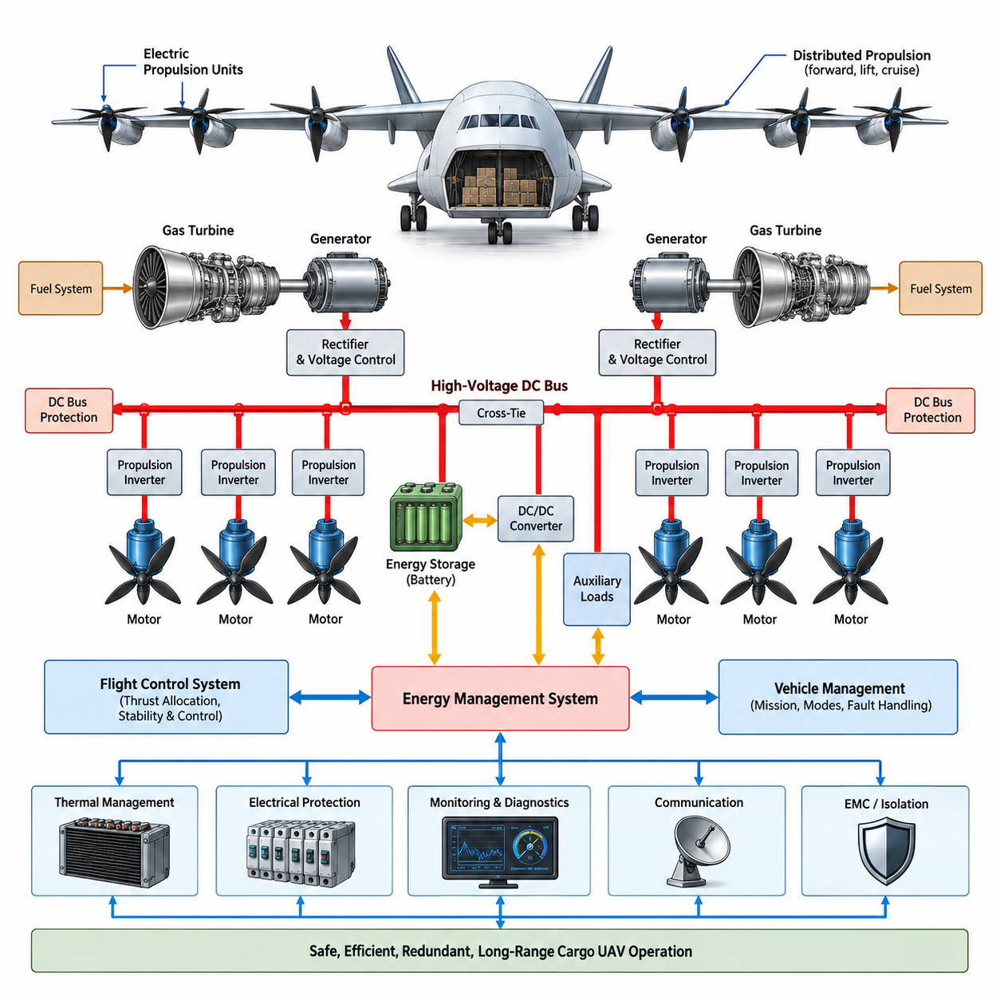
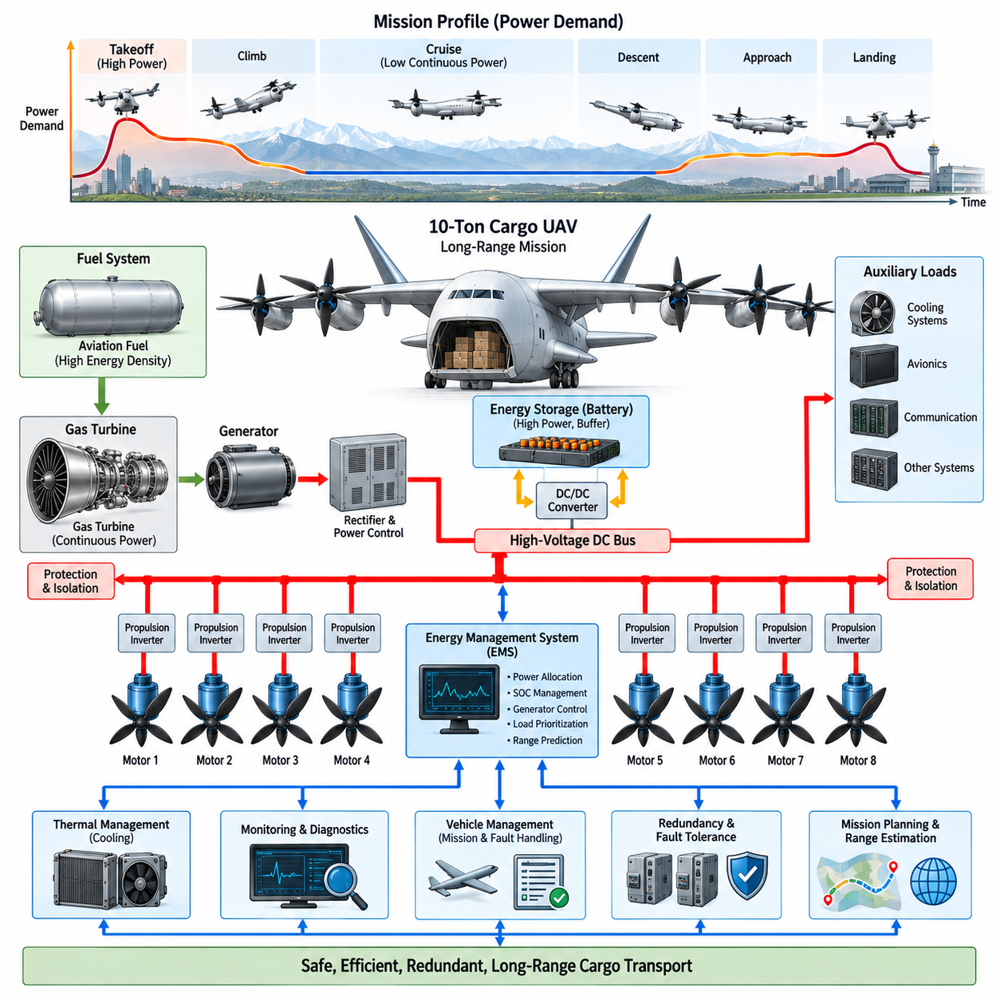
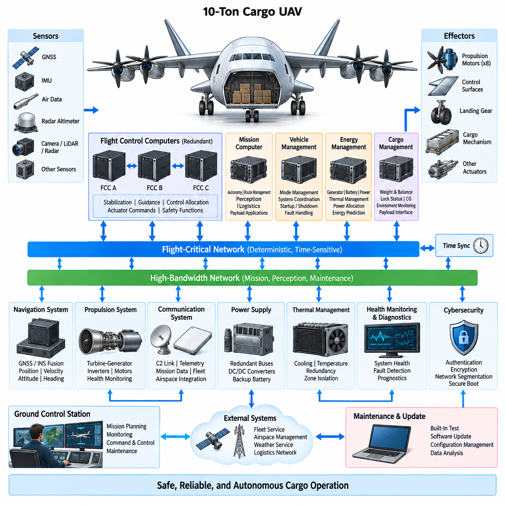
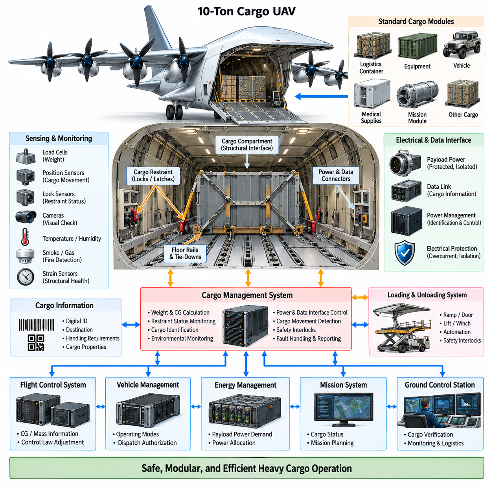
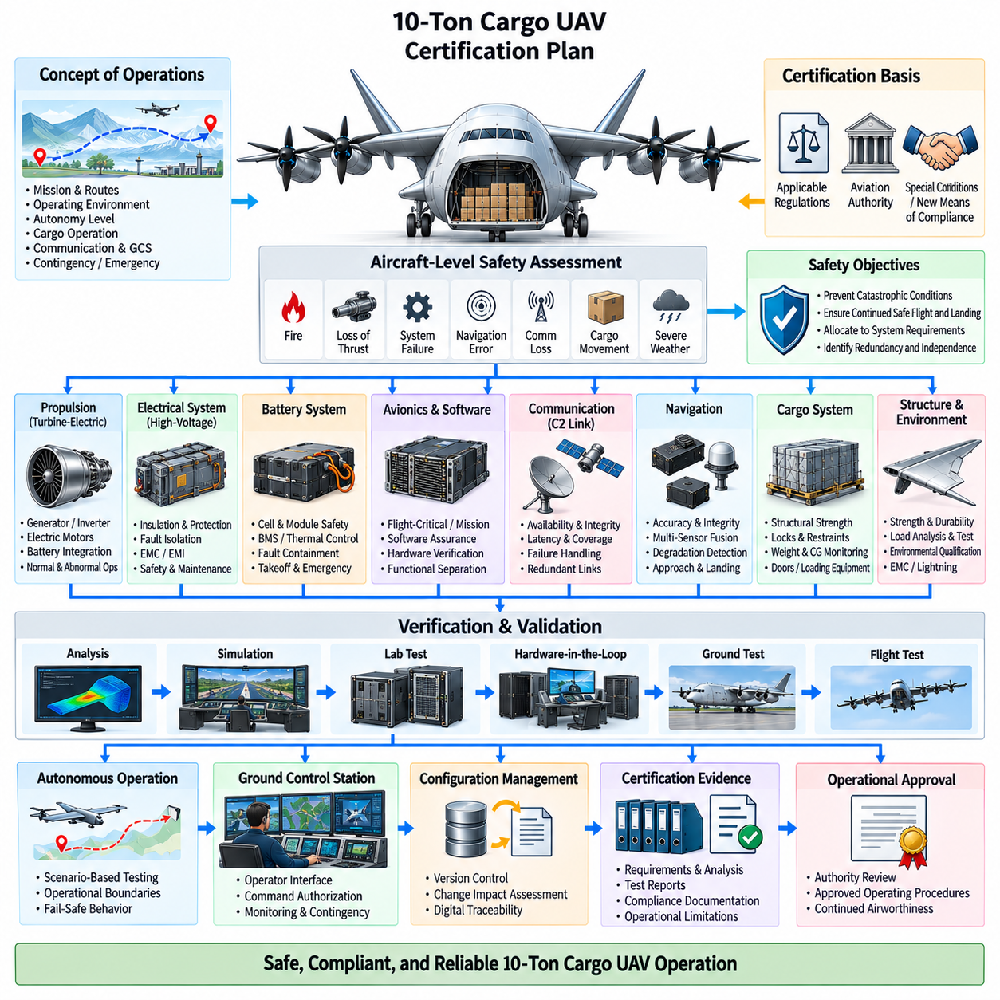

**Volume 18. Cargo UAV Architecture**

# Chapter 11. 10t Cargo UAV

## 11.01. Turbine Electric Architecture

{width="7.268055555555556in" height="7.268055555555556in"}

:::

A turbine-electric architecture for a 10-ton-class cargo UAV combines the high specific energy of aviation fuel with electrically distributed propulsion. Instead of mechanically connecting a gas turbine to propellers or rotors through shafts and gearboxes, the turbine drives one or more high-speed electrical generators. Generated electrical power is conditioned and distributed through a high-voltage network to multiple electric propulsion units located around the aircraft.

The architecture separates primary energy generation from thrust production. Aviation fuel supplies chemical energy to the turbine, the turbine converts it into mechanical shaft power, and the generator converts that shaft power into electrical energy. Power electronics then regulate voltage and current before delivering energy to propulsion inverters. Each inverter independently controls an electric motor, allowing propulsion units to be distributed according to aerodynamic and structural requirements.

For a heavy cargo UAV, this decoupling provides an important aircraft-level advantage. Propulsors no longer need to be positioned according to mechanical transmission constraints from the turbine. Motors can be installed along wings, lifting surfaces, or dedicated propulsion structures, while turbine-generator modules can be placed near locations favorable for mass distribution, maintenance, thermal management, and fuel systems. This flexibility supports unconventional VTOL and distributed-propulsion configurations.

A practical system may employ multiple turbine-generator channels rather than one centralized generator. Two or more independent generation channels reduce the consequence of a single turbine, generator, rectifier, or feeder failure. Each channel can normally supply a defined portion of total aircraft power while cross-tie contactors permit healthy sources to support critical buses after a failure. Generator sizing therefore considers both nominal efficiency and degraded-flight requirements.

The high-voltage DC bus forms the electrical backbone of the propulsion architecture. Generator output is rectified and regulated before entering the main DC distribution system, from which propulsion inverters, energy-storage interfaces, thermal systems, and auxiliary converters receive power. High operating voltage reduces current for a given megawatt-level power demand, helping limit conductor mass, resistive losses, connector size, and thermal loading throughout the aircraft.

Electrical distribution must be physically and functionally partitioned. Independent left and right propulsion buses, isolated generator feeders, sectionalized power distribution units, and controlled cross-ties can prevent a localized fault from disabling the entire propulsion system. Protection devices must rapidly identify overcurrent, short circuits, insulation faults, arc conditions, and abnormal bus voltage while maintaining power to unaffected propulsion channels whenever continued flight remains possible.

Energy storage can complement the turbine-generator system even when the turbine remains the principal energy source. A high-power battery may provide transient power during takeoff, vertical lift, rapid maneuvering, or sudden propulsion demand, reducing the turbine-generator capacity required for short-duration peaks. The battery can also maintain essential flight-control, avionics, communication, and selected propulsion functions during generator transitions or temporary generation disturbances.

This hybrid buffering function allows the turbine to operate closer to efficient steady-state operating regions. Turbines generally respond more slowly than electric motors to rapid load changes, while propulsion motors can demand substantial power almost instantaneously. The battery and bidirectional DC/DC converter can absorb this dynamic mismatch by supplying power during rapid load increases and accepting excess electrical energy when propulsion demand decreases faster than turbine output can be reduced.

Propulsion motors and inverters are organized as independently controllable thrust channels. The flight-control system commands torque or speed references while local motor controllers execute high-bandwidth electrical control. Distributed propulsion permits differential thrust to contribute to attitude and directional control, potentially providing additional control authority after certain actuator failures. However, the flight-control allocation logic must continuously account for available electrical power, motor limits, and failed propulsion channels.

The Energy Management System coordinates turbine generators, batteries, DC/DC converters, propulsion loads, and aircraft auxiliary loads. It estimates available generation capacity, battery state of charge, thermal margins, and predicted mission demand before allocating electrical power. During high-demand phases, propulsion receives priority, while nonessential loads can be reduced or disconnected. During cruise, the system can restore energy reserves and operate turbine generators near favorable efficiency points.

A hierarchical control structure helps separate fast electrical dynamics from slower mission-level optimization. Motor inverters regulate currents within milliseconds, DC bus controllers stabilize electrical power flow, generator controllers manage turbine-generator output, and the supervisory Energy Management System determines operating modes. Above these layers, the vehicle management and flight-control systems provide mission requirements, flight phase information, fault status, and propulsion commands that influence overall energy allocation.

Thermal management becomes a major architectural subsystem because losses are distributed among generators, rectifiers, converters, inverters, motors, batteries, and cables. Liquid cooling loops may serve high-power electronics and motors, while turbine-generator modules require dedicated airflow, lubrication, and high-temperature management. Thermal zones should be designed so that a failure or leak in one cooling circuit does not simultaneously remove multiple redundant propulsion or generation channels.

The turbine-electric architecture also requires strong electrical isolation and electromagnetic compatibility. High-frequency switching from megawatt-class converters can generate conducted and radiated interference capable of affecting flight computers, GNSS receivers, communication equipment, sensors, and navigation electronics. Cable routing, shielding, grounding, filtering, enclosure design, common-mode control, and physical separation therefore become integral elements of the propulsion architecture rather than secondary installation concerns.

Startup and shutdown sequences require coordinated control across several energy domains. A battery or auxiliary power source can initially energize avionics, control electronics, pumps, contactors, and turbine-start systems. After turbine stabilization, the generator is synchronized with its controlled DC interface and gradually assumes aircraft loads. Shutdown reverses this sequence while maintaining essential buses until propulsion, cooling, data recording, and safety functions have reached defined safe states.

Fault management must address both electrical and propulsion consequences. A generator failure changes available power, an inverter failure removes an individual thrust channel, and a bus fault can affect several motors simultaneously if distribution is not sufficiently partitioned. Fault detection, isolation, and reconfiguration logic therefore operates together with flight-control reallocation. The aircraft must determine not merely which component failed, but how much thrust and electrical energy remain available.

The architecture should support degraded operating modes defined around continued safe flight rather than full performance. After losing one generation channel, the aircraft may reduce maximum thrust, airspeed, climb capability, or mission range while retaining sufficient power for controlled flight and landing. Battery reserves can provide temporary emergency support, but emergency energy must be managed against time-to-landing, thermal limits, remaining generator capacity, and the power required by flight-critical systems.

For long-range cargo missions, turbine-electric propulsion offers a different optimization space from pure battery-electric propulsion. Fuel provides substantially greater mission energy density, while electric transmission enables flexible propulsion placement and precise thrust control. The resulting aircraft can exploit fuel for endurance without returning to mechanically complex distributed shafts and gearboxes. The tradeoff is increased dependence on high-power generators, converters, protection systems, cooling equipment, and electrical fault management.

Weight optimization must therefore be performed at the complete aircraft level. Increasing bus voltage can reduce cable mass but raises insulation, clearance, connector, and protection challenges. Adding generator redundancy improves fault tolerance but increases turbine and generator mass. Larger batteries improve peak-power capability and emergency endurance but reduce payload fraction. The preferred architecture emerges from balancing payload, range, hover demand, cruise efficiency, redundancy, thermal capacity, and certification objectives.

Modularity is particularly valuable for a 10-ton cargo UAV because propulsion and generation technology may evolve during the aircraft program. Standardized interfaces between turbine-generator modules, high-voltage distribution units, converters, propulsion inverters, motors, and control networks allow components to be upgraded without redesigning the complete aircraft. Electrical, mechanical, cooling, communication, diagnostic, and safety interfaces should therefore be defined as controlled architectural boundaries.

Health monitoring should extend from individual semiconductor devices to the complete propulsion-energy chain. Generator temperatures, bearing condition, insulation resistance, DC bus ripple, inverter switching health, motor winding temperature, vibration, battery condition, cooling performance, and connector temperatures can be monitored continuously. Trend analysis supports predictive maintenance while real-time diagnostics provide the flight-control and energy-management systems with accurate information about remaining propulsion capability.

The turbine-electric architecture ultimately functions as an integrated energy-and-thrust network rather than a collection of independent electrical components. Turbine generators provide sustained mission energy, batteries handle transient and emergency demands, high-voltage buses distribute power, converters regulate energy flow, and distributed motors create thrust. Coordinated control among these elements enables a heavy cargo UAV to combine long range, flexible propulsion placement, redundancy, and autonomous operation.

For the 10-ton-class cargo UAV progression, this architecture establishes the foundation for the following long-range power design, avionics architecture, heavy-cargo interface, and certification planning topics. Its central engineering objective is to maintain controllable propulsion despite credible component failures while delivering sufficient continuous and peak power for heavy cargo operations. The design therefore links energy efficiency, redundancy, electrical protection, thermal management, flight control, diagnostics, and maintainability into one aircraft-level architecture.

## 11.02. Long Range Power Design

{width="7.268055555555556in" height="7.268055555555556in"}

:::

Long-range power design for a 10-ton-class cargo UAV must balance mission energy, continuous propulsion demand, peak power, reserve capability, and system mass. Unlike short-range electric aircraft, the dominant design problem is not simply achieving maximum battery capacity. The architecture must sustain hours of operation while preserving sufficient power for takeoff, climb, cruise, diversion, approach, landing, and abnormal operating conditions.

The mission power profile provides the starting point for system sizing. Vertical takeoff or low-speed lift can require very high instantaneous propulsion power, while efficient wing-borne cruise generally requires substantially lower continuous power. Climb, maneuvering, adverse weather, cargo mass variation, and landing introduce additional transient demands. The power system must therefore be designed from the complete mission profile rather than a single maximum-power operating point.

For a turbine-electric aircraft, aviation fuel serves as the principal long-duration energy source. Fuel offers substantially higher usable energy per unit mass than present battery systems, making it suitable for regional and long-range heavy cargo missions. The turbine-generator system converts this stored chemical energy into electrical power, allowing the aircraft to retain distributed electric propulsion while avoiding the battery mass that would otherwise dominate a multi-hour mission.

The turbine-generator should primarily be sized around sustained mission power rather than the absolute short-duration propulsion peak. During cruise, the generator can operate near an efficient operating region and simultaneously supply propulsion, avionics, cooling, communication, and auxiliary loads. During higher-demand phases, stored electrical energy can supplement generator output. This approach reduces unnecessary generator oversizing while maintaining the required peak propulsion capability.

A high-power battery becomes an energy buffer rather than the sole propulsion energy source. It can support vertical takeoff, rapid climb, maneuvering, go-around, and sudden changes in thrust demand while absorbing the difference between instantaneous motor demand and turbine-generator output. Battery sizing consequently depends on both required energy and required discharge power, because a relatively short high-power event may impose a stronger design constraint than total stored energy.

Long-range operation requires deliberate management of battery state of charge throughout the mission. Consuming excessive battery energy during departure may leave insufficient reserve for landing or an emergency, while maintaining an unnecessarily high reserve can increase fuel consumption or constrain usable propulsion performance. The Energy Management System must therefore establish state-of-charge targets for each mission phase and continuously update them according to aircraft condition and remaining mission requirements.

The high-voltage DC distribution network must efficiently transfer large amounts of electrical power over the aircraft. Increasing bus voltage reduces current for a given propulsion power and can significantly reduce conductor cross-section, cable mass, resistive losses, and thermal loading. However, higher voltage increases requirements for insulation, creepage and clearance distances, connectors, switching devices, arc protection, maintenance procedures, and environmental qualification.

Power conversion efficiency has a direct influence on long-range capability because small percentage losses accumulate continuously during multi-hour operation. Losses occur in generators, rectifiers, DC/DC converters, propulsion inverters, motors, cables, connectors, and cooling systems. Efficiency must therefore be evaluated across the entire energy conversion chain from fuel to thrust. Optimizing only one component can provide limited benefit if losses elsewhere dominate the system-level energy balance.

Cruise optimization is especially important because cruise normally occupies the largest fraction of a long-range mission. Turbine operating points, generator efficiency, bus voltage, motor speed, propeller or rotor efficiency, and aerodynamic configuration should be coordinated around representative cruise conditions. Variable operating strategies can allow the propulsion system to maintain high efficiency as aircraft mass decreases through fuel consumption and environmental conditions change during flight.

Redundant generation must be incorporated without allowing redundancy mass to eliminate the range advantage of turbine-electric propulsion. Multiple turbine-generator channels can share normal loads while providing degraded capability after a failure. The required redundancy level should be derived from continued-safe-flight objectives. A failed generator does not necessarily require the remaining system to preserve maximum performance, but it must provide enough power for controlled flight, diversion, and landing.

Electrical bus segmentation is equally important for long-range reliability. Propulsion motors should be distributed across independent power zones so that a single bus, contactor, converter, cable, or protection-device failure cannot remove all thrust on one critical axis. Cross-ties can permit controlled power sharing between healthy zones, but their operation must be supervised carefully to prevent a fault from propagating from one electrical section into another.

Reserve energy must be treated as a system-level quantity rather than simply additional fuel or battery capacity. The reserve should account for diversion, holding, unexpected headwinds, route changes, degraded propulsion efficiency, generator failures, battery limitations, and landing requirements. Fuel reserve and electrical reserve can serve different purposes, with fuel providing sustained endurance and the battery providing immediate high-power support during transient or emergency conditions.

Thermal capacity also constrains long-range power design. A propulsion system capable of producing high power for several minutes may not necessarily sustain elevated output for hours. Generator windings, power semiconductor junctions, motor windings, bearings, battery cells, cables, and connectors all accumulate heat. Cooling systems must therefore be sized for continuous thermal equilibrium during cruise while retaining sufficient transient capacity for takeoff, climb, abnormal operation, and hot-weather conditions.

Cooling itself consumes power and adds mass, creating an important optimization loop. Larger pumps, fans, heat exchangers, ducts, coolant volumes, and radiators improve thermal capability but increase aircraft weight and parasitic energy consumption. Long-range design should minimize total mission energy rather than individual component temperature. Efficient component placement and utilization of external airflow can reduce both cooling power and dedicated thermal-management hardware.

Fuel consumption progressively changes aircraft mass and center-of-gravity characteristics during a long mission. Fuel tank arrangement, transfer strategy, and consumption sequencing should therefore be coordinated with flight mechanics and cargo loading. The power-management system can exchange fuel state and predicted consumption information with vehicle management so that energy optimization does not create undesirable center-of-gravity migration or structural loading conditions.

Mission planning should incorporate power availability before departure rather than treating energy management only as an onboard function. Payload mass, route length, altitude, wind, temperature, expected hover duration, reserve requirements, and alternate landing locations can be converted into a predicted energy profile. The aircraft can then determine whether sufficient fuel, battery energy, generator capacity, and thermal margin exist before accepting the mission.

During flight, the predicted energy profile should be continuously recalculated using actual operating data. Unexpected headwinds, route deviations, increased cooling demand, propulsion degradation, or extended holding can change the remaining range significantly. Real-time range estimation should therefore use measured fuel quantity, battery state of charge, generator efficiency, propulsion consumption, aircraft mass, and environmental conditions rather than relying only on the original mission plan.

Load prioritization becomes essential when available generation falls below total requested power. Flight control and essential propulsion functions receive the highest priority, followed by safety-critical avionics, navigation, communication, and thermal systems. Mission equipment and nonessential cargo services can be reduced or disconnected when necessary. Such load shedding preserves the electrical energy required to maintain aircraft control and reach a suitable landing location.

A long-range aircraft also benefits from predictive energy management. Instead of reacting only to current power demand, the supervisory controller can use the planned trajectory to anticipate climbs, descents, hover segments, weather regions, and landing requirements. The turbine-generator operating point and battery state can then be prepared in advance, reducing inefficient transients and ensuring that sufficient electrical reserve is available before high-power mission phases begin.

Degraded-mode range must be considered separately from nominal range. Loss of a turbine-generator channel, cooling loop, battery module, propulsion motor, or power-distribution section can increase energy consumption while reducing available power. The vehicle management system should calculate a revised safe operating envelope and reachable landing region based on the actual remaining system rather than assuming nominal efficiency after a fault.

Diagnostics and prognostics further support long-range operation by estimating the health of energy-system components. Trends in turbine efficiency, generator temperature, inverter losses, battery resistance, motor vibration, cooling performance, and insulation condition can indicate progressive degradation. Combining these measurements with mission energy prediction enables the aircraft to identify whether a component can safely complete the planned route or whether an earlier diversion is required.

The final power architecture is therefore determined by an aircraft-level trade among fuel quantity, turbine-generator rating, battery capacity, bus voltage, conversion efficiency, cooling capacity, redundancy, and payload. Increasing any individual margin generally adds mass, which can itself increase propulsion energy demand. Long-range optimization must iterate these variables together until mission endurance, payload capability, safety reserves, and degraded-operation requirements converge.

For a 10-ton cargo UAV, long-range power design ultimately transforms the turbine-electric architecture into a mission-energy system. The objective is not merely to generate enough electrical power, but to deliver the correct amount of power at every flight phase while preserving energy for foreseeable contingencies. Coordinated generation, storage, distribution, thermal management, prediction, and fault reconfiguration enable heavy cargo transport over extended distances with practical payload capacity and operational resilience.

## 11.03. 10t Avionics Architecture

{width="7.268055555555556in" height="7.268055555555556in"}

The avionics architecture of a 10-ton-class cargo UAV must coordinate flight control, navigation, propulsion, energy management, cargo handling, communication, and autonomous mission functions within a highly fault-tolerant computing environment. At this aircraft scale, avionics is not simply a collection of independent controllers. It becomes an integrated nervous system that connects sensing, computation, communication, actuation, power management, and ground supervision.

Flight-critical computing should be separated from mission-oriented and payload computing so that failures in high-performance autonomy functions cannot directly compromise basic aircraft control. Flight Control Computers execute deterministic stabilization, guidance, control allocation, actuator commands, and safety functions, while mission computers handle route execution, logistics coordination, perception, and higher-level autonomy. Defined interfaces connect these domains while preserving functional isolation.

Redundant Flight Control Computers form the core of the architecture. Multiple independent computing lanes can receive common sensor information, calculate control commands, and compare results through monitoring and voting mechanisms. A disagreement, timing violation, processor fault, or corrupted output can cause the affected lane to be isolated while healthy lanes continue operation. Redundancy must include not only processors but also power supplies, communication paths, clocks, and critical input/output interfaces.

Navigation requires multiple complementary sensing sources because a heavy autonomous cargo aircraft cannot depend on a single positioning technology. GNSS, inertial measurement units, air-data sensors, radar altitude, radio navigation, and other available references can be fused to estimate position, velocity, attitude, altitude, and heading. Independent navigation channels and consistency monitoring allow the system to detect sensor drift, signal loss, interference, or implausible measurements.

The avionics network must carry both deterministic flight-critical traffic and high-bandwidth mission data. Time-sensitive control messages require bounded latency, predictable delivery, fault containment, and carefully controlled network loading. High-resolution cameras, radar, LiDAR, health-monitoring data, and mission information may require substantially greater bandwidth. The architecture can therefore separate critical control networks from high-bandwidth perception and service networks while providing controlled gateways between them.

Time synchronization is essential because distributed sensors and computers must interpret measurements within a common temporal reference. IMU samples, GNSS observations, actuator feedback, propulsion states, cargo measurements, and perception data can become inconsistent if timestamps are inaccurate. A synchronized aircraft time base, redundant timing sources, hardware-supported timestamping, and monitoring of clock integrity improve sensor fusion, event reconstruction, control performance, and fault diagnosis.

The propulsion interface becomes especially important in a turbine-electric 10-ton cargo UAV. Avionics must coordinate turbine generators, high-voltage distribution, batteries, converters, propulsion inverters, and distributed electric motors without embedding all energy-control functions inside the Flight Control Computer. The flight-control domain requests required thrust, while propulsion and energy controllers determine how available electrical power should be allocated within component and thermal limits.

Control allocation translates desired aircraft forces and moments into commands for multiple distributed propulsion units and aerodynamic actuators. Under nominal conditions, the allocation algorithm can optimize efficiency, noise, component loading, or energy consumption. Following a motor, inverter, actuator, or power-zone failure, it must rapidly calculate a feasible command distribution using the remaining effectors. This makes propulsion health information a direct input to flight-critical control.

Vehicle Management provides coordination above individual subsystem controllers. It maintains aircraft operating modes, monitors system configuration, supervises startup and shutdown sequences, manages degraded states, and exchanges information among flight control, propulsion, energy, cargo, and mission systems. The vehicle manager must distinguish between faults that require immediate protective action and degradations that permit continued operation with reduced performance or modified mission objectives.

The Energy Management System is closely integrated with avionics because available electrical power directly constrains achievable thrust and mission capability. It provides generator availability, battery state of charge, thermal margins, bus status, and predicted energy information to vehicle and mission management. In return, flight and mission systems provide expected power demand and trajectory information, allowing generation and storage resources to be prepared before high-power flight phases.

Cargo management is also part of the avionics architecture rather than an isolated logistics function. Cargo weight, locking status, loading configuration, center-of-gravity information, environmental conditions, and payload interface status can affect dispatch and flight operation. The aircraft should prevent takeoff when critical cargo constraints are violated and continuously monitor conditions that could change structural loading, balance, electrical demand, or mission safety during flight.

For heavy cargo operation, center-of-gravity monitoring must interact with navigation and flight-control functions. Loading errors or cargo movement can alter stability margins and actuator requirements. Weight and balance information can therefore be incorporated into control-law configuration, performance prediction, energy estimation, and flight-envelope management. Abnormal changes detected during flight should trigger diagnostic evaluation and, when necessary, modified control limits or landing decisions.

Autonomous mission computing handles functions that do not require the deterministic execution characteristics of the inner flight-control loops. Route management, obstacle assessment, landing-zone evaluation, weather interpretation, logistics coordination, and contingency planning can operate in this domain. High-performance processors or AI accelerators may be used, but their outputs should pass through validated supervisory interfaces before they can influence safety-critical aircraft commands.

The communication architecture connects the aircraft with the Ground Control Station, fleet services, airspace-management infrastructure, and other authorized systems. Multiple communication links may provide command and control, telemetry, mission updates, maintenance information, and payload data. Link management should select appropriate channels according to availability and mission phase while ensuring that loss of a nonessential broadband connection does not remove essential command or safety capability.

Cybersecurity becomes inseparable from avionics safety when external communication can influence mission data or aircraft configuration. Authentication, encryption, secure boot, signed software, access control, network segmentation, protected maintenance interfaces, and monitored gateways reduce the possibility that compromised mission or communication systems can affect flight-critical functions. Security mechanisms themselves must also be designed so that failures do not unpredictably interrupt essential avionics operation.

Health monitoring and diagnostics should collect information across computers, networks, sensors, actuators, propulsion channels, electrical buses, thermal systems, and cargo equipment. Rather than reporting only individual fault codes, the diagnostic architecture should determine relationships among failures and estimate remaining functional capability. This information supports onboard reconfiguration, ground maintenance, mission decisions, and post-flight analysis while reducing unnecessary replacement of healthy components.

Fault Detection, Isolation and Reconfiguration must operate across subsystem boundaries. A propulsion anomaly may originate from a motor, inverter, electrical bus, cooling system, communication path, or command source, and the appropriate response depends on the actual failure mechanism. Distributed local diagnostics can detect component-level abnormalities, while vehicle-level reasoning determines their aircraft-level consequences and selects an appropriate degraded operating configuration.

Power supply redundancy for avionics must remain independent from propulsion redundancy wherever practical. Flight-critical computers, navigation sensors, communication equipment, and essential actuators require protected electrical buses capable of surviving failures in the main propulsion distribution system. Independent DC/DC conversion, backup batteries, separated feeders, controlled cross-ties, and load-shedding strategies can maintain essential avionics long enough to preserve aircraft control and complete an emergency landing.

Thermal management of avionics must also respect redundancy boundaries. Installing redundant computers on the same cooling loop or within the same vulnerable thermal zone can create a common-cause failure despite electrical independence. Critical computing lanes, network switches, power converters, and navigation units should therefore be arranged so that cooling, airflow, fire, fluid leakage, or localized overheating cannot simultaneously disable all redundant channels.

Maintenance and software update functions require controlled architectural interfaces. Flight-control software, mission applications, configuration data, AI models, navigation databases, and diagnostic parameters may follow different assurance and update processes. Partitioning these software domains allows frequently changing mission or autonomy functions to evolve without unnecessarily modifying highly assured flight-critical software. Configuration management must preserve compatibility among hardware, software, calibration data, and aircraft variants.

Built-in test functions can verify avionics integrity during power-up, before dispatch, continuously in flight, and during maintenance. Processor memory, communication links, sensor interfaces, actuator feedback, power supplies, timing sources, and redundant channels can be checked against expected behavior. Continuous monitoring must be designed carefully so that diagnostic activity does not interfere with deterministic flight-control execution or introduce excessive network and processor loading.

The complete 10-ton avionics architecture should therefore be organized around functional separation combined with controlled integration. Flight control provides deterministic aircraft stabilization, navigation establishes trusted vehicle state, propulsion and energy systems provide available thrust, vehicle management coordinates operating modes, mission computing provides autonomy, cargo management supervises payload conditions, and communication systems connect the aircraft to external operational infrastructure.

For a long-range 10-ton cargo UAV, the final objective is graceful degradation rather than dependence on perfect component reliability. Credible failures should be detected, contained, and accommodated without allowing a single fault to cascade through flight control, power, communication, or mission systems. Through redundant computing, segregated networks, synchronized sensing, protected power, integrated diagnostics, and controlled autonomy, the avionics architecture provides the dependable digital foundation required for heavy autonomous cargo flight.

## 11.04. Heavy Cargo Interface

{width="7.268055555555556in" height="7.268055555555556in"}

The heavy cargo interface of a 10-ton-class cargo UAV defines the physical, electrical, sensing, control, and operational boundary between the aircraft and its payload. At this scale, cargo integration cannot be treated as simple storage inside an airframe. Payload mass can represent a substantial fraction of aircraft weight, so loading condition, restraint integrity, center of gravity, structural load transfer, and cargo status directly influence flight safety and vehicle performance.

The cargo compartment and supporting structure must transfer payload forces into the primary aircraft load paths without creating excessive local stress. Floor beams, rails, attachment fittings, frames, and reinforced structural members distribute vertical, longitudinal, lateral, and torsional loads generated during takeoff, landing, maneuvering, turbulence, and emergency conditions. Interface design must consider both static payload weight and dynamic acceleration loads acting on concentrated or distributed cargo.

Standardized mechanical interfaces simplify integration of different cargo types. Floor rails, locking points, standardized pallets, container guides, tie-down fittings, and modular attachment locations can allow the aircraft to carry logistics containers, industrial equipment, vehicles, medical supplies, or mission-specific payload modules. A common interface reduces aircraft modification while enabling cargo modules to be prepared, inspected, and exchanged independently from the aircraft.

Cargo restraint mechanisms must maintain positive mechanical retention throughout the complete flight envelope. Powered locks or latches can provide rapid loading and unloading while position sensors confirm whether each restraint is fully engaged. Mechanical design should avoid dependence on electrical power to maintain a safe locked state whenever practical. Loss of actuator power or control communication must therefore not automatically release a secured heavy payload.

Locking status becomes a flight-critical input when cargo movement could significantly alter aircraft balance or structural loading. Independent sensors can monitor latch position, engagement force, or locking confirmation, while the Cargo Management System evaluates the complete restraint configuration. Takeoff authorization should be inhibited when required locks are not confirmed, and any unexpected change in restraint state during flight should immediately trigger fault assessment and appropriate operational restrictions.

Payload weight measurement provides the foundation for automated weight-and-balance management. Load cells or other force-sensing devices integrated into cargo support points can estimate total payload mass and its distribution across the cargo floor. Measurements should be compared with declared cargo information and aircraft limits. Significant discrepancies can indicate loading errors, sensor faults, incorrect cargo documentation, or unexpected load distribution before the aircraft departs.

Center-of-gravity monitoring extends weight measurement by estimating where the combined payload load acts relative to the aircraft reference coordinates. Multiple load sensors distributed across support points can provide information about longitudinal and lateral load distribution. Cargo position information can then be combined with aircraft empty weight, fuel distribution, and other onboard masses to calculate the overall center of gravity before and during operation.

The calculated center of gravity must be communicated to flight control, vehicle management, and mission planning systems. Control laws, actuator authority, trim requirements, takeoff performance, energy consumption, and allowable maneuvering envelopes can all depend on aircraft mass distribution. If the center of gravity approaches an operational limit, the aircraft may restrict flight, request cargo repositioning, modify the mission profile, or prevent dispatch until the condition is corrected.

Cargo movement detection is particularly important for heavy payloads because even a relatively small displacement can produce a substantial change in aircraft moments. Load-cell patterns, position sensors, accelerometers, cameras, or other monitoring devices can identify unexpected movement after loading or during flight. The system should distinguish normal structural deflection and vibration from persistent cargo displacement that may indicate restraint degradation or a shifted payload.

The cargo interface may also provide electrical power for active payload modules. Standardized power connections can support refrigeration, environmental conditioning, sensors, pumps, cargo computers, communication devices, or specialized mission equipment. Payload power should remain electrically isolated and protected so that a short circuit, overload, insulation failure, or malfunction within cargo equipment cannot propagate into flight-critical avionics or propulsion power distribution.

A controlled electrical interface requires defined voltage ranges, current limits, connector types, grounding strategy, protection coordination, and startup behavior. Intelligent power distribution can identify connected payload modules and apply power only after compatibility checks are completed. Current monitoring and electronic protection allow abnormal payload consumption to be detected rapidly, while controllable load shedding enables nonessential cargo services to be disconnected when aircraft power becomes limited.

Data connectivity enables smart cargo modules to exchange information with the Cargo Management System. A standardized communication interface can transmit payload identity, weight, destination, environmental requirements, health status, power demand, and handling instructions. The aircraft should isolate payload networks from flight-critical networks through controlled gateways so that faulty or unauthorized payload equipment cannot directly communicate with safety-critical controllers.

Cargo identification can support automated logistics from loading through delivery. Digital identifiers associated with pallets, containers, or modules allow the aircraft to verify that the correct payload has been loaded for the assigned mission. Cargo identity can be associated with mass properties, destination, handling restrictions, and interface requirements. This reduces dependence on manual data entry and helps prevent mismatches between physical cargo and mission planning information.

Environmental monitoring becomes necessary when the aircraft transports temperature-sensitive, hazardous, medical, electronic, or other controlled cargo. Temperature, humidity, pressure, smoke, gas, vibration, shock, or other relevant parameters can be measured within the cargo compartment or individual payload modules. The Cargo Management System can record these conditions throughout the mission and generate warnings when predefined limits are exceeded.

Fire detection and containment require particular attention because the cargo compartment may contain materials with different thermal and electrical hazards. Distributed temperature and smoke sensing can provide early indication of abnormal conditions. Depending on the cargo type and aircraft configuration, isolation, ventilation control, suppression, or emergency landing procedures may be required. Cargo hazards must not be allowed to disable redundant avionics, propulsion, or electrical channels through common routing or shared compartments.

Loading and unloading operations should be integrated into the aircraft architecture rather than treated only as ground-handling procedures. Powered ramps, doors, winches, rollers, lifts, or external handling equipment can exchange status with the vehicle controller. Interlocks should prevent propulsion activation, aircraft movement, door closure, or cargo release when the handling configuration is unsafe. Automation can reduce turnaround time while maintaining a defined sequence of verified loading states.

For autonomous logistics, the aircraft must determine whether loading has been completed correctly without relying entirely on human inspection. Cargo identity, weight, position, lock status, door status, electrical connection, data connection, and environmental configuration can be verified automatically. These checks can form part of an electronic dispatch condition, allowing the Vehicle Management System to authorize mission execution only after all required cargo interface criteria are satisfied.

The heavy cargo interface should support both internal and modular external payload concepts when permitted by the aircraft configuration. Internal cargo generally provides better aerodynamic protection, while removable mission modules can increase operational flexibility. Regardless of installation method, the interface must provide predictable structural loads, secure retention, known mass properties, controlled electrical and data connections, and defined emergency release behavior where such functionality is required.

Emergency cargo release, when incorporated, requires strict separation from normal unloading functions. An inadvertent release of a multi-ton payload could produce catastrophic consequences for both the aircraft and people on the ground. Release logic therefore requires carefully defined authorization, multiple independent conditions, and protection against single failures. In many cargo missions, fail-secure retention and landing with the payload may be preferable to an airborne release capability.

Structural health monitoring can complement cargo interface sensing by observing the aircraft structure around major payload attachment points. Strain sensors, load measurements, or usage monitoring can estimate repeated loading experienced by floors, rails, fittings, and surrounding structures. Accumulated load histories provide valuable information for inspection scheduling and fatigue management, particularly when the aircraft routinely carries payloads with widely varying masses and distributions.

The Cargo Management System integrates these mechanical, electrical, sensing, and logistics functions into a coherent aircraft subsystem. It communicates payload mass properties and restraint status to Vehicle Management, provides center-of-gravity information to Flight Control, exchanges power requirements with Energy Management, and sends cargo identity and condition information to mission and ground systems. This integration turns the cargo compartment into an actively supervised part of the aircraft.

Ground infrastructure should use the same interface definitions as the airborne system. Loading equipment, logistics terminals, maintenance tools, and Ground Control Stations can exchange cargo configuration and verification information before flight. Standardized mechanical and digital interfaces reduce turnaround time and enable different operators or logistics facilities to handle the aircraft without requiring extensive aircraft-specific procedures or specialized payload modifications.

The complete heavy cargo interface must therefore be designed as a safety-relevant system rather than a convenience feature. Mechanical retention, load measurement, center-of-gravity estimation, electrical protection, communication isolation, environmental monitoring, loading automation, and diagnostics collectively determine whether a payload can be transported safely. Failure analysis must consider not only loss of cargo functionality but also the aircraft-level consequences of cargo movement or interface malfunction.

For a 10-ton cargo UAV, the final objective is a modular and verifiable interface that allows heavy payloads to be exchanged rapidly without compromising structural integrity or flight safety. By connecting standardized mechanical restraints with intelligent sensing, protected power, secure data interfaces, automated weight-and-balance management, and vehicle-level supervision, the aircraft can support flexible autonomous logistics while maintaining predictable behavior throughout loading, flight, unloading, and abnormal conditions.

## 11.05. 10t Certification Plan

{width="7.268055555555556in" height="7.268055555555556in"}

Certification planning for a 10-ton-class cargo UAV must begin at aircraft architecture level because propulsion, avionics, autonomous operation, cargo handling, electrical power, and ground systems are strongly interconnected. Certification cannot be postponed until flight testing is complete. Safety objectives, compliance methods, development assurance, verification evidence, and configuration control must be established early enough to influence fundamental design decisions throughout the aircraft program.

The certification basis depends on aircraft configuration, operating concept, airspace, cargo mission, propulsion technology, and the requirements of the responsible aviation authority. A heavy unmanned aircraft may combine requirements traditionally associated with transport aircraft, remotely piloted systems, electric or hybrid propulsion, and autonomous operation. Early engagement with certification authorities is therefore necessary to define applicable requirements and identify areas requiring special conditions or new means of compliance.

The Concept of Operations provides an essential foundation for certification. It defines intended routes, operating altitudes, takeoff and landing environments, communication coverage, ground-control responsibilities, autonomy level, weather limitations, cargo operations, diversion strategy, and emergency procedures. Certification assumptions must remain consistent with this operational concept because changing the intended mission environment can significantly alter safety requirements and the evidence required to demonstrate compliance.

Aircraft-level safety assessment should identify hazardous and catastrophic conditions before detailed subsystem design becomes fixed. Failures involving loss of thrust, erroneous flight-control commands, navigation errors, electrical power loss, cargo movement, communication loss, fire, structural failure, or unintended autonomous behavior must be evaluated according to their aircraft-level consequences. These assessments establish safety objectives that flow downward into propulsion, avionics, electrical, software, hardware, and mechanical requirements.

System architecture must demonstrate appropriate independence and redundancy for functions whose failure could prevent continued safe flight and landing. Redundant Flight Control Computers, navigation sources, communication paths, propulsion channels, electrical buses, and protected power supplies should be evaluated for both independent and common-cause failures. Physical separation, thermal isolation, routing diversity, and fault containment are as important as simply duplicating electronic equipment.

The turbine-electric propulsion system requires a dedicated certification strategy because it combines fuel, rotating machinery, high-voltage generation, power electronics, batteries, and distributed electric motors. Evidence must demonstrate safe operation during normal and abnormal conditions, including generator loss, inverter failure, motor failure, battery malfunction, bus faults, cooling degradation, and rapid load transitions. Propulsion availability must be related directly to aircraft controllability and landing capability.

High-voltage electrical certification must address insulation integrity, electrical protection, arcing, short circuits, grounding, electromagnetic effects, connector safety, maintenance access, and environmental exposure. Protection coordination should demonstrate that faults are isolated before they propagate into healthy power zones. Tests and analyses must also verify that electrical disturbances generated by propulsion equipment do not compromise flight-control computers, navigation sensors, communication equipment, or other safety-critical avionics.

Battery certification requires evidence covering cell behavior, module construction, battery management, charging, thermal control, fault containment, and abnormal operating conditions. Even when the battery is primarily a power buffer rather than the main mission energy source, it can remain essential for takeoff support or emergency operation. Thermal runaway, internal short circuit, overcharge, over-discharge, cooling failure, and loss of monitoring must therefore be addressed at both component and aircraft levels.

Avionics certification should maintain clear separation between flight-critical computing and mission or autonomy computing. Deterministic flight-control functions require rigorous verification of hardware, software, timing, interfaces, and failure behavior. Higher-level autonomy may use more complex perception and planning functions, but its authority over safety-critical commands must be bounded by verified interfaces and supervisory protections. Certification evidence should clearly identify these functional boundaries.

Software assurance must be planned according to the safety significance of each software function. Requirements traceability, architecture, source implementation, verification, testing, coverage, configuration management, and problem reporting should form a continuous evidence chain. Frequently updated mission software or AI-related functions should be partitioned from highly assured flight-control software so that operational improvements do not repeatedly invalidate the certification evidence of unrelated critical functions.

Complex electronic hardware also requires structured development assurance. Flight-control processors, custom electronics, programmable logic, power-control devices, and safety-related interface hardware must be developed and verified according to their assigned criticality. Hardware requirements, design implementation, verification results, configuration records, and anomaly resolution should remain traceable. Commercial devices may require additional assurance when their internal behavior cannot be fully controlled by the aircraft developer.

Communication and command-and-control functions require certification evidence for availability, integrity, latency, coverage, interference tolerance, and failure handling. The aircraft must define safe behavior when individual links degrade or disappear. Depending on the operational concept, redundant communication channels, autonomous contingency procedures, predefined route behavior, or return and landing functions may be necessary to ensure that loss of ground communication does not immediately create an unsafe aircraft state.

Navigation certification must demonstrate sufficient accuracy, integrity, continuity, and availability for the intended operation. GNSS and inertial navigation can be supplemented by additional sensors and consistency monitoring to address signal loss, interference, or erroneous measurements. The aircraft should detect navigation degradation and transition to an appropriate operating mode before position uncertainty exceeds the limits required for route containment, obstacle clearance, approach, or landing.

Cargo-system certification must demonstrate that payload integration does not compromise structural or flight safety. Cargo floor strength, attachment fittings, restraints, locks, weight measurement, center-of-gravity estimation, doors, ramps, and loading equipment require appropriate verification. The system must prevent dispatch with unsafe loading conditions and detect relevant changes during operation. Heavy cargo movement must be considered as an aircraft-level hazard rather than only a logistics malfunction.

Structural certification requires substantiation of the airframe under expected maneuver, gust, landing, propulsion, cargo, and emergency loads. Analytical models, material properties, component tests, structural tests, and ultimately aircraft-level evidence should demonstrate adequate strength and durability. Heavy cargo attachment areas and distributed propulsion installations deserve particular attention because concentrated payload loads and propulsion forces can create complex load paths through the airframe.

Environmental qualification must demonstrate that equipment continues to perform its intended function under relevant temperature, altitude, vibration, shock, humidity, fluid, electromagnetic, and power-supply conditions. Qualification severity should reflect actual installation zones rather than applying identical environments to every component. Turbine compartments, high-voltage power zones, avionics bays, cargo areas, wing-mounted propulsion equipment, and external sensors can experience substantially different environmental stresses.

Electromagnetic compatibility and electromagnetic interference testing should be performed progressively from equipment level to integrated aircraft level. High-power converters, motors, generators, switching devices, antennas, and communication transmitters can interact in ways that are difficult to predict from isolated component tests. Aircraft-level testing should confirm that propulsion switching, communication transmission, lightning-related effects, and electrical transients do not produce hazardous behavior in critical systems.

Verification should use a combination of analysis, inspection, simulation, laboratory testing, hardware-in-the-loop testing, ground testing, and flight testing. No single method can efficiently demonstrate all requirements. Simulation can explore large numbers of scenarios, while hardware-in-the-loop environments verify real controllers and networks. Ground tests expose integrated aircraft behavior without flight risk, and flight tests provide final evidence under representative aerodynamic and operational conditions.

Iron-bird or system-integration test facilities are particularly valuable for a complex 10-ton UAV. Representative flight computers, propulsion controllers, electrical distribution, actuators, sensors, communication equipment, and cargo interfaces can be integrated before the complete aircraft is available. Such facilities allow fault injection, timing verification, power transitions, communication failures, actuator anomalies, and degraded-mode behavior to be exercised repeatedly without exposing a flight vehicle to unnecessary risk.

Flight-test expansion should proceed gradually from highly controlled conditions toward the full operational envelope. Initial tests establish basic controllability and system functionality, followed by progressively higher speed, altitude, mass, center-of-gravity variation, environmental exposure, and mission complexity. Failure-response demonstrations and degraded configurations should be introduced only after sufficient confidence has been established through analysis, simulation, laboratory testing, and lower-risk flight conditions.

Autonomous operation requires additional evidence beyond conventional flight-control verification. The certification program must demonstrate that autonomous functions remain within defined operational and safety boundaries, respond appropriately to uncertain or conflicting information, and transfer to safe contingency behavior when necessary. Scenario-based testing can cover route changes, sensor degradation, communication loss, unexpected obstacles, weather changes, landing-zone problems, and other foreseeable operational disturbances.

Ground Control Station certification must be included within the overall system boundary when ground functions contribute to safe operation. Operator interfaces, alerts, command authorization, communication status, mission planning, contingency controls, and maintenance information must be verified together with the aircraft. Human-machine interaction should minimize ambiguous indications and prevent foreseeable operator actions from unintentionally placing the aircraft into an unsafe configuration.

Configuration management becomes critical because certification evidence is valid only for a defined combination of hardware, software, calibration, databases, and aircraft configuration. Every approved change must be assessed for its effect on requirements, safety analyses, verification results, and operational limitations. Digital traceability between aircraft configuration and certification evidence helps prevent an apparently minor update from invalidating assumptions used elsewhere in the safety case.

The final certification campaign should assemble compliance evidence into a coherent aircraft-level safety case. Requirements, analyses, test reports, development records, operational limitations, maintenance procedures, and configuration data must collectively demonstrate that identified hazards have been adequately controlled. Remaining limitations should be explicitly reflected in approved operating procedures rather than hidden within subsystem documentation or engineering assumptions.

For a 10-ton cargo UAV, certification is therefore a progressive evidence-building process extending from initial concept through architecture, implementation, integration, ground testing, flight testing, and operational approval. The objective is not merely to pass individual tests, but to demonstrate that turbine-electric propulsion, redundant avionics, autonomous functions, heavy cargo interfaces, and ground systems operate together as a predictable and acceptably safe aircraft throughout normal, degraded, and emergency conditions.
